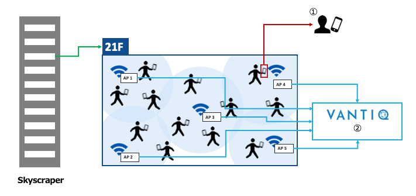

# Develop the Congestion Detction Application

## Task summary

* Using what you have learned so far, refer to this document to implement the Congestion Detction Application.  
* There are no detailed instructions. Please add all the Resources which are required to implement the application, such as `Type` and `Source`, by yourself.  
* This is an advanced task and will require programming with `Activity Pattern` and/or `VAIL` which we have not used before, so please have a look at the references while working on it.
  * App Builder Reference
    * [https://dev\.vantiq\.co\.jp/docs/system/app/index\.html](https://dev.vantiq.co.jp/docs/system/app/index.html)
  * VAIL Reference
    * [https://dev\.vantiq\.co\.jp/docs/system/rules/index\.html](https://dev.vantiq.co.jp/docs/system/rules/index.html)
* Please use these [Material files](../../conf/AdditionalContents/dev01_detect_congestion_app).  

## Scenario for this application

1. Congestion Detction on each floor of a building based on the number of devices per floor.
2. There are _5_ **WiFi APs** on each floor and they will detect devices on the floor.
3. **WiFi APs** will POST information (array data) of all devices they have detected and their own _MAC_ addresses.
4. VANTIQ will Congestion Detction and devices on the watchlist based on POSTed information.  
    ＊ The watchlist here is the list of devices of people who are not allowed to come to the building, such as positive PCR test, fever within _2_ weeks, etc.

&nbsp;&nbsp;&nbsp; ***＊ The Data Generator will be provided to reproduce 2 and 3.***

## Features of the Application to be implemented.

1. Calculate the congestion rate for each floor and determine congestion status.
2. Detect presence of a device on the watchlist into the floor.  
3. When detected, make a notification to external systems.  

## How the applications works at each floor

  
①  Detect the devices registered on the watchlist.   
②  Determine congestion status based on the data detected by the APs on each floor.  

## Process flow to be implemented in VANTIQ (overview)

  * Receive data POSTed from **WiFi APs** (`Data Generator`).  
  * Attach the floor information depending on the _MAC_ address of the **WiFi APs** which POSTed the data.
  * Parallelize the process by dividing the array data of detected devices into device units.
  * Remove unnecessary parameters and optimize the data.
  * Check whether a device exists on the watchlist.
  * Notify any service if it exists on the watchlist.
  * Split device data stream into per-floor streams.
  * Count the number of devices per floor for the last _3_ minutes and calculate the congestion rate depending on the number of people allowed per floor.
  * When congestion rate exceeds _50_%, it is judged as congestion.
  * Notify any service that congestion has occurred.

## Tips for Implementation

* ActivityPattern
  * `Filter`
    * Can do simple filtering, or can be flexible decision making by configuring `Procedure` as threshold.
  * `AccumulateState`
    * Since events received one after another can be tracked and counted, depending on how the `Procedure` is described, it can be implemented with a high flexibility, such as calculation using the number of events received in a certain period of time.
  * `Statistics`
    * Can compute the statistics processes of events.
  * `SplitByGroup`
    * Can split streams by groups.    

***＊ Not all Activity Patterns have to be used.***
