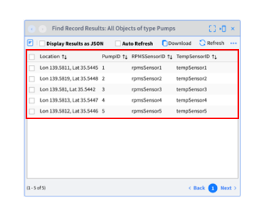

# **Lab 02 – Types（タイプ）**

## ***概要***

この Lab では、**Type** を作成します。Type はデータベースのテーブルのような仕組みです。データを保存したり、外部から受信するイベントの型の定義などに使用します。

今回のシナリオでは以下の通り Type を作成します。

-   **Pumps** – ポンプのマスタデータを保存します。**ポンプの位置、設置されたセンサーの情報を保存** します。

-   **PumpStatus** – ポンプの ***現在*** **のステータスを保存**します。

Type には、データを格納するための Type である「**Standard**」と、受信イベントの構造と型を定義するための「**Schema**」の 2種類が存在します。この Lab では「**Standard**」を扱います。「**Schema**」は Source と深い関わりを持つため、`Lab-03 Sources` で扱います。

#### 参考
- Vantiq Academy (要ログイン)
  - [4.1: 永続的 Type](https://community.vantiq.com/courses/vantiq%e3%82%a2%e3%83%97%e3%83%aa%e3%82%b1%e3%83%bc%e3%82%b7%e3%83%a7%e3%83%b3%e9%96%8b%e7%99%ba%e3%82%b3%e3%83%bc%e3%82%b9%ef%bc%86%e3%83%ac%e3%83%99%e3%83%ab1%e8%aa%8d%e5%ae%9a%e8%a9%a6%e9%a8%93v1-2/lessons/4-%e3%83%87%e3%83%bc%e3%82%bf%e3%81%ae%e5%88%86%e6%9e%90%e3%81%a8%e3%82%a8%e3%83%b3%e3%83%aa%e3%83%83%e3%83%81/topic/4-1-%e6%b0%b8%e7%b6%9a%e3%83%87%e3%83%bc%e3%82%bf%e5%9e%8b/)

## ***Step 1***

次からの作業は、`PumpFailureDetection` プロジェクトにおいて行います。
すでに開いている場合は、ナビゲーション バーのプロジェクト名に `PumpFailureDetection` と表示されているはずです。

***Pumps*** Typeを作成します。  

＊ `Pumps` Type はポンプのマスタデータを保存するために作成します。あとで受信するセンサーデータと組み合わせて使用します。

1. 「追加」 > 「Type...」 > 「_＋新規Type_」 をクリックし、Type の新規作成画面を開きます。

2. 名前に「Pumps」と入力し、ロール を 「standard」に設定して「_OK_」をクリックします。

3. `Pumps` Typeの「Property」タブを開き「_+Propertyの追加_」から以下の４つのプロパティを作成します。

| 名前         | データ型 |
|--------------|----------|
| PumpID       | Integer  |
| Location     | GeoJSON  |
| TempSensorID | String   |
| RPMSSensorID | String   |

4. 「Index」タブを開き「_+Indexの追加_」をクリックします。

5. 「ユニークなIndex」にチェックを入れ、Keyに「`PumpID`」を設定して「_OK_」をクリックします。

6. 「Natural Key」タブを開き「_Keyの編集_」をクリックします。

7. Keyに「`PumpID`」を設定して「_OK_」をクリックします。

    

8. _Save_ ボタンをクリックし、Typeを保存します。

## ***Step 2***

***PumpStatus*** Typeを作成します。

＊ ポンプの**現在の**ステータスを保持し、現在のポンプの状態をリアルタイムダッシュボードで表示するために利用します。

1. 「追加」 > 「Type...」 > 「_＋新規Type_」 をクリックし、Type の新規作成画面を開きます。

2. 名前に「PumpStatus」と入力し、ロール を 「standard」に設定して「_OK_」をクリックします。

3. `PumpStatus` Typeの「Property」タブを開き「_+Propertyの追加_」から以下の5つのプロパティを作成します。

| 名前       | データ型 |
|------------|----------|
| PumpID     | Integer  |
| Temp       | Integer  |
| RPMS       | Integer  |
| Location   | GeoJSON  |
| ReceivedAt | DateTime |

4. 「Index」タブを開き「_+Indexの追加_」をクリックします。

5. 「ユニークなIndex」にチェックを入れ、Keyに「`PumpID`」を設定して「_OK_」をクリックします。

6. 「Natural Key」タブを開き「_Keyの編集_」をクリックします。

7. Keyに「`PumpID`」を設定して「_OK_」をクリックします。

    

8. _Save_ ボタンをクリックし、Type を保存します。

以上で Type の作成は終了です。2つの Type が左側の「Project Contents」のリストに表示されているはずです。

これで `PumpFailureDetection` Project に 2つの Type が加わった状態になりましたので、その関連付けを保存するために Project 名の右にある _保存_ ボタンから Project の保存を行なってください。

＊ Type の保存と Project の保存は別の作業です。今現在 Namespace 上に 2つの Type が作成されましたが、Project の保存を行うまで Project との関連付けは保存されておりません。

  

## ***Step 3 （データ登録）***

作成した各 Type に必要なデータを登録します。

1. **Pumps Type へのデータ登録**  
Pumps Type にマスタデータを登録します。今回は複数件のデータをまとめてアップロードしたい場合に使用する手順でデータ登録を行います。  
    1. 「プロジェクト」 > 「インポート...」 をクリックして「プロジェクトまたはデータのインポート」ウィンドウを開き、「インポートタイプの選択」を「プロジェクト」から「データ」に変更します。  
    2. 事前に配布した「`Pumps.json`」をドラッグ&ドロップします。  
    3. 「_インポート_」をクリックします。

2.  **登録データ確認**  
`Pumps` Type にデータが正しく登録されているか確認します。`Pumps` Type を開き、「すべてのレコードの表示」をクリックして以下の画像のようにデータが登録されているか確認してください。

  

## ***▷確認ポイント***

-   各 Type の Type 名、プロパティ名が正しいか  
    ✔︎   大文字、小文字が正しいか、入力ミスがないかを改めて確認してください。ミスがあると今後の手順でエラーが発生します。

-   データが正しく登録されているか
