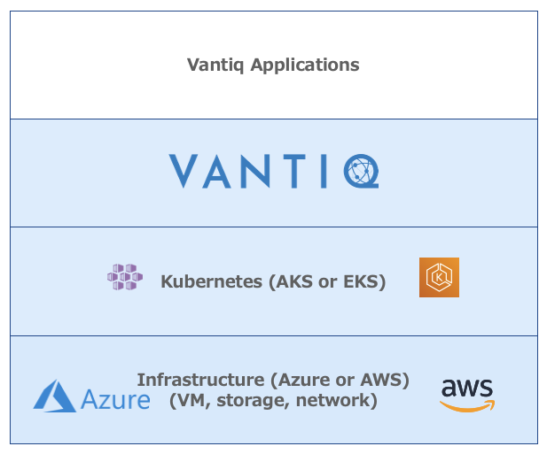

## Purpose
This repository is for sharing various technical guidance and instructions of Vantiq product.

- [Set up Vantiq External Lifecycle Management](vantiq-operations/docs/eng/Vantiq_ExtLifecycleManagement_SetupProcedure.md)
- [Vantiq on AWS EKS with Terraform](terraform_aws/readme_en.md)
- [Vantiq on Azure AKS with Terraform](terraform_azure/readme_en.md)
- [Trouble Shooting Guide for Vantiq Cloud operations](vantiq-operations/docs/eng/vantiq_k8s_troubleshooting.md)
- [Vantiq-1-day workshop](1-day-workshop/docs/eng/readme.md)

(TODO: Enlgish Menu Reorg)

## 目的

このリポジトリは、Vantiqに関わるさまざまな技術的なガイドや手順を共有するものです。

### [Vantiqのクラウドインフラ関連](./vantiq-cloud-infra-operations)
Vantiqを稼働させるAWS, AzureのクラウドインフラやKubernetesクラスタに関するガイドや手順です。

- [Terraform を使って AWS EKS を作成](./vantiq-cloud-infra-operations/terraform_aws/readme.md)
- [Terraform を使って Azure AKS を作成](./vantiq-cloud-infra-operations/terraform_azure/readme.md)
- [Vantiq を運用するのに必要な AWS の権限](./vantiq-cloud-infra-operations/docs/jp/aws_op_priviliges.md)
- [閉域網構成における考慮事項 (AWS編)](./vantiq-cloud-infra-operations/docs/jp/vantiq-install-closed-network-aws.md)
- [閉域網構成における考慮事項 (Azure編)](./vantiq-cloud-infra-operations/docs/jp/vantiq-install-closed-network-azure.md)

### [Vantiqプラットフォーム関連](./vantiq-platform-operations)
Vantiq Platformの構築や運用に関するガイドや手順です。

- [Vantiq Cloud 構築における、保守およびトラブルシューティング](./vantiq-platform-operations/docs/jp/vantiq-install-maintenance.md)
- [Vantiq Cloud 運用におけるトラブルシューティングガイド](./vantiq-platform-operations/docs/jp/vantiq_k8s_troubleshooting.md)
- [ネットワーク構成デバッグツール](./vantiq-platform-operations/docs/jp/alpine-f.md)
- [サーバー間時刻同期確認ツール](./vantiq-platform-operations/docs/jp/timestamp_ds.md)
- [mongodb 関連](./vantiq-platform-operations/docs/jp/mongodb.md)
- [サーバー証明書用 CSR 作成手順](./vantiq-platform-operations/docs/jp/prepare_csr4rsasslcert.md)
- [Vantiq Cloudwatch Logs](./vantiq-platform-operations/docs/jp/vantiq-cloudwatch.md)

### [Vantiqアプリケーション開発関連](./vantiq-apps-development)
Vantiqアプリケーションの開発や運用に関するガイドやマテリアルです。
- [Vantiq 1-day workshop](./vantiq-apps-development/1-day-workshop/docs/jp/readme.md)
- [Vantiq External Lifecycle Management の設定](./vantiq-apps-development/docs/jp/Vantiq_ExtLifecycleManagement_SetupProcedure.md)

### [Vantiqと外部サービスとの連携](./vantiq-external-services-integration/readme.md)
VantiqとクラウドWebサービス、ブローカー、データベースサービスとの連携に関するガイドや手順です。
- [Amazon MQ](./vantiq-external-services-integration/docs/jp/vantiq-aws-AmazonMQ.md)
- [DynamoDB](./vantiq-external-services-integration/docs/jp/vantiq-aws-dynamodb.md)
- [Amazon Managed Streaming For Kafka (MSK)](./vantiq-external-services-integration/docs/jp/vantiq-aws-msk.md)
- [EventHubs](./vantiq-external-services-integration/docs/jp/vantiq-azure-EventHubs.md)
- [GCP Pub/Sub](./vantiq-external-services-integration/docs/jp/vantiq-gcp-PubSub.md)
- [SendGrid](./vantiq-external-services-integration/docs/jp/vantiq-sendgrid.md)

### [Vantiqとデバイスとの連携](./vantiq-devices-integration)
VantiqとクラウドWebサービス、ブローカー、データベースサービスとの連携に関するガイドや手順です。
- [Edge~Vantiq構成 データ連携 ガイドライン](./vantiq-devices-integration/docs/jp/device-to-vantiq.md)
- コネクターサンプル
  - [Python Code](./vantiq-devices-integration/conf/vantiq-restapi-mqtt-amqp-python-sample)
  - [Vantiq Project](./vantiq-devices-integration/conf/vantiq-restapi-mqtt-amqp-python-sample/vantiq-project-sample.zip)
