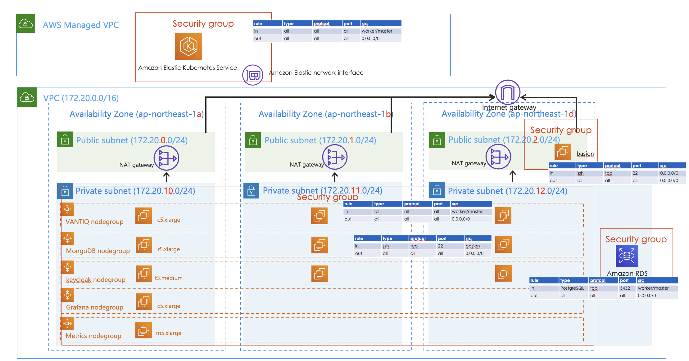

# VANTIQ on EKS with Terraform
Vantiq Public Cloudを構成するためのAWS Infrastructureの最もシンプルな構成。

## 構成



[Codeフォルダ](../../conf/terraform_aws)
```
├── env-dev
│   ├── main.tf
│   ├── basion-instance.tf
│   ├── output.tf
│   └── variables.tf
├── env-prod
│   ├── main.tf
│   ├── basion-instance.tf
│   ├── output.tf
│   └── variables.tf
├── env-template
│   ├── main.tf
│   ├── basion-instance.tf
│   ├── output.tf
│   └── variables.tf
└── modules
    ├── eks
    ├── rds-postgres
    └── vpc
```


各モジュールでは以下のリソースを作成する。

### vpc
- **VPC**
- **Subnet** (Private x 3AZ, Public x 3AZ)
- **Internet Gateway**
- **NAT Gateway** (各Public Subnetへアタッチ)
- **Route Table** (Private x 3AZ, Public x 3AZ)

### eks
- **EKS**
- **Managed Node Group**
- **IAM Role & Policy**  
- **Security Group** -  マネージドノードグループの場合、MasterとWorkerに別々のSecurity Groupの割り当てができないためデフォルトのSecurity Groupを使用する。デフォルト構成ではコメントアウトしている。

### rds-postgres  
- **DB Subnet Group**
- **RDS Instance**
- **Security Group**  
Note: シングル構成のため、RDSの構成は考慮が必要

## 構築手順

### terraformのバージョンについて
各moduleでfor_eachを利用しているためv0.12.6以降であること

### クラスタ構築の設定値について
各ディレクトリ(`env-prod`,`env-dev`,`env-template`)で環境ごとの設定値を設定し、クラスタ構築を行う。  
重要な設定値は主に以下の通り

### 事前準備事項(terraform init前までに)
- AWSアカウントの用意する
- aws cliをインストール
- kubectlをインストール
- aws cliの初期設定,Credential(access key と secret key の取得)
- S3 Bucketの作成する(tfstateをS3で管理する場合)
  ```sh
  # S3 Bucketを作成
  aws s3 mb s3://<Bucket名> --region <リージョン名>

  #　S3 Bucketのバージョニングを有効化
  aws s3api put-bucket-versioning \
      --bucket <Bucket名> \
      --versioning-configuration Status=Enabled

  # S3 Bucketのバージョニング設定確認
  aws s3api get-bucket-versioning --bucket <Bucket名>
  ```
- インスタンスアクセス用のSSHキーの作成・登録する
- [このサイト](https://aws.amazon.com/jp/blogs/news/vcpu-based-on-demand-instance-limits-are-now-available-in-amazon-ec2/
)を参考にアカウントで使用できるVCPUのクオータを緩和申請する。2020/06時点では、c5,r5,t3,m5といったインスタンスは「Running On-Demand Standard (A, C, D, H, I, M, R, T, Z) instances」といった形でまとめられているため、必要数に応じて適用されている値からvcpuのクォータを挙げる。


### パラメータの設定
各tfファイルにて、環境に応じてパラメータを設定する。

#### main.tf  
3つのmoduleを呼び出し、VPC・EKS・RDSのリソースを作成  

- locals  
  - `region`: 作成するリージョン  
  - `worker_access_ssh_key_name`: 事前準備事項で作成したSSHキーの名前を指定


- terraform  
  - `backend`: tfstateの管理をS3で行う場合は、事前準備で作成したBucket名を設定  
  ※ localの場合は backend "local" のままで


- module `vpc`  
  - `vpc_cidr_block`: 作成するVPCのcidr  
  - `public_subnet_config`: 作成するPublic Subnetのconfigで、各キーのオブジェクト(az-0など)が1つのSubnet  
  - `private_subnet_config`: public_subnet_configと同様、Private Subnet用config


- module `eks`  
  - PublicアクセスポイントのEKSを作成  
  - `cluster_version`: EKSのバージョンを指定  
  - `managed_node_group_config`: マネージドノードグループの設定で、各キーのオブジェクト(VNATIQなど)が1つのマネージドノードグループ  


- module `keycloak-db`  
  - PrivateエンドポイントのDBインスタンスを作成(Private Subnet内のいずれかのAZへシングル構成で作成)  
  - `db_instance_class`: DBインスタンスのインスタンスサイズ  
  - `db_storage_size`: DBインスタンスのディスクサイズ  
  - `db_storage_type`: DBインスタンスのディスク種類  
  - `postgres_engine_version`: PostgreSQLのバージョン  

  ** DBのパスワードは「Passw0rd」で作成されるので、作成後変更**


#### basion-instance.tf  
踏み台サーバ用EC2インスタンスを作成する。
事前準備事項で作成したSSHキーを利用したアクセスを許可を設定する。
また、マネージドノードグループのWorker Nodeは踏み台サーバからのSSHのみ許可される。

- data `aws_ami` `ubuntu`  
踏み台サーバに利用するAMIを取得


- resource `aws_instance` `basion`  
  - `instance_type`: 踏み台サーバのインスタンスタイプ


### 作成後作業
- keycloak DB(PostgreSQL)インスタンスのパスワード変更する。
- 踏み台サーバへSCPなどを利用し、登録したSSHキーを転送し適切なディレクトリに置き、パーミッションの設定を行う。


### 構築/削除の実行
各environmentのディレクトリに移動し、コマンドを実行する。

**注意！ `env-prod`は本番向けで11台のサーバーで構成するため、多額（月額20万以上）の費用が発生します。お試しであれば、`env-dev`開発向け4台構成をお勧めします。**

```bash
# 初期化
$ terraform init  \
  -var 'access_key=<YOUR-AWS-ACCESS_KEY>' \
  -var 'secret_key=<YOUR-AWS-SECRET_KEY>'

# tfstateの差分算出
$ terraform plan \
  -var 'access_key=<YOUR-AWS-ACCESS_KEY>' \
  -var 'secret_key=<YOUR-AWS-SECRET_KEY>'

# tfstateとの差分を適用(クラウドリソースの作成)
$ terraform apply \
  -var 'access_key=<YOUR-AWS-ACCESS_KEY>' \
  -var 'secret_key=<YOUR-AWS-SECRET_KEY>'

# 構成を削除(クラウドリソースの削除)
$ terraform destroy \
  -var 'access_key=<YOUR-AWS-ACCESS_KEY>' \
  -var 'secret_key=<YOUR-AWS-SECRET_KEY>'
```
