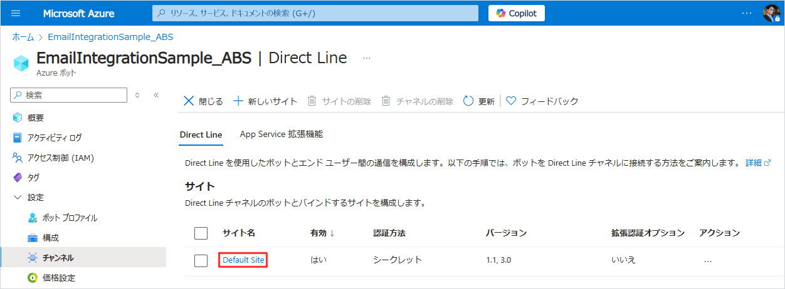

# Vantiq と Microsoft 365 のEメールのインテグレーション方法

## 目次

- [Vantiq と Microsoft 365 のEメールのインテグレーション方法](#vantiq-と-microsoft-365-のeメールのインテグレーション方法)
  - [目次](#目次)
  - [概要](#概要)
  - [前提](#前提)
  - [手順](#手順)
    - [Azure Bot リソース の作成](#azure-bot-リソース-の作成)
    - [Email チャンネルの追加](#email-チャンネルの追加)
    - [クライアントシークレットの追加](#クライアントシークレットの追加)
    - [OAuth 接続設定の追加](#oauth-接続設定の追加)
    - [リダイレクト URL の登録](#リダイレクト-url-の登録)
    - [Chatbot Source の作成](#chatbot-source-の作成)
    - [メッセージング エンドポイントの設定](#メッセージング-エンドポイントの設定)
    - [Vantiq Service の作成](#vantiq-service-の作成)
  - [実行](#実行)
  - [補足](#補足)
    - [Rule で返信する場合](#rule-で返信する場合)
    - [Procedure で返信する場合](#procedure-で返信する場合)
  - [リソース](#リソース)
  - [参考文献](#参考文献)

## 概要

Azure Bot Service を利用して Vantiq で Microsoft 365 のEメールを送受信する方法の解説です。  

Vantiq では直接メールを受信することはできません。  
ですが、 Azure Bot Service を利用することで、 Microsoft 365 の Eメールの送受信が可能になります。  
なお、設定可能なメールアドレスは Microsoft 365 のメールアドレスのみになります。  
（※記事作成時の Vantiq バージョン： r1.41.4）  

全体構成は以下の通りです。  


## 前提

- 有効な Microsoft Azure アカウントを保有しており、Azure Bot Service のリソースが作成可能であること
- Azure Bot Service と Vantiq の疎通が可能であること
- 有効な Microsoft 365 サブスクリプションを保有していること
- ボット専用の Office 365 メールアカウントが発行されていること

## 手順

以下の手順で解説する各 Vantiq リソース名はサンプルです。  
任意に命名してください。  

### Azure Bot リソース の作成

Azure Bot Service のリソースを作成します。

1. Azure Portal にログインし、検索バーで `Azure Bot` を検索します。  
   Marketplace から `Azure Bot` を選択します。  

   

1. Azure Bot を作成します。
   - ボットハンドル：任意の名前を入力します。
   - サブスクリプション：使用するサブスクリプションを選択します。
   - リソースグループ：任意のリソースグループを選択します。
   - アプリの種類：`マルチテナント` を選択します。
   - 作成の種類：`新しい Microsoft アプリID の作成` を選択します。

   

### Email チャンネルの追加

1. 作成したBotのリソースに移動し、`チャンネル` から `Email` を選択します。

   チャンネルの選択
   

1. Microsoft 365 の `メールアドレス` を入力し、 `承認する` をクリックします。

   

1. 画面に表示された `検証コード` をコピーします。

   

1. コピーした `検証コード` を入力して、 `適用` をクリックします。

   

1. チャンネルに `Email` が追加されていることを確認します。

   

### クライアントシークレットの追加

1. Bot リソースの `構成` を選択し、Microsoft App ID の `パスワードの管理` を選択します。

   

1. `新しいクライアントシークレット` を選択し、クライアントシークレットを追加します。

   

1. `説明` と `有効期限` を設定して、 `追加` をクリックします。

   

1. 新しいクライアントシークレットが作成されます。作成直後しか確認できないため、必ずここでクライアントシークレットを保存してください。

   

### OAuth 接続設定の追加

1. Bot リソースの `構成` を選択し、 `OAuth 接続設定の追加` を選択します。

   

1. OAuth 接続設定を行い、 `保存` を選択します。

   - 名前：任意の名前を入力します。
   - サービス プロバイダー： `Azure Active Directory v2` を選択します。
   - Client id：Azure Bot の `Microsoft App ID` を入力します。
   - Client secret：前の手順で作成した `クライアントシークレット` を入力します。
   - Token Exchange URL： `空欄` のままにします。
   - Tenant ID： `common` を入力します。
   - スコープ： `Mail.ReadWrite,Mail.Send` を入力します。

   

### リダイレクト URL の登録

1. 検索バーで `アプリ` を検索します。  
   サービスから `アプリの登録` を選択します。

   

1. `アプリ` 選択します。  

   

1. `管理` → `認証` を選択し、 `プラットフォームを追加` を選択します。

   

1. `Web` を選択します。

   

1. `リダイレクト URL` に以下の URL を入力して、 `構成` を選択します。

   - `https://token.botframework.com/.auth/web/redirect`

   

1. `URI の追加` を選択します。

   

1. 入力ボックスに以下の URL を入力して、 `保存` を選択します。

   - `https://token.botframework.com`

   

### Chatbot Source の作成

1. Vantiq IDE のメニューバーの `追加` → `Source...` → `+ 新規 Source` をクリックし Source の新規作成画面を開きます。

1. `Source Name` と `Package` を入力し、 `Source Type` に `CHATBOT` を選択します。

   

1. Properties タブを表示し、以下の値を入力し Source を保存します。  
   - Microsoft App ID：Azure Bot の `Microsoft App ID` を入力します。
   - Microsoft App Secret：Azure Bot リソース の作成 で作成した `クライアントシークレット` を入力します。
   - Direct Line Secret Key：Azure Bot の `Direct Line Secret Key` を入力します。

   

   <details>
   <summary>入力する Property の値の確認方法</summary>

   #### Microsoft App ID

   `設定` → `構成` → `Microsoft App ID`

   

   #### Microsoft App Secret（クライアントシークレット）

   先程の手順で発行した `クライアントシークレット` です。  

   

   #### Direct Line Secret Key

   `設定` → `チャンネル` → `Direct Line` → `Default Site`
   
   
   
   
   
   

   </details>

### メッセージング エンドポイントの設定

1. Azure Portal から Azure Bot Service のリソースに移動し、 `構成` を選択します。  
   `メッセージング エンドポイント` に以下の URL を入力し、 `適用` をクリックします。  

   - `<Vantiq Server>/private/Chatbot/<NamespaceName>/<ChatbotSourceName>`  

  

### Vantiq Service の作成

Azure Bot Service からのメッセージを受信し、自動的に偏するする Service を作成します。  

1. Service `com.example.AzureEmailService` を作成します。

1. `Source Visual Event Handler` を追加します。  

   

   

1. Source Visual Event Handler を実装します。  

   

   - #### EventStream Activity (Initiate)

     |Parameter|Value|備考|
     |---|---|---|
     |inboundResource (Enumerated)|sources||
     |inboundResourceId (String)|com.example.AzureBot|※前の手順で作成した Chatbot Source|

     

   - #### Transformation Activity (Transformation)

     |Parameter|Value|備考|
     |---|---|---|
     |transformation (Union)|※下記の表を参照||
     |transformInPlace (Boolean)|チェック||

     

     |Outbound Property|Transformation Expression|備考|
     |---|---|---|
     |text|"これは自動応答テストメールです。"|※メール本文のテキスト文|

     

   - #### PublishToSource Activity (PublishToSource)

     |Parameter|Value|備考|
     |---|---|---|
     |source (Source)|com.example.AzureBot|※前の手順で作成した Chatbot Source|

     

## 実行

- Azure Bot Service に設定した Microsoft 365 のメールアドレス宛にメールを送信します。  

## 補足

### Rule で返信する場合

```JavaScript
package com.example
RULE sendQuickMail
WHEN EVENT OCCURS ON "/sources/com.example.AzureBot" AS message

message.value.text = "これは自動応答テストメールです。"

PUBLISH message.value TO SOURCE com.example.AzureBot
```

### Procedure で返信する場合

```JavaScript
package com.example
stateless PROCEDURE AzureEmailService.sendMail(event)

event.text = "これは自動応答テストメールです。"

PUBLISH event TO SOURCE com.example.AzureBot
```

## リソース

- [サンプルプロジェクト（r1.41）](./data/EmailIntegrationSample_r1.41.zip)

## 参考文献

- [Azure portal で Azure Bot リソースを作成する - Bot Service](https://learn.microsoft.com/ja-jp/azure/bot-service/abs-quickstart?view=azure-bot-service-4.0&tabs=userassigned)
- [Bot Framework ボットを Azure で登録する - Bot Service](https://learn.microsoft.com/ja-jp/azure/bot-service/bot-service-quickstart-registration?view=azure-bot-service-4.0&tabs=userassigned)
- [ボットをメールに接続する - ボット サービス - Bot Service](https://learn.microsoft.com/ja-jp/azure/bot-service/bot-service-channel-connect-email?view=azure-bot-service-4.0)
- [Azure での OAuth 2.0 ボット認証 - Teams | ID プロバイダーの作成](https://learn.microsoft.com/ja-jp/microsoftteams/platform/bots/how-to/authentication/add-authentication?tabs=dotnet%2Cdotnet-sample#create-the-identity-provider)
- [Bot Framework REST APIでBotと通信してみる(マルチテナント)](https://blog.freks.jp/bot-framework-tutorial-multi-tenant/)
