# Vantiq LLM とAzure Bot Service Direct Lineのインテグレーションサンプル

## 概要

Vantiq LLMの機能と、Azure Bot、Direct Line チャンネルとの連携を実現するサンプルです。TeamsやSlackのようなクラウドサービスではなく、独自のサービス・Webサイトの中でREST APIを使用することにより、Vantiq LLMとの会話が可能となります。

全体構成は以下の通りです。
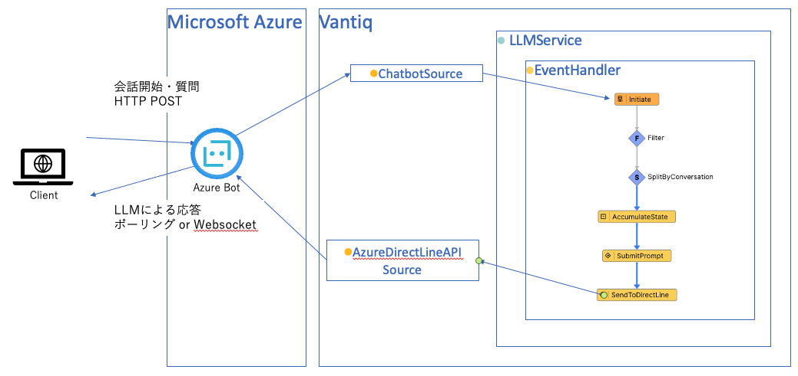

## 前提

- 有効なMicrosoft Azureアカウントを保有しており、Azure Bot のリソースが作成可能であること
- Azure Bot Service -> Vantiq の疎通が可能であること
- Vantiq -> Azure Bot WebChat API の疎通が可能であること
- サンプルアプリにはLLMs,Semantic Index のリソースは含まれません。各自OpenAIなどの必要なAPI Keyを取得し、リソースの作成やSemantic Index Entryの追加などを行ってください

## Direct Line 概要

Direct Lineは、Azure Bot Serviceが提供するチャネルの一つで、カスタムアプリケーションとボットを接続するためのRESTful APIを提供します。このチャネルにより、開発者は自社のモバイルアプリ、Webサイト、Webサービス、デスクトップアプリケーション、IoTデバイスなど、ほぼあらゆるプラットフォームにボットを統合することが可能になります。

## 手順

以下の手順で解説する各Vantiqリソース名はサンプルです。任意に命名してください。

### Azure Bot リソース の作成

Azure Bot Service のリソースを作成します。

1. Azure Portal にログインし、検索バーで`Azure Bot`を検索します。Marketplace から `Azure Bot` を選択します。
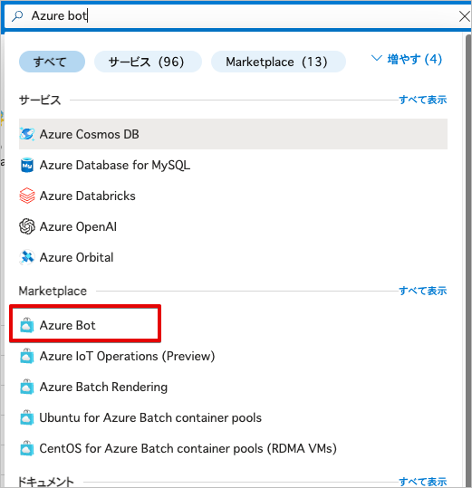
1. Azure Bot を作成します。
   - ボットハンドル : 任意の名前を入力します。
   - サブスクリプション : 使用するサブスクリプションを選択します。
   - リソースグループ : 任意のリソースグループを選択します。
   - アプリの種類 : 今回は`シングルテナント`を選択します。
   - 作成の種類 : 今回は`新しい Microsoft アプリID の作成` を選択します。

1. 作成したBotのリソースに移動し、`チャネル` に `Direct Line` が選択済みであることを確認します

1. `Direct Line` -> `Default Site` を選択し、`秘密キー`をコピーし保存します。
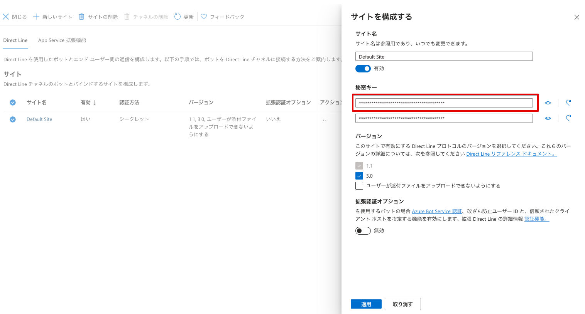
1. Botリソースの`構成` を選択し、Microsoft App ID の `パスワードの管理` を選択します。
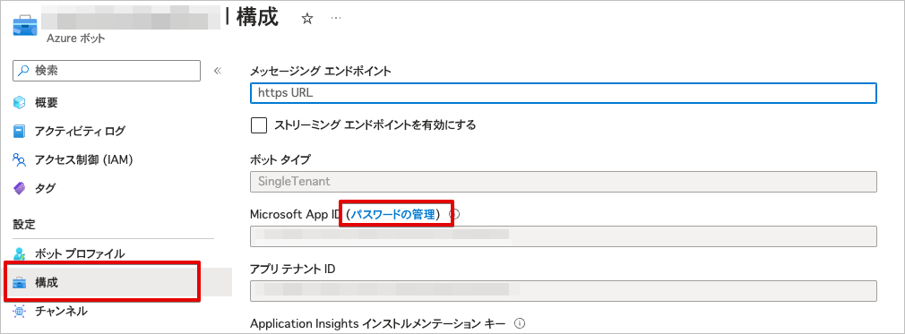
1. `新しいクライアントシークレット` を選択し、クライアントシークレットを追加します。

1. 新しいクライアントシークレットが作成されます。作成直後しか確認できないため、必ずここでクライアントシークレットを保存してください。


### クライアント の作成

上記で取得したDirect Lineの秘密キーを使用して、チャットクライアントを作成します。

- [サンプル](./conf/app/ui_sample/index.html)

```html
<!DOCTYPE html>
<html lang="ja">
  <head>
    <meta charset="utf-8" />
    <title>Azure Bot Web Chat</title>
    <!-- Bot Framework Web Chat の最新バージョンを読み込み -->
    <script src="https://cdn.botframework.com/botframework-webchat/latest/webchat.js"></script>
    <style>
      html, body {
        height: 100%;
        margin: 0;
      }
      #webchat {
        height: 100%;
      }
    </style>
  </head>
  <body>
    <!-- Web チャットが描画されるコンテナ -->
    <div id="webchat" role="main"></div>
    <script>
      // Direct Line を使って Bot と通信するための設定
      window.WebChat.renderWebChat({
        directLine: window.WebChat.createDirectLine({
          // ※ここに Azure Portal で取得した Direct Line シークレットキーを入力してください
          secret: 'DIRECT_LINE_SECRET'
        }),
        // ユーザー情報（任意設定）
        userID: 'USER_ID',      // 任意のユーザーID
        username: '訪問者',     // 任意のユーザー名
        locale: 'ja-JP',         // 日本語に設定
        styleOptions: {
          hideUploadButton: true  // アップロードボタンを非表示にする設定
        }
      }, document.getElementById('webchat'));
    </script>
  </body>
</html>

```

### Vantiq Source の作成

以下2つの Source を作成します。

1. Azure Bot Service との連携用の ChatBot Source
2. Azure Bot Direct Line 用の Remote Source

#### ChatBot Source の作成

1. Vantiq IDEで、[追加]->[Source]->[新規Source] を選択します。
1. `Source Name`、`Package`に任意の値を入力します。 `Source Type` に `ChatBot` を選択します。
1. Properties タブを表示し、以下の値を入力しSourceを保存します。
   - Microsoft App ID : Azure Bot の Microsoft App ID を入力します。
   - Microsoft App Secret : Azure Bot リソース の作成 で作成したクライアントシークレットを入力します。
   - Direct Line Secret Key : Azure Bot の Direct Line Secret Key を入力します。
   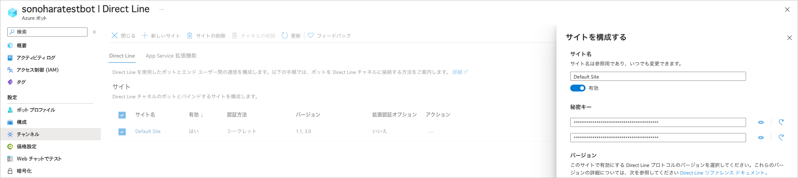
1. Azure Portal で、Azure Bot のリソースに移動し、[構成]を選択します。メッセージエンドポイントに以下のURLを入力します。`<Vantiq Server>/private/chatbot/<namespaceName>/<sourceName>`
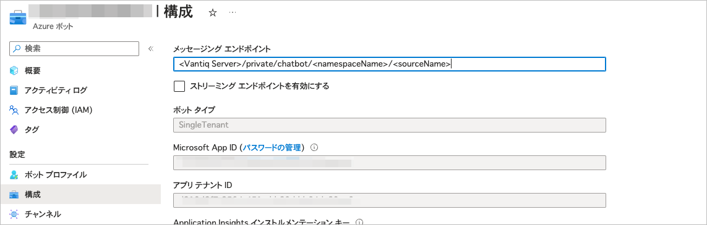

#### Azure Bot Direct Line Source の作成

1. Vantiq IDEで、[追加]->[Source]->[新規Source] を選択します。
1. `Source Name`、`Package`に任意の値を入力します。 `Source Type` に `Remote` を選択します。
1. Properties タブを表示し、以下の値を入力しSourceを保存します。
   - Server URI : `https://directline.botframework.com`

### Vantiq Service の作成

Azure Bot Service WebChatからのメッセージを受信し、Semantic Indexに登録された情報を返すVantiq Serviceを作成します。

1. Service `jp.vantiq.webchat` を作成します。

2. `Source Event Handler` を追加します。  
3. Source Event Handlerを実装します。以下のように実装します。  
   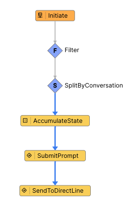

   - Initiate : 作成したChatBot Source をEventStream に設定します。
     - 以下のように設定します。
      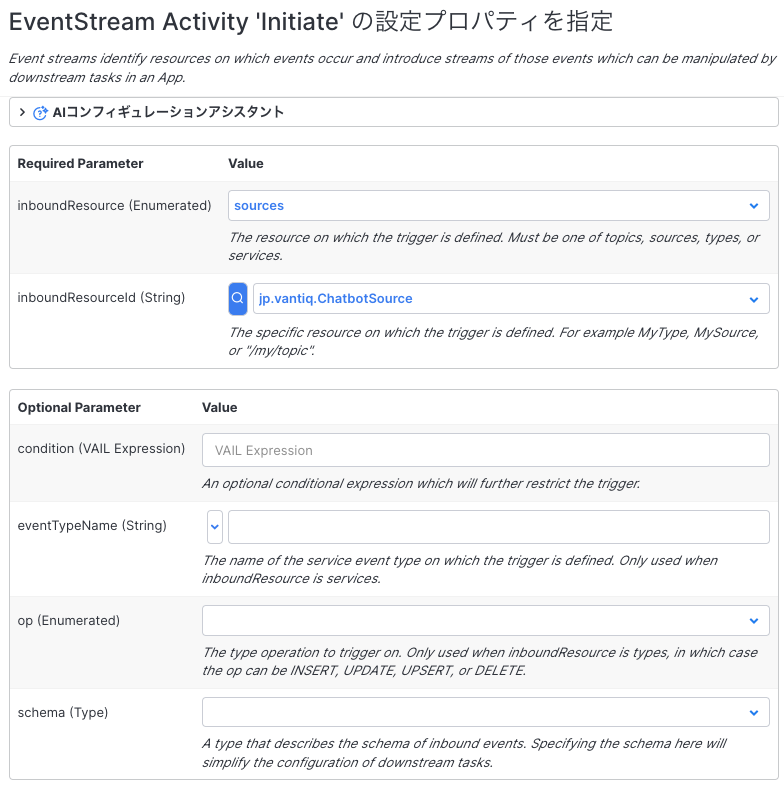
   - Filter : EventStream から受信したEventをフィルタリングします。Userからのメッセージのみを処理するように、Conditionを設定します。 `event.from.role == "user"`
     - 以下のように設定します。  
      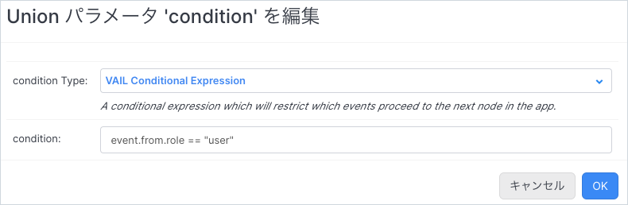
   - SplitByConversation : 受信したEventの`conversation.id`をキーにして、チャットウインドウ毎に会話を管理します。
   - AccumulateState : 会話IDの生成・保持を行います。
     - 以下のように設定します。  
      
     - vailの記述内容は以下の通りです。Vantiqの会話コンテクスト管理に関しての詳細は、[リファレンス](https://dev.vantiq.com/docs/system/rules/index.html#conversationmemory) を参照してください。

      ```javascript
      // Update the value of state using event.
      if(!state) {
         state = {}
      }
      if(!state.conversationID){
      // conversationIDが存在しない場合、ConversationMemoryに会話を開始するようにリクエストする
         var startConversation = []
         state.conversationID = io.vantiq.ai.ConversationMemory.startConversation(startConversation)
      } 
      ```

   - SubmitPrompt : `Procedure` アクティビティです。生成AIに質問を投げて回答を取得します。
     - 以下のService Procedureを作成してください。

      ```javascript
      package jp.vantiq
      import service io.vantiq.ai.LLM
      import service io.vantiq.ai.ConversationMemory
      stateless PROCEDURE webchat.SubmitPrompt(question String REQUIRED, conversationID String)

      var ERROR_TEXT = "エラーが発生しました。"

      var result
      try {
         result = LLM.submitPrompt(llmName = "<Your GenAI Name>", prompt = question, conversationId = conversationID)
      }catch(error) {
         result = {"answer": ERROR_TEXT}
         log.error(stringify(error))
      }

      return result
      ```

     - アクティビティの設定は以下の通りです。
       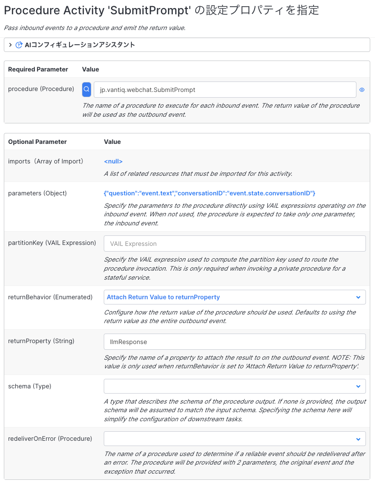

   - SendToDirectLine : `Procedure` アクティビティです。RemoteSourceにメッセージを送信します。
     - 以下のService Procedureを作成してください。
     - `"<Your Direct Line Secret>"` の部分には、Direct Line の秘密キーを入力してください。

      ```javascript
      package jp.vantiq
      stateless PROCEDURE webchat.SendToDirectLine(conversation String, llmResponse String)
      var method = "POST" 
      var path = "/v3/directline/conversations/" + conversation + "/activities"

      var headers = {
         "Authorization": io.vantiq.text.Strings.format("Bearer {0}", ["<Your Direct Line Secret>"]),
         "Content-Type": "application/json"
      }

      var data = {
         "locale": "ja-JP",
         "type": "message",
         "from": {
            "id": "vantiq_bot"
         },
         "text": llmResponse
      }

      var response = SELECT FROM SOURCE jp.vantiq.DirectLine WITH body = data, method = method, path = path, headers = headers

      return null
      ```

     - パラメータの設定は以下の通りです。
       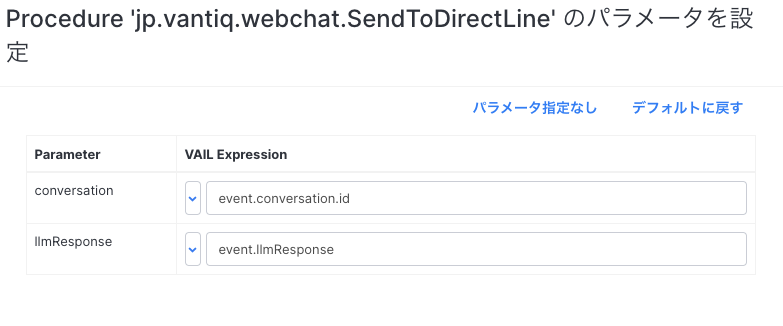

## 実行

- HTMLの作成で作成したファイルをブラウザで開き、Web Chat が表示されることを確認します。
 
