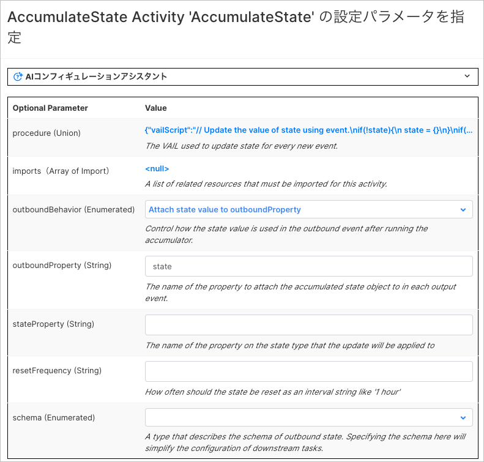

# Vantiq LLM とAzure Bot Serviceのインテグレーションサンプル

## 概要

Vantiq LLMの機能と、Azure Bot、Bot Framework Web Chatとの連携を実現するサンプルです。TeamsやSlackのようなクラウドサービスではなく、独自のWebサイトの中にWeb Chatをコンポーネントとして埋め込むことで、Vantiq LLMとの会話が可能となります。

全体構成は以下の通りです。


## 前提

- 有効なMicrosoft Azureアカウントを保有しており、Azure Bot のリソースが作成可能であること
- Azure Bot Service -> Vantiq の疎通が可能であること
- Vantiq -> Azure Bot WebChat API の疎通が可能であること
- サンプルアプリにはLLMs,Semantic Index のリソースは含まれません。各自OpenAIなどの必要なAPI Keyを取得し、リソースの作成やSemantic Index Entryの追加などを行ってください

## 手順

以下の手順で解説する各Vantiqリソース名はサンプルです。任意に命名してください。

### Azure Bot リソース の作成

Azure Bot Service のリソースを作成します。

1. Azure Portal にログインし、検索バーで`Azure Bot`を検索します。Marketplace から `Azure Bot` を選択します。

1. Azure Bot を作成します。
   - ボットハンドル : 任意の名前を入力します。
   - サブスクリプション : 使用するサブスクリプションを選択します。
   - リソースグループ : 任意のリソースグループを選択します。
   - アプリの種類 : 今回は`シングルテナント`を選択します。
   - 作成の種類 : 今回は`新しい Microsoft アプリID の作成` を選択します。

1. 作成したBotのリソースに移動し、`チャネル` に `Web Chat` が選択済みであることを確認します

1. `Web Chat` -> `Default Site` を選択し、`秘密キー`と `埋め込まれたコード`をコピーし保存します。

1. Botリソースの`構成` を選択し、Microsoft App ID の `パスワードの管理` を選択します。

1. `新しいクライアントシークレット` を選択し、クライアントシークレットを追加します。

1. 新しいクライアントシークレットが作成されます。作成直後しか確認できないため、必ずここでクライアントシークレットを保存してください。


### HTML の作成

上記で取得したWeb Chatの秘密キーと埋め込まれたコードを使用して、WebサイトにWeb Chatを埋め込みます。

- [サンプル](./conf/app/ui_sample/index.html)

```html
<!DOCTYPE html>
<html lang="ja">
<head>
    <meta charset="UTF-8">
    <meta name="viewport" content="width=device-width, initial-scale=1.0">
    <title>埋め込みチャット</title>
</head>
<body>
    // コピーしたiframeを埋め込む
</body>
</html>

```

### Vantiq Source の作成

以下2つの Source を作成します。

1. Azure Bot Service との連携用の ChatBot Source
2. Azure Bot WebChat 用の Remote Source

#### ChatBot Source の作成

1. Vantiq IDEで、[追加]->[Source]->[新規Source] を選択します。
1. `Source Name`、`Package`に任意の値を入力します。 `Source Type` に `ChatBot` を選択します。
1. Properties タブを表示し、以下の値を入力しSourceを保存します。
   - Microsoft App ID : Azure Bot の Microsoft App ID を入力します。
   - Microsoft App Secret : Azure Bot リソース の作成 で作成したクライアントシークレットを入力します。
   - Direct Line Secret Key : Azure Bot の Direct Line Secret Key を入力します。
   
1. Azure Portal で、Azure Bot のリソースに移動し、[構成]を選択します。メッセージエンドポイントに以下のURLを入力します。`<Vantiq Server>/private/chatbot/<namespaceName>/<sourceName>`


#### Azure Bot WebChat Source の作成

1. Vantiq IDEで、[追加]->[Source]->[新規Source] を選択します。
1. `Source Name`、`Package`に任意の値を入力します。 `Source Type` に `Remote` を選択します。
1. Properties タブを表示し、以下の値を入力しSourceを保存します。
   - Server URI : `https://webchat.botframework.com`

### Vantiq Service の作成

Azure Bot Service WebChatからのメッセージを受信し、Semantic Indexに登録された情報を返すVantiq Serviceを作成します。

1. Service `jp.vantiq.AzureWebChatService` を作成します。

2. `Source Event Handler` を追加します。

1. Source Event Handlerを実装します。以下のように実装します。
   

   - Initiate : 作成したChatBot Source をEventStream に設定します。
     - 以下のように設定します。
      
   - Filter : EventStream から受信したEventをフィルタリングします。Userからのメッセージのみを処理するように、Conditionを設定します。 `event.from.role == "user"`
     - 以下のように設定します。
      
   - SplitByChat : 受信したEventの`conversation.id`をキーにして、スレッド毎に会話を管理します。
   - AccumulateState : 会話IDの生成・保持を行います。
     - 以下のように設定します。
      
     - vailの記述内容は以下の通りです。Vantiqの会話コンテクスト管理に関しての詳細は、[リファレンス](https://dev.vantiq.com/docs/system/rules/index.html#conversationmemory) を参照してください。

      ```javascript
      // Update the value of state using event.
      if(!state){
      state = {}
      }
      if(!state.convId){
         // convIdが存在しない場合、ConversationMemoryに会話を開始するようにリクエストする
         var startConvo = []
         state.convId = io.vantiq.ai.ConversationMemory.startConversation(startConvo)
      } 
      ```

   - SemanticSearch : `Procedure` アクティビティです。Semantic Indexに登録された情報を検索し、結果を返します。
     - 以下のService Procedureを作成してください。

      ```javascript
      package jp.vantiq
      import service io.vantiq.ai.SemanticSearch
      import service io.vantiq.text.Template
      import service io.vantiq.ai.ConversationMemory
      stateless PROCEDURE AzureWebChatService.SemanticSearch(question String REQUIRED, convId String): Object

      var INDEX_NAME = "Semantic Index Name"
      var GENERATIVE_AI = "GenerativeLLM Name"

      var ERROR_TEXT = "エラーが発生しました。"
      var TEMPLATE = "質問です。「${question}」"

      var input = {
         "question": question
      }

      var prompt = Template.format(TEMPLATE, input)
      var result
      try {
      result = SemanticSearch.answerQuestion(INDEX_NAME, prompt, GENERATIVE_AI, convId)
      if convId {
         var convMem = ConversationMemory.getConversation(convId)
         log.info(stringify(convMem))
      }
      }catch(error) {
         result = {"answer": ERROR_TEXT}
         log.error(stringify(error))
      }

      return result
      ```

     - アクティビティの設定は以下の通りです。
       

   - SendToChat : `Procedure` アクティビティです。RemoteSourceにメッセージを送信します。
     - 以下のService Procedureを作成してください。
     - `"Authorization": "Bearer <Your WebChat Secret>"` の部分には、Azure Bot WebChat の秘密キーを入力してください。

      ```javascript
         package jp.vantiq
         stateless PROCEDURE AzureWebChatService.SendToChat(llmResponse Object, from Object, conversation Object)

         var source_config = {
            "path": "/v3/directline/conversations/" + conversation.id + "/activities",
            "headers": {
               "Content-type": "application/json",
               "Authorization": "Bearer <Your WebChat Secret>>"
            }
         }

         // see https://learn.microsoft.com/ja-jp/azure/bot-service/rest-api/bot-framework-rest-connector-add-rich-cards?view=azure-bot-service-4.0
         var actions = []
         var firstTwoItems = llmResponse.metadata.slice(0, 2)
         for (item in firstTwoItems) {
            var action = {
               "type": "Action.OpenUrl",
               "url": item.url,
               "title": item.url
            }
            actions.push(action)
         }
         var references = [
               {
               "contentType": "application/vnd.microsoft.card.adaptive",
               "content": {
               "type": "AdaptiveCard",
               "version": "1.0",
               "body": [
                  {
                     "type": "TextBlock",
                     "text": "参照リンク",
                     "size": "large"
                  }
               ],
               "actions": actions
               }
            }
         ]

         var data = {
            "type": "message",
            "from": {
               "id": from.id,
               "name": from.name
            },
            "text": llmResponse.answer,
            "attachments": references
         }
         try {
            PUBLISH { "body": data } TO SOURCE jp.vantiq.AzureWebChatAPI USING source_config
         }catch(error) {
            log.error(stringify(error))
         }

         return null
      ```

     - アクティビティの設定・パラメータの設定は以下の通りです。
       
       

## 実行

- HTMLの作成で作成したファイルをブラウザで開き、Web Chat が表示されることを確認します。
 

## リソース

- [サンプルプロジェクト](./conf/llm_azurebot_webchat_integration.zip)
