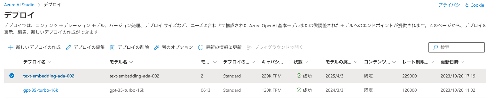
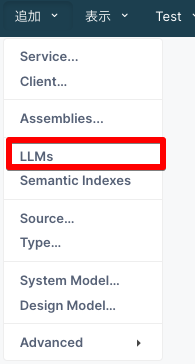
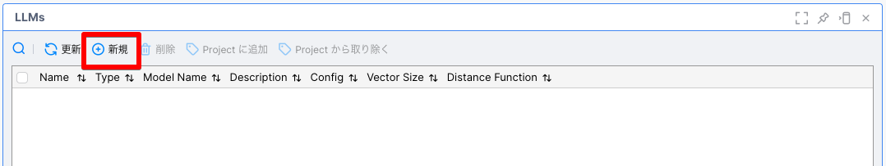
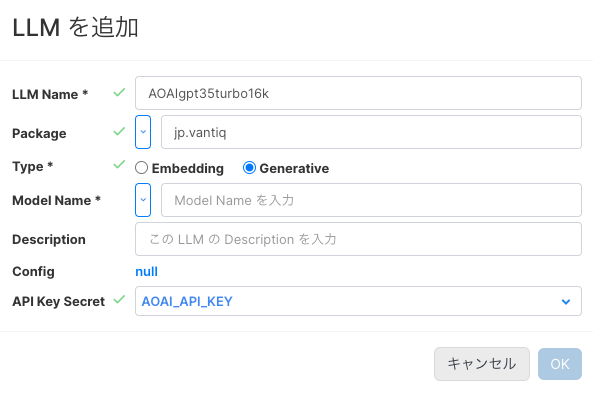
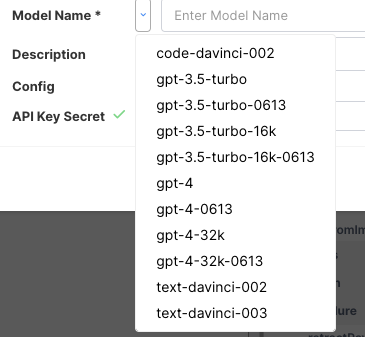
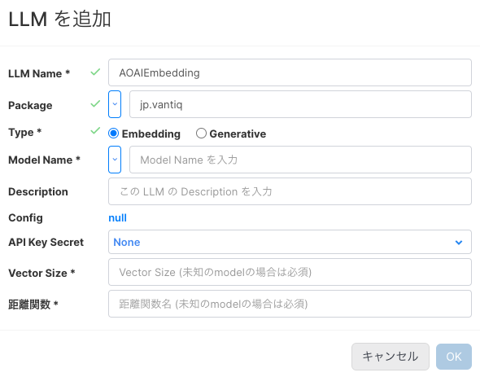
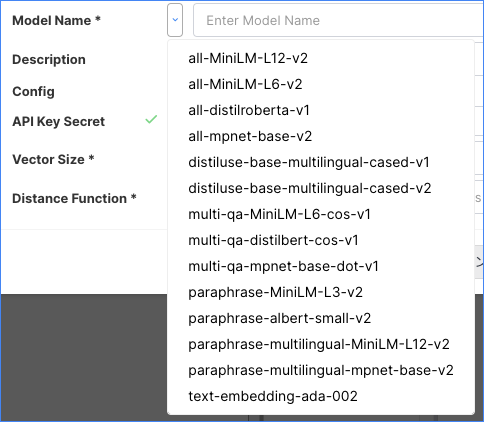

# LLM リソースで既定のモデル以外のモデルを使用する

LLM リソースでは、既定のモデル(OpenAI、と、HuggingFace)以外のモデルも使用することが可能です。ここでは、[Azure OpenAI Service](https://azure.microsoft.com/ja-jp/products/ai-services/openai-service) を例として設定方法を記述します。

## 前提条件

- Azure Open AI Service のリソースが作成されていること
- Azure Open AI Service のリソースに、使用したいモデルがデプロイされていること
- Azure Open AI Service の API Key を取得していること
- 取得した API Key を Vantiq の Secrets に登録していること

今回は、以下のように2つのモデルをデプロイしています。


**Note**
> この文書ではAzure OpenAI Service のリソース作成方法やデプロイ方法については解説しません。[公式のリファレンス](https://learn.microsoft.com/ja-JP/azure/ai-services/openai/overview)や、以下のようなインターネット上の記事を参照して設定してください。
> https://qiita.com/vfuji/items/196c8bb31be0ebdc8886
> https://note.com/fushiroyama/n/n584473dd57b2

## 設定方法

IDEのメニューから、[追加] > [LLMs] を選択します。



LLMsの一覧が表示されます。「新規」をクリックし、新しいLLMリソースを作成します。



### Generative LLM

1. LLM Name, Package を入力し、Typeは `Generative` を選択します。API Key Secret にはあらかじめ作成しておいたAzure OpenAI Service のAPI KeyのSecretを選択します。

   

2. Model Name を選択します。Azure OpenAI Service でデプロイしたモデルと同じモデルを選択します。ここでは、`gpt-3.5-turbo-16k` を選択します。

   

3. Configを選択し、Json Config を追加します。以下の内容を入力して [OK] をクリックします。
[Generative LLMのConfig Json](../../conf/LLM_Platform_Support/aoai_genmodel.json)

   ```json
   {
      "class_name": "langchain.chat_models.azure_openai.AzureChatOpenAI",
      "deployment_name": "gpt-35-turbo-16k",
      "openai_api_base": "https://xxxxxxxxxxx.openai.azure.com",
      "openai_api_version": "2023-05-15"
   }
   ```


1. [OK]をクリックし、作成を完了します。

### Embedding LLM

1. LLM Name, Package を入力し、Typeは `Embedding` を選択します。API Key Secret にはあらかじめ作成しておいたAzure Open AI Service の API KeyのSecretを選択します。

   

2. Model Name を選択します。Azure OpenAI Service でデプロイしたモデルと同じモデルを選択します。ここでは、`text-embedding-ada-002` を選択します。

   

3. Configを選択し、Json Config を追加します。以下の内容を入力して [OK] をクリックします。
[Embedding LLMのConfig Json](../../conf/LLM_Platform_Support/aoai_embmodel.json)

   ```json
   {
      "deployment": "text-embedding-ada-002",
      "openai_api_base": "https://xxxxxxxxxxx.openai.azure.com",
      "openai_api_version": "2023-05-15",
      "class_name": "langchain.embeddings.OpenAIEmbeddings",
      "openai_api_type": "azure"
   }
   ```

4. [OK]をクリックし、作成を完了します。
