# LLM Platform Support

Vantiq r1.37で追加されたLLM(Large Language Model) Platform Support の機能についての解説です。

## 概要

Vantiq r1.37以降では、大規模言語モデル (LLM) との対話をプラットフォームレベルでサポートします。また、LLM とベクトルデータベースを組み合わせたセマンティック検索(Semantic Search)機能も提供し、企業の固有のコンテンツに関する質問/回答をサポートします。


## Resources

以下2つの新しいシステム リソースが導入されます。

- LLMs
  
- Semantic Indexes

## Activity Pattern

以下の2つのActivity Patternが追加され、Visual Event HandlerでLLMリソースを使用することができます。

- Submit Prompt
  - LLMに1つのプロンプトを送信し、1つの回答を受け取るActivity Patternです。会話の履歴は保存されません。

- Answer Question
  - Semantic Indexと統合され、追加のコンテキスト情報を検索・取得します。
  - LLMとの会話の状態をメモリに保持します。LLMに送信されるプロンプトに以前の質問/回答が追加されます

## LLMs の作成

> **Note**
> あらかじめ、[管理] > [Advanced] > [Secrets] でOpenAI APIのAPI Keyを作成しておきます。使用したいモデルの利用条件を満たしたOpenAI API Keyを手配して下さい。

> **Note**
> この文書では、Vantiqで事前に構成済みの既定のモデルを使用します。既定モデル以外のモデルを使用したい場合、 [LLM リソースで既定のモデル以外のモデルを使用する](./LLM_AOAI_CONFIG.md) を参照してください。

IDEのメニューから、[追加] > [LLMs] を選択します。


LLMsの一覧が表示されます。「新規」をクリックし、新しいLLMリソースを作成します。


### Generative LLM

1. LLM Name, Package を入力し、Typeは `Generative` を選択します。API Key Secret にはあらかじめ作成しておいたOpenAI API KeyのSecretを選択します。

   

1. Model Name を選択します。Generative LLM の既定のモデルは、OpenAIの[GPT3.5](https://platform.openai.com/docs/models/gpt-3-5)、[GPT-4](https://platform.openai.com/docs/models/gpt-4) のモデルとなります。設定したOpenAI API Keyで利用可能なモデルを選択してください。

   

1. [OK]をクリックし、作成を完了します。作成したLLMリソースが一覧に表示されます。

   

### Embedding LLM

1. LLM Name, Package を入力し、Typeは `Embedding` を選択します。API Key Secret にはあらかじめ作成しておいたOpenAI API KeyのSecretを選択します。

   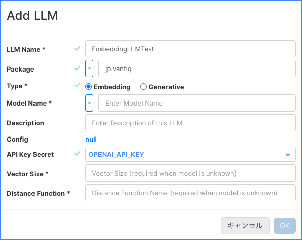

1. Model Name を選択します。Embedding LLM の既定のモデルは、OpenAI の [text-embedding-ada-002モデル](https://platform.openai.com/docs/models/embeddings)と、HuggingFace の[Sentence Transformers モデル](https://www.sbert.net/docs/pretrained_models.html#model-overview)となります。ここでは`text-embedding-ada-002` を選択します。既定のモデルを使用する場合、Vector Size・Dinstance Functionは設定不要です。

   

1. [OK]をクリックし、作成を完了します。作成したLLMリソースが一覧に表示されます。

   

## Semantic Index の作成

### Semantic Index の新規作成

1. IDEのメニューから、[追加] > [Semantic Indexes] を選択します。

   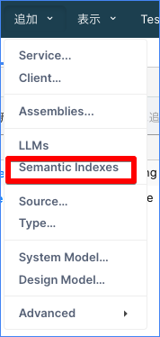

1. Semantic Indexesの一覧が表示されます。「新規」をクリックし、新しいSemantic Indexリソースを作成します。

   

1. Semantic Index Name, Package を入力し、Embedding LLM Nameは 作成したEmbedding LLM を選択します。Default Q&A LLM Nameは、質問に対する回答に使用されるGenerative LLMを選択します。ここでは、作成したGenerative LLMを選択します。設定しなくても構いません。

   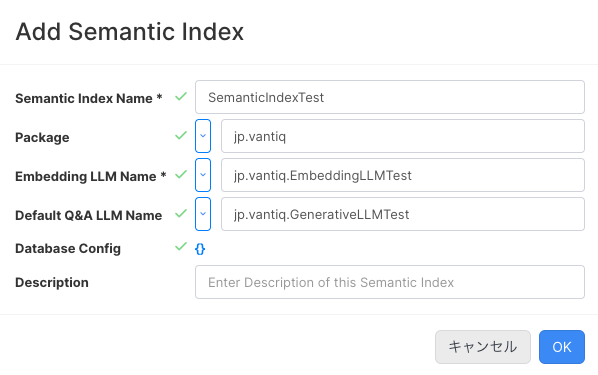

### Semantic Index Entry の作成

Semantic Indexに追加のコンテクストを提供するために、Semantic Index Entryを作成します。

1. Semantic Indexの一覧から、Entryを追加するSemantic Indexを選択します。

   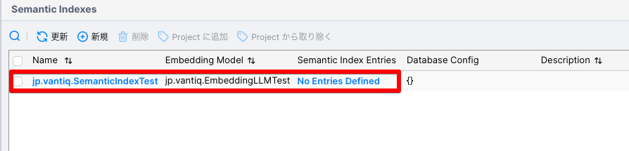

1. Semantic Index Entries のセクションで、「新規」をクリックします。

   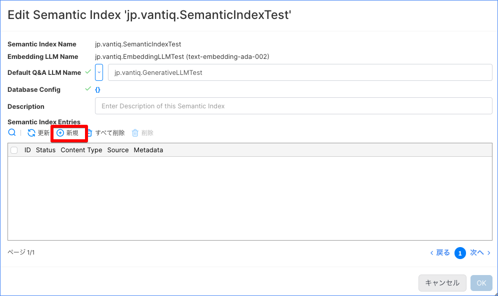

1. Semantic Index Entries のセクションで、「新規」をクリックします。

   

2. Entry Typeは `Upload`, `Remote`, `Resource`, `Embedded` から選択可能です。ここでは、`Upload` を選択し、ファイルをアップロードします。ここでは、gpt-3.5-turboが持っていない情報をコンテキストに追加するため、2023年の[日本国内の裁判の判例](https://www.courts.go.jp/app/hanrei_jp/search1?reload=1)をアップロードします。[アップロードファイル](../../conf/LLM_Platform_Support/092381_hanrei.pdf)

   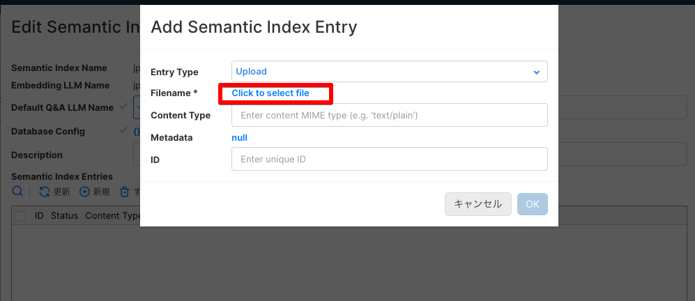

1．正常にアップロードされました。

   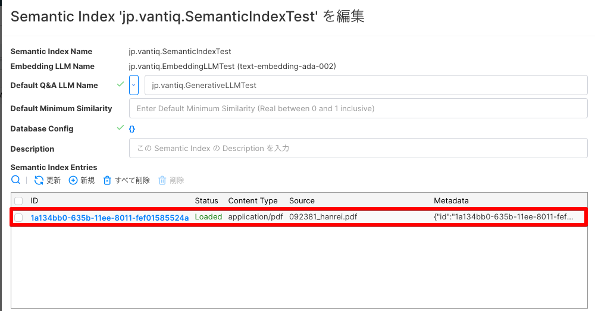

### Vantiqアプリ内での使用

### Submit Prompt

1. 新規サービスを作成し、Submit Prompt アクティビティを使用したEvent Handlerを作成します。

   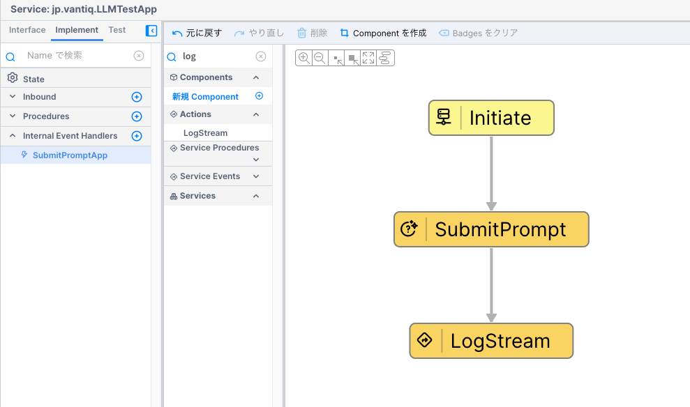

2. Event Stream には Topic を作成し、設定します。

   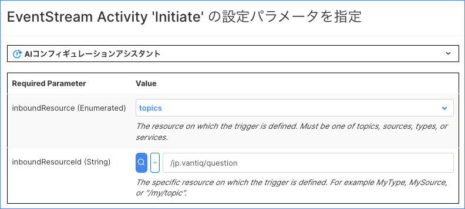

3. Submit Prompt アクティビティの設定をします。llm には作成したGenerative LLMを、promptにはLLMに送信するプロンプトをイベントから取得するように設定します。

   

4. Topicにメッセージを発行します。

   ```json
   {"question":"ストリーミングプロセッシングについて解説してください。"}
   ```

   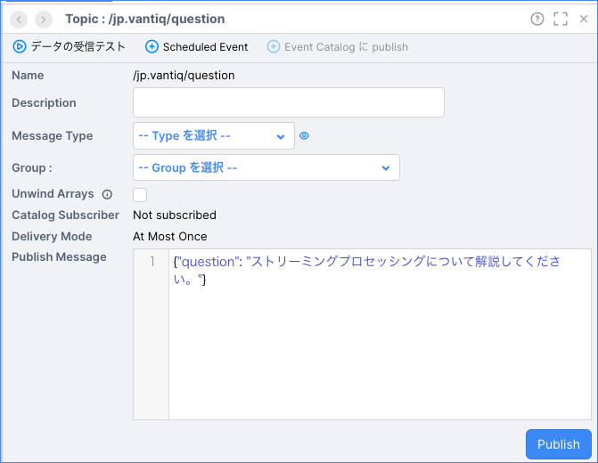

5. ログに、LLMからの回答が出力されていることを確認します。

   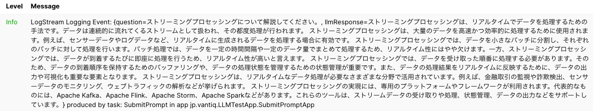

6. questionに、LLM(gpt-3.5-turbo)が持っていない情報に対する質問を設定し、Topicにメッセージを発行します。

   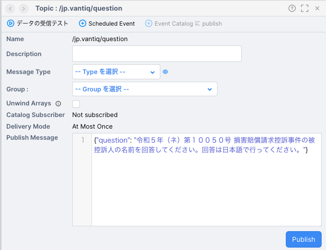

7. 今回設定しているGenerative LLMのモデル `GPT-3.5-turbo` は 2021年9月までのデータを学習しています。この質問に関する情報は有していないため、回答は得られません。これは正しい動作です。

   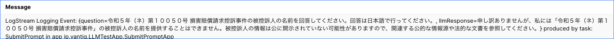

### Answer Question

1. 新規サービスを作成し、Answer Question アクティビティを使用したEvent Handlerを作成します。

   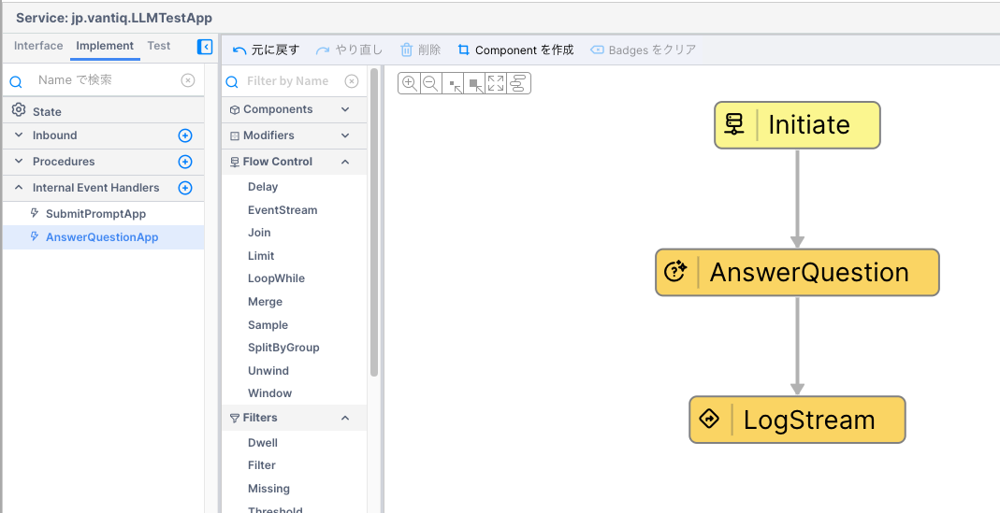

2. Event Stream には Topic を作成し、設定します。

   

3. Answer Question アクティビティの設定をします。semanticIndex には作成したSemantic Indexを、questionにはSemantic Indexに送信する質問をイベントから取得するように設定します。その他はオプションですが、qaLLMは回答の文章を生成するためのGenerative LLMを設定します。未設定の場合、Semantic IndexのDefault Q&A LLM Name に設定したLLMが使用されます。

   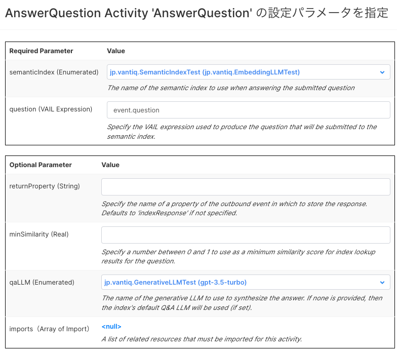

4. Topicにメッセージを発行します。

   ```json
   {"question":"令和５年（ネ）第１００５０号 損害賠償請求控訴事件の被控訴人の名前を回答してください。回答は日本語で行ってください。"}
   ```

   

5. ログに、LLMからの回答が出力されていることを確認します。Semantic Index Entry に追加された情報から回答が生成されていることがわかります。

   ```
    answer=被控訴人の名前は「日本テレビ放送網株式会社」です。
   ```

   また、情報の出典であるPDFファイルも明示的に示され、情報の信頼性を確認することも可能です。

   ```
      fileName=092381_hanrei.pdf, 
      id=1a134bb0-635b-11ee-8011-fef01585524a, 
      page_number=1, 
      url=https://internal.vantiq.com/docs/.vantiq/semanticindexes/jp.vantiq.SemanticIndexTest/entries/1a134bb0-635b-11ee-8011-fef01585524a, 
      source=null, 
      filetype=application/pdf, 
   ```

   


[サンプルプロジェクト](../../conf/LLM_Platform_Support/llm_test.zip)