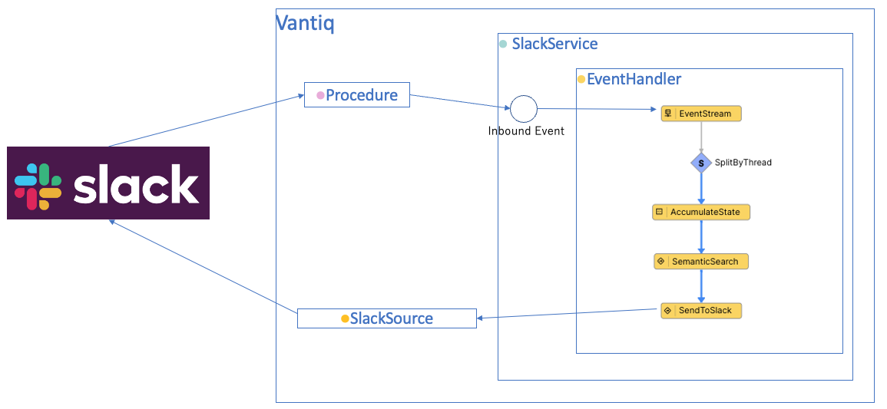
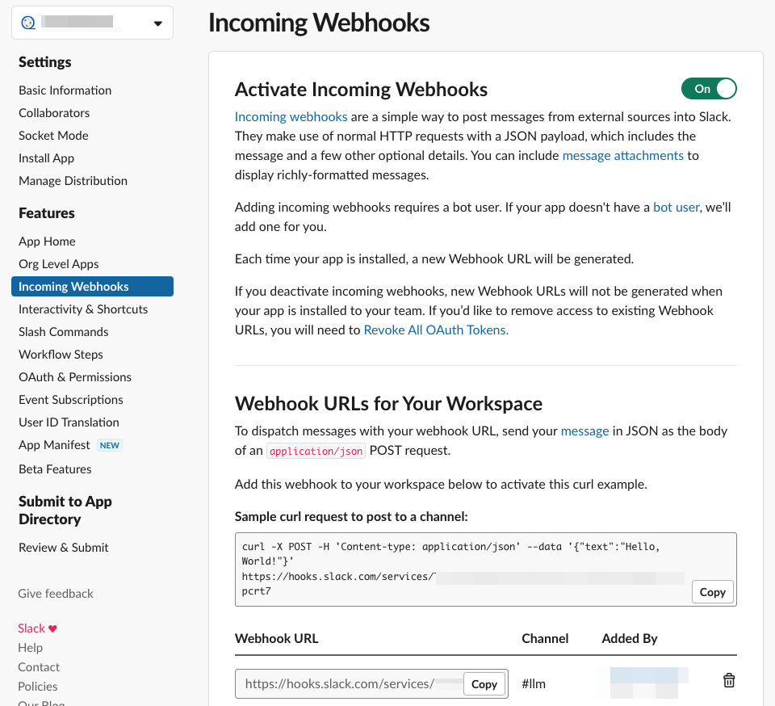
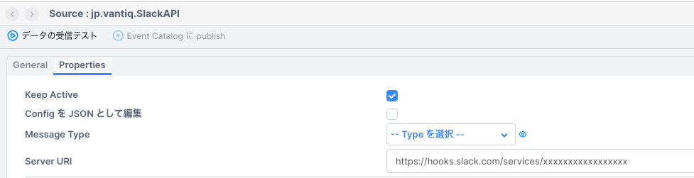
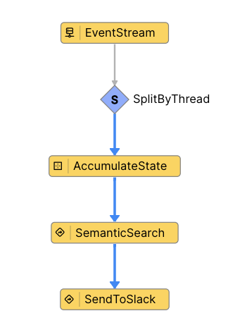
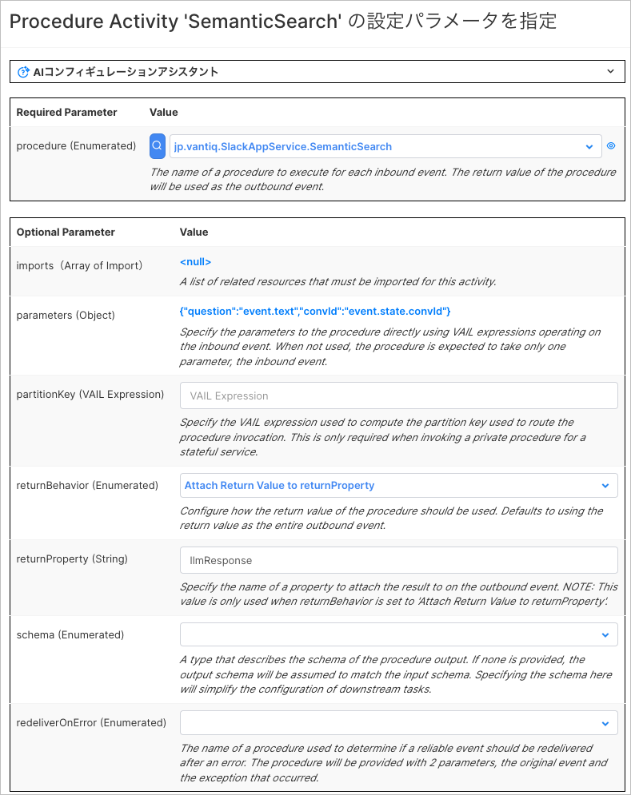
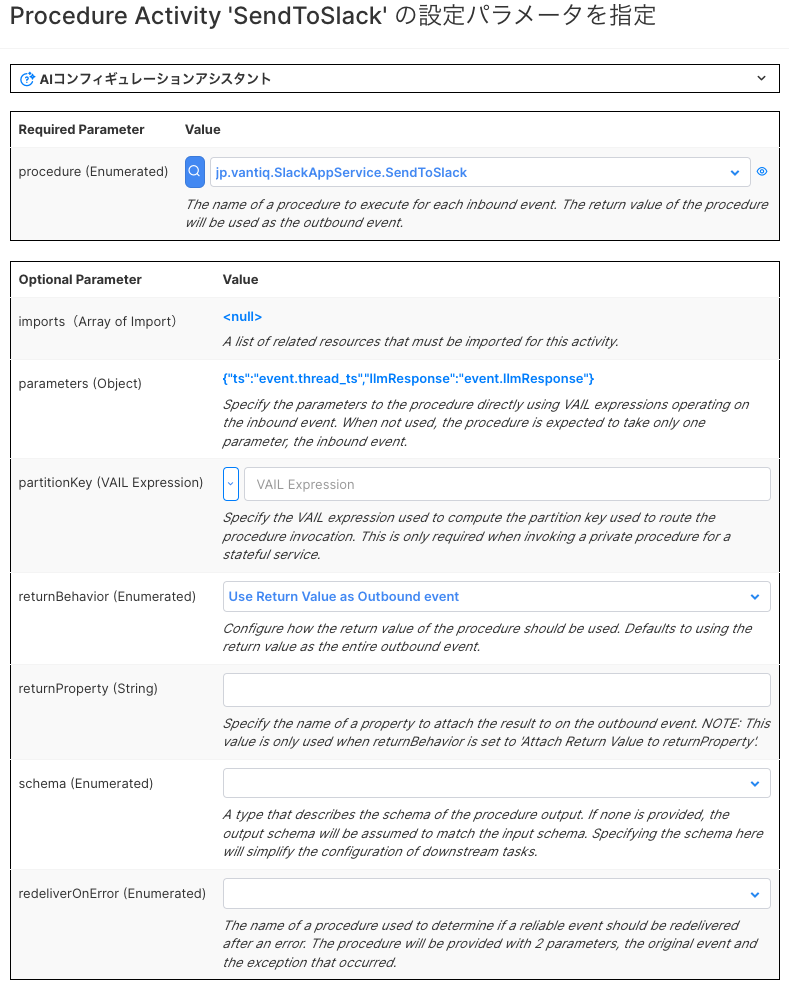
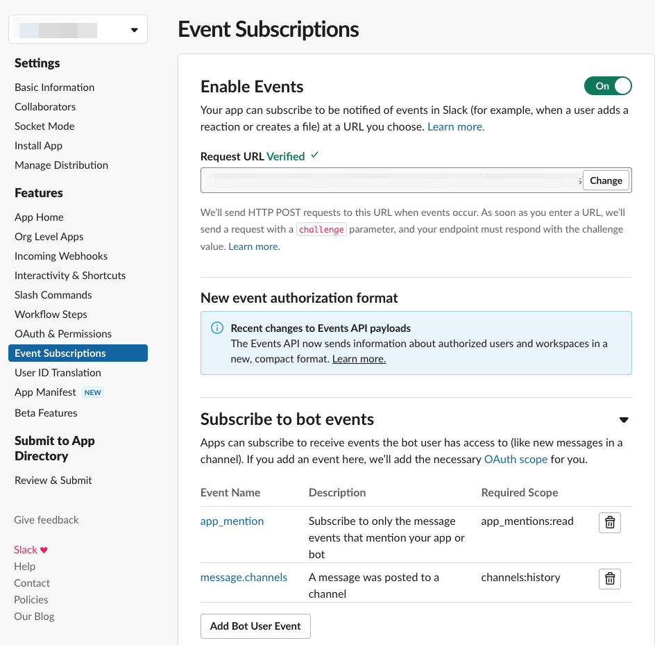

# Vantiq LLM とSlackのインテグレーションサンプル

## 概要

Vantiq LLMの機能と、Slack Appを使用して、Slackとの連携を実現するサンプルです。社内の独自情報をSemantic Indexに登録し、SlackからSemantic Indexに登録した情報を問い合わせることができます。

全体構成は以下の通りです。


## 前提

- Slack App の作成方法・設定方法については解説しません。https://zenn.dev/mokomoka/articles/6d281d27aa344e などを参考に作成・設定してください
- LLMs,Semantic Index のリソースは含まれません。各自OpenAIなどの必要なAPI Keyを取得し、リソースの作成やSemantic Index Entryの追加などを行ってください
- Slack -> Vantiq の疎通が可能であること
- Vantiq -> Slack の疎通が可能であること
- Slack App のEvent Subscriptions が有効であること
- Slack App に必要なOAuth Scopeが設定されていること。今回は`app_mentions:read`, `channels:history`, `channels:join`, `chat:write`, `groups:read`, `incoming-webhook` を設定してください

## 手順

以下の手順で解説する各Vantiqリソース名はサンプルです。任意に命名してください。

### Vantiq Source の作成

VantiqからSlackにメッセージを送信するためのRemoteSourceを作成します。

1. Slack App のIncoming Webhook URLを取得します。Slack App のIncoming Webhook URLは、Slack App のIncoming Webhook の設定画面から取得できます。


1. RemoteSource `jp.vantiq.SlackAPI`を作成し、Slack App のIncoming Webhook URLを設定します。


### Vantiq Service の作成

SlackからのEventを受信し、Semantic Indexに登録された情報を返すVantiq Serviceを作成します。

1. Service `jp.vantiq.SlackAppService` を作成します。

1. Service のInbound Event に、SlackからのEventを受信するための `inbound` を追加します。

1. `inbound` のEvent Handlerを実装します。以下のように実装します。
   
   

   - SplitByThread : `inbound` で受信したEventのthread_tsをキーにして、スレッド毎に会話を管理します。
   - AccumulateState : 会話IDの生成・保持を行います。
     - 以下のように設定します。
      
     - vailの記述内容は以下の通りです。Vantiqの会話コンテクスト管理に関しての詳細は、[リファレンス](https://dev.vantiq.com/docs/system/rules/index.html#conversationmemory) を参照してください。

       ```javascript
         // Update the value of state using event.
         if(!state){
         state = {}
         }
         if(!state.convId){
            // convIdが存在しない場合、ConversationMemoryに会話を開始するようにリクエストする
            var startConvo = []
            state.convId = io.vantiq.ai.ConversationMemory.startConversation(startConvo)
         } 
       ```

   - SemanticSearch : `Procedure` アクティビティです。Semantic Indexに登録された情報を検索し、結果を返します。
     - 以下のService Procedureを作成してください。

       ```javascript
         package jp.vantiq
         import service io.vantiq.ai.SemanticSearch
         import service io.vantiq.text.Template
         import service io.vantiq.ai.ConversationMemory
         PROCEDURE SlackAppService.SemanticSearch(question String REQUIRED, convId String): Object

         var INDEX_NAME = <Semantic Index Name>
         var GENERATIVE_AI = <Generative LLM Name>
         var ERROR_TEXT = "エラーが発生しました。"
         var TEMPLATE = "質問です。「${question}」"

         var input = {
            "question": question
         }

         var prompt = Template.format(TEMPLATE, input)
         var result
         try {
            result = SemanticSearch.answerQuestion(INDEX_NAME, prompt, GENERATIVE_AI, convId)
         if convId {
            var convMem = ConversationMemory.getConversation(convId)
            log.info(stringify(convMem))
         }
         }catch(error) {
            result = {"answer": ERROR_TEXT}
            log.error(stringify(error))
         }

         return result
       ```

     - アクティビティの設定は以下の通りです。
       

   - SendToSlack : `Procedure` アクティビティです。RemoteSourceにメッセージを送信します。
     - 以下のService Procedureを作成してください。

       ```javascript
         package jp.vantiq
         PROCEDURE SlackAppService.SendToSlack(ts String, llmResponse Object )

         var references = []
         for item in llmResponse.metadata {
            var  reference = {
                           "title": "",
                           "value": item.url,
                           "short": true
            }
            references.push(reference)
            
         }

         var data = {
            "channel": "@channel",
            "thread_ts": ts,
            "text": llmResponse.answer,
            "attachments": [
               {
                  "color": "#ff0000",
                  "title": "参考リンク",
                  "fields": references
               }
            ]
         }

         PUBLISH { "body": data } TO SOURCE jp.vantiq.SlackAPI

         return null
       ```

     - アクティビティの設定は以下の通りです。
       

### Slack Event のSubscribe

1. Slack のEventを受信する Procedure を作成します。通常VantiqでRESTでEventを受信する場合Topicを使用しますが、TopicはEventを受信して`HTTP 200 OK` を返すだけなので[リクエストの検証処理](https://api.slack.com/apis/connections/events-api#handshake)を行うことができません。よってProcedureでイベントを受信し、Procedure内でURL Verification を行う必要があります。
Procedureのサンプルは以下となります。`app_mention`Eventを受信した場合、ServiceのInbound EventにPublishします。

   ```javascript
   PROCEDURE EventSubscriptions(type, token, challenge, event)
   //Slackからのイベントを受け取り、メンションの場合ServeceにPublishするProcedureです。
   //https://api.slack.com/apis/connections/events-api#handshake
   // URL verification handshake  の手順は省略しています。
   if event && event.type == "app_mention" {
      // スレッドのIDが存在しない場合、スレッドの親とみなしてイベントのIDをスレッドIDに設定する
      if !event.thread_ts {
         event.thread_ts = event.ts
      } 
      PUBLISH event TO SERVICE EVENT "jp.vantiq.SlackAppService/inbound"
   }
   return {"challenge": challenge}
   ```

1. Slack App のEvent Subscriptions のRequest Url に、上記で作成したProcedureのURLを設定します。URLには、VantiqのREST APIのURLを設定します。クエリパラメータでVantiqのAPI Tokenを渡します。
 
 > **NOTE**
 > 通常、POSTリクエストではクエリパラメータを使用しませんが、VantiqのREST APIは認証が必要なため、クエリパラメータでAPI Tokenを渡します。クエリパラメータに認証情報を含めることはセキュリティ上問題があるため、プロダクション環境ではAPI GatewayでAuthorization Headerを付与するなどの対応が必要です。

   ```javascript
   https://dev.vantiq.com/api/v1/resources/SlackAppService/EventSubscriptions?token=<API Token>
   ```


## 実行

- Slack AppをChannelに追加し、`@bot名` で質問してください。スレッドで返信が行われます。スレッド内では会話コンテクストが維持されます。

## リソース

- [サンプルプロジェクト](../../conf/vantiq_llm_slack_integration/vantiq_llm_slack_integration.zip)
