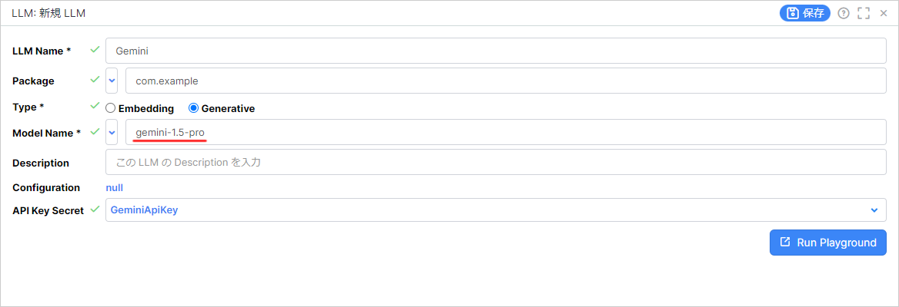
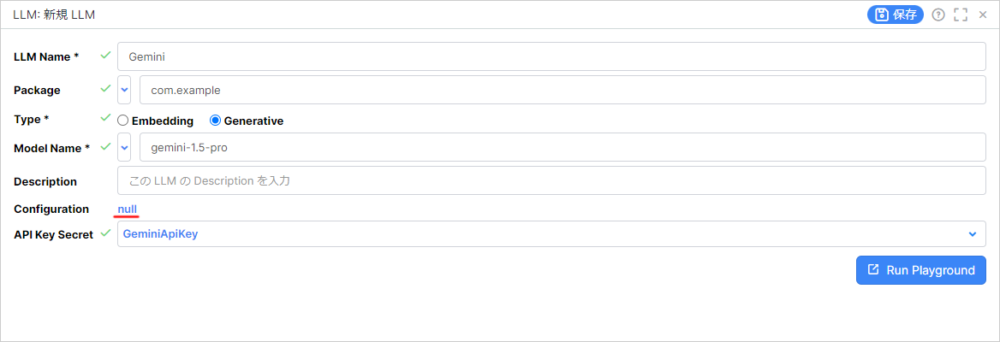
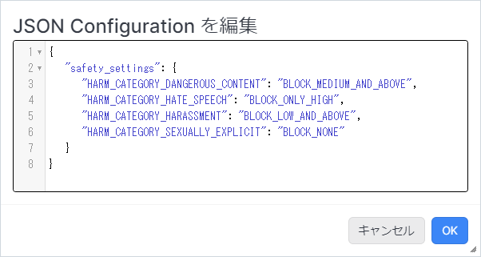
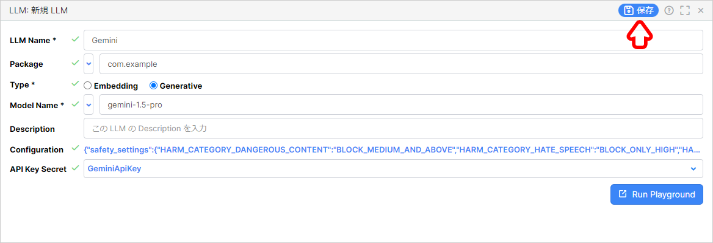

# Gemini を Vantiq で利用する方法

LLM リソースで Gemini を利用する方法を解説します。  
（※記事作成時の Vantiq バージョン： r1.39.5）

> **注意：送信データの利用について**  
> 無料版の Gemini の場合、 API に送信されたデータが Gemini の研究開発に利用されるため、機密情報を取り扱う際は従量課金設定を行ってください。  
>
> - :globe_with_meridians: [Gemini API の料金 | Google AI for Developers](https://ai.google.dev/pricing?hl=ja)

## 目次

- [Gemini を Vantiq で利用する方法](#gemini-を-vantiq-で利用する方法)
  - [目次](#目次)
  - [API キー](#api-キー)
  - [Vantiq LLM リソースの設定方法](#vantiq-llm-リソースの設定方法)
    - [参考文献](#参考文献)
  - [Gemini の安全性属性の設定方法](#gemini-の安全性属性の設定方法)
    - [設定方法](#設定方法)
    - [設定値](#設定値)
    - [参考文献](#参考文献-1)

## API キー

下記の URL から Google AI Studio API Key を発行します。  

- :globe_with_meridians: [Google AI Studio API Key](https://aistudio.google.com/app/apikey)

## Vantiq LLM リソースの設定方法

Gemini の各モデルを利用する場合は `Model Name` を下記の表を参考にして、手入力で書き換えます。  

|Gemini のモデル名|入力する値|
|---|---|
|Gemini 1.5 Pro|gemini-1.5-pro|
|Gemini 1.5 Flash|gemini-1.5-flash|
|Gemini 1.0 Pro|gemini-1.0-pro|



### 参考文献

- :globe_with_meridians: [Gemini API | Google AI for Developers](https://ai.google.dev/gemini-api/docs/models/gemini?hl=ja)

## Gemini の安全性属性の設定方法

Gemini API を利用する際にプロンプトがフィルターに引っかかりブロックされることがあります。  
フィルター設定の変更方法は下記のとおりです。  

### 設定方法

1. LLM リソースの新規作成を行うか、既存の Gemini の LLM リソースを開きます。

1. `Configuration` の `null` をクリックします。

   

1. 後述する [設定値](#設定値) を参考にして、安全性属性の設定を行います。  

   

1. LLM リソースを保存します。

   

### 設定値

#### 安全性属性の種類

|安全性属性|キー|説明|
|---|---|---|
|危険なコンテンツ|HARM_CATEGORY_DANGEROUS_CONTENT|有害な商品、サービス、アクティビティへのアクセスを促進または可能にするコンテンツ。|
|ヘイトスピーチ|HARM_CATEGORY_HATE_SPEECH|ID や保護されている属性をターゲットとする否定的なコメントや有害なコメント。|
|嫌がらせ|HARM_CATEGORY_HARASSMENT|他人をターゲットにした悪口、威圧表現、いじめ、虐待的な内容を含むコメント|
|性的に露骨な表現|HARM_CATEGORY_SEXUALLY_EXPLICIT|性行為やわいせつな内容に関する情報が含まれるコンテンツ。|

#### 安全性の設定値

|しきい値|安全性属性|説明|
|---|---|---|
||BLOCK_NONE|安全でないコンテンツの確率に関係なく、常に表示されます。|
|少量をブロック|BLOCK_ONLY_HIGH|安全でないコンテンツである確率が高い場合にブロックします。|
|一部をブロック（デフォルト）|BLOCK_MEDIUM_AND_ABOVE|安全でないコンテンツの確率が中程度または高い場合にブロックします。|
|ほとんどをブロック|BLOCK_LOW_AND_ABOVE|安全でないコンテンツの確率が中程度または高い場合にブロックします。|
||HARM_BLOCK_THRESHOLD_UNSPECIFIED|	しきい値が指定されていません。デフォルトのしきい値を使用してブロックします。|

#### 設定例

```JSON
{
   "safety_settings": {
        "HARM_CATEGORY_DANGEROUS_CONTENT": "BLOCK_MEDIUM_AND_ABOVE"
        , "HARM_CATEGORY_HATE_SPEECH": "BLOCK_ONLY_HIGH"
        , "HARM_CATEGORY_HARASSMENT": "BLOCK_LOW_AND_ABOVE"
        , "HARM_CATEGORY_SEXUALLY_EXPLICIT": "BLOCK_NONE"
   }
}
```

### 参考文献

- :globe_with_meridians: [安全性属性を構成する | Vertex AI の生成 AI | Google Cloud](https://cloud.google.com/vertex-ai/generative-ai/docs/multimodal/configure-safety-attributes?hl=ja)

- :globe_with_meridians: [アプリケーションを開発する | Vertex AI の生成 AI | Google Cloud](https://cloud.google.com/vertex-ai/generative-ai/docs/reasoning-engine/develop?hl=ja)
