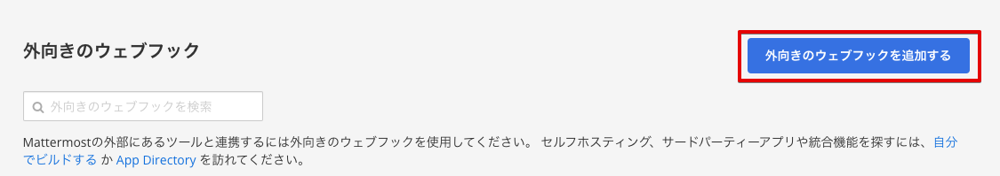

# Vantiq LLM と Mattermost のインテグレーションサンプル

## 目次

- [Vantiq LLM と Mattermost のインテグレーションサンプル](#vantiq-llm-と-mattermost-のインテグレーションサンプル)
  - [目次](#目次)
  - [概要](#概要)
  - [前提](#前提)
  - [手順](#手順)
    - [Vantiq Topic の作成](#vantiq-topic-の作成)
    - [Mattermost の外部連携の設定](#mattermost-の外部連携の設定)
    - [Vantiq Source の作成](#vantiq-source-の作成)
    - [Vantiq Service の作成](#vantiq-service-の作成)
  - [実行](#実行)
  - [リソース](#リソース)

## 概要

Vantiq LLM の機能と、 Mattermost との連携を実現するサンプルです。  
社内の独自情報を Semantic Index に登録し、 Mattermost から Semantic Index に登録した情報を問い合わせることができます。  

全体構成は以下の通りです。  


## 前提

- Mattermost の動作環境が存在すること。
  (※新規構築する場合は [こちら](https://qiita.com/shun_so/items/127904a3482fb8e971fb) を参照)
- Mattermost -> Vantiq の疎通が可能であること。
- Vantiq -> Mattermost API の疎通が可能であること。
- サンプルアプリには LLMs, Semantic Index のリソースは含まれません。
  各自 OpenAI などの必要な API Key を取得し、リソースの作成や Semantic Index Entry の追加などを行ってください。

## 手順

以下の手順で解説する各 Vantiq リソース名はサンプルです。  
任意に命名してください。  

### Vantiq Topic の作成

Mattermost からの Event を受信するための Topic を作成します。


### Mattermost の外部連携の設定

#### Bot アカウントの作成

Mattermost で、外部サーバとの通信に使用する Bot アカウントを作成します。  
Bot アカウントの詳細については [公式ドキュメント](https://developers.mattermost.com/integrate/reference/bot-accounts/) を参照してください。

1. Mattermost の画面左上部をクリックし、メニューを開き、 **統合機能** を選択します。

   

1. Bot アカウントを選択し、 Bot アカウントの追加ボタンをクリックします。
   
   

1. 必要な情報を入力します。  
   Bot アカウントのユーザ名は任意、ロールにはメンバー、権限は **投稿：全て** を有効にします。  
   

1. 作成した Bot アカウントにトークンを生成します。  
   

   トークンの説明を入力し、保存します。  
   

   生成されたトークンを保存します。  
   生成直後しか表示されないため、必ず保存してください。  
   

#### OutgoingWebhook の作成

1. Mattermost の **統合機能** から、「Outgoing Webhook」を選択し、新しい Outgoing Webhook を作成します。  
   
   

1. 必要な情報を入力し、保存します。
   - タイトル、チャンネルは任意
   - トリガーワードに Bot アカウントへのメンション（例: @botname）を指定します。
   - コールバック URL に Vantiq Topic の URL （例: <https://dev.vantiq.com/api/v1/resources/topics/jp.vantiq.mattermost/inbound?token=VantiqAccessToken>）を指定します。
   

### Vantiq Source の作成

Vantiq から Mattermost にメッセージを送信するための RemoteSource を作成します。

1. RemoteSource `jp.vantiq.Mattermost.MattermostAPISource` を作成します。
   - Server URI: Mattermost API のメッセージ投稿 API の URL を設定します。
   - Authorization Properties: Access Token に、 [Bot アカウントの作成](#bot-アカウントの作成) で生成した、Botアカウントのトークンを設定します。
   

### Vantiq Service の作成

Mattermost からの Event を受信し、 Semantic Index に登録された情報を返す Vantiq Service を作成します。

1. Service `jp.vantiq.MattermostService` を作成します。

1. Service の Topic Event Handler を新規追加し、 Mattermost からの Event を受信するための Topic を設定します。
   

1. Event Handlerを実装します。  
   以下のように実装します。

   

   - SplitByThread : `inbound` で受信した Event の post_id をキーにして、スレッド毎に会話を管理します。
   - AccumulateState : 会話IDの生成・保持を行います。
     - 以下のように設定します。
       
     - VAIL の記述内容は以下の通りです。
       Vantiq の会話コンテクスト管理に関しての詳細は、 [リファレンス](https://dev.vantiq.com/docs/system/rules/index.html#conversationmemory) を参照してください。

       ```javascript
       // Update the value of state using event.
       if(!state){
       state = {}
       }
       if(!state.convId){
          // convIdが存在しない場合、ConversationMemoryに会話を開始するようにリクエストする
        var startConv = []
          state.convId = io.vantiq.ai.ConversationMemory.startConversation(startConv)
       } 
       ```

   - SemanticSearch : `Procedure` アクティビティです。  
     Semantic Index に登録された情報を検索し、結果を返します。  
     - 以下の Service Procedure を作成してください。

       ```javascript
       package jp.vantiq
       import service io.vantiq.ai.SemanticSearch
       import service io.vantiq.text.Template
       import service io.vantiq.ai.ConversationMemory
       stateless PROCEDURE Mattermost.SemanticSearch(question String REQUIRED, convId String): Object

       var INDEX_NAME = <Semantic Index Name>
       var GENERATIVE_AI = <Generative LLM Name>
       var ERROR_TEXT = "エラーが発生しました。"
       var TEMPLATE = "質問です。「${question}」"

       var pattern = regExp("@\\w+\\s*")
       var input = {
          // "質問からメンション(＠xxx) を取り除く"
          "question": question.replace( pattern, "")
       }

       var prompt = Template.format(TEMPLATE, input)
       var result
       try {
          result = SemanticSearch.answerQuestion(INDEX_NAME, prompt, GENERATIVE_AI, convId)
       }catch(error) {
          result = {"answer": ERROR_TEXT}
          log.error(stringify(error))
       }

       return result
       ```

     - アクティビティの設定は以下の通りです。
       

   - SendToMatterMost : `Procedure` アクティビティです。  
     RemoteSource にメッセージを送信します。  
     - 以下の Service Procedure を作成してください。

       ```javascript
       package jp.vantiq
       stateless PROCEDURE Mattermost.SendToMatterMost(channel_id String, post_id String, llmResponse Object )

       var data = {
          "channel_id": channel_id,
          "root_id": post_id,
          "message": llmResponse.answer
       }

       PUBLISH { "body": data } TO SOURCE jp.vantiq.Mattermost.MattermostAPISource

       return null
       ```

     - アクティビティの設定は以下の通りです。
       
       

## 実行

[OutgoingWebhook の作成](#outgoingwebhook-の作成) で指定したチャンネルで、 `@bot名` で質問してください。  
スレッドで返信が行われます。  
スレッド内では会話コンテクストが維持されます。  

> **補足**  
> スレッドへの返信方法は [こちら](/vantiq-aiml-integration/documents/mattermost/mattermost-integration-feature/readme.md#スレッドへの返信) を参照してください。  

## リソース

- [サンプルプロジェクト](./conf/mattermost_integration.zip)
