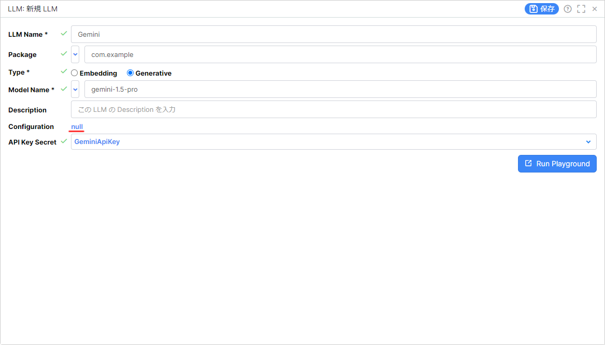
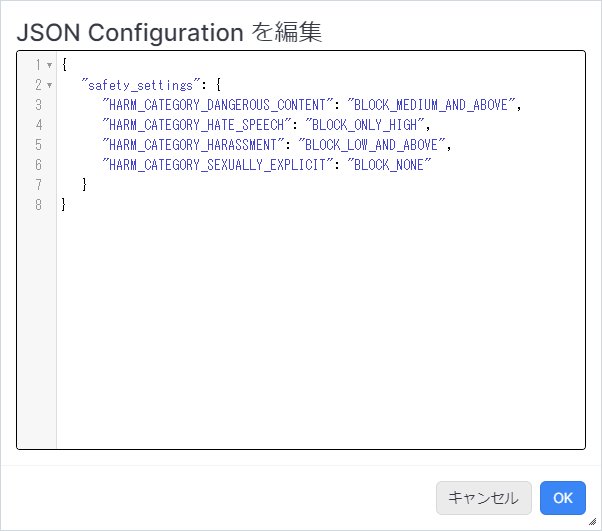
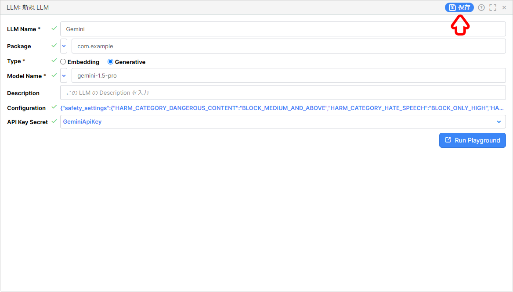

# Gemini の安全性属性の設定方法

LLM リソースの Gemini で安全性属性を設定する方法を解説します。  

## 目次

- [Gemini の安全性属性の設定方法](#gemini-の安全性属性の設定方法)
  - [目次](#目次)
  - [設定方法](#設定方法)
  - [設定値](#設定値)
    - [安全性属性の種類](#安全性属性の種類)
    - [安全性の設定値](#安全性の設定値)
    - [設定例](#設定例)
  - [参考文献](#参考文献)

## 設定方法

1. LLM リソースの新規作成を行うか、既存の Gemini の LLM リソースを開きます。

1. `Configuration` の `null` をクリックします。

   

1. 後述する [設定値](#設定値) を参考にして、安全性属性の設定を行います。  

   

1. LLM リソースを保存します。

   

## 設定値

### 安全性属性の種類

|安全性属性|キー|説明|
|---|---|---|
|危険なコンテンツ|HARM_CATEGORY_DANGEROUS_CONTENT|有害な商品、サービス、アクティビティへのアクセスを促進または可能にするコンテンツ。|
|ヘイトスピーチ|HARM_CATEGORY_HATE_SPEECH|ID や保護されている属性をターゲットとする否定的なコメントや有害なコメント。|
|嫌がらせ|HARM_CATEGORY_HARASSMENT|他人をターゲットにした悪口、威圧表現、いじめ、虐待的な内容を含むコメント|
|性的に露骨な表現|HARM_CATEGORY_SEXUALLY_EXPLICIT|性行為やわいせつな内容に関する情報が含まれるコンテンツ。|

### 安全性の設定値

|しきい値|安全性属性|説明|
|---|---|---|
||BLOCK_NONE|安全でないコンテンツの確率に関係なく、常に表示されます。|
|少量をブロック|BLOCK_ONLY_HIGH|安全でないコンテンツである確率が高い場合にブロックします。|
|一部をブロック（デフォルト）|BLOCK_MEDIUM_AND_ABOVE|安全でないコンテンツの確率が中程度または高い場合にブロックします。|
|ほとんどをブロック|BLOCK_LOW_AND_ABOVE|安全でないコンテンツの確率が中程度または高い場合にブロックします。|
||HARM_BLOCK_THRESHOLD_UNSPECIFIED|	しきい値が指定されていません。デフォルトのしきい値を使用してブロックします。|

### 設定例

```JSON
{
   "safety_settings": {
        "HARM_CATEGORY_DANGEROUS_CONTENT": "BLOCK_MEDIUM_AND_ABOVE"
        , "HARM_CATEGORY_HATE_SPEECH": "BLOCK_ONLY_HIGH"
        , "HARM_CATEGORY_HARASSMENT": "BLOCK_LOW_AND_ABOVE"
        , "HARM_CATEGORY_SEXUALLY_EXPLICIT": "BLOCK_NONE"
   }
}
```

## 参考文献

- :globe_with_meridians: [安全性属性を構成する | Vertex AI の生成 AI | Google Cloud](https://cloud.google.com/vertex-ai/generative-ai/docs/multimodal/configure-safety-attributes?hl=ja)

- :globe_with_meridians: [アプリケーションを開発する | Vertex AI の生成 AI | Google Cloud](https://cloud.google.com/vertex-ai/generative-ai/docs/reasoning-engine/develop?hl=ja)
