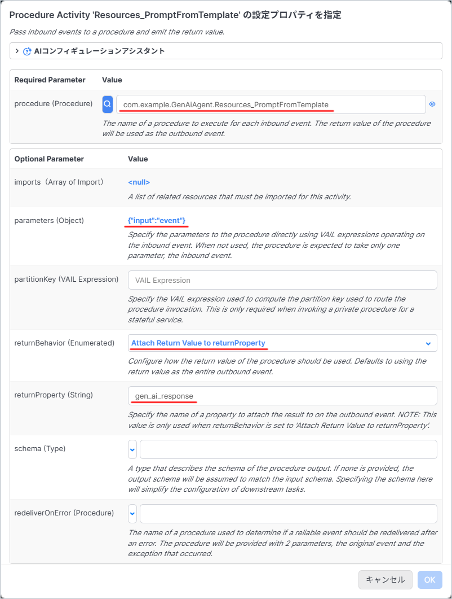
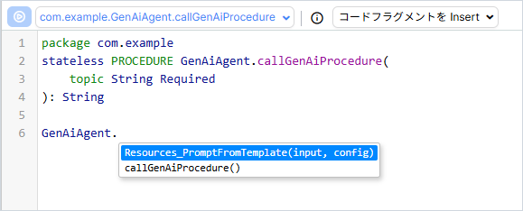

# GenAI Builder について

ここでは GenAI Builder について概要を解説します。  
（※記事作成時の Vantiq バージョン： r1.40.13）

- [GenAI Builder について](#genai-builder-について)
  - [GenAI ビルダーとは？](#genai-ビルダーとは)
  - [GenAI Procedures の呼び出し方](#genai-procedures-の呼び出し方)
    - [Visual Event Handler の場合](#visual-event-handler-の場合)
    - [Procedure の場合](#procedure-の場合)

## GenAI ビルダーとは？

App Builder のように GUI ベースで GenAI を構築できる機能になります。

App Builder では SubmitPrompt Activity や AnswerQuestion Activity を利用して、アプリケーションに GenAI を迅速に追加できるように設計されています。  
しかしその一方で、これらの Activity Pattern の動作は比較的固定されています。  
これは、これらの Activity Pattern が最も広範なユースケースに対応することを目的としているためです。  

アプリケーションによってはより特殊な GenAI 機能が必要な場合や最新の GenAI アルゴリズムを活用する必要がある場合もあります。  
これらの要件に対応することが、 GenAI Builder の目的です。  

## GenAI Procedures の呼び出し方

GenAI Builder で作成した GenAI Procedures は通常のプロシージャと同様に呼び出すことが出来ます。  

### Visual Event Handler の場合

通常の Procedure を呼び出すときと同じように Procedure Activity を利用します。




### Procedure の場合

通常の Procedure を呼び出すときと同じように VAIL を記述します。

```JavaScript
package com.example
stateless PROCEDURE GenAiAgent.callGenAiProcedure(
    topic String Required
): String

var input = {
    topic: topic
}

var response = GenAiAgent.Resources_PromptFromTemplate(input)

return response
```

また、通常の Procedure と同様に入力補完が利用できます。


