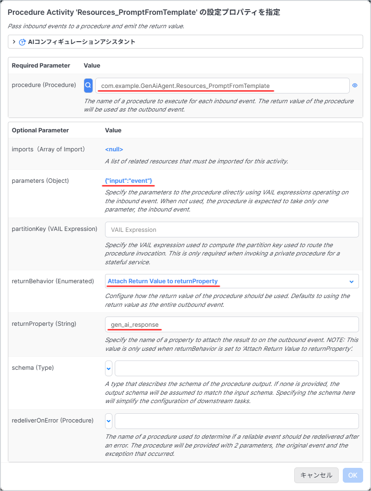
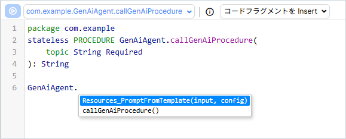

# GenAI Procedures の呼び出し方

GenAI Builder で作成した GenAI Procedures は通常のプロシージャと同様に呼び出すことが出来ます。  
（※記事作成時の Vantiq バージョン： r1.43.0）

## Visual Event Handler の場合

通常の Procedure を呼び出すときと同じように Procedure Activity を利用します。




## Procedure の場合

通常の Procedure を呼び出すときと同じように VAIL を記述します。

```JavaScript
package com.example
stateless PROCEDURE GenAiAgent.callGenAiProcedure(
	topic String Required
): String

var input = {
	topic: topic
}

var response = GenAiAgent.Resources_PromptFromTemplate(input)

return response
```

また、通常の Procedure と同様に入力補完が利用できます。


