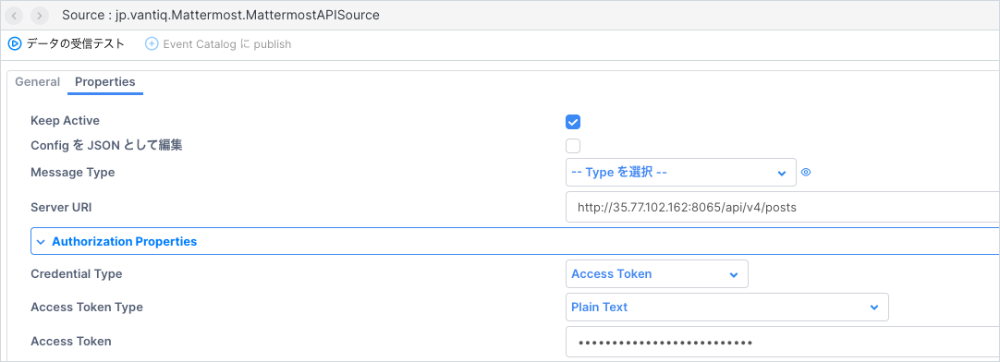
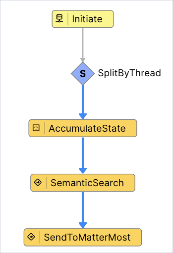

# Vantiq LLM とMattermostのインテグレーションサンプル

## 目次

- [Vantiq LLM とMattermostのインテグレーションサンプル](#vantiq-llm-とmattermostのインテグレーションサンプル)
  - [目次](#目次)
  - [概要](#概要)
  - [前提](#前提)
  - [手順](#手順)
    - [Vantiq Topic の作成](#vantiq-topic-の作成)
    - [Mattermost の外部連携の設定](#mattermost-の外部連携の設定)
    - [Vantiq Source の作成](#vantiq-source-の作成)
    - [Vantiq Service の作成](#vantiq-service-の作成)
  - [実行](#実行)
  - [リソース](#リソース)

## 概要

Vantiq LLMの機能と、Mattermostとの連携を実現するサンプルです。社内の独自情報をSemantic Indexに登録し、MattermostからSemantic Indexに登録した情報を問い合わせることができます。

全体構成は以下の通りです。


## 前提

- Mattermostの動作環境が存在すること(新規構築する場合は[こちら](https://qiita.com/shun_so/items/127904a3482fb8e971fb)を参照)
- Mattermost -> Vantiq の疎通が可能であること
- Vantiq -> Mattermost API の疎通が可能であること
- サンプルアプリにはLLMs,Semantic Index のリソースは含まれません。各自OpenAIなどの必要なAPI Keyを取得し、リソースの作成やSemantic Index Entryの追加などを行ってください

## 手順

以下の手順で解説する各Vantiqリソース名はサンプルです。任意に命名してください。

### Vantiq Topic の作成

MattermostからのEventを受信するためのTopicを作成します。


### Mattermost の外部連携の設定

#### Botアカウントの作成

Mattermostで、外部サーバとの通信に使用するBotアカウントを作成します。Botアカウントの詳細については[公式ドキュメント](https://developers.mattermost.com/integrate/reference/bot-accounts/) を参照してください。

1. Mattermostの画面左上部をクリックし、メニューを開き、**統合機能** を選択します。

   

2. Botアカウントを選択し、Botアカウントの追加ボタンをクリックします。
   
   

3. 必要な情報を入力します。Botアカウントのユーザ名は任意、ロールにはメンバー、権限は**投稿：全て** を有効にします。
   

4. 作成したBotアカウントにトークンを生成します。
   

   トークンの説明を入力し、保存します。
   

   生成されたトークンを保存します。生成直後しか表示されないため、必ず保存してください。
   

#### OutgoingWebhookの作成

1. Mattermostの**統合機能**から、「Outgoing Webhook」を選択し、新しいOutgoing Webhookを作成します。
   
   

1. 必要な情報を入力し、保存します。
   - タイトル、チャンネルは任意
   - トリガーワードにBotアカウントへのメンション（例: @botname）を指定します。
   - コールバックURLにVantiq TopicのURL（例: <https://dev.vantiq.com/api/v1/resources/topics/jp.vantiq.mattermost/inbound?token=VantiqAccessToken>）を指定します。
   

### Vantiq Source の作成

VantiqからMattermostにメッセージを送信するためのRemoteSourceを作成します。

1. RemoteSource `jp.vantiq.Mattermost.MattermostAPISource`を作成します。
   - Server URI: Mattermost APIのメッセージ投稿APIのURLを設定します。
   - Authorization Properties: Access Token に、[Botアカウントの作成](#botアカウントの作成)で生成した、Botアカウントのトークンを設定します。


### Vantiq Service の作成

MattermostからのEventを受信し、Semantic Indexに登録された情報を返すVantiq Serviceを作成します。

1. Service `jp.vantiq.MattermostService` を作成します。

2. Service のTopic Event Handler を新規追加し、MattermostからのEventを受信するためのTopicを設定します。
   

3. Event Handlerを実装します。以下のように実装します。

   

   - SplitByThread : `inbound` で受信したEventのpost_idをキーにして、スレッド毎に会話を管理します。
   - AccumulateState : 会話IDの生成・保持を行います。
     - 以下のように設定します。
      
     - vailの記述内容は以下の通りです。Vantiqの会話コンテクスト管理に関しての詳細は、[リファレンス](https://dev.vantiq.com/docs/system/rules/index.html#conversationmemory) を参照してください。

       ```javascript
         // Update the value of state using event.
         if(!state){
         state = {}
         }
         if(!state.convId){
            // convIdが存在しない場合、ConversationMemoryに会話を開始するようにリクエストする
            var startConv = []
            state.convId = io.vantiq.ai.ConversationMemory.startConversation(startConv)
         } 
       ```

   - SemanticSearch : `Procedure` アクティビティです。Semantic Indexに登録された情報を検索し、結果を返します。
     - 以下のService Procedureを作成してください。

       ```javascript
         package jp.vantiq
         import service io.vantiq.ai.SemanticSearch
         import service io.vantiq.text.Template
         import service io.vantiq.ai.ConversationMemory
         stateless PROCEDURE Mattermost.SemanticSearch(question String REQUIRED, convId String): Object

         var INDEX_NAME = <Semantic Index Name>
         var GENERATIVE_AI = <Generative LLM Name>
         var ERROR_TEXT = "エラーが発生しました。"
         var TEMPLATE = "質問です。「${question}」"

         var pattern = regExp("@\\w+\\s*")
         var input = {
            // "質問からメンション(＠xxx) を取り除く"
            "question": question.replace( pattern, "")
         }

         var prompt = Template.format(TEMPLATE, input)
         var result
         try {
            result = SemanticSearch.answerQuestion(INDEX_NAME, prompt, GENERATIVE_AI, convId)
         }catch(error) {
            result = {"answer": ERROR_TEXT}
            log.error(stringify(error))
         }

         return result
       ```

     - アクティビティの設定は以下の通りです。
       

   - SendToMatterMost : `Procedure` アクティビティです。RemoteSourceにメッセージを送信します。
     - 以下のService Procedureを作成してください。

       ```javascript
         package jp.vantiq
         stateless PROCEDURE Mattermost.SendToMatterMost(channel_id String, post_id String, llmResponse Object )

         var data = {
            "channel_id": channel_id,
            "root_id": post_id,
            "message": llmResponse.answer
         }

         PUBLISH { "body": data } TO SOURCE jp.vantiq.Mattermost.MattermostAPISource

         return null
       ```

     - アクティビティの設定は以下の通りです。
       
       
## 実行

- [OutgoingWebhookの作成](#outgoingwebhookの作成) で指定したチャンネルで、`@bot名` で質問してください。スレッドで返信が行われます。スレッド内では会話コンテクストが維持されます。

## リソース

- [サンプルプロジェクト](../../conf/vantiq_llm_mattermost_integration/mattermost_integration.zip)
