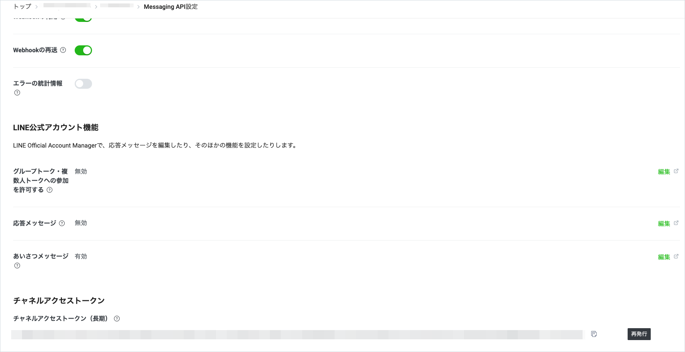
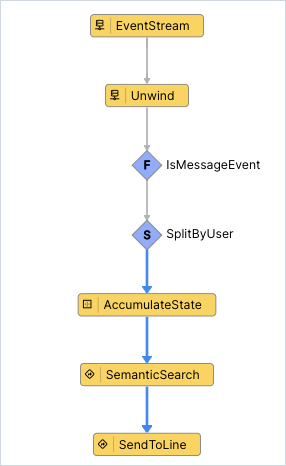

# Vantiq LLM とLINEのインテグレーションサンプル

## 概要

Vantiq LLM の機能と、 LINE bot を使用して、 LINE との連携を実現するサンプルです。  
社内の独自情報を Semantic Index に登録し、 LINE から Semantic Index に登録した情報を問い合わせることができます。  

全体構成は以下の通りです。  


## 前提

- LINE 公式アカウントや Messaging API の作成方法・設定方法については解説しません。  
  [公式ドキュメント](https://developers.line.biz/ja/docs/) などを参考に作成・設定してください。
- LLMs, Semantic Index のリソースは含まれません。  
  各自 OpenAI などの必要な API Key を取得し、リソースの作成や Semantic Index Entry の追加などを行ってください。
- LINE Messaging API Webhook -> Vantiq の疎通が可能であること。
- Vantiq -> LINE API の疎通が可能であること。

## 手順

以下の手順で解説する各 Vantiq リソース名はサンプルです。  
任意に命名してください。  

### Vantiq Source の作成

Vantiq から LINE にメッセージを送信するための RemoteSource を作成します。

1. LINE Messaging API のチャンネルアクセストークンを取得します。  
   チャンネルアクセストークンは、LINE Developers コンソール の Messaging API の設定画面から取得できます。  
  

1. RemoteSource `jp.vantiq.LineAPI` を作成し、 LINE API の URL `https://api.line.me` を設定します。  
   Authorization Property は、`Credential Type` を Access Token に設定し、 `Access Token` に上記で取得したチャンネルアクセストークンを設定します。  
  

### Vantiq Service の作成

LINE からの Event を受信し、 Semantic Index に登録された情報を返す Vantiq Service を作成します。  

1. Service `jp.vantiq.LineMessagingAPIService` を作成します。

1. Service の Inbound Event に、 LINE Webhook イベントを受信するための `webhook` を追加します。  

1. `webhook` の Event Handler を実装します。  
   以下のように実装します。  

   

   - Unwind : `webhook` で受信したEventを展開します。  
     (1つの Webhook に複数の Webhook イベントオブジェクトが含まれる場合があるため)
     EventStream に直接 Event の配列が流れてくるため、 unwindProperty の設定は不要です。
   - IsMessageEvent : `Filter` アクティビティです。  
     `webhook` で受信した Event が MessageEvent かどうかを判定します。  
     今回はメッセージイベントのみを対象とします。  
     conditions に `event.type == "message"` を設定します。
   - SplitByUser : 受信した Event の UserId をキーにして、ユーザー毎に会話を管理します。
     groupByに `event.source.userId` を設定します。
   - AccumulateState : 会話IDの生成・保持を行います。
     - 以下のように設定します。  
      
     - VAIL の記述内容は以下の通りです。  
       Vantiq の会話コンテクスト管理に関しての詳細は、 [リファレンス](https://dev.vantiq.com/docs/system/rules/index.html#conversationmemory) を参照してください。  

       ```javascript
       // Update the value of state using event.
       if !state {
          state = {}
       }
       if !state.convId {
          // convIdが存在しない場合、ConversationMemoryに会話を開始するようにリクエストする
          var startConv = []
          state.convId = io.vantiq.ai.ConversationMemory.startConversation(startConv)
       }
       ```

   - SemanticSearch : `Procedure` アクティビティです。  
     Semantic Index に登録された情報を検索し、結果を返します。  
     - 以下の Service Procedure を作成してください。  

       ```javascript
       package jp.vantiq
       import service io.vantiq.ai.SemanticSearch
       import service io.vantiq.text.Template
       import service io.vantiq.ai.ConversationMemory
       PROCEDURE LineMessagingAPIService.SemanticSearch(question String REQUIRED, convId String): Object

       var INDEX_NAME = <Semantic Index Name>
       var GENERATIVE_AI = <Generative LLM Name>
       var ERROR_TEXT = "エラーが発生しました。"
       var TEMPLATE = "以下の質問に日本語で回答してください。質問です。「${question}」"

       var input = {
          "question": question
       }
       var prompt = Template.format(TEMPLATE, input)

       var result
       try {
          result = SemanticSearch.answerQuestion(INDEX_NAME, prompt, GENERATIVE_AI, convId)
       if convId {
          var covMem = ConversationMemory.getConversation(convId)
          log.info(stringify(covMem))
       }
       }catch(error) {
          result = {"answer": ERROR_TEXT}
          log.info(stringify(error))
       }

       return result
       ```

     - アクティビティの設定は以下の通りです。  
       

   - SendToLine : `Procedure` アクティビティです。  
     RemoteSourceにメッセージを送信します。  
     - 以下のService Procedureを作成してください。

       ```javascript
       package jp.vantiq
       ROCEDURE LineMessagingAPIService.SendToLine(userId String, llmResponse Object )

       var source_config = {
          "path": "/v2/bot/message/push"
       }

       var data = {
          "to": userId,
          "messages": [
             {
                "text": llmResponse.answer,
                "type": "text"
             }
          ]
       }

       PUBLISH { "body": data } TO SOURCE jp.vantiq.LineAPI Using source_config

       return null
       ```

     - アクティビティの設定は以下の通りです。
       

### LINE Webhook Event の受信

1. LINE Webhook Event を受信する Procedure を作成します。  
   通常、 Vantiq で REST で Event を受信する場合は Topic を使用しますが、 Topic は Event を受信して `HTTP 200 OK` を返すだけなので [リクエストの検証処理](https://developers.line.biz/ja/docs/messaging-api/receiving-messages/#verifying-signatures) を行うことができません。  
   よって Procedure でイベントを受信し、 Procedure 内で署名検証を行う必要があります。  

   Procedure のサンプルは以下となります。  
   検証に成功した場合、 Service の Inbound Event に Publish します。  
   まず、チャンネルシークレット・リクエストボディ・ x-line-signature を受け取り、署名検証を行う Service Procedure を作成します。  
   (※チャンネルシークレットは、 LINE Developers コンソール の Messaging API の設定画面から取得できます。)

   ```javascript
   package jp.vantiq
   PROCEDURE LineMessagingAPIService.validateLineRequest(channelSecret String, requestBody String, lineSignature String)
   // see https://developers.line.biz/ja/reference/messaging-api/#signature-validation
   var digest = Hash.hmacSha256(channelSecret, requestBody)
   var encodedDigest = Encode.base64(digest)

   return encodedDigest == lineSignature
   ```

   次に、 LINE Webhook Event を受信する Procedure を作成します。  
   以下のように実装します。  

   ```javascript
   PROCEDURE ReceiveLineMessages(destination String, events Object ARRAY)
   var headers = Utils.getHttpHeaders()

   var channelSecret = <Channel Secret>
   var requestBody = {destination: destination, events : events}
   var lineSignature = headers."x-line-signature"

   if jp.vantiq.LineMessagingAPIService.validateLineRequest(channelSecret, stringify(requestBody), lineSignature) {
      // 署名検証に成功したらServiceにPublish
      PUBLISH events TO SERVICE EVENT "jp.vantiq.LineMessagingAPIService/webhook"
   }
   ```

1. LINE Messaging API の Webhook Url に、上記で作成した Procedure の URL を設定します。  
   URL には、 Vantiq の REST API の URL を設定します。  
   クエリパラメータで Vantiq の API Token を渡します。  

   > **NOTE**
   > 通常、 POST リクエストではクエリパラメータを使用しませんが、 Vantiq の REST API は認証が必要なため、クエリパラメータで API Token を渡します。  
   > クエリパラメータに認証情報を含めることはセキュリティ上問題があるため、プロダクション環境では API Gateway で Authorization Header を付与するなどの対応が必要です。  

   ```javascript
   https://dev.vantiq.com/api/v1/resources/procedures/ReceiveLineMessages?token=<API Token>
   ```

   

## 実行

LINE アプリで LINE Bot を友達登録し、質問してください。  
Semantic Index からの返信が行われます。  
会話コンテクストも維持されます。  

## リソース

- [サンプルプロジェクト](./conf/line_integration.zip)
