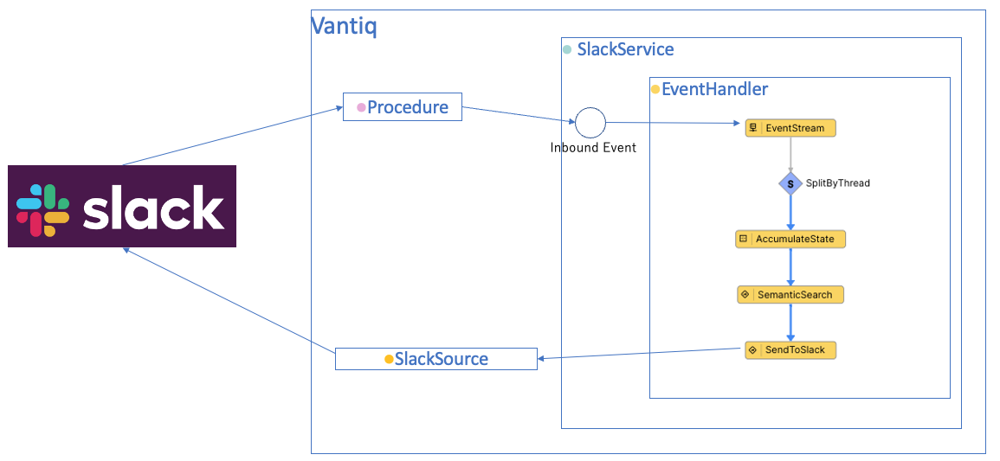
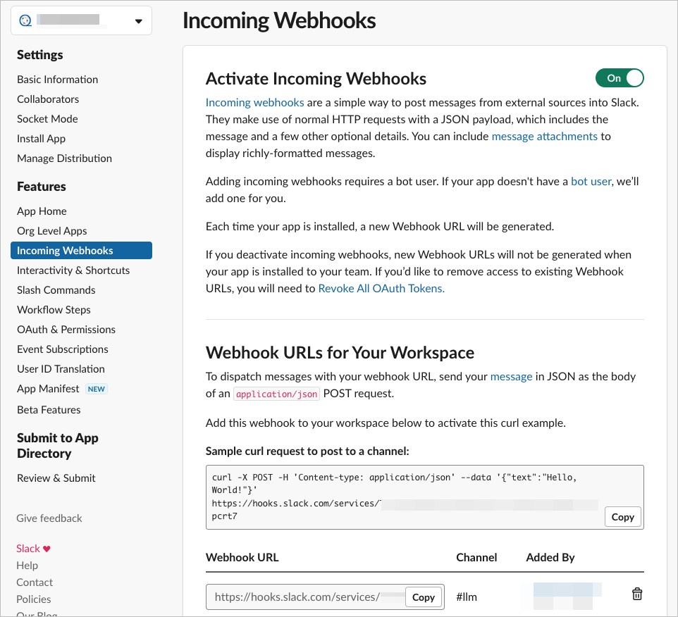
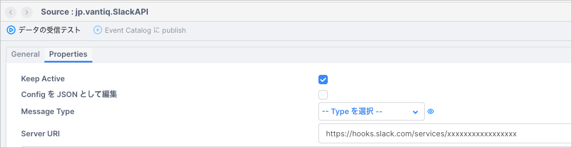
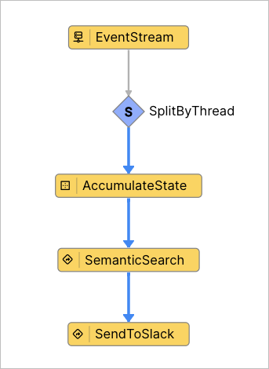
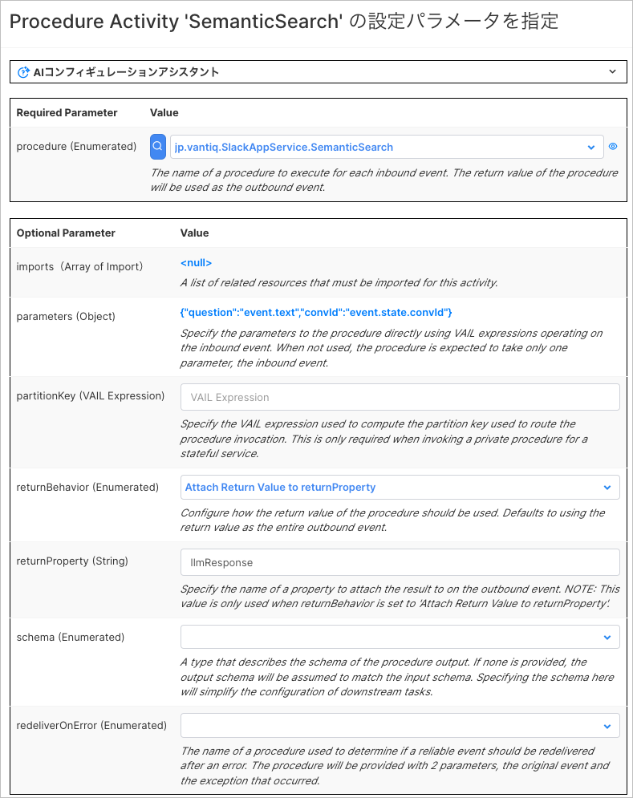
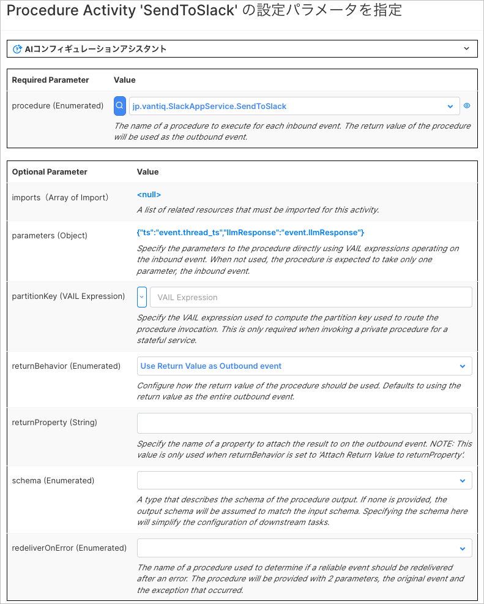
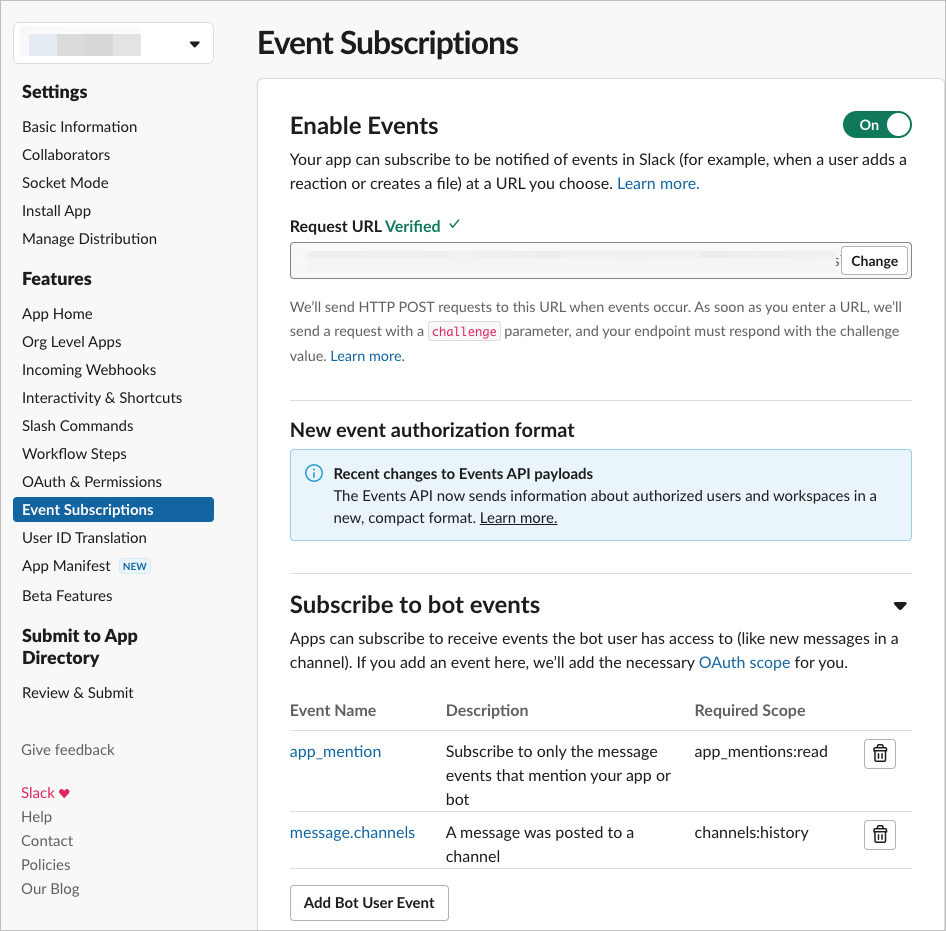

# Vantiq LLM と Slack のインテグレーションサンプル

## 概要

Vantiq LLM の 機能と、 Slack App を使用して、 Slack との連携を実現するサンプルです。  
社内の独自情報を Semantic Index に登録し、 Slack から Semantic Index に登録した情報を問い合わせることができます。  

全体構成は以下の通りです。  


## 前提

- Slack App の作成方法・設定方法については解説しません。  
  [Slack Appの作り方を丁寧に残す【BotとEvent APIの設定編】](https://zenn.dev/mokomoka/articles/6d281d27aa344e) などを参考に作成・設定してください。
- LLMs, Semantic Index のリソースは含まれません。  
  各自 OpenAI などの必要な API Key を取得し、リソースの作成や Semantic Index Entry の追加などを行ってください。
- Slack -> Vantiq の疎通が可能であること。
- Vantiq -> Slack の疎通が可能であること。
- Slack App の Event Subscriptions が有効であること。
- Slack App に必要な OAuth Scope が設定されていること。  
  今回は `app_mentions:read`, `channels:history`, `channels:join`, `chat:write`, `groups:read`, `incoming-webhook` を設定してください。

## 手順

以下の手順で解説する各 Vantiq リソース名はサンプルです。  
任意に命名してください。  

### Vantiq Source の作成

Vantiq から Slack にメッセージを送信するための RemoteSource を作成します。  

1. Slack App の Incoming Webhook URL を取得します。  
   Slack App の Incoming Webhook URL は、 Slack App の Incoming Webhook の設定画面から取得できます。

   

1. RemoteSource `jp.vantiq.SlackAPI` を作成し、 Slack App の Incoming Webhook URL を設定します。

   

### Vantiq Service の作成

Slack からの Event を受信し、 Semantic Index に登録された情報を返す Vantiq Service を作成します。

1. Service `jp.vantiq.SlackAppService` を作成します。

1. Service の Inbound Event に、 Slack からの Event を受信するための `inbound` を追加します。

1. `inbound` の Event Handler を実装します。  
   以下のように実装します。

   

   - SplitByThread : `inbound` で受信した Event の thread_ts をキーにして、スレッド毎に会話を管理します。
   - AccumulateState : 会話IDの生成・保持を行います。
     - 以下のように設定します。

       

     - VAIL の記述内容は以下の通りです。
       Vantiq の会話コンテクスト管理に関しての詳細は、 [リファレンス](https://dev.vantiq.com/docs/system/rules/index.html#conversationmemory) を参照してください。

       ```javascript
       // Update the value of state using event.
       if(!state){
       state = {}
       }
       if(!state.convId){
          // convIdが存在しない場合、ConversationMemoryに会話を開始するようにリクエストする
          var startConvo = []
          state.convId = io.vantiq.ai.ConversationMemory.startConversation(startConvo)
       } 
       ```

   - SemanticSearch : `Procedure` アクティビティです。  
     Semantic Index に登録された情報を検索し、結果を返します。  
     - 以下の Service Procedure を作成してください。  

       ```javascript
       package jp.vantiq
       import service io.vantiq.ai.SemanticSearch
       import service io.vantiq.text.Template
       import service io.vantiq.ai.ConversationMemory
       PROCEDURE SlackAppService.SemanticSearch(question String REQUIRED, convId String): Object

       var INDEX_NAME = <Semantic Index Name>
       var GENERATIVE_AI = <Generative LLM Name>
       var ERROR_TEXT = "エラーが発生しました。"
       var TEMPLATE = "質問です。「${question}」"

       var input = {
          "question": question
       }

       var prompt = Template.format(TEMPLATE, input)
       var result
       try {
          result = SemanticSearch.answerQuestion(INDEX_NAME, prompt, GENERATIVE_AI, convId)
       if convId {
          var convMem = ConversationMemory.getConversation(convId)
          log.info(stringify(convMem))
       }
       }catch(error) {
          result = {"answer": ERROR_TEXT}
          log.error(stringify(error))
       }

       return result
       ```

     - アクティビティの設定は以下の通りです。

       

   - SendToSlack : `Procedure` アクティビティです。  
     RemoteSource にメッセージを送信します。
     - 以下の Service Procedure を作成してください。

       ```javascript
       package jp.vantiq
       PROCEDURE SlackAppService.SendToSlack(ts String, llmResponse Object )

       var references = []
       for item in llmResponse.metadata {
          var  reference = {
                         "title": "",
                         "value": item.url,
                         "short": true
          }
          references.push(reference)
       }

       var data = {
          "channel": "@channel",
          "thread_ts": ts,
          "text": llmResponse.answer,
          "attachments": [
             {
                "color": "#ff0000",
                "title": "参考リンク",
                "fields": references
             }
          ]
       }

       PUBLISH { "body": data } TO SOURCE jp.vantiq.SlackAPI

       return null
       ```

     - アクティビティの設定は以下の通りです。

       

### Slack Event の Subscribe

1. Slack の Event を受信する Procedure を作成します。  
   通常 Vantiq で REST で Event を受信する場合 Topic を使用しますが、 Topic は Event を受信して `HTTP 200 OK` を返すだけなので [リクエストの検証処理](https://api.slack.com/apis/connections/events-api#handshake) を行うことができません。  
   よって Procedure でイベントを受信し、 Procedure 内で URL Verification を行う必要があります。  

   Procedure のサンプルは以下となります。  
   `app_mention` Event を受信した場合、 Service の Inbound Event に Publish します。  

   ```javascript
   PROCEDURE EventSubscriptions(type, token, challenge, event)
   //Slackからのイベントを受け取り、メンションの場合ServeceにPublishするProcedureです。
   //https://api.slack.com/apis/connections/events-api#handshake
   // URL verification handshake  の手順は省略しています。
   if event && event.type == "app_mention" {
      // スレッドのIDが存在しない場合、スレッドの親とみなしてイベントのIDをスレッドIDに設定する
      if !event.thread_ts {
         event.thread_ts = event.ts
      } 
      PUBLISH event TO SERVICE EVENT "jp.vantiq.SlackAppService/inbound"
   }
   return {"challenge": challenge}
   ```

1. Slack App の Event Subscriptions の Request Url に、上記で作成した ProcedureのURL を設定します。  
   URL には、 Vantiq の REST API の URL を設定します。  
   クエリパラメータで Vantiq の API Token を渡します。  
 
   > **NOTE**
   > 通常、 POST リクエストではクエリパラメータを使用しませんが、 Vantiq の REST API は認証が必要なため、クエリパラメータで API Token を渡します。  
   > クエリパラメータに認証情報を含めることはセキュリティ上問題があるため、プロダクション環境では API Gateway で Authorization Header を付与するなどの対応が必要です。  

   ```javascript
   https://dev.vantiq.com/api/v1/resources/SlackAppService/EventSubscriptions?token=<API Token>
   ```

   

## 実行

Slack App を Channel に追加し、 `@bot名` で質問してください。  
スレッドで返信が行われます。  
スレッド内では会話コンテクストが維持されます。  

## リソース

- [サンプルプロジェクト](./conf/llm_slack_integration.zip)
