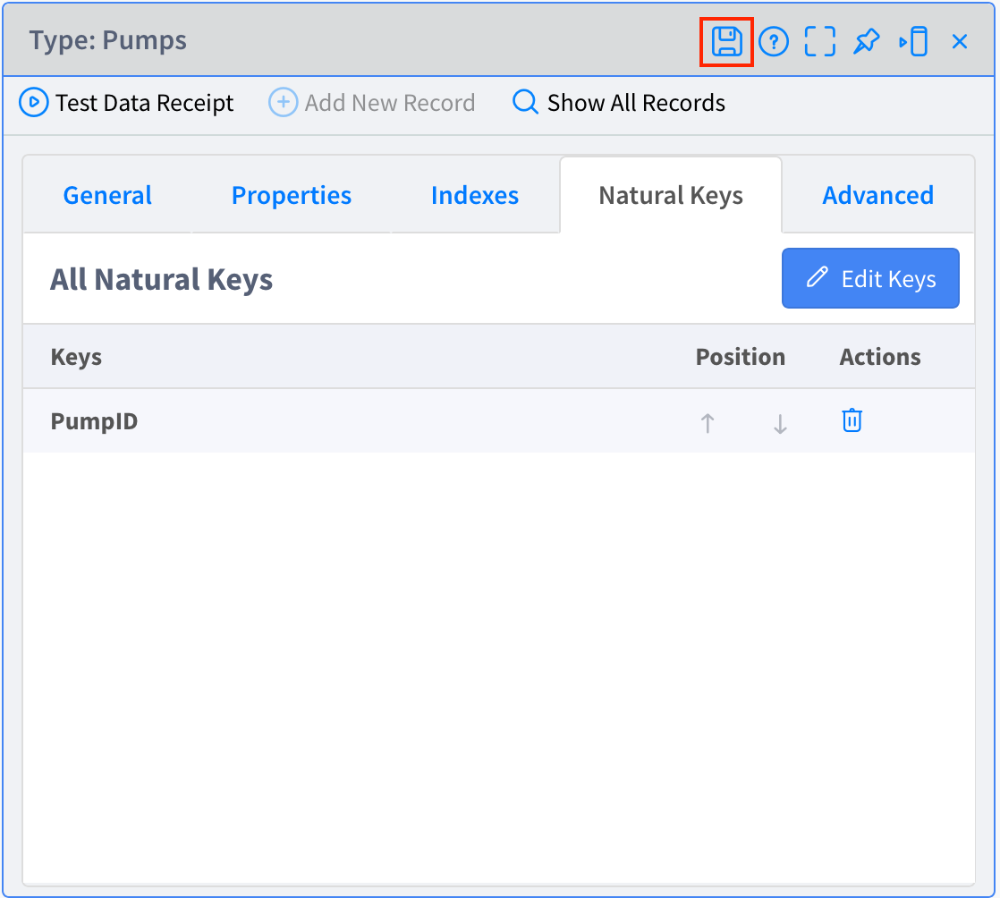
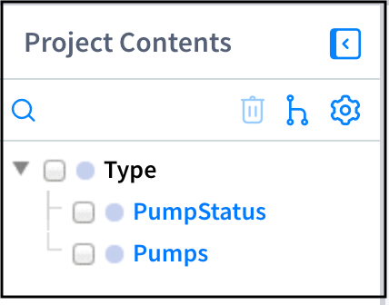
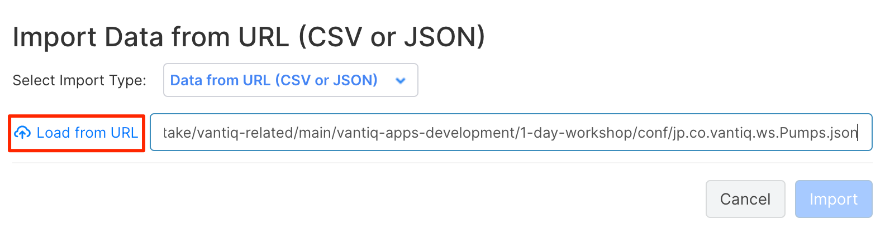
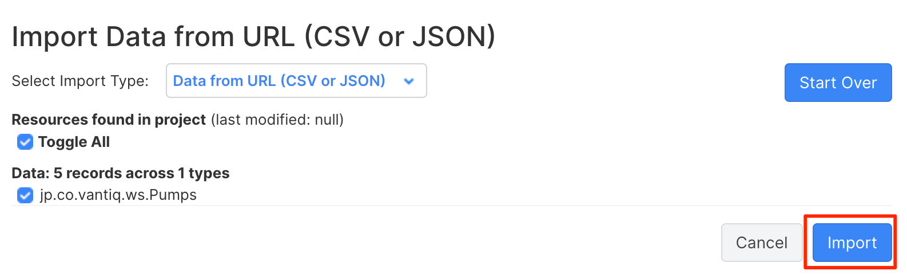
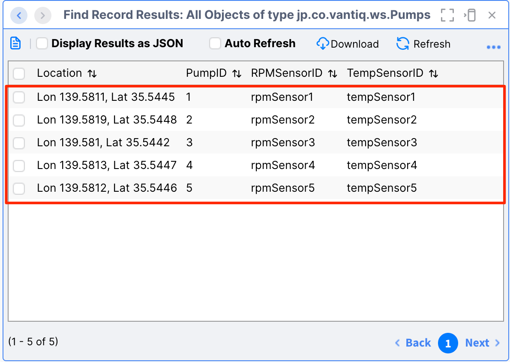

# **Lab 02 – Types（タイプ）**

## ***概要***

この Lab では、**Type** を作成します。Type はデータベースのテーブルのような仕組みです。データを保存したり、外部から受信するイベントの型の定義などに使用します。

今回のシナリオでは以下の通り Type を作成します。

-   **Pumps** – ポンプのマスタデータを保存します。**ポンプの位置、設置されたセンサーの情報を保存** します。

-   **PumpStatus** – ポンプの ***現在*** **のステータスを保存**します。

Type には、データを格納するための Type である「**Standard**」と、受信イベントの構造と型を定義するための「**Schema**」の 2種類が存在します。この Lab では「**Standard**」を扱います。「**Schema**」は Source と深い関わりを持つため、`Lab-03 Sources` で扱います。

#### 参考
- Vantiq Academy (要ログイン)
  - [2.5: 基本Resource: Type](https://community.vantiq.com/courses/%e3%82%a2%e3%83%97%e3%83%aa%e3%82%b1%e3%83%bc%e3%82%b7%e3%83%a7%e3%83%b3%e9%96%8b%e7%99%ba%e8%80%85-level-1-%e3%82%b3%e3%83%bc%e3%82%b9-%e6%97%a5%e6%9c%ac%e8%aa%9e/lessons/lesson-2-vantiq-%e9%96%8b%e7%99%ba%e3%83%97%e3%83%a9%e3%83%83%e3%83%88%e3%83%95%e3%82%a9%e3%83%bc%e3%83%a0/topic/2-5-%e5%9f%ba%e6%9c%acresource-type-copy-2/)

## ***Step 1***

次からの作業は、`PumpFailureDetection` Project において行います。
すでに開いている場合は、ナビゲーション バーの Project 名に `PumpFailureDetection` と表示されているはずです。

***Pumps*** Type を作成します。  

＊ `Pumps` Type はポンプのマスタデータを保存するために作成します。あとで受信するセンサーデータと組み合わせて使用します。

1. 「追加」 > 「Type...」 > 「_＋新規 Type_」 をクリックし、Type の新規作成画面を開きます。

2. 名前に「`Pumps`」と入力し、Packageを `jp.co.vantiq.ws`、Role を「standard」に設定して「_OK_」をクリックします。

3. `Pumps` Type の「Properties」タブを開き「_+ Property の追加_」から以下の 4つのプロパティを作成します。

| 名前         | データ型 | 説明               |
|--------------|----------|--------------------|
| PumpID       | Integer  | ポンプの ID         |
| Location     | GeoJSON  | 緯度経度の座標     |
| TempSensorID | String   | 温度センサーの ID   |
| RPMSensorID  | String   | 回転数センサーの ID |

4. 「Index」タブを開き「_+ Index の追加_」をクリックします。

5. 「Is Index unique?」にチェックを入れ、Key に「`PumpID`」を設定して「_OK_」をクリックします。

6. 「Natural Keys」タブを開き「_Keyの設定_」をクリックします。

7. Key に「`PumpID`」を設定して「_OK_」をクリックします。

    

8. _変更の保存_ ボタンをクリックし、Type を保存します。

## ***Step 2***

***PumpStatus*** Type を作成します。

＊ ポンプの**現在の**ステータスを保持し、現在のポンプの状態をリアルタイムダッシュボードで表示するために利用します。

1. 「追加」 > 「Type...」 > 「_＋ 新規 Type_」 をクリックし、Type の新規作成画面を開きます。

2. 名前に「`PumpStatus`」と入力し、Packageを `jp.co.vantiq.ws`、Role を「standard」に設定して「_OK_」をクリックします。

3. `PumpStatus` Type の「Properties」タブを開き「_+ Property の追加_」から以下の 5つのプロパティを作成します。

| 名前       | データ型 | 説明                   |
|------------|----------|------------------------|
| PumpID     | Integer  | ポンプの ID             |
| Temp       | Integer  | 温度の値               |
| RPM        | Integer  | 回転数の値             |
| Location   | GeoJSON  | 緯度経度の座標         |
| ReceivedAt | DateTime | 受信したタイムスタンプ |

4. 「Index」タブを開き「_+ Index の追加_」をクリックします。

5. 「Is Index unique?」にチェックを入れ、Key に「`PumpID`」を設定して「_OK_」をクリックします。

6. 「Natural Keys」タブを開き「_Key の設定_」をクリックします。

7. Key に「`PumpID`」を設定して「_OK_」をクリックします。

   

8. _変更の保存_ ボタンをクリックし、Type を保存します。

以上で Type の作成は終了です。2つの Type が左側の「Project Contents」のリストに表示されているはずです。

これで `PumpFailureDetection` Project に 2つの Type が加わった状態になりましたので、その関連付けを保存するために Project 名の右にある _保存_ ボタンから Project の保存を行なってください。

＊ Type の保存と Project の保存は別の作業です。今現在 Namespace 上に 2つの Type が作成されましたが、Project の保存を行うまで Project との関連付けは保存されておりません。  

## ***Step 3 （データ登録）***

作成した各 Type に必要なデータを登録します。

1. **Pumps Type へのデータ登録**  
Pumps Type にマスタデータを登録します。今回は複数件のデータをまとめてアップロードしたい場合に使用する手順でデータ登録を行います。  
    1. 「Projects」 > 「インポート...」 をクリックして「Project またはデータのインポート」ウィンドウを開き、「Select Import Type」を「Projects」から「Data From URL(CSV or JSON)」に変更します。  
    2. 「[`Pumps.json`](https://raw.githubusercontent.com/fujitake/vantiq-related/main/vantiq-apps-development/1-day-workshop-135/conf/jp.co.vantiq.ws.Pumps.json)」のURLを指定し、Importをクリックします。
   

1.  **登録データ確認**  
`Pumps` Type にデータが正しく登録されているか確認します。`Pumps` Type を開き、「すべてのレコードの表示」をクリックして以下の画像のようにデータが登録されているか確認してください。

    

## ***▷確認ポイント***

-   各 Type の Type 名、プロパティ名が正しいか  
    ✔︎   大文字、小文字が正しいか、入力ミスがないかを改めて確認してください。ミスがあると今後の手順でエラーが発生します。

-   データが正しく登録されているか

## Vantiq 1-day Workshop 次のセッション  
|Session #|Session      | Type  |Contents Description       |Duration (m)|Material               |
|:-----:|--------------|:------:|---------------------------|:-:|--------------------------------|
|4|Source (ソース)|Lab|データの送受信で使う機能|20|[Lab03_Sources](4-Lab03_Sources.md)|
