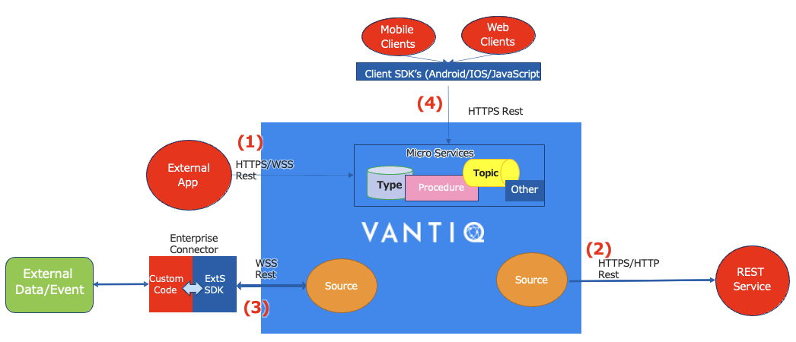

# Vantiq インテグレーション

## 概要

Vantiqは以下の方法で外部システムとインテグレーションすることができます。
- 外部システムからVantiq ServerへREST APIで接続 (HTTPS or WebSocket) - **(1)**
- Vantiqから外部システムへREST APIで接続 (Remote Source) - **(2)**
- MQTT、AMQP、KafkaなどのBrokerとの接続
- Vantiq Extension Source (既製 or カスタム実装）を使用して接続 - **(3)**
- Vantiq Client SDK (IOS/Android/JavaScript) – Vantiq　Client Integration SDK - サードパーティのUIをVantiqと統合できるようにするSDK  - **(4)**

## 外部システムからVantiqへREST APIで接続する

Vantiqは、リソースへのRESTベースのHTTPSアクセスをサポートしています。
- リソースのURI構造: `/api/v<version>/resources/<リソース名>[/<リソース識別子>]`
  - APIの現在のバージョンは1です(すなわち、/api/v1/...)。
  - <リソース名>には、リソースの種類（topics, type, procedure etc.) もしくはユーザー定義のTypeの名前を指定することができます。
  - ユーザー定義のリソースの前には/customが付きます。 例：`/api/v1/resources/custom/Customer`
- セキュリティ
  - VantiqクラウドではHTTPS通信のみ許可
  - Access Tokenによる認証が必要

- アクションはHTTP動詞
  - `GET` (SELECT) は、リソースまたはリソースのリストのデータを取得します。
  - `POST` (CREATE) は新しいリソースを作成します。
  - `PUT` (UPDATE) はリソースを (完全に) 更新します。
  - `DELETE` (DELETE) はリソースを削除します。
  - `PATCH` (UPDATE) はリソースを更新します。
- 結果はJSONで戻る
- 成功/失敗はHTTPステータスコードとして戻る
- 詳細は[API Reference](https://dev.vantiq.co.jp/docs/system/api/index.html)を参照

## Vantiqから外部サービスへREST APIで接続 (Remote Source)

Restベースの外部サービスにアクセスできるようにする
- Googleマップ、AI＆MLサービス、データベース、SAP、Saleforce etc…
- REMOTE SourceにURLとHTTPパラメータを定義しておける。
  - 例) – Server URI = https://maps.googleapis.com/maps/api/geocode/outputFormat , Query Parameters = { ”address” : “XXXXXXX”} 
- VAIL(RuleやProcedure)から呼び出します。
  - `SELECT` (SQLのような構文) - データを取得、もしくはリクエストに対するレスポンスで受け取る
  - `PUBLISH` - レスポンスなしでデータを送信する
- Rest サービスを定期的にポーリングするように構成することもできる
