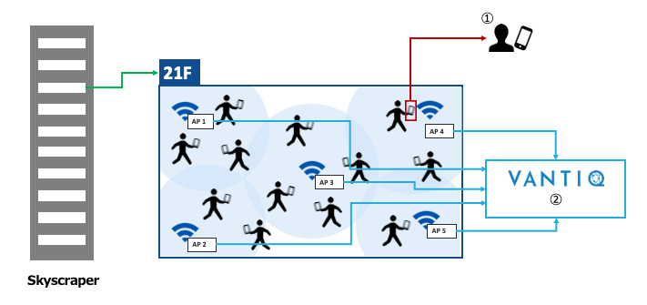

# 混雑検出アプリケーション開発

## 課題概要

* これまでに学習した内容を使いながら本資料を参考に混雑検出アプリケーションの実装を行ってください。  
* 詳細な手順はありません。アプリケーションの実装に必要な `Type` や `Source` などリソースは全てご自身で追加してください。
* 応用的な課題であり、これまでに使っていない `Activity Pattern` や `VAIL` でのプログラミングが必要になりますのでリファレンスを調べながら取り組んでください。
  * App Builder リファレンス
    * [https://dev\.vantiq\.co\.jp/docs/system/app/index\.html](https://dev.vantiq.com/docs/system/app/index.html)
  * VAIL リファレンス
    * [https://dev\.vantiq\.co\.jp/docs/system/rules/index\.html](https://dev.vantiq.com/docs/system/rules/index.html)
* こちらの[素材ファイル](../../conf/AdditionalContents/dev01_detect_congestion_app)を使用してください。

## 本アプリケーションのシナリオ

1. ビルのそれぞれのフロアの混雑を、フロアごとのデバイス数を元に検出する
2. 各フロアに **WiFi AP** が _5_ 台ずつ存在し、それらがフロア内のデバイスを検出する
3. **WiFi AP** は検出した全デバイスの情報（配列データ）と自身の _MAC_ アドレスを POST する
4. VANTIQ は POST されたデータをもとに混雑と、ウォッチリストに登録されたデバイスの検出を行う  
    ＊ ウォッチリストは、PCR 検査で陽性だった、_2_ 週間以内に発熱があったなど、ビルに来ては行けない人のデバイスが登録されているリストを指します

&nbsp;&nbsp;&nbsp; ***＊ 2と3 を再現するためのデータジェネレータが配布されます。***

## 実装するアプリケーションの機能

1. フロアごとに混雑率を計算し混雑を検出する  
2. ウォッチリストに登録されたデバイスがフロア内に侵入したことを検出する  
3. 検出された場合、通知・他システムへの連携を行う  

## １フロアあたりの動作イメージ

  
① ウォッチリストに登録されたデバイスを検出  
② フロアごとに存在する AP で検出したデータから混雑判定  

## VANTIQ で実装する処理の流れ（概要）

  * **WiFi AP**（`データジェネレータ`）から POST されるデータを受信する
  * データを POST した **WiFi AP** の _MAC_ アドレスに合わせてフロア情報を付与する
  * 検出されたデバイスの配列データをデバイス単位に分割し処理を並列化する
  * 不要なパラメータを削除し、データを最適化する
  * デバイスがウォッチリストに存在しているか判定する
  * ウォッチリストに存在していたら任意のサービスに通知する
  * デバイスごとのデータをフロア単位のストリームに分割する
  * 直近  _3_ 分間のデバイス数をフロアごとにカウントし、フロアごとの許容人数に合わせて混雑率を計算する
  * 混雑率  _50_%を超えたら混雑と判定する
  * 混雑が発生したことを任意のサービスに通知する

## 実装のヒント

* ActivityPattern
  * `Filter`
    * 単純なフィルタリングから、閾値に `Procedure` を設定することで柔軟に判定を行える
  * `AccumulateState`
    * 次々に受信するイベントをトラッキングしてカウントをしたりできるため、`Procedure` の書き方次第で一定期間に受信したイベント数を使った計算など自由度高く実装することができる
  * `Statistics`/`ComputeStatistics`
    * イベントの統計処理が行える
  * `SplitByGroup`
    * グループごとにストリームを分割できる    

***＊全ての Activity Pattern を使用しなければいけないわけではありません。***
