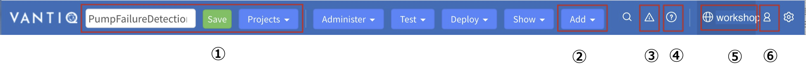
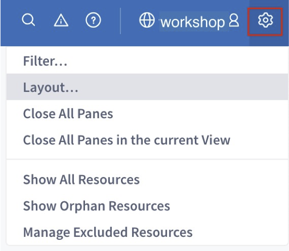
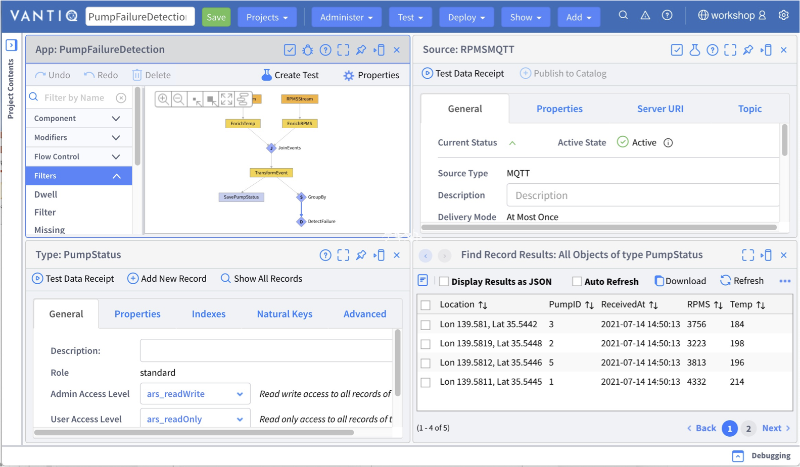
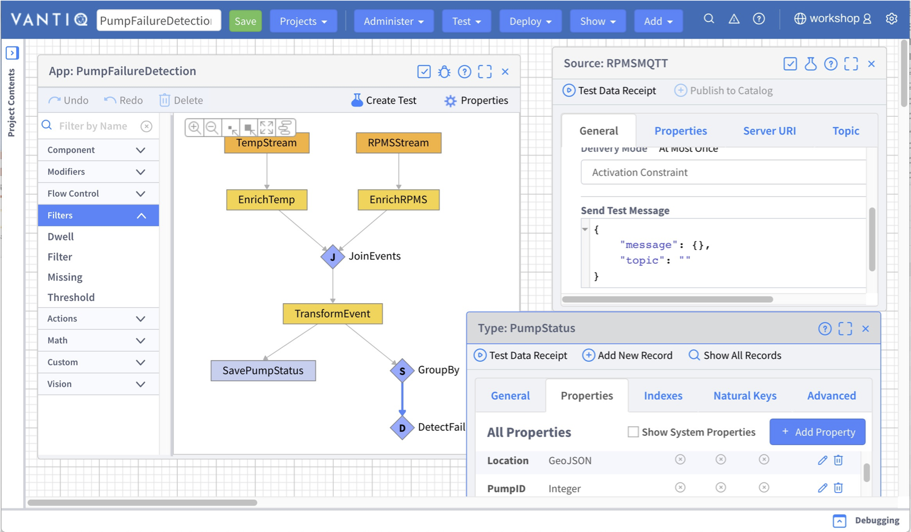
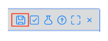
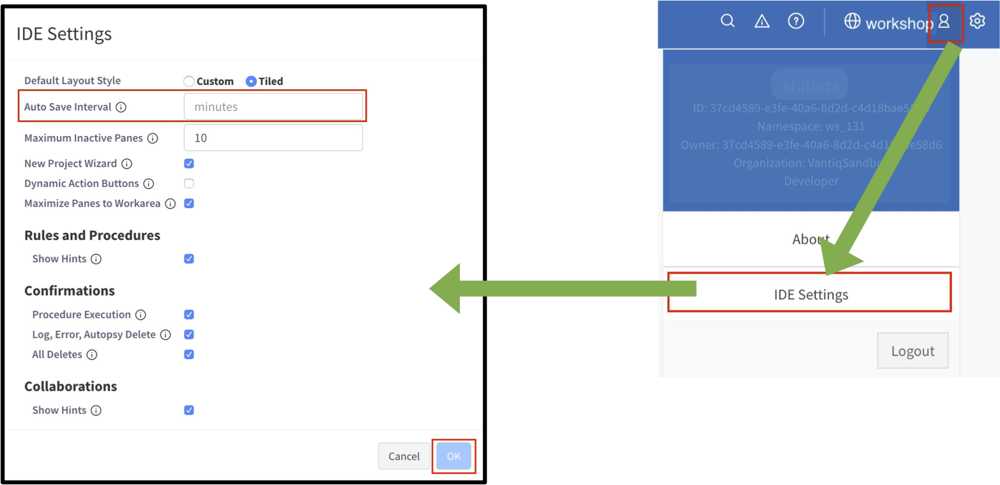
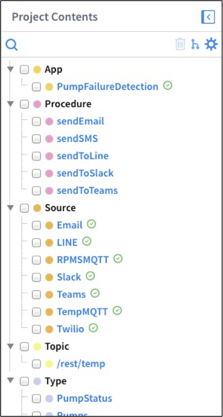
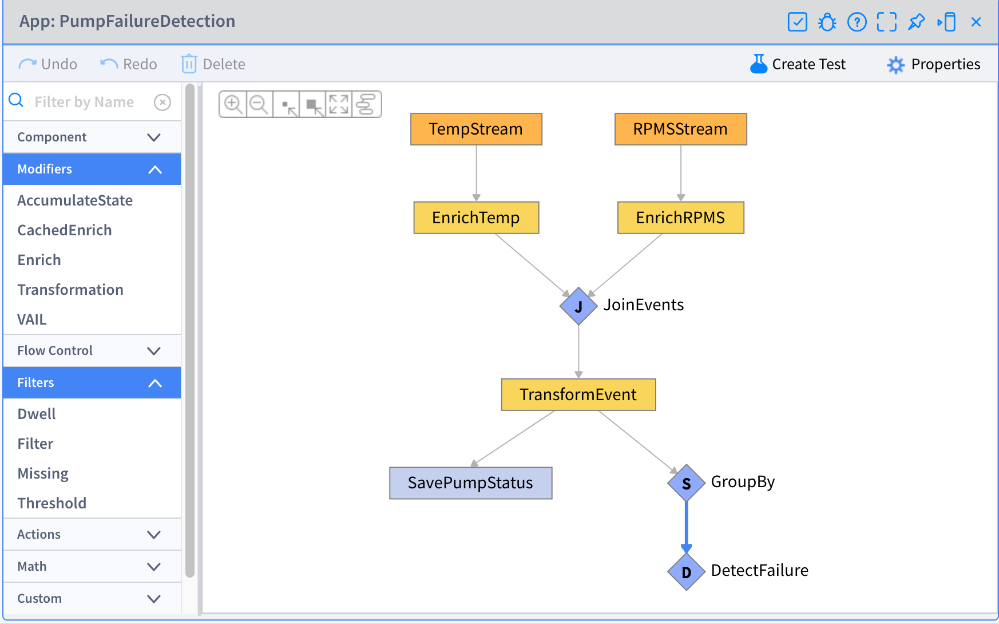
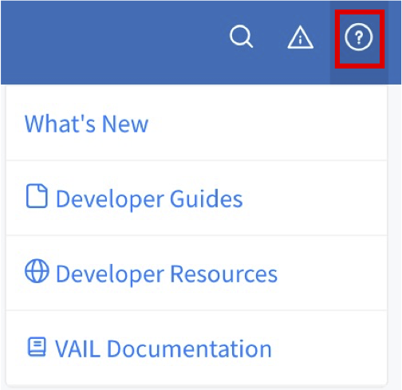

# VANTIQ で開発する上での基本事項

## ナビゲーション バーについて

  
① Project 関連。Project の作成・保存・切り替えなどを行う  
② Resource の追加  
③ 発生したエラーの一覧  
④ リファレンスなどの開発に関する情報  
⑤ Namespace 名。Namespace の切り替えはここから行う  
⑥ 自分のアカウント情報。自分のアカウントに関する情報の確認・編集や IDE 設定を行う  

## 開発画面の 2種類のレイアウトについて

* VANTIQ の開発画面には、「タイル」と「カスタム」の 2種類のレイアウトがあります。
* 画面、右上の _歯車_ アイコンをクリックし、「レイアウト\.\.\.」から選択することができます。

## タイルの例（2×2）

## カスタムの例

## Namespace と Project の関係について

各 Resource は Project ではなく Namespace に保存されるため、Namespace 内の各 Project で Namespace 内の全ての Resource を使うことができます。

## Project の保存と各 Resource の保存について

* Project の保存
  * Project のレイアウトの状態やその Project でどの Resource を扱うのかを保存します。
  * 画面左上の緑の「 _保存_ 」をクリックして保存します。  
「PumpFailureDetection」という Project 名で保存する。

* 各 Resource の保存
  * Type や Source などの各 Resource を作成すると Namespace に保存されます。
  * 各 Resource 編集ダイアログの _保存_ ボタンをクリックして保存します。  

_＊ 例えば Type を新規作成して Project の保存をせずにブラウザーをリロードしてしまうと、_  
_Project の保存をしていないために Type が Project に追加されていない状態になります。_  
_しかし、作成自体はされており、Namespace には保存されています。_

## Project の自動保存について

自動保存の設定をしておくことで、不意な状況で変更内容が失われることを防ぎます。  
画面右上の人型アイコンから IDE 設定ウィンドウを開いて設定します。

  

## Resource の表示方法について

画面左の「Project Contents」に Project に紐付く Resource が一覧で表示されます。  
表示したい Resource 名をクリックするとウィンドウが開きます。

  

## ショートカットキー

AppBuilder において、ショートカットキーが使用できます。
* Ctrl\-Z or Cmd\-Z – Undo changes
* Shift\-Ctrl\-Z or Shift\-Cmd\-Z – Redo Changes
* Ctrl\-S or Cmd\-S – Save changes

## リファレンスについて

* ナビゲーション バーの「_?_」アイコンからリファレンスを開くことができます。

  

|メニュー項目名|機能|
|:------|:---:|
|新機能|最新バージョンの新着情報|
|開発者ガイド|リファレンス|
|開発者リソース|CLI や SDK などの開発リソース|
|VAIL ドキュメント|VAIL のリファレンス|

## 関連リソース

- Vantiq Academy (要ログイン)
  - [2.2: Vantiq 開発 アーキテクチャ](https://community.vantiq.com/courses/%e3%82%a2%e3%83%97%e3%83%aa%e3%82%b1%e3%83%bc%e3%82%b7%e3%83%a7%e3%83%b3%e9%96%8b%e7%99%ba%e8%80%85-level-1-%e3%82%b3%e3%83%bc%e3%82%b9-%e6%97%a5%e6%9c%ac%e8%aa%9e/lessons/lesson-2-vantiq-%e9%96%8b%e7%99%ba%e3%83%97%e3%83%a9%e3%83%83%e3%83%88%e3%83%95%e3%82%a9%e3%83%bc%e3%83%a0/topic/2-2-vantiq-%e9%96%8b%e7%99%ba-%e3%82%a2%e3%83%bc%e3%82%ad%e3%83%86%e3%82%af%e3%83%81%e3%83%a3/)
  - [2.3: Vantiq IDE (Modelo)](https://community.vantiq.com/courses/%e3%82%a2%e3%83%97%e3%83%aa%e3%82%b1%e3%83%bc%e3%82%b7%e3%83%a7%e3%83%b3%e9%96%8b%e7%99%ba%e8%80%85-level-1-%e3%82%b3%e3%83%bc%e3%82%b9-%e6%97%a5%e6%9c%ac%e8%aa%9e/lessons/lesson-2-vantiq-%e9%96%8b%e7%99%ba%e3%83%97%e3%83%a9%e3%83%83%e3%83%88%e3%83%95%e3%82%a9%e3%83%bc%e3%83%a0/topic/2-3-vantiq-ide-modelo-copy-2/)

## Vantiq 1-day Workshop 次のセッション  
|Session #|Session      | Type  |Contents Description       |Duration (m)|Material               |
|:-----:|--------------|:------:|---------------------------|:-:|--------------------------------|
|2|準備|Lab|Namespace の準備 |5|[Lab01_Preparation](2-Lab01_Preparation.md)|
