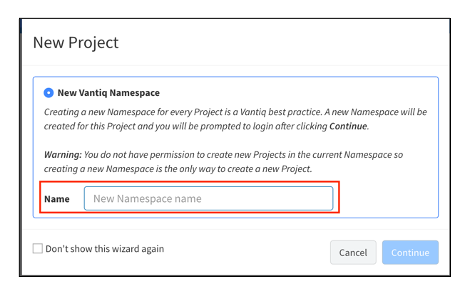
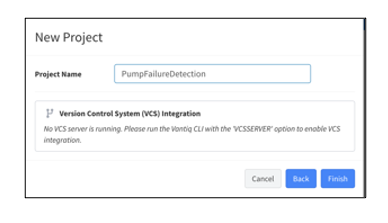

# **Lab 01 – 準備（Namespace の作成）**

## ***Step 1***　ログイン

[VANTIQ の開発環境](https://dev.vantiq.co.jp) にログインします。

## ***Step 2***　Namespace の作成

1. 「新規 Project」ウィンドウが表示されるので、「新規 Vantiq Namespace」を選択し、Name に **ポンプ故障検知システム** 用の Namespace 名を入力して、「_続行_」をクリックします。  
（例：PumpFailureDetectionNS）

#### 参考
  - [2.3: リソースの整理](https://community.vantiq.com/courses/vantiq%e3%82%a2%e3%83%97%e3%83%aa%e3%82%b1%e3%83%bc%e3%82%b7%e3%83%a7%e3%83%b3%e9%96%8b%e7%99%ba%e3%82%b3%e3%83%bc%e3%82%b9%ef%bc%86%e3%83%ac%e3%83%99%e3%83%ab1%e8%aa%8d%e5%ae%9a%e8%a9%a6%e9%a8%93v1-2/lessons/2-vantiq%e3%83%97%e3%83%a9%e3%83%83%e3%83%88%e3%83%95%e3%82%a9%e3%83%bc%e3%83%a0%e3%81%ae%e7%b4%b9%e4%bb%8b/topic/2-3-%e3%83%aa%e3%82%bd%e3%83%bc%e3%82%b9%e3%81%ae%e6%95%b4%e7%90%86/)

## ***Step 3***　Project の作成
1. 「新規 Project」ウィンドウが表示されるので「空の Project」を選択し、「_続行_」をクリックします。  
　　 ＊ 既に Project が存在する場合は表示されません。  

    

    ＊ ウィンドウが表示されない場合は、ナビゲーション バーにある以下の入力欄に「**PumpFailureDetection**」と入力し、隣の _保存_ ボタンをクリックしてください。また次の手順をスキップしてください。  

    

3. 「Project Name」に 「**PumpFailureDetection**」と入力し、「_終了_」をクリックします。  

    

3. Project 名に「`PumpFailureDetection`」と表示されていることを確認します。  

    

＊ ここまでの手順で、`PumpFailureDetectionNS` という Namespace に `PumpFailureDetection` という Project が存在しているはずです。

 ＊ 以上で、ワークショップの準備は終了です。

## ***▷確認ポイント***

各 Lab の最後には「**確認ポイント**」のステップが設けられています。ミスしやすい、または理解を深めるためのポイントが記載されておりますので、必ず目を通して理解するようにしてください。

- 開いている Project が正しいか
- - `PumpFailureDetectionNS` Namespace には、**ポンプ故障検知システム** を構築するために使用する Resource を追加していく `PumpFailureDetection` Project (今はまだ空の状態) が存在しています。  
  次の Lab から `PumpFailureDetection` Project で作業を行います。

## Vantiq 1-day Workshop 次のセッション  
|Session #|Session      | Type  |Contents Description       |Duration (m)|Material               |
|:-----:|--------------|:------:|---------------------------|:-:|--------------------------------|
| 3 | Vantiq の基本リソース | Lecture | Vantiqアプリケーションを構成する最も基本なリソース | 15 | [00_BasicResources](0-10_BasicResources.md) |