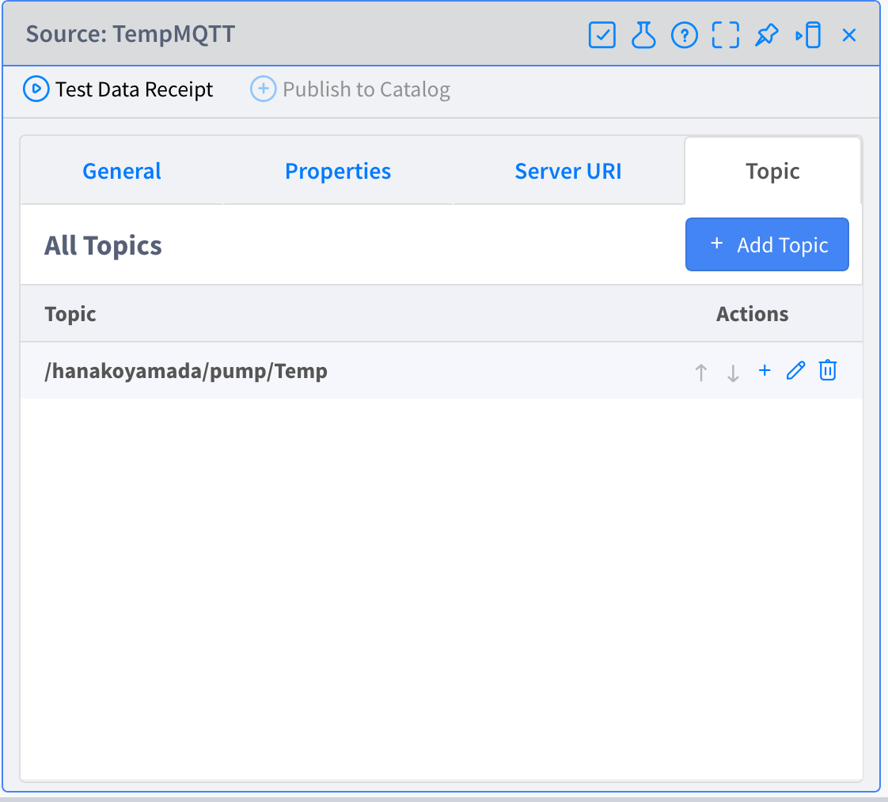
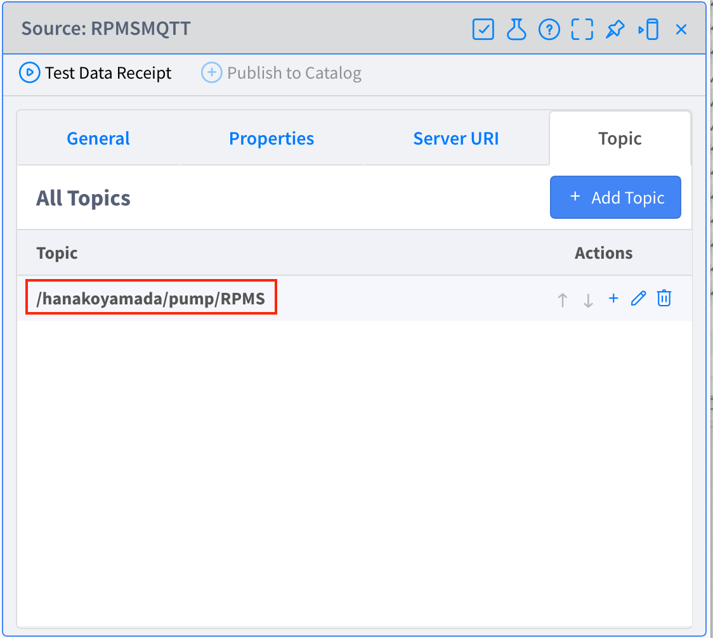
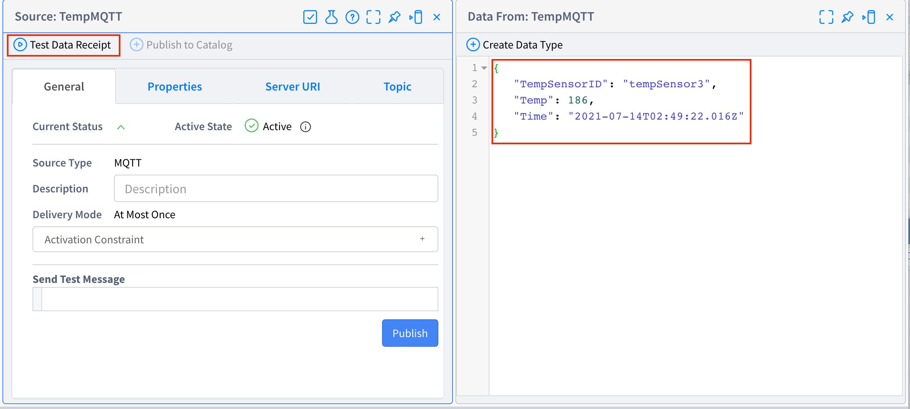
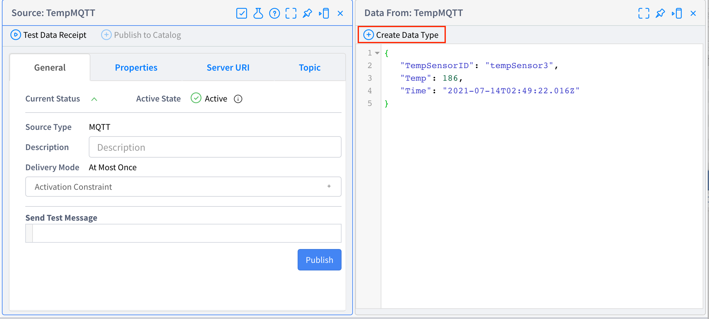
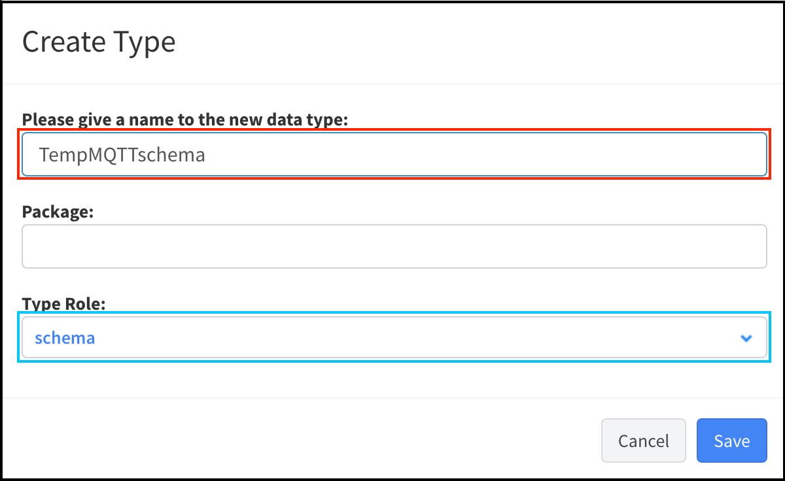
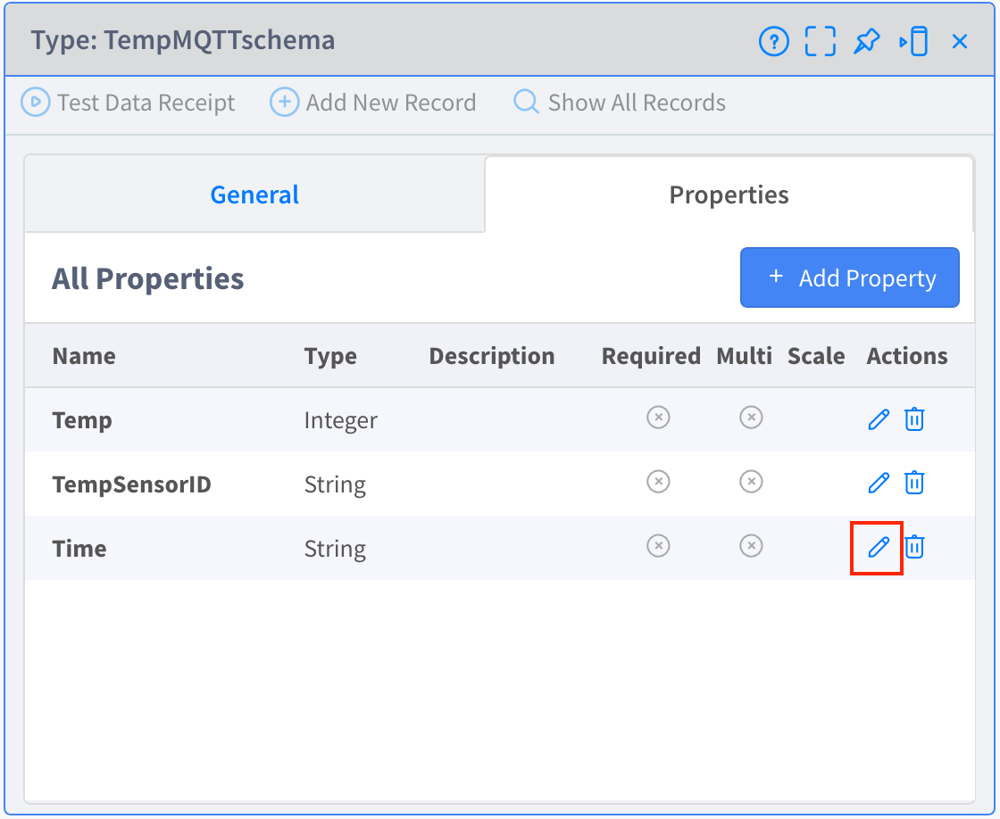
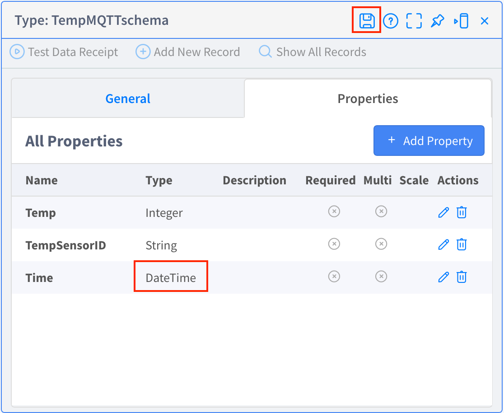
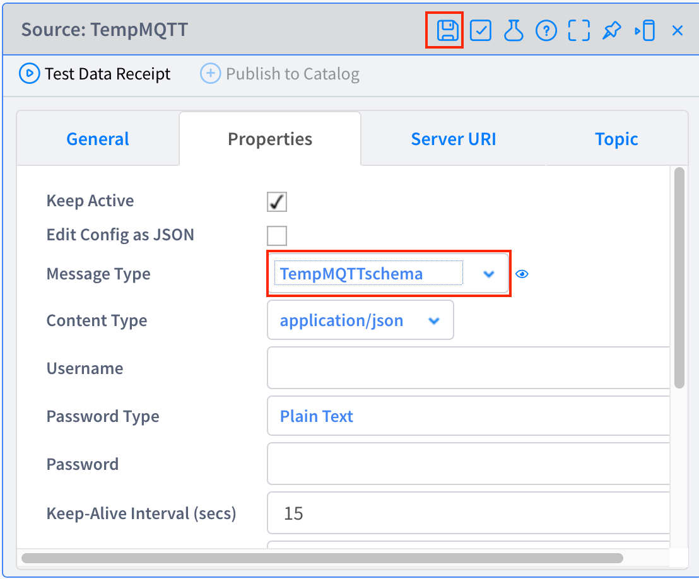
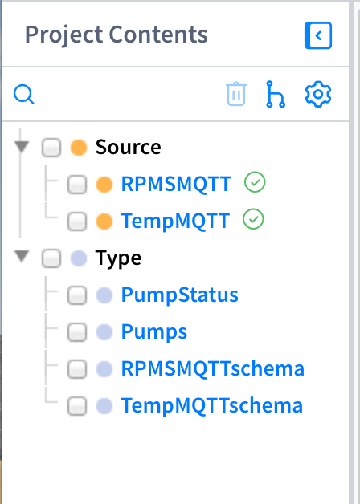

# **Lab 03 – Sources（ソース）**

## **概要**

この Lab では、Source を作成します。**Source** は、外部システムとの接続ポイントであり、データの送受信の入り口となる仕組みで、MQTT、REST、KAFKA、EMAIL など様々な種類が選択でき、拡張も可能です。

この Lab では MQTT Broker からデータをサブスクライブするための Source を作成します。また、その Source に関連して、サブスクライブしたデータの構造と型を定義するための Type も併せて作成します。

####  参考
- Vantiq Academy (要ログイン)
  - [2.4: 基本Resource: Source & Topic](https://community.vantiq.com/courses/%e3%82%a2%e3%83%97%e3%83%aa%e3%82%b1%e3%83%bc%e3%82%b7%e3%83%a7%e3%83%b3%e9%96%8b%e7%99%ba%e8%80%85-level-1-%e3%82%b3%e3%83%bc%e3%82%b9-%e6%97%a5%e6%9c%ac%e8%aa%9e/lessons/lesson-2-vantiq-%e9%96%8b%e7%99%ba%e3%83%97%e3%83%a9%e3%83%83%e3%83%88%e3%83%95%e3%82%a9%e3%83%bc%e3%83%a0/topic/2-4-%e5%9f%ba%e6%9c%acresource-source-topic-copy-2/)

## **Source**

-   **TempMQTT** – 温度センサーのデータを MQTT Broker からサブスクライブします。

-   **RPMSMQTT** – 回転数センサーのデータを MQTT Broker からサブスクライブします。

### **Type**

-   **TempMQTTSchema** – `TempMQTT` でサブスクライブするデータの構造と型を定義します。

-   **RPMSMQTTSchema** – `RPMSMQTT` でサブスクライブするデータの構造と型を定義します。

## ***Step 1（Source の作成）***

1. 「追加」 > 「Source...」 > 「_+ 新規 Source_」から Source の新規作成画面を開きます。

2. Source 名に「TempMQTT」と入力します。

3. Source の種類 を「MQTT」に設定します。

4. 「Server URI」タブを開き「_+ Server URI の追加_」をクリックし、 MQTT Broker Server の URI を設定します。  
   - 講師の方は事前に準備した MQTT Broker Server の URI を伝えてください。

5. 「Topic」タブを開き「_+ Topic の追加_」をクリックし、以下の Topic を設定します。

   Topic： "_/***unique name***/pump/Temp_"  
   - 講師の方は事前に準備した MQTT Broker Server の Topic 名を伝えてください。
   -  [事前準備（データジェネレーターの設定）](./0-03_DataGenerator.md#step-5-mqtt-broker-の設定) の **「TempSensorTopic」に入力した値と同じ**にします。
   - topic 名に**ダブルクォーテーションは含みません**。
   - topic 名の**前後に半角スペースが入らないよう**にしてください。

6. _変更の保存_ ボタンをクリックし、Source を保存します。  

    

7. 上記の `TempMQTT` Source と同様の手順で以下の画像を参考に `RPMSMQTT` Source を作成してください。  

   Topic： "/unique name/pump/RPMS"

    

以上で、Source の作成は終了です。

## ***Step 2（Source の受信テスト）***

※講師の方は [ダミーデータの生成方法](./0-03_DataGenerator.md#ダミーデータの生成方法) を参考にダミーデータの生成を行ってください。

1. VANTIQ 開発画面に戻って TempMQTT を開き、「_データの受信テスト_」をクリックし、データを受信できていることを確認します。

    

2. `RPMSMQTT` でも同様の手順でデータが受信できていることを確認してください。

以上で、Source の受信テストは終了です。

## ***Step 3（Source のデータ構造定義）***

Source に「**Schema**」の Type を設定し、受信イベントの構造と型を定義することにより、`Lab-04 AppBuilder` の Step で行う作業でプロパティの入力補助が有効になります。

1. `TempMQTT` の「データの受信テスト」で開いたウィンドウの「_Type Data の作成_」をクリックします。

    

2. 以下の画像を参考に Type 名を「_TempMQTTSchema_」に修正し「_保存_」をクリックします。これで `TempMQTT` の「Schema」Type が作成されます。

    

3. 画面左の [Project Contents] ペインの「Type」の箇所にある、作成した「`TempMQTTSchema`」を開き、自動で認識された型のうち、「Time」プロパティの型を「_DateTime_」に変更します。

   a. 「Properties」タブを開きます。

   b. 「Time」プロパティの _編集_ ボタンをクリックします。

   

   c. 型を「_DateTime_」に修正して保存します。

   

4. 画面左の [Project Contents] ペインの「Source」の箇所にある「`TempMQTT`」を開き、「Properties」タブの「Message Type」に「_TempMQTTSchema_」を設定し、Source を保存します。

   

5. 1.\~4. の Step を繰り返し、「`RPMSMQTT`」Source から「`RPMSMQTTSchema`」Typeを作成し、「RPMSMQTT」Source の「Message Type」に設定してください。

以上で、Schema の設定は終了です。

ここまでの手順で [Project Contents] ペインには下の画像のような要素が存在しているはずですので、ご確認ください。  

   

## ***▷確認ポイント***

-   `TempMQTT` と `RPMSMQTT` に設定されている Topic（MQTT Broker の Topic）がそれぞれ温度用、回転数用の Topic になっていること    
    ✔︎   ミスがあると今後の手順でエラーが発生します。  

## Vantiq 1-day Workshop 次のセッション  
|Session #|Session      | Type  |Contents Description       |Duration (m)|Material               |
|:-----:|--------------|:------:|---------------------------|:-:|--------------------------------|
| 6 | App Builder の紹介 | Lecture |  | 15 | [02_AppBuilder](5-02_AppBuilder.md) |
