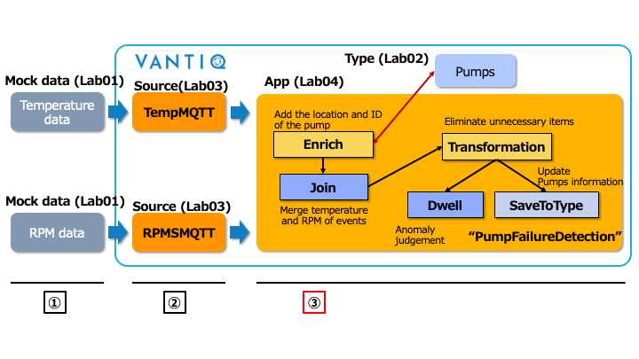
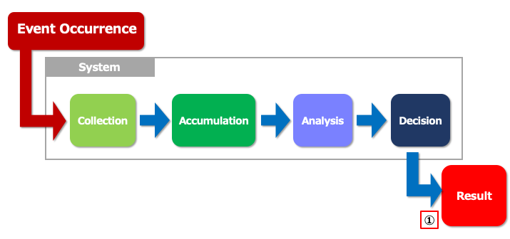
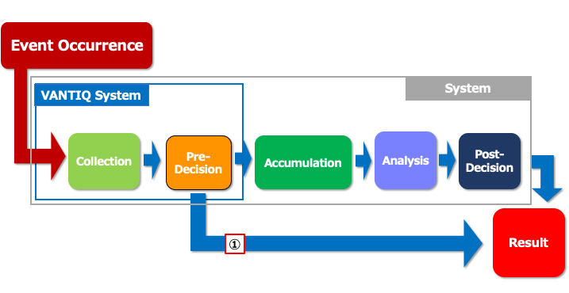

# Lab 04 までの復習

## 処理の流れ

  
① データジェネレーターによるデータ生成  
② データ受信  
③ **1. ポンプの故障検知**  
&nbsp;&nbsp;&nbsp;&nbsp;**2. 各ポンプのリアルタイム情報の更新**

## 今までのシステムの処理とデータの流れ

  
① **結果はイベントの発生から遅れて得られる**  

## VANTIQ を使ったシステムの処理とデータの流れ

  
① **データを貯めることなく事前に判断をすることが可能**  

## Vantiq 1-day Workshop 次のセッション  
|Session #|Session      | Type  |Contents Description       |Duration (m)|Material               |
|:-----:|--------------|:------:|---------------------------|:-:|--------------------------------|
| 9 | Q&A | | 質疑応答 | 15 | |
