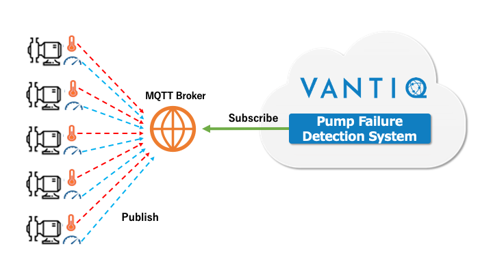

# Vantiq 1-day Workshop（短時間用） 概要説明

この Workshop では、複数のポンプのリアルタイムデータを取得し、ポンプの異常を検知するシステムを構築します。  

※短時間の Workshop 用に [Vantiq 1-day workshop (v1.34)](./../../../1-day-workshop/docs/jp/readme.md) から、 **データジェネレータの準備** を省き、ポンプ故障検知アプリの開発のみを行う内容になっています。  

※講師の方は事前に **Data Generator** と **MQTTブローカー** を用意しておいてください。（[データジェネレータの準備](0-03_DataGenerator.md)）

## ポンプ故障検知システム

下記の要件を満たすポンプ故障検知システムの実装を通じてVantiqの基本機能を学んでいきます。
* __前提__
  * ポンプが５台あり、それぞれに __温度センサー__ と  __回転数センサー__ が付いている
* __実装する機能__
  * 温度が __200__  __度以上__ 、かつ回転数が __4000__  __回以上__ の状態が __20__  __秒間続いた__ 際に「故障」として検出する

## ポンプ故障検知システムの処理の流れ

   
&nbsp;&nbsp;&nbsp; **＊ Pump Failure Detection System: ポンプの故障を検知**

## Vantiq 1-day Workshop での処理の流れ
このWorkshopにおいては、センサー/デバイスの代わりに、Dummyデータを生成する **Data Generator** を使用します。  

__５台分のポンプの__  __温度__   __と__   __回転数__  __のデータをランダムに__  __Publish__

  
&nbsp;&nbsp;&nbsp; **＊ Pump Failure Detection System: ポンプの故障を検知**

## Workshopで使用するマテリアル

* Labs：Vantiq 1-day Workshop の手順書
  * 01~06
  * 追加課題: 混雑検出アプリ開発課題
* Lectures:　説明資料
* Materials：手順書で使用する[素材ファイル](../../conf)
  * Pumps\.json

## Vantiq 1-day Workshop の内容

* 以下の内容を通してポンプの故障検知システムを作成します。
  * __Lab01__  __準備__
    * ポンプ故障検知システム用の Namespace の準備
  * __Lab02 Types__  __（タイプ）__
    * データベースのテーブルのような機能
  * __Lab03 Sources__  __（ソース）__
    * データの送受信で使う機能
  * __Lab04 App Builder__  __（アプリケーションビルダー）__
    * 受信したイベントの処理ロジックの作成

* 以下の内容を通してVantiqと外部システム連携を行います。
  * __Lab05 REST API__
    * 外部システムからVantiqリソースを操作します。
  * __Lab06 REMOTE Source__
    * Vantiqから外部システムのAPIを呼び出します。

## Course Agenda

| Session # | Session                                 |  Type   | Contents Description                               | Duration (m) | Material                                                                                                                    |
|:---------:| --------------------------------------- |:-------:| -------------------------------------------------- |:------------:| --------------------------------------------------------------------------------------------------------------------------- |
|     1     | VANTIQ で開発する上での基本事項         | Lecture |                                                    |      10      | [01_Basics](1-01_Basics.md)                                                                                                 |
|     2     | 準備                                   |   Lab   | Namespace の準備                                 |      5      | [Lab01_Preparation](2-Lab01_Preparation.md)                                                                                 |
|     3     | Vantiq の基本リソース                   | Lecture | Vantiqアプリケーションを構成する最も基本なリソース |      15      | [00_BasicResources](0-10_BasicResources.md)                                                                                 |
|     4     | Types (タイプ)                          |   Lab   | データベースのテーブルのような機能                 |      20      | [Lab02_Types](3-Lab02_Types.md)                                                                                             |
|     5     | Source (ソース)                         |   Lab   | データの送受信で使う機能                           |      20      | [Lab03_Sources](4-Lab03_Sources.md)                                                                                         |
|     6     | App Builder の紹介                      | Lecture |                                                    |      15      | [02_AppBuilder](5-02_AppBuilder.md)                                                                                         |
|     7     | App Builder (アプリケーション ビルダー) |   Lab   | 受信したイベントの処理ロジックの作成               |      45      | [Lab04_AppBuilder](6-Lab04_AppBuilder.md)                                                                                   |
|     8     | Lab 04 までの復習                       | Lecture |                                                    |      15      | [03_Review](7-03_Review.md)                                                                                                 |
|     9     | Q&A                                     |         | 質疑応答                                           |      15      |                                                                    |

＊上記のセッションは、短時間の Workshop 用に内容が一部変更されています。より詳しい内容は [Vantiq 1-day workshop (v1.34)](./../../../1-day-workshop/docs/jp/readme.md) を御覧ください。

## 参考情報
[トラブルシューティング](./troubleshootings.md)
