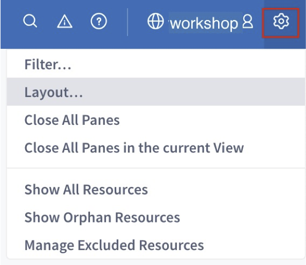
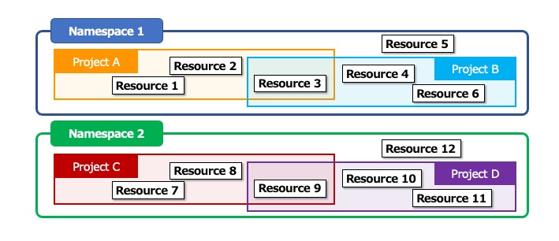
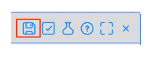

# The basics of developing with VANTIQ

## About Navigation Bar

  
① Create, save, and switch between project-related projects  
② Add Resources  
③ A list of occurred errors  
④ Reference and other information for development  
⑤ Namespace name. Switch Namespaces.  
⑥ Own account information. View and edit information about the account and configure IDE settings.  

## About the two types of layouts for the Development screen

* There are two types of layouts for the VANTIQ Development screen: "Custom" and "Tiled".
* Click the _gear_ icon in the upper right corner of the screen and select "Layout\.\.\.".

  

## Example of "Tiled”（2×2）

## Example of "Custom"

## On the relationship between Namespaces and Projects

Since each Resource is stored in a Namespace instead of a Project, each Project in a Namespace can use all the Resources in the same Namespace.

## Saving the Project and saving each Resource

* Saving the Project
  * It saves the state of the Project layout and which Resources are handled by that Project.
  * Click the green _Save_ button in the upper left corner of the screen to save it。  
 &nbsp;&nbsp; Save the project as "PumpFailureDetection".

* Saving each Resources
  * When creating each Resource, such as Type or Source, it is saved in the Namespace.
  * Click the _Save Changes_ button in the Edit dialog for each Resource to save it.  

_＊ For example, when creating a new Type and reloading the browser without saving the Project, the Type will not be added to the Project because the Project has not been saved._  
_However, it has been created and is saved in the Namespace._

## About auto saving a Project

Setting up Auto Save prevents from losing the changes in an unexpected situation.   
Open the "IDE Settings" window with the _human_ icon in the upper right corner of the screen to configure the setting.  

  

## About the way to display Resources

The "Project Contents" on the left side of the screen displays a list of Resources related to the Project.    
Click on the name of the Resource to be displayed, and a window will open.  

  

## Shortcut keys

In App Builder, shortcut keys are available.
* Ctrl\-Z or Cmd\-Z – Undo changes
* Shift\-Ctrl\-Z or Shift\-Cmd\-Z – Redo Changes
* Ctrl\-S or Cmd\-S – Save changes

## About References

* Click the _?_ icon in the navigation bar to open the Reference。

  

|Menu items|functions|
|:------|:---:|
|What's New|The latest Vantiq system release note|
|Developer Guides|Reference Guides|
|Developer Resources|Development resources such as CLI and SDKs|
|VAIL Documentaion|VAIL Reference|

## Related Resources

- Vantiq Academy (Login required)
  - [2.1: The Vantiq IDE](https://community.vantiq.com/courses/developer-level-1-course/lessons/2-the-vantiq-platform/topic/2-1-the-vantiq-ide-master/)
  - [2.3: Organizing Resources](https://community.vantiq.com/courses/developer-level-1-course/lessons/2-the-vantiq-platform/topic/2-3-organizing-resources-master/)  

## Vantiq 1-day Workshop; Next Session    
|Session #|Session      | Type  |Contents Description       |Duration (m)|Material               |
|:-----:|--------------|:------:|---------------------------|:-:|--------------------------------|
|2| Preparation (Configuration of the Data Generator)|Lab|Preparation for the Data Generator |15|[Lab01_Preparation](2-Lab01_Preparation.md)|  
