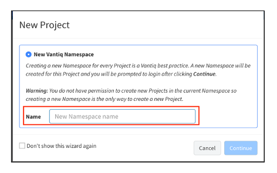

# **Lab 01 – Preparation (Configuration of the Data Generator)**

## ***Step 1***

Log in to the [VANTIQ IDE](https://dev.vantiq.co.jp).

## ***Step 2***

1. When "New Project" Wizard will be displayed, select "New Vantiq Namespace" and set the Namespace name for **Data Generator** to Name. Click _Continue_ button.  
     

#### Reference
  - [2.3: Organizing Resources](https://community.vantiq.com/courses/developer-level-1-course/lessons/2-the-vantiq-platform/topic/2-3-organizing-resources-master/)

## ***Step 3（Import the Data Generator）***

＊ Prepare the Data Generator to generate mock data which is simulate the data from the temperature sensors and the RPM sensors attached to multiple pumps respectively.

1. Select "Projects" > "Import...", and open the "Import Projects" window.  
     Drag and drop the pre-distributed "[`TrainingDataGen.zip`](https://github.com/fujitake/vantiq-related/raw/main/vantiq-apps-development/1-day-workshop/conf/TrainingDataGen.zip)" which is for the Data Generator.

      

2. Click the _Import_ button.  

3. After importing, "Confirm dialog" is displayed, and click the _Reload_ button.

## ***Step 4 (Configure MQTT Broker)***

＊ Reconfigure the server settings for generating the sample data to the MQTT Broker which you prepared by yourself.  

1. Select "Add" > "Sources...", and open the "Sources" window.

2. Click `TrainingDataGenMQTT`, and open the "Source" window.

3. Click the "Server URI" tab.

4. Click the _Edit_ (a small pencil) icon to open "Edit Server URI" dialog.

      

5. "Server URI:" is set to a temporary value in advance, so reconfigure it to the URI of the MQTT Broker server which you prepared by yourself. Click the _OK_ button.

      

6. Click the _Toggle Keep Active On_ icon on the upper right of the Title Bar to activate the Source.

    

7. Click the _Save Changes_ icon next to it to save it.

## ***Step 5（Configure the Data Generator）***

＊ In this workshop, create the application based on the assumption that each of the multiple pumps has a temperature sensor and a RPM sensor, and that the data is sent to each of them.  
Use the Data Generator to simulate the situation.

  

1. Click "Launch" > "_Run currentry saved Client in Client Launcher (RTC)_" in "TrainingDataGeneratorClient" to open the Data Generator in a browser.  
  ＊ Clients developed with VANTIQ, such as this example, can be launched with the application "**VANTIQ Client Launcher**".  

  

2. When the Data Generator is displayed, click the _Setup_ button at the top.  

3. Type _"5"_ in the text box.

      

4. Click the _Update Number Pumps_ button.

5. Confirm that from _1_ to _5_ is displayed as the PumpNo in the table.

6. Type the Topic name for MQTT as the followings.  

    RPMSSensor Topic： _/***your name***/pump/RPMS_

    TempSensor Topic： _/***your name***/pump/Temp_

    ＊ In the _your name_ field, type your name **to make the topic name unique**. Also, make sure that the Topic name should **NOT** have enclosing extra spaces nor double quotations.  

7. CLick the _Update Topics_ button.

    

8. Click the _Date Generator_ button at the top to switch screens.   

9. Click the _Start Generator_ button, and confirm that the data is displayed in the "Last Message" window after about _6_ seconds.

## ***Step 6（Return to the IDE）***

1. Return to the already opened tab（https://dev.vantiq.co.jp).

2. Select "Administer" > "Namespaces", and click the _+ New_ button to open "New Namespace" window.

3. Set the Namespace for **Pump Failure Detection System** to Namespace and click the _Save Changes_ icon.  

     

4. Click on the Current Namespace name in the Navigation Bar to open the "Change Namespace" dialog and switch to the Namespace created in the above steps.  

1. When "New Project" Wizard will be displayed, select "Empty" and click _Continue_ button.    
　　 ＊ If the Project already exists, it will not be displayed.  

        

    ＊ If the window is not displayed, type "**PumpFailureDetection**" in the input field in the Navigation Bar as shown below, and click the _Save_ button next to it. Then, skip the next step.  

      

2. Type "**PumpFailureDetection**" in the "Project Name" field, and click the _Finish_ button.  

      

3. Confirm that "`PumpFailureDetection`" is displayed in the Project name.  

      

＊ Now there should be one project in the two Namespaces respectively, one is `PumpFailureDetection` and the other is `TrainingDataGen`. Display the `PumpFailureDetection` project.

 ＊ This completes the preparations for the Workshop.

## ***▷Checkpoints***

At the end of each Lab, there is the "**Checkpoints**" step. Please be sure to read and understand them, as they contain points that are easy to make mistakes or to deepen your understanding.  

-   Whether the Topic set in the Data Generator is correct.
    -   If there are any mistakes, such as setting the RPM Topic as the Temperature Topic, the system that will be developed later will not work properly. Confirm that the settings are correct again.  
        ✔︎   **RPMS** SensorTopic：　/***your name***/pump/**RPMS**  
        ✔︎   **Temp** SensorTopic：　/***your name***/pump/**Temp**

-   Whether the project that is opened is correct.
    -   There are two development Namespaces;  One should have the `TrainingDataGen` Project which contains those Resources used by the Data Generator, and the other should have the `PumpFailureDetection` Project to which Resources to build the **Pump Failure Detection System** (currently empty) will be added.  We will work on the `PumpFailureDetection` Project from the next Lab.

## Vantiq 1-day Workshop; Next Session    
|Session #|Session      | Type  |Contents Description       |Duration (m)|Material               |
|:-----:|--------------|:------:|---------------------------|:-:|--------------------------------|
|3| Types|Lab|Functions like a table in a database|20|[Lab02_Types](3-Lab02_Types.md)|  
