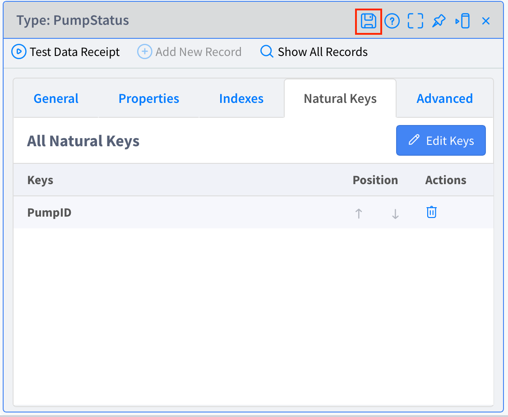
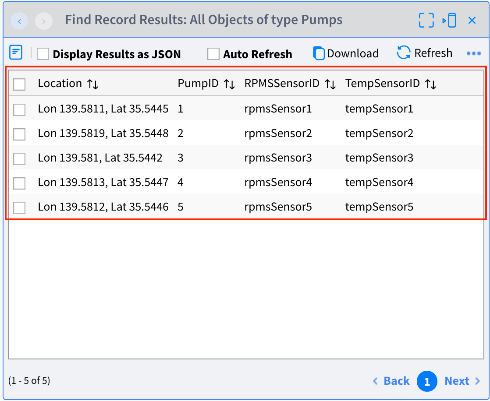

# **Lab 02 – Types**

## ***Overview***

In this Lab, create a **Type**. Type works like a table in a database. It is used for storing data, defining the type of events to be received from outside, and so on.  

In this scenario, create the Type as followings.

-   **Pumps** – Saves the master data of the Pumps. **Stores the location of the Pumps and the information of the installed Sensors**.

-   **PumpStatus** – **Stores** ***the current*** **status** of the Pumps.

There are two types of Type: "**Standard**" for storing data, and "**Schema**" for defining the structure and type of incoming events. In this Lab, "**Standard**" is treated. "**Schema**" is dealt with in `Lab-03 Sources` because it has a deep relation with Source.  

#### Reference
- Vantiq Academy (Login required)
  - [4.1: Persistent Types](https://community.vantiq.com/courses/developer-level-1-course/lessons/4-analyze-enrich-data/topic/4-1-persistent-types-master/)

## ***Step 1***

The followings will be worked on in the `PumpFailureDetection` project.
If it is already opened, it should be displayed as `PumpFailureDetection` in the project name in the Navigation Bar.

Create ***Pumps*** Type.

＊ `Pumps` Type is created to store the master data of the Pumps. It will be used later in combination with the incoming sensor data.

1. Select "Add" > "Type...", and click the "_+ New Type_" button to open the "Create Type" window.

2. Type _Pumps_ in the Name field, set the Role to _standard_ and click the _OK_ button.  

3. Open the "Properties" tab of the `Pumps` Type and use the _+ Add Property_ button to create the following four properties.  

| Name         | Data type | Note      |
|--------------|----------|-------------------|
| PumpID       | Integer  | ID of the Pump|
| Location     | GeoJSON  | Lon/Lat coordinates |
| TempSensorID | String   | ID of the Temperature sensor|
| RPMSSensorID | String   | ID of the RPM sensor|

4. Open "Indexes" tab and click the _+ Add Index_ button.  

5. Check the "Is Index unique?" checkbox, set the Key to `PumpID` and click the _OK_ button.  

6. Open "Natural Keys" tab and click the _Edit Keys_ button.

7. Set the Key to `PumpID` and click the _OK_ button.

      

8. Click the _Save_ button to save the Type.

## ***Step 2***

Create ***PumpStatus*** Type.  

＊ It is used to maintain the **current** status of the Pumps and to display the current pumps status in a real-time dashboard.

1. Select "Add" > "Type...", and click the "_+ New Type_" button to open the "Create Type" window.  

2. Type _PumpStatus_ in the Name field, set the Role to _standard_ and click the _OK_ button.  

3. Open the "Properties" tab of the `PumpStatus` Type and use the _+ Add Property_ button to create the following five properties.  

| Name       | Data type |Note         |
|------------|----------|-------------|
| PumpID     | Integer  |ID of the Pump|
| Temp       | Integer  |ID of the Temperature sensor|
| RPMS       | Integer  |ID of the RPM sensor|
| Location   | GeoJSON  |Lon/Lat coordinates |
| ReceivedAt | DateTime |Timestamp when received|

4. Open "Indexes" tab and click the _+ Add Index_ button.

5. Check the "Is Index unique?" checkbox, set the Key to `PumpID` and click the _OK_ button.

6. Open "Natural Keys" tab and click the _Edit Keys_ button.  

7. Set the Key to `PumpID` and click the _OK_ button.  

      

8. Click the _Save_ button to save the Type.  

This completes the creation of the Types. The two Types should now appear in the "Project Contents" list on the left.

Now, the `PumpFailureDetection` Project has two new Types. To save the relationship, click the _Save_ button to the right of the Project name to save the Project.  

＊ Saving a Type and saving a Project are different tasks. At this point, two Types have been created in the Namespace, but their relationship to the Project is not saved until the Project is saved.  

## ***Step 3 （Import master data）***

Register the required data for each Type created.

1. **Import data in Pumps Type**  
Import master data in Pumps Type. This case, import the data by bulk import.    
    1. Select "Projects" > "Import...", and open the "Import Projects" window. Change the "Select Import Type" from "Project" to "Data".  
    2. Save  "[`Pumps.json`](https://github.com/fujitake/vantiq-related/raw/main/vantiq-apps-development/1-day-workshop/conf/Pumps.json)" as a JSON file, and drag and drop it into there.      
    3. Click the _Import_ button.

2.  **Confirm the registered data**  
Confirm that the data is correctly imported in the `Pumps` Type. Open `Pumps` Type, click the "Show All Records" and check if the data is imported as shown below.  

      

## ***▷Checkpoints***

-   Whether the Type name and Property name of each Type are correct.   
    ✔︎   Confirm again that the uppercase and lowercase letters are correct and that there are no input errors. If there are any mistakes, errors will occur in future steps.

-   Whether the data has been registered correctly.

## Vantiq 1-day Workshop; Next Session    
|Session #|Session      | Type  |Contents Description       |Duration (m)|Material               |
|:-----:|--------------|:------:|---------------------------|:-:|--------------------------------|
|4|Source|Lab|Functions used for sending and receiving data|20|[Lab03_Sources](4-Lab03_Sources.md)|  
