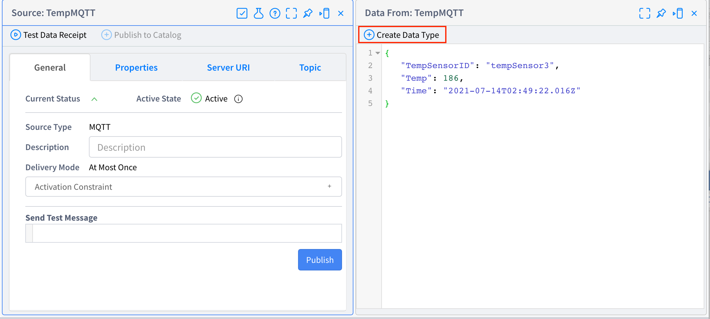
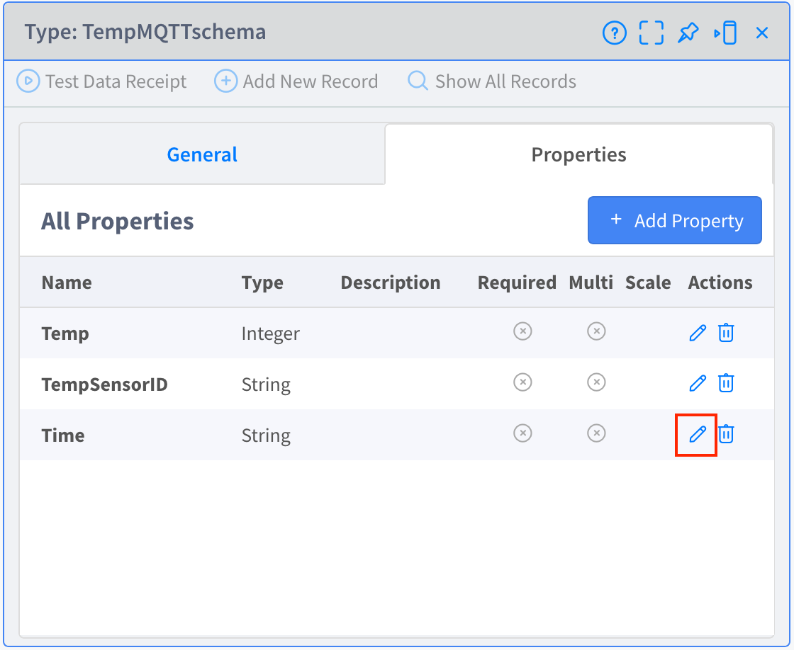
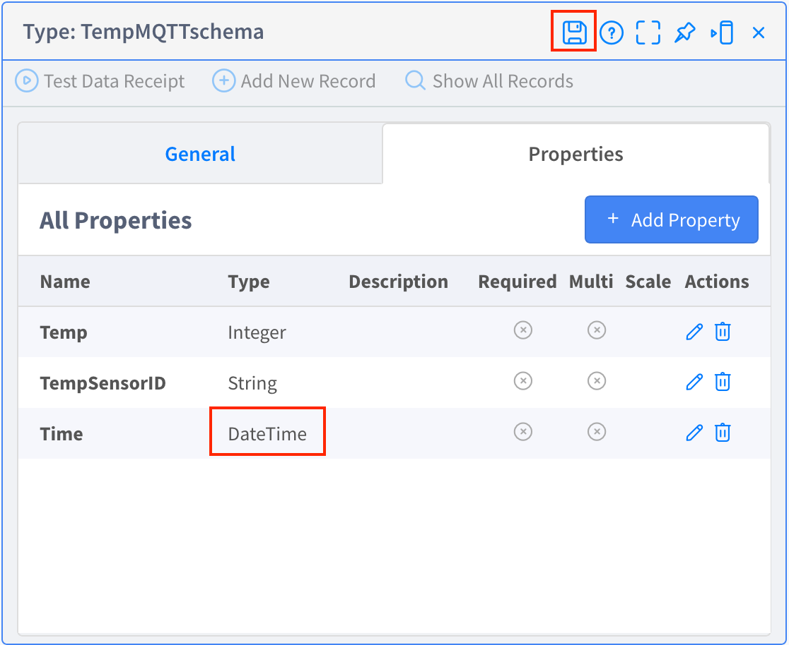

# **Lab 03 – Sources**

## ***Overview***

In this lab, create Sources. **Source** is the connection point to the external system and the entry point for sending and receiving data, and can be selected from various types such as MQTT, REST, KAFKA, and EMAIL, and can be extended.  

In this lab, create Sources to subscribe to data from an MQTT Broker. Also, in relation to those Sources, create Types to define the structure and type of the subscribed data.  

####  References
- Vantiq Academy (Login required)
  - [3.3: Inbound Sources](https://community.vantiq.com/courses/developer-level-1-course/lessons/3-sense-correlate-data/topic/3-3-inbound-sources-master/)
  - [3.2: Schema Types](https://community.vantiq.com/courses/developer-level-1-course/lessons/3-sense-correlate-data/topic/3-2-schema-types-master/)

## **Source**

-   **TempMQTT** – Subscribe to the Temperature sensor data from the MQTT Broker.

-   **RPMSMQTT** – Subscribe to the RPM sensor data from the MQTT Broker.

### **Type**

-   **TempMQTTSchema** – Defines the structure and type of data to be subscribed to with `TempMQTT`.

-   **RPMSMQTTSchema** – Defines the structure and type of data to be subscribed to with `RPMSMQTT`.

## ***Step 1（Create the Source）***

1. Select "Add" > "Source...", and click the "_+ New Source_" button to open the "Source: New Source" window.  

2. Type _TempMQTT_ in the Source Name filed.

3. Set the Source Type to _MQTT_.

4. Open "Server URI" tab, click the _+ Add Server URI_ and type the following URI in the Server URI field.

5. Open "Topic" tab, click the _+ Add Topic_ and type the following Topic in the Topic field.

|   |
|:----------------------|
|**/your name/pump/Temp**|
|**＊ In ***your name***, type the value that was entered in "TempSensorTopic" of the Data Generator setting in Lab 01.** |  

DataGenerator URL: **<https://dev.vantiq.co.jp/ui/rtc/index.html?run=TrainingDataGeneratorClient>**

6. Click the _Save_ button to save the Source.

7. Create the `RPMSMQTT` Source using the same procedure as the `TempMQTT` Source above, referring to the following image.    
   **＊ Please note the Topic to be typed.**

This completes the creation of the Sources.

## ***Step 2（Receiving test for Source）***

1. Open **Data Generator** with the following URL and click on the _Start Generator_ button to start generating the Temperature data and the RPM data. (If it does not show up with the following URL, please switch to your own namespace.）  
  **<https://dev.vantiq.co.jp/ui/rtc/index.html?run=TrainingDataGeneratorClient>**

2. Return to the VANTIQ IDE screen, open TempMQTT and click the "Test Data Receipt" to confirm that the data is being received.

3. Confirm that the data is received by following the same procedure for `RPMSMQTT`.  

This completes the receiving test for Source.

## ***Step 3（Data structure definition for Source）***

By setting the Type of "**Schema**" to Source and defining the structure and type of the incoming event, the input assistance of the Property will be enabled in the work done in the Steps of `Lab-04 AppBuilder`.

1. Click the "Create Data Type" in the window that opens with "Test Data Receipt" in `TempMQTT`.

2. Revise the Type name to "_TempMQTTSchema_" referring to the following image, and click the _Save_ button. This will create the `TempMQTT` "Schema" Type.  

3. Open the created `TempMQTTSchema` in the "Type" section of the resource pane on the left of the screen, and revise the type of the "Time" property of the automatically recognized type to _DateTime_.  

   a. Open "Properties" tab.

   b. Click the _Edit_ icon of "Time" Property.

  

&emsp;  c. Revise the type to _DateTime_ and save it.

4. Open `TempMQTT` in the "Source" section of the resource pane on the left side of the screen, set _TempMQTTSchema_ as the "Message Type" in the "Properties" tab, and save the Source.

5. Repeat the steps from _1_ to _4_ to create the `RPMSMQTTSchema` Type from the `RPMSMQTT` Source, and set it to the "Message Type" of the `RPMSMQTT` Source.

This completes the Schema configuration.

Now there should be elements like the following image in the project. Please review it.  

## ***▷Checkpoints***

-   The Topic (MQTT Broker's Topic) set in `TempMQTT` and `RPMSMQTT` should be the Topic for Temperature and for RPM respectively.     
    ✔︎   If there are any mistakes, errors will occur in future steps.
