# Introduce App Builder

## App Builder

* A tool to create applications (Real time Complex Event processing) with GUI.
* Development proceeds by combining built-in processing patterns.
  *  Programming is also available for flexible implementation when built-in patterns are not sufficient.

## App Builder Overview

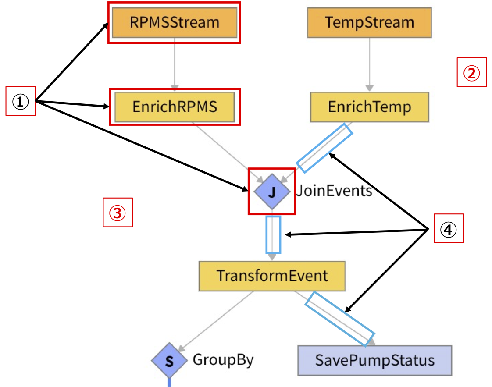

① Each rectangle, called a task, is a chunk of processing.    
_②_ All processing is done in memory without going through the DB unless there is a process to save.   
_③_ The output of a Task will be the input of the next Task.    
④ The arrows connecting the rectangles represent the Event Streams.   


## The Application to be developed and its main Activity Patterns  

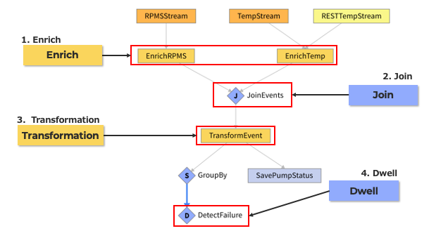
1. ***Enrich***
    * Process to add the data stored in Type to the event.
      * **Add persistent data to stream data.**
2. ***Join***
    * Process to combine events with events.
      * **Allows joins without using timestamps.**
3. ***Transformation***
    * The Process of Modifying Events.
      * **Delete or add properties, change values, etc.**
4. ***Dwell***
    * Process to determine if conditions are met for a certain period of time.
      * **In this case, it will be used to determine if the value becomes an anomaly for 20 seconds.**


# Debugging methods

## Debugging the Application ①&nbsp;&nbsp; Confirming the processing data
* Confirm the processing data with "View Task Events".
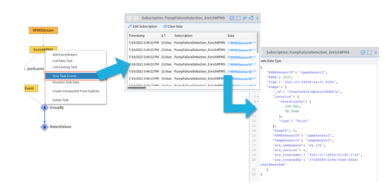

* Click a Task and use "View Task Events"

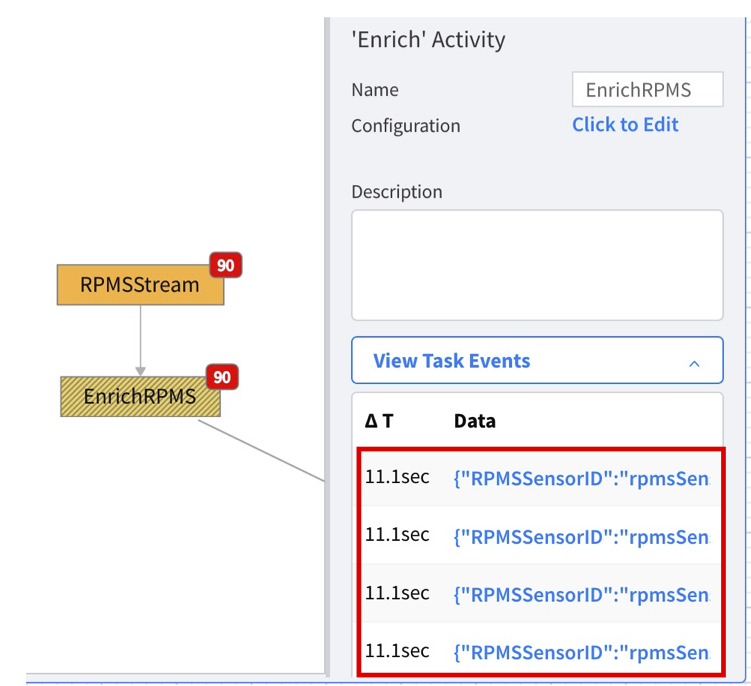

## Debugging the Application ②&nbsp;&nbsp; Confirming errors

* Confirm the details of the error and investigate the cause.

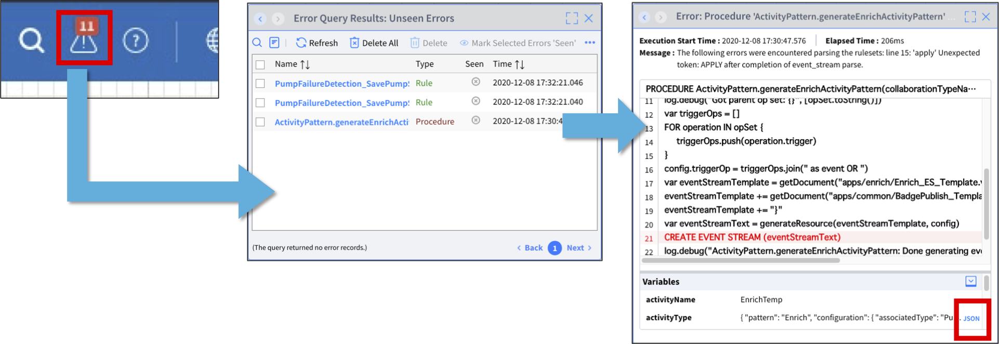

_＊ Error list can also be displayed via Test > Errors > Run Query_

# Introduce Activity Patterns

## Contents

* Enrich\(Cached Enrich\)  
* Join  
* Transformation  
* SplitByGroup  
* Dwell  
* SaveToType  
* Statistics  
* Unwind  
* Smooth  
* Procedure  
* Filter  
* AccumulateState

## Enrich（Cached Enrich）

* Add the data stored in Type to the event.
* `Cached Enrich` is an `Enrich` which improves performance by caching the value of Type. Instead, even if changes the value of Type, it will not be reflected in the value added to the event until the next time when the Type value is retrieved.
  * When using `Cached Enrich`, it is required to use `SplitByGroup` to split the stream in advance.

## An example of Enrich (Cashed Enrich)

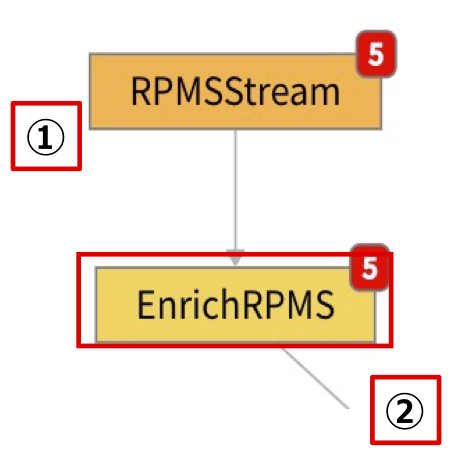

① Output of the previous task which will be the input.  
```
{
👉 "RPMSSensorID": "rpmsSensor3",
   "RPMS": 3222,
   "Time": "2020-03-19T04:42:24.021Z"
}
```

*Set the common property (`RPMSSensorID`) of Type and Event as Key.*  

② Output of `Enrich`    
```
{
   "RPMSSensorID": "rpmsSensor3",          #  ① Output result of "RPMSStream" Task
   "RPMS": 3222,                           #  ① Output result of "RPMSStream" Task
   "Time": "2020-03-19T04:42:24.021Z",     #  ① Output result of "RPMSStream" Task
   "Pumps": {                              #  The lines below this are the data that the Type added to the event has.
      "_id": "5e70949fc714e2125bbb8854",
      "Location": {
         "coordinates": [
            139.581,
            35.5442
         ],
         "type": "Point"
      },
      "PumpID": 3,
👉    "RPMSSensorID": "rpmsSensor3",
      "TempSensorID": "tempSensor3",
      "ars_namespace": "Test",
      "ars_version": 1,
      "ars_createdAt": "2020-03-17T09:13:03.371Z",
      "ars_createdBy": "446b7d1d-2d7a-45f0-b74c-ba60866ced11"
   }
}
```

## Join  

* Combine events from multiple streams.
* Events with different timestamps can be combined.
* Events of the leftmost stream will be used as the reference.

## An example of Join

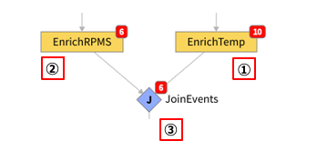


① Output of the previous task which will be the input ①.  
```
{
  "TempSensorID": "tempSensor2",
  "Temp": 184,
  "Time": "2020-03-19T05:18:22.020Z",
  "Pumps": {
     "_id": "5e70949fc714e2125bbb8853",
     "Location": {
        "coordinates": [
           139.5819,
           35.5448
        ],
        "type": "Point"
     },
👉       "PumpID": 2,
             (Omitted)
```
② Output of the previous task which will be the input ②.  
```
{
  "RPMSSensorID": "rpmsSensor2",
  "RPMS": 3971,
  "Time": "2020-03-19T05:18:28.022Z",
  "Pumps": {
     "_id": "5e70949fc714e2125bbb8853",
     "Location": {
        "coordinates": [
           139.5819,
           35.5448
        ],
        "type": "Point"
     },
👉       "PumpID": 2,
             (Omitted)
```  

*The property (`PumpID`) that the two events to be combined have in common is defined as Key.*  

③ Output of `Join`  
```
{
   "EnrichTemp": {
      "TempSensorID": "tempSensor2",
      "Temp": 184,
      "Time": "2020-03-19T05:18:22.020Z",
      "Pumps": {
         "_id": "5e70949fc714e2125bbb8853",
         "Location": {
            "coordinates": [
               139.5819,
               35.5448
            ],
            "type": "Point"
         },
👉       "PumpID": 2,
	               (Omitted)
      }
   },
   "EnrichRPMS": {
      "RPMSSensorID": "rpmsSensor2",
      "RPMS": 3971,
      "Time": "2020-03-19T05:18:28.022Z",
      "Pumps": {
         "_id": "5e70949fc714e2125bbb8853",
         "Location": {
            "coordinates": [
               139.5819,
               35.5448
            ],
            "type": "Point"
         },
👉       "PumpID": 2,
	               (Omitted)
      }
   }
}
```

## Transformation

* Events can be changed.
* Modify by adding or deleting items, calling `Procedure`, etc.

## An example of Transformation

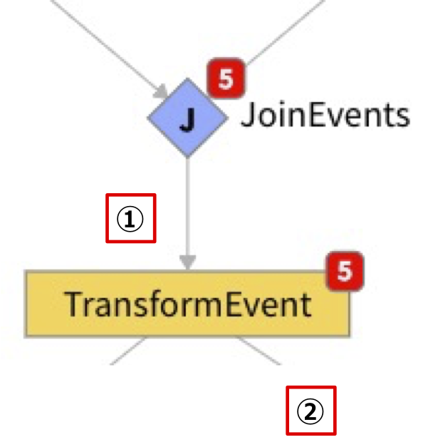

① Output of the previous task which will be the input.  
```
{
   "EnrichTemp": {
      "TempSensorID": "tempSensor2",
      "Temp": 184,
      "Time": "2020-03-19T05:18:22.020Z",
      "Pumps": {
         "_id": "5e70949fc714e2125bbb8853",
         "Location": {
            "coordinates": [
               139.5819,
               35.5448
            ],
            "type": "Point"
         },
         "PumpID": 2,
	               (Omitted)
      }
   },
   "EnrichRPMS": {
      "RPMSSensorID": "rpmsSensor2",
      "RPMS": 3971,
      "Time": "2020-03-19T05:18:28.022Z",
      "Pumps": {
         "_id": "5e70949fc714e2125bbb8853",
         "Location": {
            "coordinates": [
               139.5819,
               35.5448
            ],
            "type": "Point"
         },
         "PumpID": 2,
              	 (Omitted)
      }
   }
}
```
② Transform only the necessary items.  
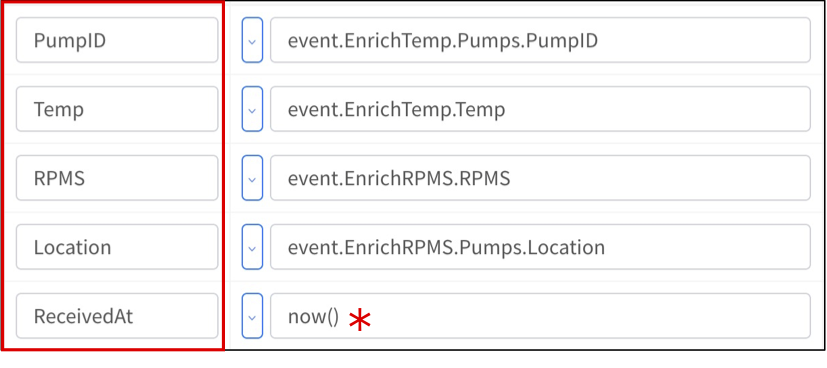 &nbsp; _＊_ Procedure calling    

Output of `Transformation`    
```
{
👉 "Location": {
      "coordinates": [
         139.581,
         35.5442
      ],
      "type": "Point"
   },
👉 "PumpID": 3,
👉 "RPMS": 3152,
👉 "ReceivedAt": "2020-03-19T06:05:14.245Z",
👉 "Temp": 194
}
```

## SplitByGroup

* Split the stream by groups.
* Used prior to activities that need to be handled by a specific group (not by event), such as `Dwell`, `Statistics`.
* By splitting the stream, the resources used are distributed, and therefore load balancing is achieved.

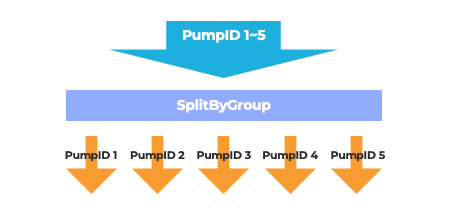

## Dwell

* Issue an event when an event that meets the configured conditions is detected for a configured period of time.

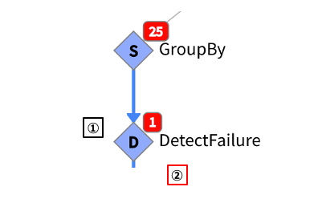  

① Configure the event to be issued when the temperature is 200°C or higher and the RPM is 4000 times or higher for 20 seconds continuously.  
② Output of `Dwell`  
```
{
   "Location": {
      "coordinates": [
         139.5819,
         35.5448
      ],
      "type": "Point"
   },
   "PumpID": 2,
👉 "RPMS": 4034,
   "ReceivedAt": "2020-03-19T11:59:33.227Z",
👉 "Temp": 210
}
```

## SaveToType

* Save or update events to Type.
* Use `Upsert` configuration for updating.

## Statistics

* Compute statistics for a single property contained of events that pass through the task.
* Output count, minimum, maximum, median, mean, and standard deviation.

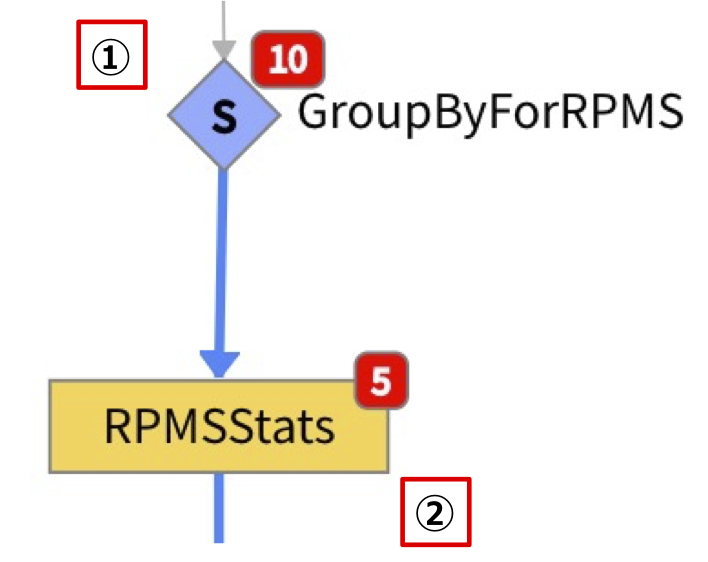

① Output of the previous task which will be the input.  
```
{
   "RPMSSensorID": "rpmsSensor2",
   "Time": "2020-03-19T06:48:19.218Z",
   "RPMS": 3265,
   "PumpID": "pumpId2"
}
```
***In this example, get the RPMS statistics for each PumpID.***  
***＊ When using `Statistics`, it is required to use `SplitByGroup` in advance.***  

② Output of `Statistics`  
```
{
   "count": 34,                           # Count
   "mean": 3505.294117647059,             # Mean
   "min": 3042,                           # Minimum
   "max": 3997,                           # Maximum
   "median": 3463,                        # Median
   "stdDeviation": 264.82567501314435,    # Standard Deviation
   "ars_groupKey": "pumpId2"
}
```

## Unwind

* Turn one event into multiple events.
* By using `Unwind`, instead of processing large size events as they are, each event will be processed in parallel after it is divided, which leads to load balancing.

## An example of Unwind

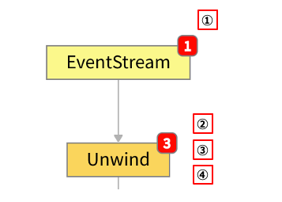

① Output of the previous task which will be the input.  
```
{
   "PumpID": 1,
   "Status": [
      {
②       "Temp": 190,
         "RPMS": 3560,
         "ts": "2020-01-01T00:00:01Z"
      },
      {
③       "Temp": 180,
         "RPMS": 4560,
         "ts": "2020-01-01T00:00:02Z"
      },
      {
④       "Temp": 170,
         "RPMS": 5560,
         "ts": "2020-01-01T00:00:03Z"
      }
   ]
}
```
*Turn one event into multiple events.*  
② Output of `Unwind` ①  
```
{
   "PumpID": 1,
   "Temp": 170,
   "RPMS": 5560,
   "ts": "2020-01-01T00:00:03Z"
}
```
③ Output of `Unwind` ②  
```
{
   "PumpID": 1,
   "Temp": 180,
   "RPMS": 4560,
   "ts": "2020-01-01T00:00:02Z"
}
```
④ Output of `Unwind` ③   
```
{
   "PumpID": 1,
   "Temp": 190,
   "RPMS": 3560,
   "ts": "2020-01-01T00:00:01Z"
}
```

## Smooth

* It is possible to configure the maximum number of events that can pass through in a configured period of time.
* It is possible to adjust the stream to match the number of events allowed for the next and subsequent tasks.

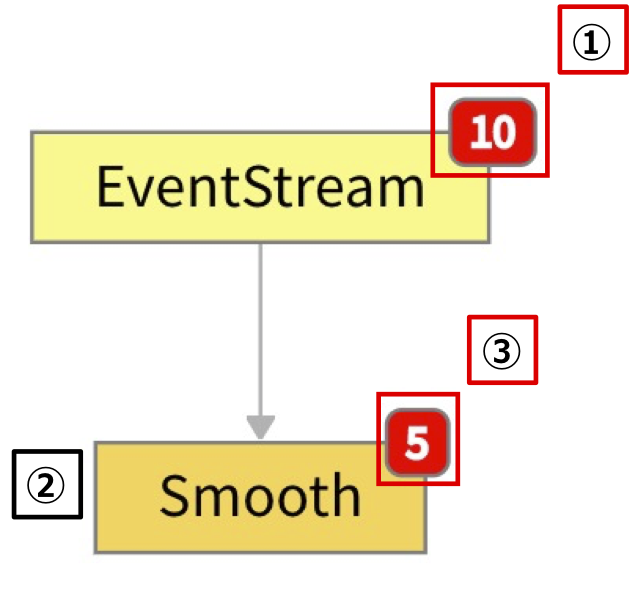

① 10 events happening at once.  
② Configure to pass 5 events per 10 seconds.    
③ Number of events at the end of 10 seconds.  

## Procedure

* Use this when you want to use a process in App Builder that is not in the built-in Activity Patterns.
* It is possible to call and use self-made Procedure (VAIL program).

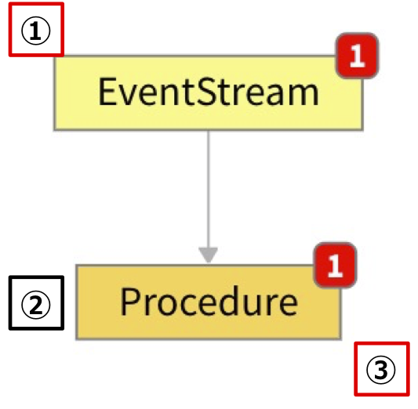

① Output of the previous task which will be the input.  
```
{
  "value": 1
}
```
② Self-made Procedure calling  
```
PROCEDURE myProcedure(event)
event.value += 1
return event
```
③ Output of Procedure  
```
{
  "value": 2
}
```

## Filter

* Only events that match the configured conditions will be allowed to pass through.

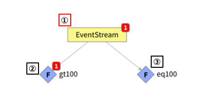

① Output of the previous task which will be the input.  
```
{
   "value": 200
}
```
② Configured condition  
```
event.value > 100
```
③ Configured condition  
```
event.value == 100
```

## AccumulateState

* Keep track of events that pass through the Task for which this Activity Pattern has been configured.
* It is possible to create and configure a procedure for `AccumulateState`, so that optional processes can be executed for the events passing through.  
  * When using `AccumulateState`, it is required to use `SplitByGroup` to split the stream in advance.

## An example of AccumulateState: Count the number of events that have passed through ❶

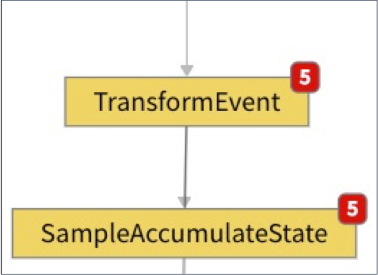

* The ***1*** st event in the `SampleAccumulateState`.
```
{
   "PumpID": 1,
   "Temp": 183,
   "RPMS": 3063,
   "Location": {
      "coordinates": [
         139.5811,
         35.5445
      ],
      "type": "Point"
   },
   "ReceivedAt": "2020-11-30T08:18:18.441Z",
   "current_status": {
👉    "eventCount": 1
   }
}
```

* The ***5*** th event in the `SampleAccumulateState`.
```
{
   "PumpID": 4,
   "Temp": 183,
   "RPMS": 3896,
   "Location": {
      "coordinates": [
         139.5813,
         35.5447
      ],
      "type": "Point"
   },
   "ReceivedAt": "2020-11-30T08:18:18.464Z",
   "current_status": {
👉    "eventCount": 5
   }
}
```


## An example of AccumulateState: Count the number of events that have passed through ❷

**Procedure created  for `AccumulateState`.**  
```
PROCEDURESample.accumulateState(lastEventObject, event Object)
iflastEvent{     # If there are events that have passed through this task.
  lastEvent.eventCount++
} else {         # If there are no events that have passed through this task yet.
  lastEvent = {
👉  eventCount: 1
  }
}
return lastEvent
```  
&nbsp;&nbsp; ***＊ Each time an event passes, the "eventCount" is counted up.***

## An example of AccumulateState: Count the number of events that have passed through ❸

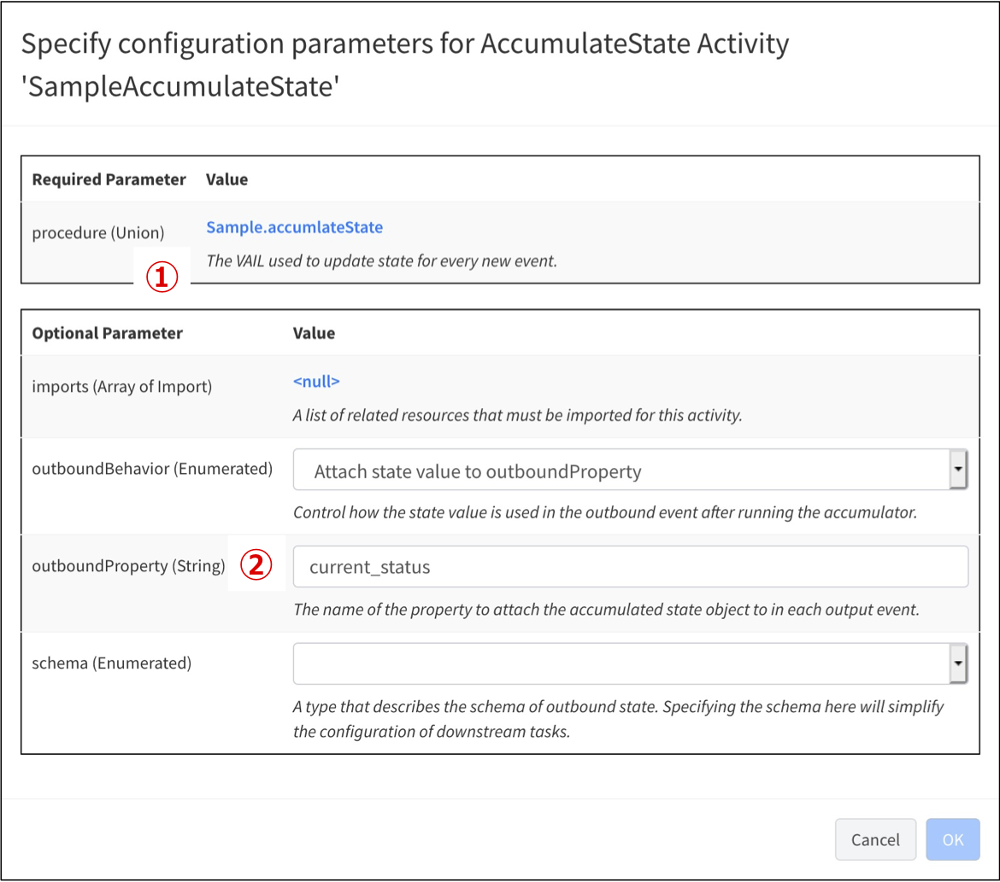

① _procedure_: Self-made Procedure for `AccumulateState`.    
② _outboundProperty_: Property names of objects in `AccumulateState`.    


# Related Resources

- Vantiq Academy (Login required)
  - [3.4: The App Builder](https://community.vantiq.com/courses/developer-level-1-course/lessons/3-sense-correlate-data/topic/3-4-the-app-builder-master/)
  - [4.3: App Builder – Additional Activity Patterns](https://community.vantiq.com/courses/developer-level-1-course/lessons/4-analyze-enrich-data/topic/4-3-app-builder-additional-activity-patterns-master/)
  - [4.4: VAIL](https://community.vantiq.com/courses/developer-level-1-course/lessons/4-analyze-enrich-data/topic/4-4-vail-master/)
  - [4.5: VAIL Procedures](https://community.vantiq.com/courses/developer-level-1-course/lessons/4-analyze-enrich-data/topic/4-5-vail-procedures-master/)
  - [4.6: VAIL Rules](https://community.vantiq.com/courses/developer-level-1-course/lessons/4-analyze-enrich-data/topic/4-6-vail-rules-master/)
