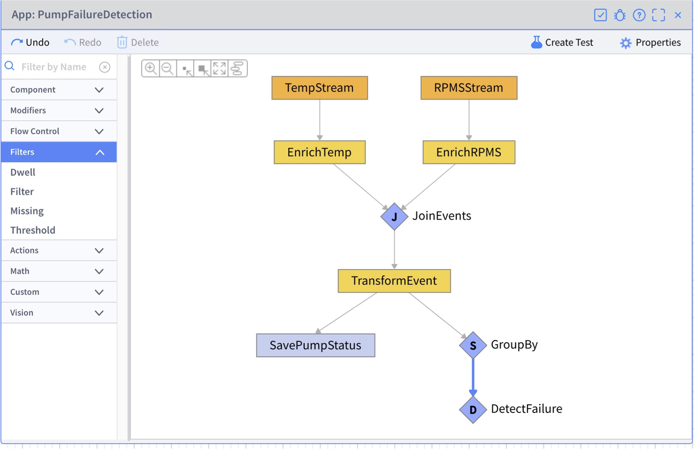

# **Lab 04 – App Builder**

## ***Overview***

In this Lab, create an application that performs Complex Event Processing in real time using App Builder.

### * Overall view of App Builder

### ①. The list of Activity patterns  
* Activity pattern, which is a list of built-in functions prepared by VANTIQ.    
* It can be used by drag and drop in the Development area.  
### ②. Development area  
* Area to develop applications.  
### ③. Configuration area  
* Area for configuring the dragged and dropped Activity patterns.

## ***Step 1（Adding EventStreams）***

1. Open the App Builder window from "Add" > "App..." > "_+ New App_".  

2. Enter _PumpFailureDetection_ as the Name, and click the _OK_ button.  

3. Click the _orange rectangle_ and configure the parameters on the right side of the window as followings.  
    1.  Name: _TempStream_  
    2.  Configuration：  
        1.  inboundResource: _sources_  
        2.  inboundResourceId: _TempMQTT_  　＊ Select from the dropdown menu

  

4. Drag and drop `EventStream` from "Flow Control" in the list of Activity Patterns on the left side of the window, and configure it as followings. ＊ Expand the window if the Development area is too small.  
    1.  Name: _RPMSStream_  
    2.  configuration:  
        1.  inboundResource: _sources_  
        2.  inboundResourceId: _RPMSMQTT_  　＊ Select from the dropdown menu

5. Use the _Save_ button in the upper right corner to save the application.  

6. Launch the Data Generator and click the _Start Generator_ button to start generating data.

7. Go back to the Development screen and confirm that the two streams are fetching data following steps.  
    1.  Click the each event stream and click the "_View Task Events_".    
    2.  Confirm that the `Temp` data (event) and the `RPMS` data (event) are appeared.  

  
&emsp;&emsp;&emsp;&emsp;&emsp;   ＊ "View Task Events" can also be appeared from the menu which is displayed by right-clicking on each task.

## ***Step 2（Attaching information by Enrich）***

Use **Enrich** to attach the `Pumps` Type information to the received events. This allows to see the sensor data, which pump it is about, and where the pump is located.

1. Drag and drop `Enrich` from "Modifiers" in the list of Activity Patterns so it overlaps the `TempStream` task. Then, set the name.    
    1.  Name: _EnrichTemp_

2. Configure the settings as followings.  
    1.  associatedType: _Pumps_    
    2.  foreignKeys : ＊ Click the \<null>  
        1.  Click the "_Add an Item_"  
        2.  Entr "_TempSensorID_"  

After saving the application, click on the `EnrichTemp` task and confirm that data of `Pumps` Type is attached to the received `Temp` event in the "view. Also, if the Data Generator has stopped, run it again.

  
① Received `Temp` event  
② Attached `Pumps` Type data　　

It is possible to confirm that the data of the sensor received by the sensor's ID is associated with the master data of the Pump.

**Add `EnrichRPMS` under "`PMSStream`" in the same way, taking care of the parameters to be set. Also, please confirm in the "View Task Events" section.**

## ***Step 3（Joining Events with Join）***

Combine the events of two streams with **Join**.  

1. Drag and drop "`Join`" from the "Flow Control" in the Activity Pattern list to overlap the `EnrichTemp` Task. Then set the name.  
    1.  Name: _JoinEvents_  

2. Right-click the `EnrichRPMS` Task and click "_Link Existing Task_". Set the Task name to "_JoinEvents_".

3. Click the `JoinEvents` Task and configure the settings as followings.  
    1.  constraints: ＊ Click \<null> .  
        1.  Click the "_+Add an Item_" to display the input field.  
        2.  Enter "_EnrichTemp.Pumps.PumpID == EnrichRPMS.Pumps.PumpID_" in the input field.  ＊ Each element can be selected from the drop down list.  
    2.  Enter "_10 seconds_" in the _withinDuration_.

4. Save the Application, then click the `JoinEvents` Task and confirm the results of the events processed by the `JoinEvents` Task in the "View Task Events" section to see whether they look like the image following. If the Data Generator has stopped, please run it again.

  
① Processed results for `EnrichTemp`  
② Processed results for `EnrichRPMS`  

## ***Step 4（Modification by Transformation）***

Modify the event with **Transformation**.

1. Drag and drop "`Transformation`" from the "Modifiers" in the Activity Pattern list to overlap the `JoinEvents` Task. Then set the name.   
    1.  Name: _TransformEvent_

2. Configure the settings as followings.    
    1. Click the \<null> in Transformation to display the following list of properties.  

|  |  
|--------|  

&emsp;&emsp;&emsp;  ⅱ. Change the list of properties as shown in the above image to the one shown in the following image by deleting or entering manually.  

| |  
|---------|  

&emsp;&emsp;&emsp;  ⅲ. Set "_PumpStatus_" in the _schema_.  

3. Save the Application, then click the `TransformEvent` Task and confirm the results of the events processed by the `TransformEvent` task in the "View Task Events" section to see whether they look like the image following. If the Data Generator has stopped, please run it again.

  
↑ Duplicate content and other information has been removed, and the structure is now simple with only necessary properties.

## ***Step 5（Saving to Type with SaveToType）***

Save the event with **SaveToType**.

1. Drag and drop "`SaveToType`" from the "Actions" in the Activity Pattern list to overlap the `TransformEvent` Task.Then set the name.  
    1.  Name: _SavePumpStatus_

2. Configure the settings as followings.  
    1.  type: _PumpStatus_  
    2.  upsert: Check on the checkbox.

3. After saving the Application, confirm the data in the `PumpStatus` Type and check if the data is saved as the image following (Open `PumpStatus` Type and click the "Show All Records"). If the Data Generator has stopped, please run it again.

  
    ＊ PumpID from I to 5 is stored. The data stored in `PumpStatus` Type is stored by `Upsert`, so the number of data will not be more than the number of pumps.

## ***Step 6（Anomaly detecting with Dwell）***

Use `SplitByGroup` to group events by the PumpID, and then use **Dwell** to detect when temperature data and RPM data continue to exceed a certain value.

1. Drag and drop "`SplitByGroup`" from the "Flow Control" in the Activity Pattern list to overlap the `TransformEvent` Task. Then set the name.   
    1.  Name: _GroupBy_

2. Configure the settings as following.  
    1.  groupBy: _event.PumpID_

3. Drag and drop "`Dwell`" from the "Filters" in the Activity Pattern list to overlap the `GroupBy` Task. Then set the name.  
    1.  Name: _DetectFailure_

4. Configure the settings as followings.  
    1.  condition: _event.Temp > 199 and event.RPMS > 3999_  
    2.  duration: _20 seconds_

5. Save the application, then click the `DetectFailure` Task and confirm the results of the events processed by the `DetectFailure` Task in the "View Task Events" section.

6. Open the Data Generator and select "Pump 1" from the _Select a Pump_ drop down under "Set Status of Pump".

7. Select "High Temp & RPMS" from the _Normal_ drop down, then click the _Update Pump Status_ button (The pump whose PumpID is 1 will have a higher temperature and speed value).

8. Click the _Start Generator_ button to start data generation.

9. Go back to the Development screen.

10. It is detected when an event with a temperature of 200°C or higher and a RPM of 4000 times or higher is generated continuously for 20 seconds.

At this point, the project graph and App should have the elements shown in the image below, so please confirm.

* Resource graph

||
|-----------------------------------------------|

* PumpFailureDetection

## ***▷Checkpoints***

-   In case an error occurs.    
    ✔︎   Check the debugging method document distributed and investigate the cause.

-   In case DetectFailure (Dwell) does not have a value.  
    ✔︎   Once `Dwell` detects a value above the set value, it will not detect it again until it receives a value below the set value again or after a certain period of time.　In this case, it is required to open the Data Generator and change the "Set Status of Pump" of the relevant pump back to _Normal_ once.   
    ✔︎   For example, when a pump fails, it is obvious that once the failure is detected, it will continue to exceed the set value unless repaired, and there is no need to continuously detect the failure. When a normal value is received, it can be considered to be in a state of repair. If a value that exceeds the set value is received again after this, it will be detected again.

-   Activity patterns other than the ones used in this App.  
    ✔︎   There is information about each Activity pattern in the reference. So, please check it out.  
    ✔︎   App Builder reference: <https://dev.vantiq.co.jp/docs/system/apps/index.html>
