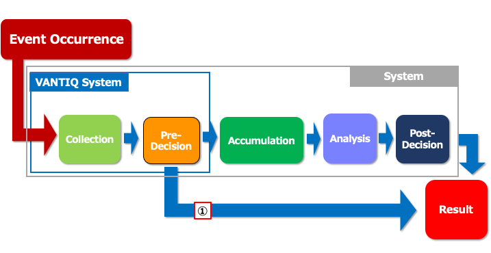

# Review through Lab 04

## Process flow

  
① The Data which is generated with the Data Generator.  
② Receive the data  
③ **1. Detect Pumps failures**  
&nbsp;&nbsp;&nbsp;&nbsp;**2. Update the real-time information of each Pump**

## System processing and data flow with previous way

  
① **Results can be derived with a delay from the occurrence of an event.**  

## System processing and data flow with VANTIQ

  
① **Decision can be made in advance without storing data.**  

