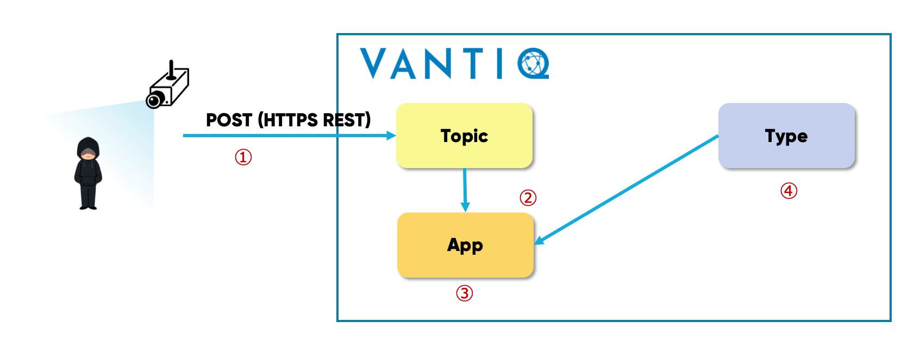
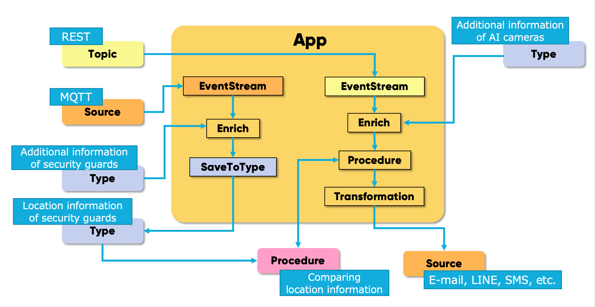

# Understanding Vantiq Resources through real-world example

##  Notification system to security guards using AI cameras  

Detect suspicious persons in a large park using AI cameras, and notify the nearest security guard.  

➡️ Compare **location information of AI camera** that detected suspicious person and **location information of all security guards**, and then notify the security guard who is nearest to the suspicious person.  


# Prerequisites

## Specification of the AI camera

- Model has been trained to identify the characteristics of suspicious persons.  
- When a suspicious person is captured in the camera view, send the following data via _HTTPS REST_.

```sh
{
“camera_id”: "camera_001",    # ID of the AI camera
“event_type”: "notice_001",
“image”: "data:image/jpeg;base64,/9j/4AAQSkZJRgABAQAAAQABAAD/2wBDAAMC...."    # Base64-encoded image
}
```

***※ Generally, AI cameras do not have location information with them.
If they do, AI camera needs to be reconfigured when it gets reinstalled. ***


## Method of obtaining location information of security guard  

- A security guard has a smartphone with an App that acquires location.    
- App sends the following data to MQTT broker at a certain frequency, such as every 30 seconds.  

```sh
{
"guard_id": "134678493_1",    # ID of each security guard
"type": "location",
"lat": 35.6864604,             # Latitude
"lon": 139.7635769,            # Longitude
"time": 1631083251
}
```

## Process to be implemented in Vantiq

1. Receive data from AI cameras and the location App.  
   * It should be designed to accomodate future changes (such as data format) flexibly.    

1. Enrich the data sent from AI cameras.  
   * Since AI camera does not have location itself, such data should be maintained in Vantiq side and added when necessary.    

1. Continuously update the latest location of security guards.    
   * In order to minimuze the latency for notification, the location of the security guards should be fetched continuously in Vantiq prior to when a suspicious person is detected.    

1. Compare the location of the AI camera which detected the suspicous person and the locations of security guards.  
   * Identify the nearest security guard on site.    

1. Notify the nearest security guard.    
   * notify via arbitrary channels such as E-mail, SMS, LINE, Slack


# Implementation method

## 1. Inputting data into Vantiq  


①　Vantiq can process data even if the schema of the data to be received is not defined.    
②　A Source receives data via various protocols.    
③　A Topic is an endpoint of REST API.    

## 2. Enrich the data sent from AI cameras. 



① Sent Data
```sh
{
👉“camera_id”: "camera_001",
“event_type”: "notice_001",
“image”: "data:image/jpe...."
}
```  
② Format data as needed, such as changing or deleting parameters. (Transformation)  
③ Enrich the stream data that comes from AI cameras. (Enrich)    
```sh
{
👉“camera_id”: "camera_001",
👉“lan”: 35.6864604,
👉“lon”: 139.7635769,
“event_type”: "notice001",
“image”: "data:image/jpe...."
}
```  
④ Additional information used in ③, such as the locations are maintained in Type. 
``` sh
{
👉“camera_id”: "camera_001",
“lan”: 35.6864604,
“lon”: 139.7635769
}
```

## 3. Continuously update the latest location of security guards.   

  

① Sent Data
```sh
{
"guard_id": "134678493_1",
"type": "location",
"lat": 35.6864604,
"lon": 139.7635769,
"time": 1631083251
}
```  
② `Enrich` additional information such as E-mail address, phone number, etc. required for notification.    
③ Save to *Type* by `SaveToType` activity with `Upsert` option to retain the latest information only.  

## 4. Compare the location of the AI camera and the locations of security guards  

  

① Data to be passed to Procedure.  
```sh
{
“camera_id”: "camera_001",
👉“lan”: 35.6864604,
👉“lon”: 139.7635769,
“event_type”: "notice_001",
“image”: "data:image/jpe...."
}
```
② Call the custom procedure to compare locations and identify the nearest security guards   
③ Identify the nearest security guard by comparing the location contained in _the AI camera data in the stream_ and the locations in _the security guard data saved in Type_.    
④ Store the latest location information of the security guards.  


## 5. Notify the specified security guard  

  


① Transform data to meet the format required for notification. (Transformation)  
② Source is used not only for receiving but also for sending.    
③ E-mail, SMS, Slack, LINE, Teams, etc.    

## Overview of Vantiq Application



## Sample App  

A sample App (consisting of App and Data Generator) can be found [here](../../conf/ai-camera-demo).    


# Introduction to each Resource

|Reource|Description|
|:-----|:---|
|Source|A client that sends and receives data.   Sending and Receiving: MQTT, AMQP, Kafka   Sending only: HTTP(S), E-mail, SMS|
|Topic|An event bus that passes events between App in Vantiq, etc. It also functions as an endpoint of REST API.|
|Type|Store the data. Resource which corresponds to the DB in Vantiq.|
|App|The application itself which can be developed on GUI by combining prepared patterns and Procedure.|
|Procedure|Resource which can be programmed by oneself. It is possible to use the original features by calling them in App and so on.|

  

① Sending data externally and executing other APIs.    
② Implement the process with combining patterns.    
③ Implement the process that is external to the pattern on your own.    
④ Stream data which is sent from the device.    
⑤ Store information to be added to the stream data, and real-time status, etc.  
