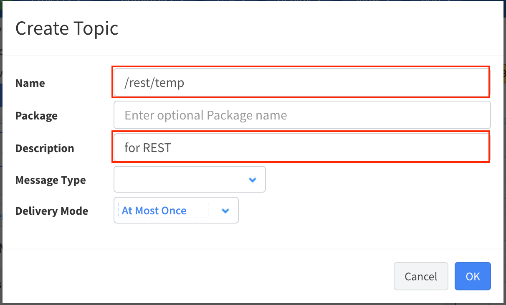
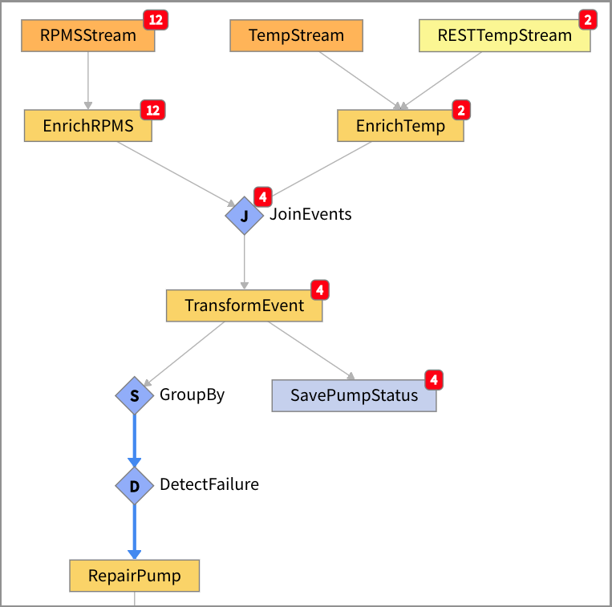

# **Lab 05 – VANTIQ REST API**

## **Overview**

In this lab, learn how to use **VANTIQ's REST API** to manipulate VANTIQ Resources from outside and to run Applications created in **App Builder**.

The following tools are also used in this lab.  
**Postman（**<https://www.getpostman.com/>**）**  
Or **Postman Chrome App**  
**(**<https://chrome.google.com/webstore/detail/postman/fhbjgbiflinjbdggehcddcbncdddomop?hl=ja-jp>**)**  
***＊ Alternatively, it is possible to use the curl command or any other REST client.***

-   **Register, retrieve, update, and delete data from outside to `Type` in VANTIQ.**  
Use Postman (REST Client) to POST, GET, PUT, and DELETE data of `Type`.  

-   **POST data from outside to VANTIQ `Topic` and run the App.**  
Use Postman (REST Client) to POST data to `Topic` and run the Application.  

    **＊ Topic**: Feature to send and receive data via event processing within VANTIQ. It is possible to publish events to `Topic` from outside using the _REST API_.  

#### References
- Vantiq Academy (Login required)
  - [4.2: Source & Topic](https://community.vantiq.com/courses/developer-level-1-course/lessons/4-analyze-enrich-data/topic/4-2-sources-topics-master/)  
- Vantiq Developer Guide
  - [API Reference Guide](https://dev.vantiq.co.jp/docs/system/api/index.html#api-reference-guide)

## ***Step 1（Register, retrieve, update, and delete data from outside to `Type` in VANTIQ）***

Use Postman (REST Client) to manipulate the `Type` of your `Namespace`.

1.  To access the resource from the outside, create an **Access Token** by taking the following steps.

    1. Go to "Administer > "Advanced" > "Access Tokens", and click "_+ New_" to open "Create Token" which creates new Access Token.

    2.  Enter your own `Namespace` name, etc in the Name field. For example, "workshop_XX".

    3.  Confirm that the expiration date entered in "Expires At:" is after today, and click "_OK_".

    4.  The Access Token which has just created will appear in the list. Copy the Access Token.  
    ＊ Click on the Access Token part to copy it.  
      

2.  Open another tab and go to "<https://www.getpostman.com/>" to install and start Postman.  

    1.  Confirm that it looks like the the following.  

       

3.  Follow the steps below to register data via Postman to the `PumpStatus` Type.  

    1.  Change the "GET" part to "POST" from the pulldown menu, and change the method to **POST**.  
    2.  Enter the following URL where it says "Enter request URL".  

    | https://dev.vantiq.co.jp/api/v1/resources/custom/PumpStatus |
    |-------------------------------------------------------------|  

    3.  Open the "Headers" tab and enter the following.  

    | KEY           | VALUE                                 |
    |---------------|---------------------------------------|
    | Authorization | **Bearer** ***Copied Access Token*** |  

    4.  Open the "Body" tab, and configure as followings.  
        1.  Select the _raw_ radio button.  
        2.  In the pull-down menu, change "Text" to "_JSON (application/json)_".  
        3.  Enter the followings in the input field.  

        ```
        {
    	     "Location": {
    		       "coordinates": [
    			             0,
    			             0
    		       ],
    		       "type": "Point"
    	     },
    	     "PumpID": 7,
    	     "RPMS": 5000,
    	     "ReceivedAt": "2020-01-01T00:00:00Z",
    	     "Temp": 250
        }
        ```

    5.  Confirm that it looks like the the following.

      

    6.  CLick on the _Send_ button.

    7.  Once the POST is successful, the result will be displayed as in the following image.  

      

    8.  Go back to VANTIQ and confirm the data in the `PumpStatus` Type.  
        1.  Click on `PumpStatu`s Type "_Show All Records_", and confirm that the _7_ th sample data has been POSTed, as the following image.

          

＊ Using the curl command, it looks like the following (This may not work properly on Windows).

```
curl
-X POST
-H 'Content-Type:application/json'
-H "Authorization: Bearer Access Token"
-d '{"Location": {"coordinates": [ 0, 0 ], "type": "Point" }, "PumpID": 7, "RPMS": 5000, "ReceivedAt": "2020-01-01T00:00:00Z", "Temp": 250 }'
https://dev.vantiq.co.jp/api/v1/resources/custom/PumpStatus
```

4.  Follow the steps below and get data of `PumpStatus` Type via Postman.  

    1.  Go back to Postman, and change the "Post" part to **GET** from the pulldown menu, and then click the _Send_ button.  

      

    Confirm that all data of `PumpStatus` Type is displayed.

＊ Using the curl command, it looks like the following (This may not work properly on Windows).

```
curl
-H "Authorization: Bearer Access Token" https://dev.vantiq.co.jp/api/v1/resources/custom/PumpStatus
```

5.  Follow the steps below and update the data of `PumpStatus` type via Postman.

    1.  Open Postman and change the "GET" part to "**PUT**" from the pulldown menu.

    2.  Change the URL part as following.

    |https://dev.vantiq.co.jp/api/v1/resources/custom/PumpStatus?where={"PumpID": 7}|
    |---|  

    3.  Enter the followings in the input field of "Body" tab.  
    ```
    {
        "Location": {
            "coordinates": [
                  130,
                  35
            ],
            "type": "Point"
        }
    }
    ```  

    4.  Click the _Send_ button.

    5.  Go back to VANTIQ and review the data for the `PumpID` _7_ in the `PumpStatus` Type and confirm that the `Location` has been updated (it doesn't matter with "GET").

＊ Using the curl command, it looks like the following (This may not work properly on Windows).  
```
curl
-g -X PUT
-H 'Content-Type: application/json'
-H 'Authorization: Bearer Access Token'
-d '{"Location": {"coordinates": [130,35],"type": "Point"}}' 'https://dev.vantiq.co.jp/api/v1/resources/custom/PumpStatus?where={"PumpID":7}'
```

6.  Follow the steps below and delete the data of `PumpStatus` type via Postman.

    1.  Open Postman and change the "GET" part to "**DELETE**" from the pulldown menu.

    2.  Confirm that the URL part as following.

    |https://dev.vantiq.co.jp/api/v1/resources/custom/PumpStatus?where={"PumpID": 7}|
    |---|

    3.  Click the _Send_ button.

    4.  Go back to VANTIQ and review the data of the `PumpStatus` Type, then confirm that the data of `PumpID` _7_ has been deleted (it doesn't matter with "GET").  

＊ Using the curl command, it looks like the following (This may not work properly on Windows).  
```
curl -g -X DELETE
-H 'Content-Type: application/json'
-H 'Authorization: Bearer Access Token'
'https://dev.vantiq.co.jp/api/v1/resources/custom/PumpStatus?where={"PumpID":7}'
```


The above steps allow to register, retrieve, update, and delete data from an outside system to `Type` in VANTIQ.

## ***Step 2（POST data from outside to VANTIQ `Topic` and confirm in the App）***

 POST data from Postman(REST Client) and run the **PumpFailureDetection** App.

 This time, POST the data to the `Topic` instead of the `Type`. Also, modify the Application slightly to accept events from the `Topic`.

1.  Open VANTIQ Development screen.

2.  Go to "Add" > "Advanced" > "Topic...", and click "_+ New Topic_" to open "Create Topic" which creates new Topic.

3.  Enter "_/rest/temp_" in the Name field.

4.  Enter "_for REST_" in the Description field.

5.  Click the _OK_ button, and save `Topic`.

   

6.  Open **PumpFailureDetection** App.

7.  Drag and drop "`EventStream`" from "Flow Control" in the list of `Activity Pattern` to the development area, and configure it as followings.

    1.  Name: _RESTTempStream_

    2.  Configuration:

        1.  inboundResource: _topics_

        2.  inboundResourceId: _/rest/temp_

8.  Right-click the `RESTTempStream` Task and click "_Link Existing Task_". Set the Task name to "_EnrichTemp_".

   

9.  Follow the steps below and run the **PumpFailureDetection** App using RPM data from the **Data Generator** and temperature data from Postman.

    1.  Open Postman and configure as followings.

        1.  Method: POST

        2.  URL: https://dev.vantiq.co.jp/api/v1/resources/topics//rest/temp

        3.  Headers:

        | KEY           | VALUE                                 |
        |---------------|---------------------------------------|
        | Authorization | **Bearer** ***Copied Access Token*** |
        | Content-Type  | application/json                      |

        4.  Body:  

        ```
        {
          "TempSensorID": "tempSensor1",
          "Temp":250,
          "Time": "2020-01-01T00:00:00Z"
        }
        ```

    2.  Open **Data Generator** and click the _Start RPMS Only_ button. Pressing this button will generate RPM data only.

    3.  Go back to Postman with the RPM data being generated, and click the _Send_ button with the above settings already in place. The Temp data will now be published to the `/rest/temp` Topic.

    4.  Go back to the Development screen and confirm that the RPM data and the data from Postman are `Join`ed and the Application is running.

      

## ***▷Checkpoints***

-   Use VANTIQ's _REST API_ makes it easy to integrate with outside systems.  
    ✔︎  For example, POSTing data from multiple outside systems to VANTIQ and combining and formatting it in the application, updating the `Type` value from outside systems and changing the `Enrich` content, etc. can be easily implemented using what you have learned in this workshop.
