# **Lab 06 – Integrating with External Services**

## **Overview**

In this Lab, when a pump failure is detected, make notification of its contents through external services.  
The services that get integrated in this lab are the followings. Feel free to pick any one(s) you want to work with.

-   **[Email](#step-1-email)**

-   **[SMS (Twilio)](#step-2-sms)**

-   **[Teams](#step-3-teams)**

-   **[LINE](#step-4-line)**

-   **[Slack](#step-5-slack)**

***＊ The environment and the account for each service must be prepared in advance.***

   

Also, use "**Procedure**" to implement the function to send data. Using Procedure allows to freely program processes that do not exist in the `Activity patterns`. Procedure is a program that can be called from applications created with **App Builder**.

#### References
- Vantiq Academy (Login required)
  - [4.2: Source & Topic](https://community.vantiq.com/courses/developer-level-1-course/lessons/4-analyze-enrich-data/topic/4-2-sources-topics-master/)
  - [4.8: VAIL SQL](https://community.vantiq.com/courses/developer-level-1-course/lessons/4-analyze-enrich-data/topic/4-8-vail-sql-master/)


## ***Step 1 (Email)***

The following is the procedure for creating a Source for Email and sending the Email when a pump failure is detected.

1.  Create a Source

    1.  Go to "Add" > "Source...", and click "_+ New Source_" to open "New Source".

    2.  Enter "_Email_" in the Source Name filed.

    3.  Set "_EMAIL_" to the Source Type.

    4.  Open "Properties" tab, set your own mail server information in the following fields, and save it.  
        1.  Server URL  
        2.  Server Port  
        3.  Username/Password

          

2.  Create a Procedure

    1.  Go to "Add" > "Procedure...", and click "_+ New Procedure_" to open Edit window for New Procedure.

    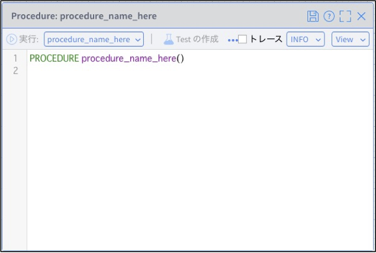  

    2.  Paste the following information and save it.

        ***＊ A procedure called "`sendEmail`" will be created.***  
        ***＊ Enter your own Email Address in the "\<Any Email Address\>" field.***  
        ```
        PROCEDURE sendEmail(event)
        // Receiver Email Address
        var toAddress = "<Any Email Address>"
        // Sender Email Address
        var fromAddress = "<Any Email Address>"
        // Contents of Sending
        var subject = "The pump has failed."
        var body = "<div>Dear Maintenance Staff</div>"
        body += "<div>The Pump on PumpID　" + event.PumpID + " has failed.</div>"
        body += "<div>Temperature: " + event.Temp + "℃</div>"
        body += "<div>RPM: " + event.RPMS + "</div>"
        body += "<div>Location of the pump: " + "Latitude: " + event.Location.coordinates[1] + "、Longitude: " + event.Location.coordinates[0] + "</div>"
        body += "<div>Time: " + event.ReceivedAt + "</div>"
        // Send
        PUBLISH { html: body } TO SOURCE Email USING { from: fromAddress, to: toAddress, subject: subject }    
        ```

3.  Modify and Run the App

    1.  Open **PumpFailureDetection** App, drag and drop the "`Procedure`" from the "Actions" in the Activity Patterns on the left side of the window to the "`DetectFailure`" Task, and configure it as following.

        1.  procedure: `sendEmail`

    2.  Save "**PumpFailureDetection**" App, configure it to generate high values for temperature and RPM for any of the pumps, and run the **Data Generator**.

    3.  Confirm that the "`SendEmail`" Task has been executed.  

    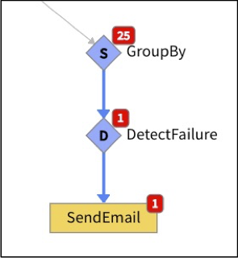  

    4.  Confirm that the Email has been sent to the designated Email Address.

    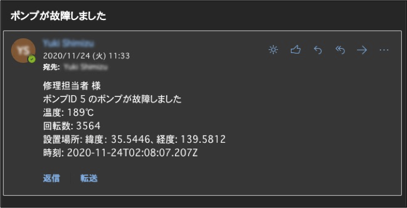  

Up to here are the steps to send the Email.

## ***Step 2 (SMS)***

The following is the procedure for creating a Source for SMS and sending the SMS when a pump failure is detected.

1.  Create a Source

    1.  Go to "Add" > "Source...", and click "_+ New Source_" to open "New Source".

    2.  Enter "_Twilio_" in the Source Name field.

    3.  Set "_SMS_" to the Source Type.

    4.  Open "Properties" tab, set your own Twilio information in the following field, and save it.  
        1.  Twilio Account SID  
        2.  Twilio Auth Token  
        3.  Twilio 'From' Phone Number  


        * Twilio console dashboard  
        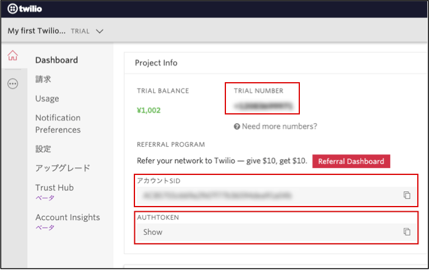  
        * Source for Twilio  
        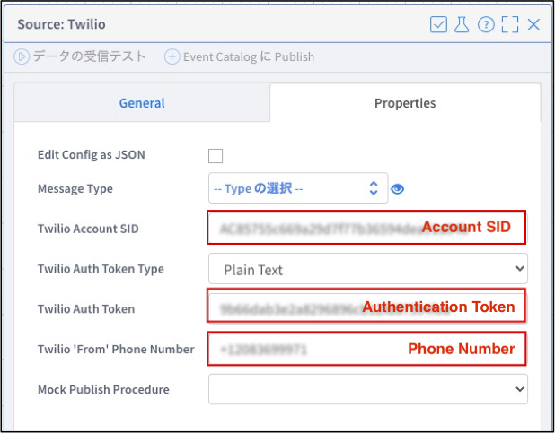  
        ＊ The format of the phone number is "+xxxxxxxxxxx".

2.  Create a Procedure

    1.  Go to "Add" > "Procedure...", and click "_+ New Procedure_" to open Edit window for New Procedure.

    2.  Paste the following information and save it.  
    ***＊ Enter your own phone number in the "\<Any Phone Number\>".***  
        ```
        PROCEDURE sendSMS(event)
        // Receiver Phone Number（+1xxxxxxxxxx‬）
        var phoneNumber = "＜Any Phone Number＞"
        //　Contents of Sending
        var body = "The Pump on PumpID" + event.PumpID + "has failed. \n"
        body += "Temperature: " + event.Temp + "℃ \n"
        body += "RPM: " + event.RPMS + "\n"
        body += "Location of the pump: \n"
        body += "Latitude: " + event.Location.coordinates[1] + "\n"
        body += "Longitude: " + event.Location.coordinates[0] + "\n"
        body += "Time: " + event.ReceivedAt
        // Sending process
        PUBLISH { body: body } TO SOURCE Twilio USING { to: phoneNumber }
        ```

3.  Modify and Run the App

    1.  Open **PumpFailureDetection** App, drag and drop the "`Procedure`" from the "Actions" in the Activity Patterns on the left side of the window to the "`DetectFailure`" Task, and configure it as following.

        1.  procedure: sendSMS

    2.  Save **PumpFailureDetection** App, configure it to generate high values for temperature and RPM for any of the pumps, and run the **Data Generator**.

    3.  Confirm that the "`SendSMS`" Task has been executed and the SMS is sent to the designated phone number.

    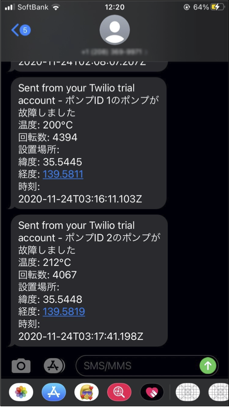

Up to here are the steps to send the SMS.

## ***Step 3 (Teams)***

The following is the procedure for creating a Source for Teams and sending the message to Teams when a pump failure is detected.

1.  Prepare Teams connector

    1.  Go to the channel settings of the Teams that want to use it as a notification destination, open the connector settings, and click "_Configure_" for the connector for Incoming Webhook.

    

    2.  Provide any name and any image, and click the "_Create_".

    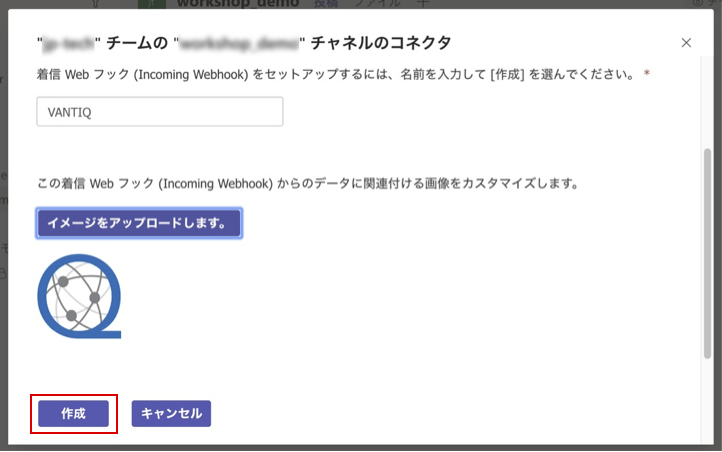

    3.  As the URL will be displayed, copy it, and click the "_Done_".

    

2.  Create a Source

    1.  Go back to VANTIQ. Go to "Add" > "Source...", and click "_+ New Source_" to open "New Source".

    2.  Enter "_Teams_" in the Source Name field.

    3.  Set "_REMOTE_" to Source Type.

    4.  Open "Properties" tab, paste the Teams URL copied earlier into "Server URI" and save it.

3.  Create a Procedure

    1.  Go to "Add" > "Procedure...", and click "_+ New Procedure_" to open Edit window for New Procedure.

    2.  Paste the following information and save it.  
        ```
        PROCEDURE sendToTeams(event)
        // Contents of sending
        var message = "The Pump on PumpID" + event.PumpID + "has failed. <br>"
        message += "Temperature: " + event.Temp + "℃ <br>"
        message += "RPM: " + event.RPMS + "<br>"
        message += "Location of the pump: <br>"
        message += "Latitude: " + event.Location.coordinates[1] + "<br>"
        message += "Longitude: " + event.Location.coordinates[0] + "<br>"
        message += "Time: " + event.ReceivedAt
        var body = {
          text: message
        }
        // Sending process
        PUBLISH { body: body } TO SOURCE Teams
        ```

4.  Modify and Run the App

    1.  Open **PumpFailureDetection** App, drag and drop the "`Procedure`" from the "Actions" in the Activity Patterns on the left side of the window to the "`DetectFailure`" Task, and configure it as following.

        1.  procedure: `sendToTeams`

    2.  Save **PumpFailureDetection** App, configure it to generate high values for temperature and RPM for any of the pumps, and run the **Data Generator**.

    3.  Confirm that "`SendToTeams`" Task has been executed and the message is sent to the channel of Teams that has posted the URL.  
    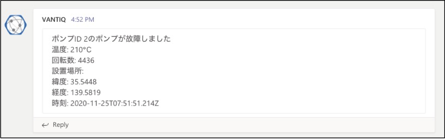

Up to here are the steps to send a message to the Teams.

## ***Step 4 (LINE)***

The following is the procedure for creating a Source for LINE and sending the message to LINE when a pump failure is detected.

1.  Configure LINE  

    1.  Log in the [Developers console](https://developers.line.biz/console/), and create a channel for the Messaging API.  
      ＊ Reference: [Getting started with the Messaging API](https://developers.line.biz/en/docs/messaging-api/getting-started/)  

    2.  In the "Messaging API Settings" tab of the channel that was created, issue the Channel Access Token and copy it.  
    ***＊ It will be used in "the Create a Source" procedure.***  
    

    3.  Add your bot as a friend by scanning the QR code on the channel from your LINE app.  
    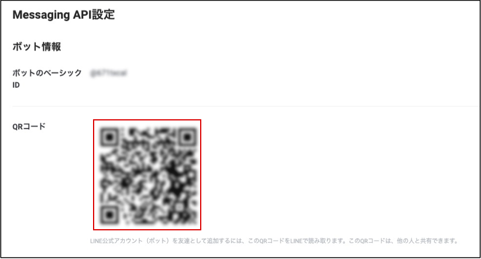

2.  Create a Source

    1.  Go to "Add" > "Source...", and click "_+ New Source_" to open "New Source".

    2.  Enter "_LINE_" in the Source Name field.

    3.  Set "_REMOTE_" to the Source Type.

    4.  Open "Properties" tab, and configure as the followings and save it.  
      -   Server URI: https://api.line.me/v2/bot/message/broadcast  
      -   Credential Type: Access Token  
      -   Access Token Type: Plain Text  
      -   Access Token: ＊ Tokens issued by the LINE Developers Console  
    

3.  Create a Procedure

    1.  Go to "Add" > "Procedure...", and click "_+ New Procedure_" to open Edit window for New Procedure.

    2.  Paste the following information and save it.  

        ```
        PROCEDURE sendToLine(event)
        // Contents of sending
        var message = "The Pump on PumpID " + event.PumpID + "has failed. \n"
        message += "Temperature: " + event.Temp + "℃ \n"
        message += "RPM: " + event.RPMS + "\n"
        message += "Location of the pump: \n"
        message += "Latitude: " + event.Location.coordinates[1] + "\n"
        message += "Longitude: " + event.Location.coordinates[0] + "\n"
        message += "Time: " + event.ReceivedAt
        var body = {
            messages: [
              {
                  type: "text",
                  text: message
              }
            ]
        }
        // Sending process
        PUBLISH { body: body } TO SOURCE LINE
        ```

4.  Modify and Run the App

    1.  Open **PumpFailureDetection** App, drag and drop the "`Procedure`" from the "Actions" in the Activity Patterns on the left side of the window to the "`DetectFailure`" Task, and configure it as following.

        1.  procedure: `sendToLine`

    2.  Save **PumpFailureDetection** App, configure it to generate high values for temperature and RPM for any of the pumps, and run the **Data Generator**.

    3.  Confirm that "`SendToLine`" Task has been executed and the message is sent to LINE.

    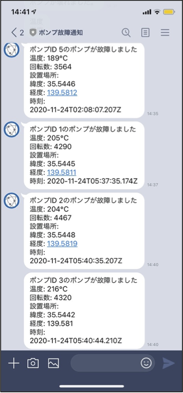

Up to here are the steps to send a message to LINE.

## ***Step 5 (Slack)***

The following is the procedure for creating a Source for Slack and sending the message to Slack when a pump failure is detected.

1.  Prepare the Incoming Webhook App for Slack

    1.  Open [slack app directory](https://slack.com/apps), find "Incoming Webhooks" and select it.  
    ***＊ Confirm that the workspace name displayed in the upper right corner is the one that you want to use.***  
    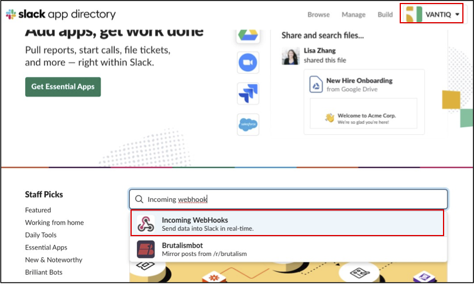

    2.  Click the "_Add to Slack_".

    3.  Select the channel to send the message to, and click the "_Add Incoming Webhooks integration_".  
    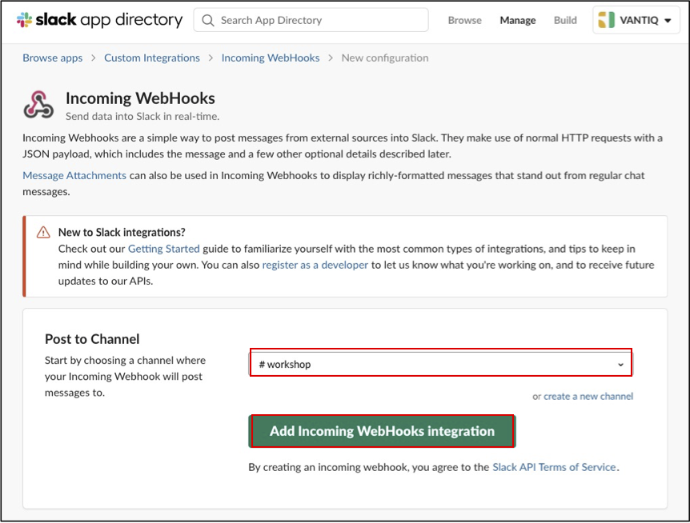

    4.  As the Webhook URL will be displayed, copy it.  
    ***＊ It will be used in the "Create a Source" procedure.***

2.  Create a Source

    1.  Go back to VANTIQ Development screen. Go to "Add" > "Source...", and click "_+ New Source_".

    2.  Enter "_Slack_" in the Source Name field.

    3.  Set "_REMOTE_" to the Source Type.

    4.  Open "Properties" tab, past the Webhook URL of Slack copied earlier into "Server URI" and save it.

3.  Create a Procedure

    1.  Go to "Add" > "Procedure...", and click "_+ New Procedure_" to open Edit window for New Procedure.

    2.  Paste the following information and save it.  

        ```
        PROCEDURE sendToSlack(event)
        // Contents of sending
        var message = "The Pump on PumpID " + event.PumpID + "has failed. \n"
        message += "Temperature: " + event.Temp + "℃ \n"
        message += "RPM: " + event.RPMS + "\n"
        message += "Location of the pump: \n"
        message += "Latitude: " + event.Location.coordinates[1] + "\n"
        message += "Longitude: " + event.Location.coordinates[0] + "\n"
        message += "Time: " + event.ReceivedAt
        var body = {
            text: message
        }
        // Sending process
        PUBLISH { body: body } TO SOURCE Slack
        ```

4.  Modify and Run the App

    1.  Open **PumpFailureDetection** App, drag and drop the "`Procedure`" from the "Actions" in the Activity Patterns on the left side of the window to the "`DetectFailure`" Task, and configure it as following.

        1.  procedure: `sendToSlack`

    2.  Save **PumpFailureDetection** App, configure it to generate high values for temperature and RPM for any of the pumps, and run the **Data Generator**.

    3.  Confirm that "`SendToSlack`" Task has been executed and the message is sent to Slack.
    

Up to here are the steps to send a message to Slack.

## ***▷Checkpoints***

-   Using Source allows to integrate with external services.  
    ✔︎ As for the information on types of sources, please refer to the [External Source Reference Guide](https://dev.vantiq.com/docs/system/sources/source/index.html).  

-   Using `Procedure`, it is possible to implement it according to the format required by the service to be cooperated with.  

-   VANTIQ allows to code in an original language called "**VAIL**", which looks like a combination of SQL and JavaScript.    
    ✔︎ As for the details, please refer to the [VAIL Reference Guide](https://dev.vantiq.com/docs/system/rules/index.html).
