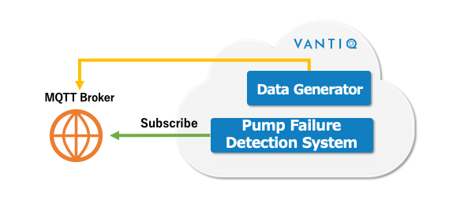

# Vantiq 1-day Workshop Overview

## Pump Failure Detection System

Learn the basic functions of Vantiq through the implementation of a Pump Failure Detection System.
* __Assumed Preset__
  * There are five pumps, each equipped with **a temperature sensor** and **a RPM sensor**.
* __Features to be implemented__
  * A "Failure" is to be detected when the temperature is **200°C or higher** and the RPM is **4000 rpm or higher for 20 seconds**.

## Process flow of the Pump Failure Detection System

   
&nbsp;&nbsp;&nbsp; **＊ Pump Failure Detection System: Detect Pump failure**

## Process flow at Vantiq 1-day Workshop
In this Workshop, instead of sensors/devices, use the **Data Generator** to generate Dummy data.

**Randomly Publish both temperature and RPM data for five pumps.**

  
&nbsp;&nbsp;&nbsp; **＊ Pump Failure Detection System: Detect Pump failure**

## Materials used in this Workshop

* Labs: Instructions for Vantiq 1-day Workshop
  * 01 - 06
  * Additional Task: Development of the Detect Congestion App
* Lectures: Explanation materials
* Materials: [Material files](../../conf) used in the instructions
  * TraingDataGen\.zip
  * Pumps\.json

## Required preparations for this Workshop

* MQTT Broker - Amazon MQ, Mosquitto, etc., that can be accessed from the Internet.
  - Reference: [Amazon MQ Demo - AWS](https://www.youtube.com/watch?v=ibvCmegX0Io)  
  ＊ For the testing purpose, t2.micro, single-broker would be sufficient

## Course Contents

* Create the Pump Failure Detection System through the followings.
  * __Lab01 Preparation__
    * Preparation for the Data Generator
  * __Lab02 Types__
    * Functions like a table in a database
  * __Lab03 Sources__
    * Functions used for sending and receiving data
  * __Lab04 App Builder__
    * Create the processing logic for received events
* Integrate Vantiq with outside systems through the followings.
  * __Lab05 REST API__
    * Manipulate VANTIQ Resources from outside systems
  * __Lab06 REMOTE Source__
    * Call APIs of outside systems from Vantiq

## Course Agenda

Session #|Session      | Type  |Contents Description       |Duration (m)|Material                          |
|:-----:|--------------|:------:|---------------------------|:-:|--------------------------------------------|
|1| The basics of developing with VANTIQ| Lecture||10|[01_Basics](1-01_Basics.md) |
|2| Preparation (Configuration of the Data Generator)|Lab|Preparation for the Data Generator |15|[Lab01_Preparation](2-Lab01_Preparation.md)|
|3| Types|Lab|Functions like a table in a database|20|[Lab02_Types](3-Lab02_Types.md)|
|4|Source|Lab|Functions used for sending and receiving data|20|[Lab03_Sources](4-Lab03_Sources.md)|
|5| Introduction to App Builder| Lecture|  |15| [02_AppBuilder](5-02_AppBuilder.md)|
|6|App Builder|Lab|Create the processing logic for received events|45|[Lab04_AppBuilder](6-Lab04_AppBuilder.md)|
|7| Review through Lab 04| Lecture| |15| [03_Review](7-03_Review.md)|
|8|Q&A||Question and Answer session|15||
|9|VANTIQ REST API|Lab|Next Steps for the Vantiq 1-day Workshop| | [Lab05_VANTIQ_REST_API](a08-Lab05_VANTIQ_REST_API.md)|
|10| Integrate with other services|Lab|Next Steps for the Vantiq 1-day Workshop| |[Lab06_Integrate_other_services](a09-Lab06_Integrate_other_services.md)|
|11|Introducing overall Vantiq Resources||Reference||[Understanding Vantiq Resources through real-world example](../../../vantiq-resources-introduction/docs/eng/Vantiq_resources_introduction.md)|
|12| Task in detect congestion app development|Lecture|Next Steps for the Vantiq 1-day Workshop| | [detect_congestion_app](a10-dev01_detect_congestion_app.md)|

＊ After completing the above sessions, developers are encouraged to attend [Applications Developer Level I Course](https://community.vantiq.com/courses/developer-level-1-course/)(Login required）for a deeper understanding.

## Reference Information
[Troubleshooting](./troubleshootings.md)
