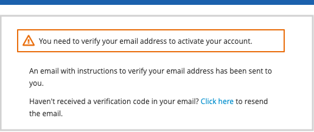
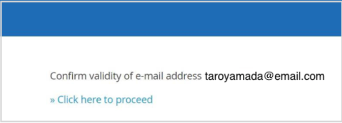

# **開発者向け環境準備手順書**

## ***＜はじめに＞***　
この記事は、初めて Vantiq Public Cloud 環境（__dev.vantiq.co.jp__）を利用する開発者向けに環境準備の手順を説明します。作業環境が利用できるためには、以下の 3つのステップが必要です。
1.  ユーザーアカウントを登録する
2.  招待メールにより root namespace へのアクセス権を付与される
3.  開発用 namespace を作成する  

**推奨ブラウザーは Google Chrome です。**

**資料を参照しながら開発作業を行いますのでPCと別途、ディスプレイを用意することを推奨します。**

Vantiq 1-day Workshop では VANTIQ operations (operations@vantiq.com) からのメールを受信できるメールアドレスをご利用ください。　

## ***Step 1 (招待メールの確認)***

1. VANTIQ からの招待メール (件名: Vantiq -- Namespace Authorization) を開きます。  
    ＊ VANTIQ からのメールが迷惑メールに振り分けられる可能性がありますので届いていない場合はご確認ください。

2. メール中段にある\[here\]をクリック しブラウザーで開きます。  
    ＊ **招待メールの有効期限は *48* 時間となっています。**　　  
       

## ***Step 2 (アカウント作成)***

1. 表示された画面中段にある \[Register\] をクリックします。  
    

2. 表示されたユーザー情報の入力欄に、ユーザー情報を入力してアカウントを登録します。  
      

    ＜注意＞ **Username にもメールアドレスを入力してください。** (Lab 運営上の都合)  

   |項目|内容|
   |:---|:---|
   |First name| 名(英語表記) 例 Taro|
   |Last name| 姓(英語表記) 例 Yamada |
   |Email| 認証をしたメールアドレス  |
   |Username| **認証をしたメールアドレス**  |
   |Password| 任意のパスワード (8文字以上)  |
   |Confirm password| パスワードの再入力|

3. 入力が終了したら \[click here\] をクリック、登録したメールアドレスに確認メールが届きます。

4. 次のような画面が表示されれば、VANTIQ から E メールが送られていますので、次の手順に進んでください。  
    

## ***Step 3 (メールアドレスの認証メールの確認をしてアカウント登録)***

1. メールアドレスの認証メール (件名: Verify email) を開きます。  
    ＊ **メールアドレス認証メールの有効期限は *15* 分です。**  
    

2. `Link to e-mail address verification` のリンクをブラウザーで開きます。

3. 次の画面が表示された場合は、\[Click here to proceed\] をクリックし、メールアドレス認証を完了します。  
    

4. 「Edit Account」 画面が表示された場合は、アカウント情報登録の際に入力した情報が反映されているか確認し、\[save\] ボタンをクリックしてください。緑のポップアップ \[Your account has been updated\] が表示されます。

5. 以上でアカウント登録は終了となります。

## ***Step 4 (作業用 Namespace の作成)***

1. VANTIQ 開発環境にログインします。＊ 表示される次のような「新規 Project」ウィンドウはキャンセルします。  
    

2. 画面上部の「管理」から「Namespace」をクリックします。  
    

3. 「+新規」より Namespace の新規作成画面を開きます。  
    

4. Namespace 名を入力し、右上の [変更の保存] ボタンをクリックします。Namespace 名は、システム全体でユニークである必要があります。  
    

5. 操作する Namespace を作成した Namespace に変更します。Namespace を変更するには、現在の Namespace 名をクリックして「Namespace の変更」ウィンドウを開き、変更したい Namespace を選択します。  
      

    ＊ 招待状の受信後に最初ログインした **○○○\_root/○○○\_home** などの Namespace は **Home Namespace** と呼ばれる組織用の Namespace のため、作成していただいた自分専用の Namespace に切り替えを行います。

6. 開発環境を開くと次のような画面になります。  
    

7. 「ポリシーと規約」の 2つの項目にチェックを入れて [OK] をクリックします。

8. 以上でワークショップのための開発環境が整いました。 ＊「新規 Project」ウィンドウはキャンセルしていただいて構いません。ワークショップでの実際の開発時には使用します。  
    
