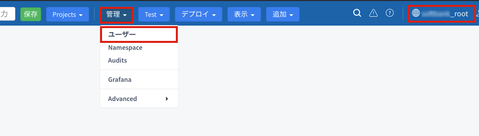
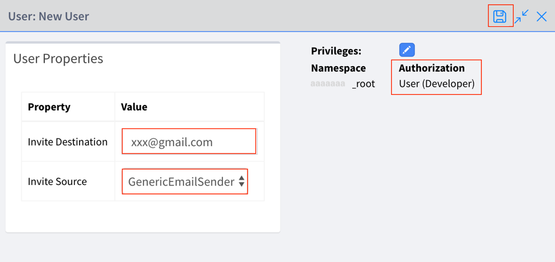

# **Organization管理者向け開発者アカウント発行手順**
この記事は、Vantiq Public Cloud環境（__dev.vantiq.co.jp__）において、Organization管理者が新たな開発者を招待する手順を説明します。
## ***Step 1 (Organization の決定)***

アカウントを発行したい Organization を決定し、現在の Namespace 名から、その Organization のルート Namespace に切り替えます。

＊ VANTIQ では Organization 毎に Resources が割り当てられますので、同じ Organization のユーザー間で Resources が共有されます。

## ***Step 2 (アカウント発行)***

1. [管理] > [Users] をクリックします。

2. 「ユーザー 一覧」ウィンドウの「+ 新規」をクリックして「新規ユーザー」のウィンドウを開きます。

3. Authorization を **「User(Developer)」** にします。

   **＊ User(Developer) の他に「Organization Admin」、「User」、「Custom」を選択することができますが、必ず「User(Developer)」に設定してください。**

4. [Invite Destination] に招待するユーザーのメールアドレスを入力します。

5. [Invite Source] が「***GenericEmailSender***」になっていることを確認します。

6. 最後に右上の [変更の保存] ボタンをクリックして、招待メールを送信します。

手順は以上です。
