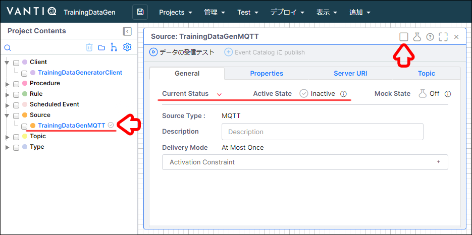
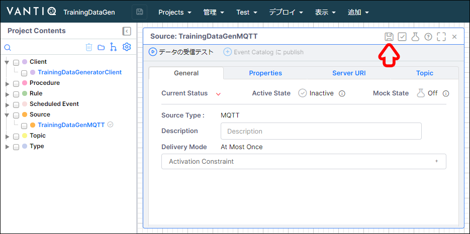
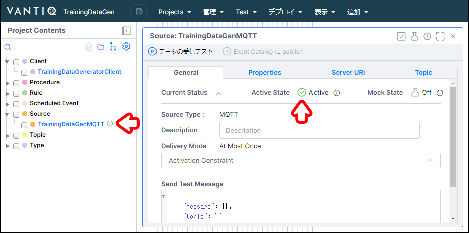
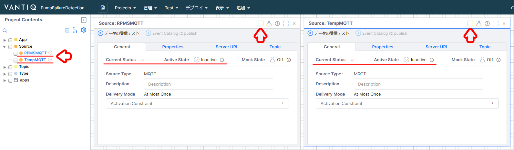
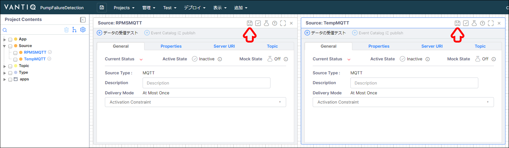
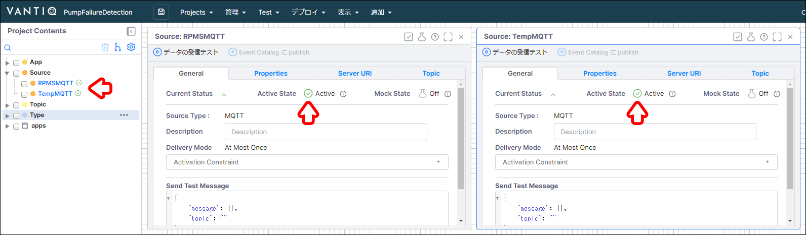

# Source のアクティブ化

非アクティブになってしまった Source のアクティブ化する方法を解説します。

## Source が非アクティブになる理由

VANTIQ の Source はサーバーとの接続が切断されると再接続を一定回数試みます。  
しかし、再接続を試みても接続が成功しない場合は、 Source を非アクティブにして余計な負荷を減らします。  
そのため、サーバーの状況やネットワークの状態に応じて Source が非アクティブになっていることがあるのです。

HiveMQ に限らず、パブリックなサーバーやブローカーは接続が切れてしまうことが多いため、利用する際は注意してください。  

## Source のアクティブ状態の確認方法

Source のアクティブ状態は下記の箇所で確認できます。

- 画面左側の Project Contents エリアの Source 名の右側に表示されているアイコン
  - アクティブの場合：**アイコンの色が緑色**
  - 非アクティブの場合：**アイコンの色が灰色**

- Source 画面の General タブ の Current Status
  - アクティブの場合：**Active State** が **Active** で **アイコンの色が緑色**
  - 非アクティブの場合：**Active State** が **Inactive** で **アイコンの色が灰色**

- Source 画面の画面右上の右から5個目の四角いボタン
  - アクティブの場合：**チェックが入っている**
  - 非アクティブの場合：**チェックが入っていない**

## データジェネレータの Source のアクティブ化

1. データジェネレーター用のネームスペースを開き、 `TrainingDataGen` プロジェクトを開きます。

1. 画面左側の **Project Contents** から **`TrainingDataGenMQTT` Source** をクリックして表示します。

1. Source 画面の画面右上の右から5個目の **四角いボタン** をクリックしてチェックを入れます。

   

1. Source 画面の画面右上の右から6個目の **フロッピーディスク** のボタンを押して保存します。

   

1. Source がアクティブになっていることを確認します。

   

## ポンプ故障検知システムの Source のアクティブ化

1. ポンプ故障検知システム用のネームスペースを開き、 `PumpFailureDetection` プロジェクトを開きます。

1. 画面左側の **Project Contents** から **`RPMSMQTT` Source** と **`TempMQTT` Source** をそれぞれクリックして表示します。

1. Source 画面の画面右上の右から5個目の **四角いボタン** をクリックして、それぞれチェックを入れます。

   

1. Source 画面の画面右上の右から6個目の **フロッピーディスク** のボタンを押して、それぞれ保存します。

   

1. それぞれの Source がアクティブになっていることを確認します。

   
