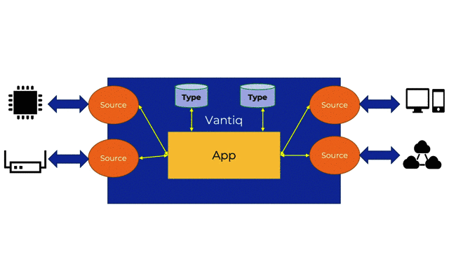
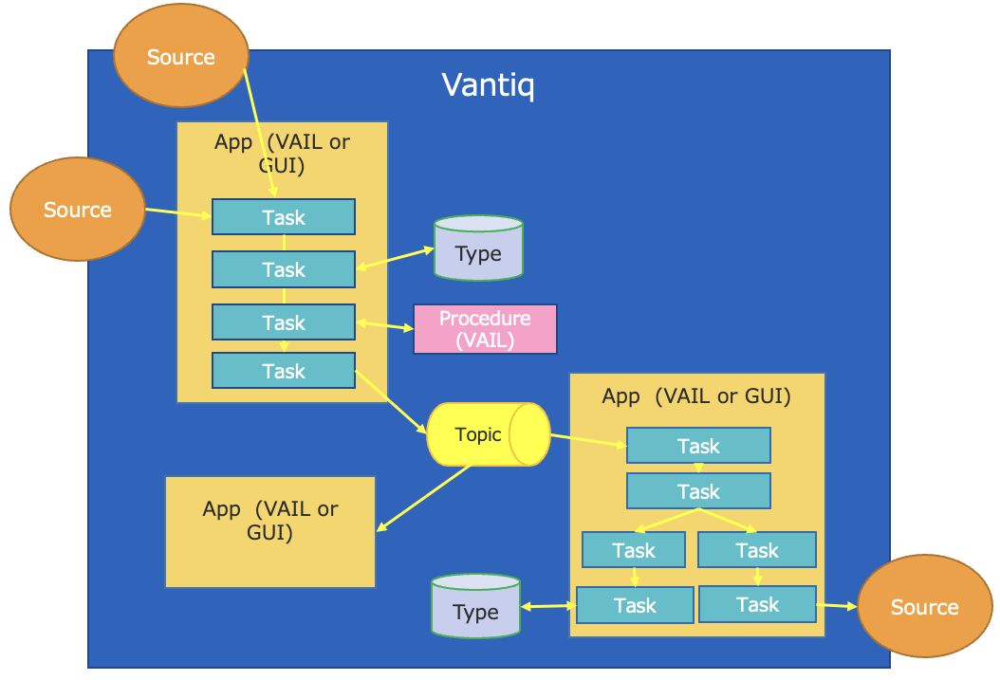

# Vantiqの基本要素

## Vantiqアプリケーションの基本リソースと構成

まず、Vantiq アプリケーションを1つのブラックボックスとしてとらえるところから始めます。
- __Source__ は、Vantiqとの外部との入出力を行います。 Source は互いに独立し、さまざまなプロトコル、タイミングを通じてデータを取り込み、データを外部に送信するインタフェースとなります。
- __App__ は Source からさまざまなタイミングで入力されるデータ同士を非同期につなぎ、結合、処理を行い、出力を行います。
- __Type__ は内部でデータを一時保持します。

- アプリケーションは __VAIL__ というVanitqの独自ドメイン言語で実装します。
- __App Builder__ というGUIのツールを使うことで、極力VAILを意識することなく、 __ローコード__ にアプリケーションを実装することができます。
- __Procedure__ はVAILで実装された、再利用可能なユーザー定義関数です。
- __Topic__ はアプリケーション (__App__) 間でイベントを受け渡しするイベントバスです。（外部からHTTPS RESTで入力を受けることもできます。）
- __プロジェクト__ は、作業を行う対象のリソースの集合です。

## 基本リソースのまとめ

|Reource|説明|
|:-----:|:---|
|__Source__| Vantiq外部データの入出力を行う。　送受信: MQTT, AMQP, Kafka 送信のみ: HTTP(S), E-mail, SMS|
|__Type__|データを保存する。VantiqでDBに該当するリソース。|
|__App__|SourceやTypeなどの入出力をつなぐアプリケーションを実装する。|
|__Procedure__|再利用可能なコード、関数。|
|__Topic__|Vantiqアプリ内でイベントの受け渡しをするイベントバス。REST APIのエンドポイントとしても機能する。|
