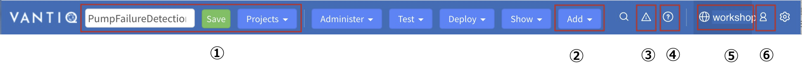
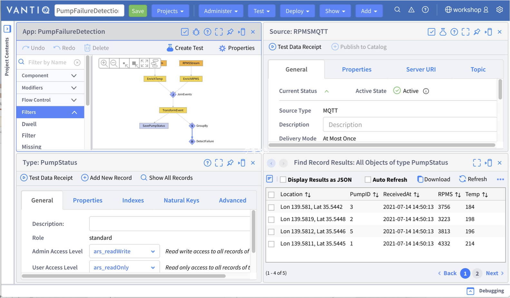
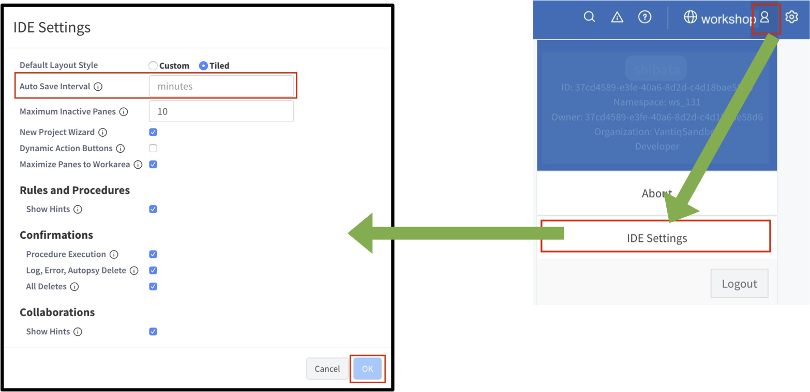
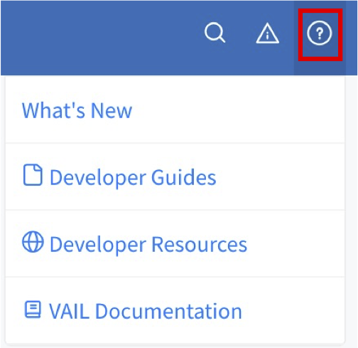

# VANTIQ で開発する上での基本事項

## ナビゲーション バーについて

  
① プロジェクト関連プロジェクトの作成・保存・切り替えなどを行う  
② リソースの追加  
③ 発生したエラーの一覧  
④ リファレンスなどの開発に関する情報  
⑤ ネームスペース名。ネームスペースの切り替えはここから行う  
⑥ 自分のアカウント情報。自分のアカウントに関する情報の確認・編集や IDE 設定を行う  

## 開発画面の 2種類のレイアウトについて

* VANTIQ の開発画面には、「タイル」と「カスタム」の 2種類のレイアウトがあります。
* 画面、右上の _歯車_ アイコンをクリックし、「レイアウト\.\.\.」から選択することができます。

## タイルの例（2×2）

## カスタムの例

## ネームスペースとプロジェクトの関係について

各リソースはプロジェクトではなくネームスペースに保存されるため、ネームスペース内の各プロジェクトでネームスペース内の全てのリソースを使うことができます。

## プロジェクトの保存と各リソースの保存について

* プロジェクトの保存
  * プロジェクトのレイアウトの状態やそのプロジェクトでどのリソースを扱うのかを保存します。
  * 画面左上の緑の「 _保存_ 」をクリックして保存します。  
「PumpFailureDetection」というプロジェクト名で保存する。

* 各リソースの保存
  * Type や Source などの各リソースを作成するとネームスペースに保存されます。
  * 各リソース編集ダイアログの _保存_ ボタンをクリックして保存します。  

_＊ 例えば Type を新規作成してプロジェクトの保存をせずにブラウザをリロードしてしまうと、_  
_プロジェクトの保存をしていないために Type がプロジェクトに追加されていない状態になります。_  
_しかし、作成自体はされており、ネームスペースには保存されています。_

## プロジェクトの自動保存について

自動保存の設定をしておくことで、不意な状況で変更内容が失われることを防ぎます。  
画面右上の人型アイコンから IDE 設定ウィンドウを開いて設定します。

## リソースの表示方法について

画面左の「Project Contents」にプロジェクトに紐付くリソースが一覧で表示されます。  
表示したいリソース名をクリックするとウィンドウが開きます。

## ショートカットキー

AppBuilder において、ショートカットキーが使用できます。
* Ctrl\-Z or Cmd\-Z – Undo changes
* Shift\-Ctrl\-Z or Shift\-Cmd\-Z – Redo Changes
* Ctrl\-S or Cmd\-S – Save changes

## リファレンスについて

* ナビゲーション バーの「_?_」アイコンからリファレンスを開くことができます。

  
|メニュー項目名|機能|
|:------|:---:|
|新機能|最新バージョンの新着情報|
|開発者ガイド|リファレンス|
|開発者リソース|CLI や SDK などの開発リソース|
|VAIL ドキュメント|VAIL のリファレンス|

## 関連リソース

- Vantiq Academy (要ログイン)
  - [2.1: VANTIQ IDE](https://community.vantiq.com/courses/vantiq%e3%82%a2%e3%83%97%e3%83%aa%e3%82%b1%e3%83%bc%e3%82%b7%e3%83%a7%e3%83%b3%e9%96%8b%e7%99%ba%e3%82%b3%e3%83%bc%e3%82%b9%ef%bc%86%e3%83%ac%e3%83%99%e3%83%ab1%e8%aa%8d%e5%ae%9a%e8%a9%a6%e9%a8%93v1-2/lessons/2-vantiq%e3%83%97%e3%83%a9%e3%83%83%e3%83%88%e3%83%95%e3%82%a9%e3%83%bc%e3%83%a0%e3%81%ae%e7%b4%b9%e4%bb%8b/topic/2-1-the-vantiq-ide%e3%81%ae%e7%b4%b9%e4%bb%8b/)
  - [2.3: リソースの整理](https://community.vantiq.com/courses/vantiq%e3%82%a2%e3%83%97%e3%83%aa%e3%82%b1%e3%83%bc%e3%82%b7%e3%83%a7%e3%83%b3%e9%96%8b%e7%99%ba%e3%82%b3%e3%83%bc%e3%82%b9%ef%bc%86%e3%83%ac%e3%83%99%e3%83%ab1%e8%aa%8d%e5%ae%9a%e8%a9%a6%e9%a8%93v1-2/lessons/2-vantiq%e3%83%97%e3%83%a9%e3%83%83%e3%83%88%e3%83%95%e3%82%a9%e3%83%bc%e3%83%a0%e3%81%ae%e7%b4%b9%e4%bb%8b/topic/2-3-%e3%83%aa%e3%82%bd%e3%83%bc%e3%82%b9%e3%81%ae%e6%95%b4%e7%90%86/)
