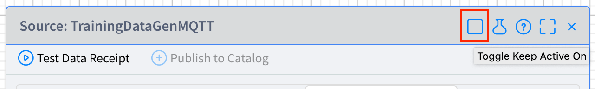
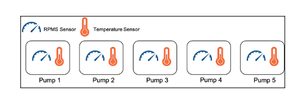
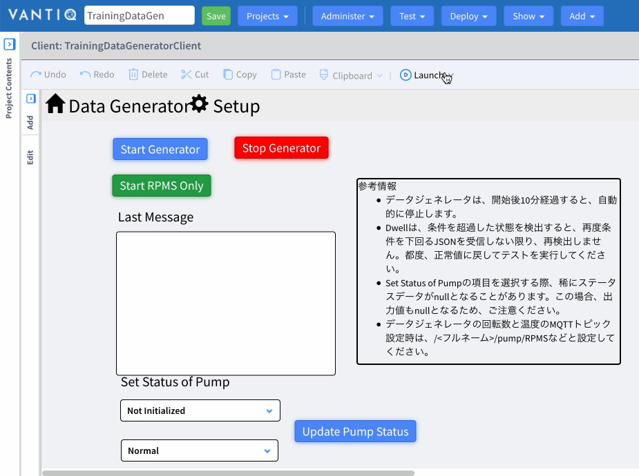
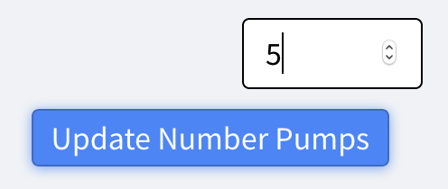

# **Lab 01 – 準備（データジェネレーターの設定）**

## ***Step 1***

[VANTIQ の開発環境](https://dev.vantiq.co.jp) にログインします。

## ***Step 2***

1. 「新規プロジェクト」ウィンドウが表示されるので、「新規 Vantiq Namespace」を選択し、Name に **データジェネレーター** 用の Namespace 名を入力して、「_続行_」をクリックします。  

#### 参考
  - [2.3: リソースの整理](https://community.vantiq.com/courses/vantiq%e3%82%a2%e3%83%97%e3%83%aa%e3%82%b1%e3%83%bc%e3%82%b7%e3%83%a7%e3%83%b3%e9%96%8b%e7%99%ba%e3%82%b3%e3%83%bc%e3%82%b9%ef%bc%86%e3%83%ac%e3%83%99%e3%83%ab1%e8%aa%8d%e5%ae%9a%e8%a9%a6%e9%a8%93v1-2/lessons/2-vantiq%e3%83%97%e3%83%a9%e3%83%83%e3%83%88%e3%83%95%e3%82%a9%e3%83%bc%e3%83%a0%e3%81%ae%e7%b4%b9%e4%bb%8b/topic/2-3-%e3%83%aa%e3%82%bd%e3%83%bc%e3%82%b9%e3%81%ae%e6%95%b4%e7%90%86/)

## ***Step 3（データジェネレーターのインポート）***

＊ 複数台のポンプにそれぞれ取り付けられた温度センサーと回転数センサーからのデータを擬似的に発生させるデータジェネレーターを準備します。

1. 「プロジェクト」 > 「インポート...」 を開き、「プロジェクトまたはデータのインポート」ウィンドウを開きます。  
     事前に配布したデータジェネレータの zip ファイル 「[`TrainingDataGen.zip`](https://github.com/fujitake/vantiq-related/raw/main/vantiq-apps-development/1-day-workshop/conf/TrainingDataGen.zip)」をドラッグ&ドロップします。  

    

2. 「_インポート_」をクリックします。

3.  インポートすると確認ダイアログが表示されるので「_リロード_」をクリックします。

## ***Step 4 (MQTT Broker の設定)*** 

＊ サンプルデータを生成するためのサーバーの設定をご自身で準備された MQTT Broker に設定します。  

1. 「追加」 > 「Source...」 を開き、「Sources」ウィンドウを開きます。

2.  `TrainingDataGenMQTT` をクリックし、「Source」ウィンドウを開きます。

3. 「Server URI」タブをクリックします。

4. 「編集」(小さい鉛筆) アイコンをクリックし、「Server URI の編集」ダイアログを開きます。  

    

5. 「Server URI:」には、仮の値が設定されているので、ご自身で準備された MQTT Broker サーバーの URI に設定し直してください。「OK」をクリックします。  

    

6. タイトルバーの右上にある _アクティブ状態オンに_ アイコンをクリックして、Source をアクティブにします。

    

7. 隣にある _変更の保存_ アイコンをクリックして、保存します。

## ***Step 5（データジェネレーターの設定）***　

＊ 本ワークショップでは複数台存在するポンプそれぞれに温度センサーと回転数センサーが設置されており、データが送信されるという状況を前提にアプリケーションの作成を進めます。  
データジェネレーターを使用して、その状況を擬似的に再現します。

1. 「TrainingDataGeneratorClient」の「起動」 > 「_現在保存されているClientをClient Launcher(RTC)で実行_」をクリックし、データジェネレーターをブラウザで開きます。  
 ＊ 今回のように VANTIQ で開発されたクライアントは「**VANTIQ Client Launcher**」というアプリケーションで起動できます。

      

2. データジェネレーターを開いたら、上部にある _Setup_ をクリックします。  

3. テキストボックスに「_5_」と入力します。 ＊ 半角で入力してください。

    

4. _Update Number Pumps_ ボタンをクリックします。

5. 表に PumpNo 1\~5 が表示されていることを確認します。

6. MQTT の Topic 名を以下のように入力します。  

    RPMSSensor Topic： "_/***your name***/pump/RPMS_"

    TempSensor Topic： "_/***your name***/pump/Temp_"

    ＊ **_your name_** の箇所には会社名+お名前など**他人と重複しない**任意の値を入力してください。また、topic名に**ダブルクォーテーションは含みません**。topic名の**前後に半角スペースが入らないよう**にしてください。  

7. _Update Topics_ ボタンをクリックします。

  

8. 上部にある _Date Generator_ をクリックし、画面を切り替えます。   

9. _Start Generator_ ボタンをクリックし、約 6秒後に 「Last Message」 ウインドウにデータが表示されることを確認します。

## ***Step 6（開発画面に戻る）***

1. 予め開いていたタブ（https://dev.vantiq.co.jp) に戻ります。

2. 「管理」 > 「Namespace」を開き、_+ 新規_ ボタンをクリックして、「新規 Namespace」ウィンドウを開きます。  

3. Namespace に **ポンプ故障検知システム** 用の Namespace 名を入力して、「_変更の保存_」をクリックします。  

  

4. ナビゲーション バーで、現在の Namespace 名をクリックし、「Namespace の変更」ダイアログを表示して、上記の手順で作成した Namespace に切り替えます。  

1. 「新規プロジェクト」ウィンドウが表示されるので「空のプロジェクト」を選択し、「_続行_」をクリックします。  
　　 ＊ 既にプロジェクトが存在する場合は表示されません。  

    

    ＊ ウィンドウが表示されない場合は、ナビゲーション バーにある以下の入力欄に「**PumpFailureDetection**」と入力し、隣の _保存_ ボタンをクリックしてください。また次の手順をスキップしてください。  

    

2. 「プロジェクト名」に 「**PumpFailureDetection**」と入力し、「_終了_」をクリックします。  

    

3. プロジェクト名に「`PumpFailureDetection`」と表示されていることを確認します。  

    

＊ ここまでの手順で、2つの Namespace にそれぞれ、`PumpFailureDetection` というプロジェクトと `TrainingDataGen` というプロジェクトが存在しているはずです。`PumpFailureDetection` プロジェクトを表示してください。

 ＊ 以上で、ワークショップの準備は終了です。

## ***▷確認ポイント***

各 Lab の最後には「**確認ポイント**」のステップが設けられています。ミスしやすい、または理解を深めるためのポイントが記載されておりますので、必ず目を通して理解するようにしてください。

-   データジェネレーターに設定している Topic が正しいか
    -   温度の Topic として回転数の Topic を設定してしまうなどの間違いがあると、この後開発していくシステムが正しく動作しません。改めて正しく設定されていることを確認しましょう。  
        ✔︎   **RPMS** SensorTopic： /***your name***/pump/**RPMS**  
        ✔︎   **Temp** SensorTopic： /***your name***/pump/**Temp**

-   開いているプロジェクトが正しいか
    -   皆様の環境には、2つの開発用 Namespace があるはずです。ある Namespace には、データジェネレーターで使用しているリソースを確認できる `TrainingDataGen` プロジェクトが、もうひとつの Namespace には、**ポンプ故障検知システム** を構築するために使用するリソースを追加していく `PumpFailureDetection` プロジェクト（今はまだ空の状態）が存在しています。次の Lab から `PumpFailureDetection` プロジェクトで作業を行います。

## Vantiq 1-day Workshop 次のセッション  
|Session #|Session      | Type  |Contents Description       |Duration (m)|Material               |
|:-----:|--------------|:------:|---------------------------|:-:|--------------------------------|
|3| Types (タイプ)|Lab|データベースのテーブルのような機能|20|[Lab02_Types](3-Lab02_Types.md)|
