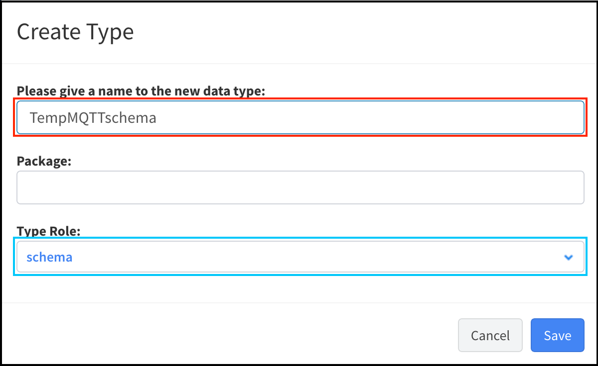
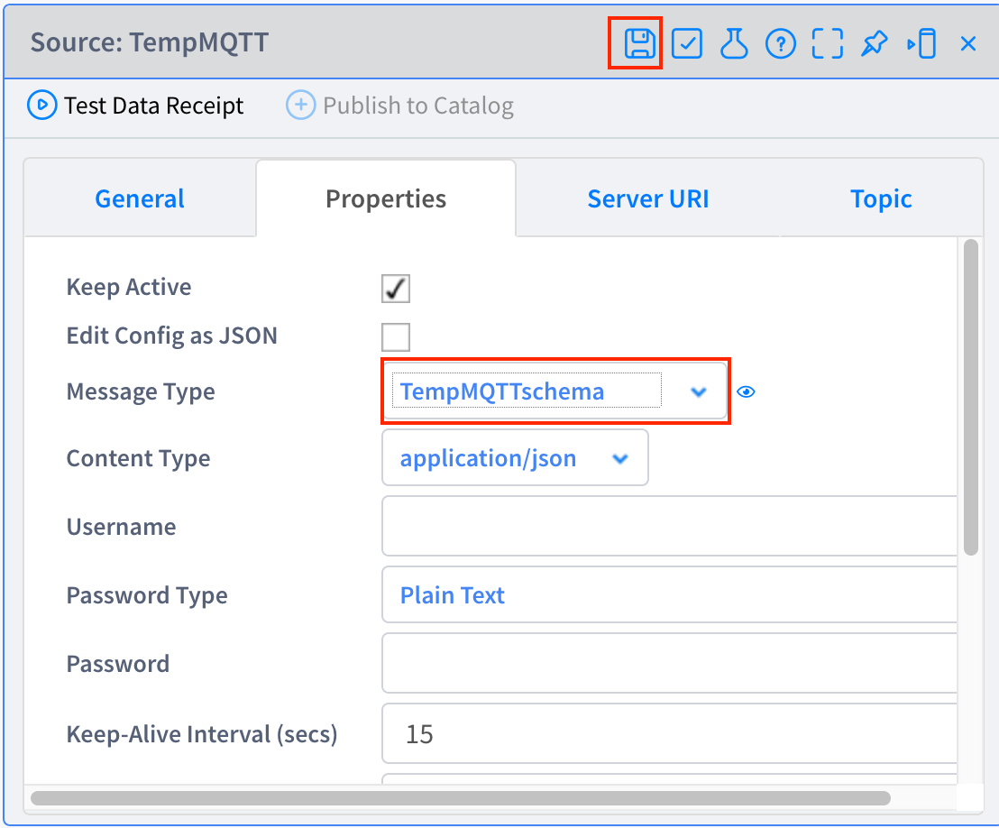
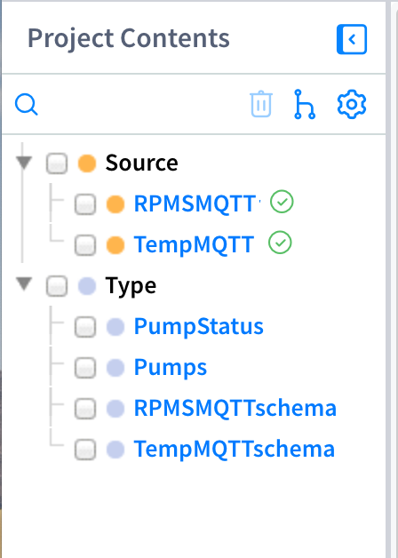

# **Lab 03 – Sources（ソース）**

## **概要**

この Lab では、Source を作成します。**Source** は、外部システムとの接続ポイントであり、データの送受信の入り口となる仕組みで、MQTT、REST、KAFKA、EMAIL など様々な種類が選択でき、拡張も可能です。

この Lab では MQTT Broker からデータをサブスクライブするための Source を作成します。また、その Source に関連して、サブスクライブしたデータの構造と型を定義するための Type も併せて作成します。

####  参考
- Vantiq Academy (要ログイン)
  - [3.3: インバウンド SOURCE](https://community.vantiq.com/courses/vantiq%e3%82%a2%e3%83%97%e3%83%aa%e3%82%b1%e3%83%bc%e3%82%b7%e3%83%a7%e3%83%b3%e9%96%8b%e7%99%ba%e3%82%b3%e3%83%bc%e3%82%b9%ef%bc%86%e3%83%ac%e3%83%99%e3%83%ab1%e8%aa%8d%e5%ae%9a%e8%a9%a6%e9%a8%93v1-2/lessons/3-%e3%83%87%e3%83%bc%e3%82%bf%e3%81%ae%e6%a4%9c%e7%9f%a5%e3%81%a8%e9%96%a2%e9%80%a3%e3%81%a5%e3%81%91/topic/3-3%e3%82%a4%e3%83%b3%e3%83%90%e3%82%a6%e3%83%b3%e3%83%89%e3%81%ae%e3%82%bd%e3%83%bc%e3%82%b9/)
  - [3.2: SCHEMA TYPE](https://community.vantiq.com/courses/vantiq%e3%82%a2%e3%83%97%e3%83%aa%e3%82%b1%e3%83%bc%e3%82%b7%e3%83%a7%e3%83%b3%e9%96%8b%e7%99%ba%e3%82%b3%e3%83%bc%e3%82%b9%ef%bc%86%e3%83%ac%e3%83%99%e3%83%ab1%e8%aa%8d%e5%ae%9a%e8%a9%a6%e9%a8%93v1-2/lessons/3-%e3%83%87%e3%83%bc%e3%82%bf%e3%81%ae%e6%a4%9c%e7%9f%a5%e3%81%a8%e9%96%a2%e9%80%a3%e3%81%a5%e3%81%91/topic/3-2-%e3%82%b9%e3%82%ad%e3%83%bc%e3%83%9e%e3%81%ae%e7%a8%ae%e9%a1%9e/)

## **Source**

-   **TempMQTT** – 温度センサーのデータを MQTT Broker からサブスクライブします。

-   **RPMSMQTT** – 回転数センサーのデータを MQTT Broker からサブスクライブします。

### **Type**

-   **TempMQTTSchema** – `TempMQTT` でサブスクライブするデータの構造と型を定義します。

-   **RPMSMQTTSchema** – `RPMSMQTT` でサブスクライブするデータの構造と型を定義します。

## ***Step 1（Source の作成）***

1. 「追加」 > 「Source...」 > 「_+新規Source_」から Source の新規作成画面を開きます。

2. Source 名に「TempMQTT」と入力します。

3. Source の種類 を「MQTT」に設定します。

4. 「Server URI」タブを開き「_+Server URI の追加_」をクリックし、ご自身で事前に準備された MQTT Broker server の URI を設定します。

5. 「Topic」タブを開き「_+Topic の追加_」をクリックし、以下の Topic を設定します。

|   |
|:----------------------|
|**/your name/pump/Temp**|
|**＊ ***your name*** の箇所には Lab 01 でデータジェネレーター設定の「TempSensorTopic」に入力した値を入力します。**|  

＊ DataGenerator は次のようにして起動します。
      

6. _変更の保存_ ボタンをクリックし、Source を保存します。  

    

7. 上記の `TempMQTT` Source と同様の手順で以下の画像を参考に `RPMSMQTT` Source を作成してください。  
   **＊ 入力する Topic に注意してください。**

    

以上で、Source の作成は終了です。

## ***Step 2（Source の受信テスト）***

1. 以下のようにして、**Data Generator** を開き、_Start Generator_ ボタンをクリックして温度と回転数データの生成を開始します。
      

2. VANTIQ 開発画面に戻って TempMQTT を開き、「_データの受信テスト_」をクリックし、データを受信できていることを確認します。

    

3. `RPMSMQTT` でも同様の手順でデータが受信できていることを確認してください。

以上で、Source の受信テストは終了です。

## ***Step 3（Source のデータ構造定義）***

Source に「**Schema**」の Type を設定し、受信イベントの構造と型を定義することにより、`Lab-04 AppBuilder` の Step で行う作業でプロパティの入力補助が有効になります。

1. `TempMQTT` の「データの受信テスト」で開いたウィンドウの「_Type Data の作成_」をクリックします。

    

2. 以下の画像を参考に Type 名を「_TempMQTTSchema_」に修正し「_保存_」をクリックします。これで `TempMQTT` の「Schema」Type が作成されます。

    

3. 画面左のリソースペインの「Type」の箇所にある、作成した「`TempMQTTSchema`」を開き、自動で認識された型のうち、「Time」プロパティの型を「_DateTime_」に変更します。

   a. 「Properties」タブを開きます。

   b. 「Time」プロパティの _編集_ ボタンをクリックします。

    

&emsp;  c. 型を「_DateTime_」に修正して保存します。

    

4. 画面左のリソースペインの「Source」の箇所にある「`TempMQTT`」を開き、「Properties」タブの「Message Type」に「_TempMQTTSchema_」を設定し、Source を保存します。

    

5. 1.\~4. の Step を繰り返し、「`RPMSMQTT`」Source から「`RPMSMQTTSchema`」Typeを作成し、「RPMSMQTT」Source の「Message Type」に設定してください。

以上で、Schema の設定は終了です。

ここまでの手順でプロジェクトには下の画像のような要素が存在しているはずですので、ご確認ください。  

   

## ***▷確認ポイント***

-   `TempMQTT` と `RPMSMQTT` に設定されている Topic（MQTT Broker の Topic）がそれぞれ温度用、回転数用の Topic になっていること    
    ✔︎   ミスがあると今後の手順でエラーが発生します。  

## Vantiq 1-day Workshop 次のセッション  
|Session #|Session      | Type  |Contents Description       |Duration (m)|Material               |
|:-----:|--------------|:------:|---------------------------|:-:|--------------------------------|
|5| App Builder の紹介| Lecture|  |15| [02_AppBuilder](5-02_AppBuilder.md)|  
