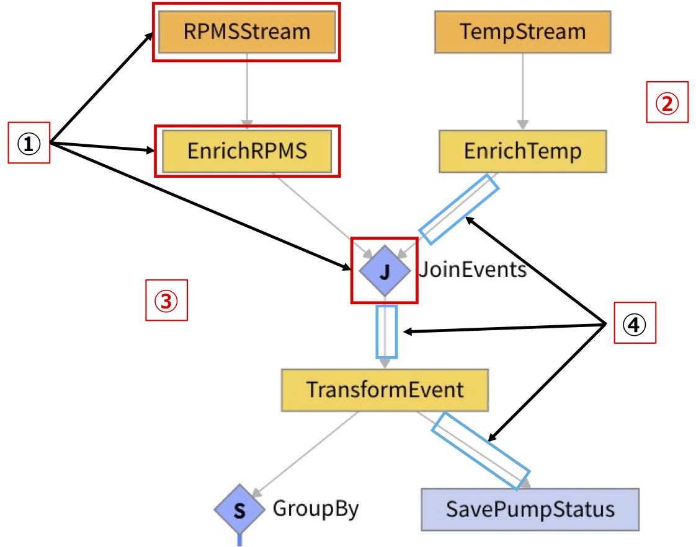
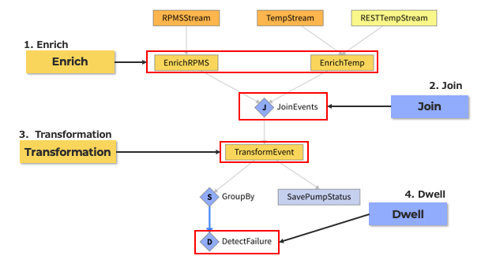
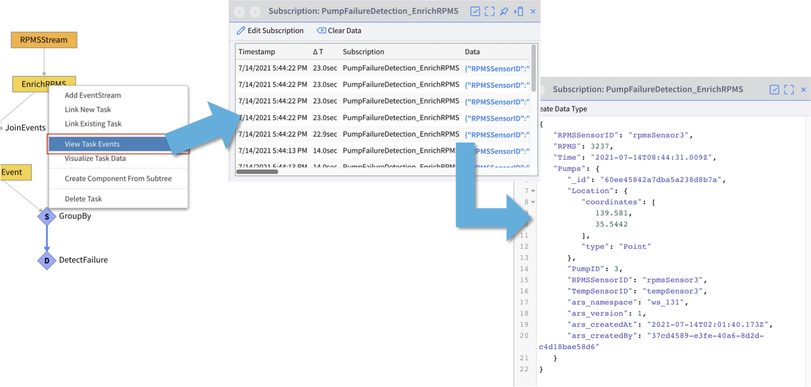
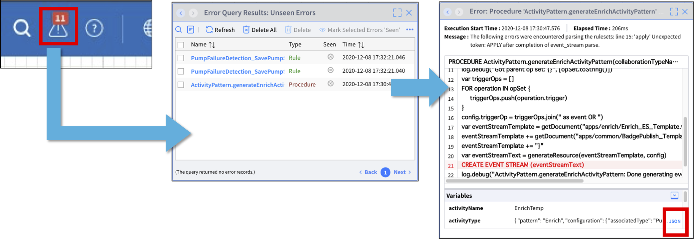
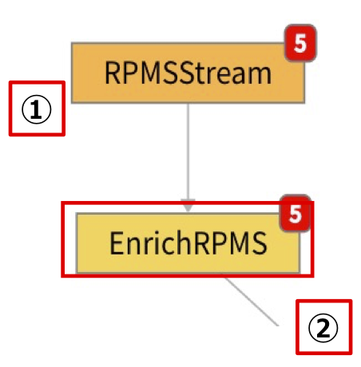
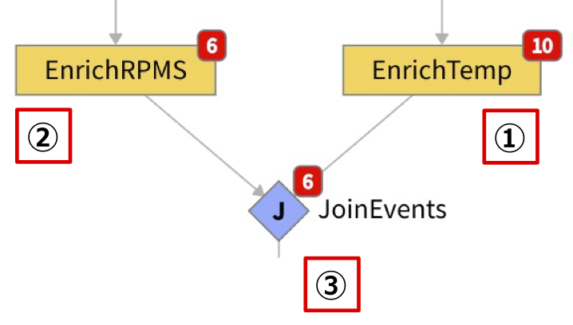
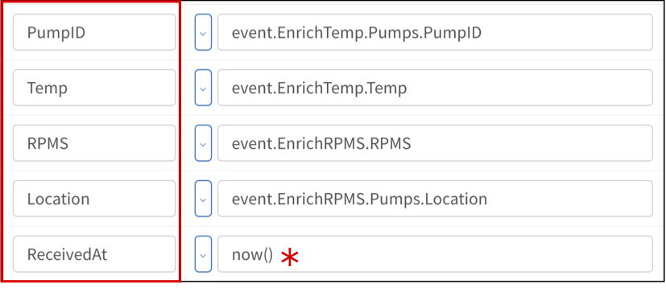
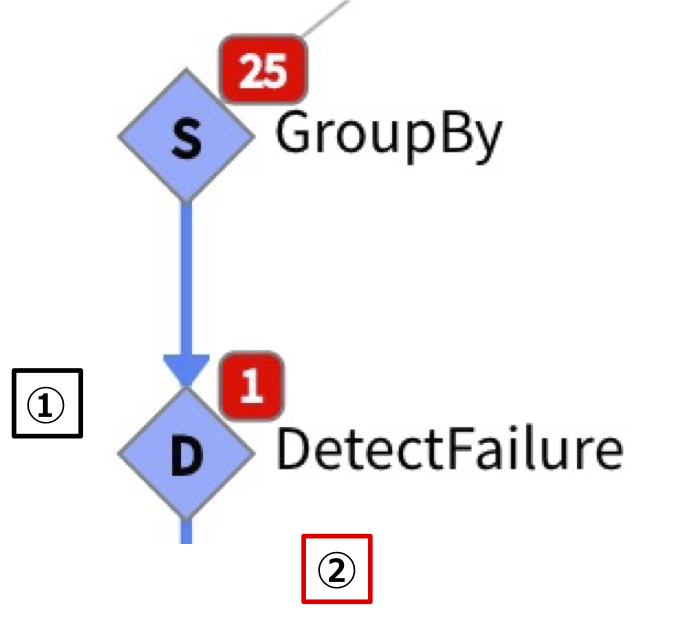
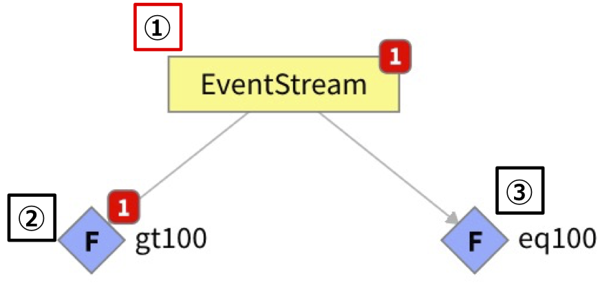

# App Builderの紹介

## App Builder

* GUI でアプリケーション（リアルタイム複合イベント処理）を作成できるツール
* あらかじめ用意された処理のパターンを組み合わせることで開発を進める
  * 用意されたパターンで対応できない場合はプログラミングも可能なため柔軟に実装可能

## App Builder概要

  

① タスクと呼ばれるボックスの一つ一つが処理のかたまり  
_②_ 全ての処理は、保存する処理を入れない限り DB を経由せず、メモリ上で行われます  
_③_ タスクの出力は、次のタスクの入力になります  
④ ボックス間をつなぐ矢印がイベントのストリームを表す   


## 開発するアプリケーションと主要な Activity Pattern  


1. ***Enrich***
    * イベントに対して Type に保存されたデータを追加する処理
      * **ストリームデータに永続化されたデータを追加する**
2. ***Join***
    * イベントとイベントを結合する処理
      * **タイムスタンプを使わない結合ができる**
3. ***Transformation***
    * イベントを加工する処理
      * **プロパティの削除・追加、値の変更などを行う**
4. ***Dwell***
    * 条件を一定期間満たすかどうかを判定する処理
      * **今回は 20秒間異常値になるかの判定で使う**


# デバッグ方法

## Application のデバッグ①&nbsp;&nbsp; 処理データの確認
* 「タスクイベントの表示」を使用して処理したデータを確認する


* タスクをクリックして「タスクイベントの表示」を使用する


## Application のデバッグ②&nbsp;&nbsp; エラーの確認

* エラーの詳細を確認して原因を調査する



_＊ デバッグ > エラー > クエリの実行 からでもエラー一覧を表示できます_

# Activity Pattern 紹介

## Contents

* Enrich, Cached Enrich
* Join  
* Transformation  
* SplitByGroup  
* Dwell  
* SaveToType  
* ComputeStatistics
* Unwind  
* Smooth  
* Procedure  
* VAIL
* Filter  
* AccumulateState

## Enrich, Cached Enrich

* イベントに Type に保存されたデータを追加する
* `Cached Enrich` は Type の値キャッシュしておくことによりパフォーマンスを向上させた `Enrich` です。その代わり Type の値を変更しても、次に Type の値を取得するタイミングまではイベントに追加される値として反映されません
  * `Cached Enrich` を使用する場合は事前に `SplitByGroup` を使用してストリームを分割しておく必要があります。

## Enrich, Cashed Enrich 例



① 入力となる前のタスクの出力  
```
{
👉 "RPMSSensorID": "rpmsSensor3",
   "RPMS": 3222,
   "Time": "2020-03-19T04:42:24.021Z"
}
```

*Type とイベントが持つ共通のプロパティ (`RPMSSensorID`) を Key として設定する*  

② `Enrich` の出力  
```
{
   "RPMSSensorID": "rpmsSensor3",          #  ① "RPMSStream" タスクの出力結果
   "RPMS": 3222,                           #  ① "RPMSStream" タスクの出力結果
   "Time": "2020-03-19T04:42:24.021Z",     #  ① "RPMSStream" タスクの出力結果
   "Pumps": {                              # これ以降はイベントに追加された Type が持つデータ
      "_id": "5e70949fc714e2125bbb8854",
      "Location": {
         "coordinates": [
            139.581,
            35.5442
         ],
         "type": "Point"
      },
      "PumpID": 3,
👉    "RPMSSensorID": "rpmsSensor3",
      "TempSensorID": "tempSensor3",
      "ars_namespace": "Test",
      "ars_version": 1,
      "ars_createdAt": "2020-03-17T09:13:03.371Z",
      "ars_createdBy": "446b7d1d-2d7a-45f0-b74c-ba60866ced11"
   }
}
```

## Join  

* 複数のストリームのイベント同士を結合する
* タイムスタンプが異なるイベント同士でも結合することができる
* 左側に位置するストリームのイベントが基準となる

## Join 例




① 入力となる前のタスクの出力①  
```
{
  "TempSensorID": "tempSensor2",
  "Temp": 184,
  "Time": "2020-03-19T05:18:22.020Z",
  "Pumps": {
     "_id": "5e70949fc714e2125bbb8853",
     "Location": {
        "coordinates": [
           139.5819,
           35.5448
        ],
        "type": "Point"
     },
👉       "PumpID": 2,
             - 略 -
```
② 入力となる前のタスクの出力②  
```
{
  "RPMSSensorID": "rpmsSensor2",
  "RPMS": 3971,
  "Time": "2020-03-19T05:18:28.022Z",
  "Pumps": {
     "_id": "5e70949fc714e2125bbb8853",
     "Location": {
        "coordinates": [
           139.5819,
           35.5448
        ],
        "type": "Point"
     },
👉       "PumpID": 2,
             - 略 -
```  

*結合する 2つのイベントが共通して持つプロパティ (`PumpID`) を Key とする*  

③ `Join` の出力
```
{
   "EnrichTemp": {
      "TempSensorID": "tempSensor2",
      "Temp": 184,
      "Time": "2020-03-19T05:18:22.020Z",
      "Pumps": {
         "_id": "5e70949fc714e2125bbb8853",
         "Location": {
            "coordinates": [
               139.5819,
               35.5448
            ],
            "type": "Point"
         },
👉       "PumpID": 2,
	               - 略 -
      }
   },
   "EnrichRPMS": {
      "RPMSSensorID": "rpmsSensor2",
      "RPMS": 3971,
      "Time": "2020-03-19T05:18:28.022Z",
      "Pumps": {
         "_id": "5e70949fc714e2125bbb8853",
         "Location": {
            "coordinates": [
               139.5819,
               35.5448
            ],
            "type": "Point"
         },
👉       "PumpID": 2,
	               - 略 -
      }
   }
}
```

## Transformation

* イベントの変換を行うことができる
* 項目の追加・削除、`Procedure` の呼び出しなどをして変換する

## Transformation 例


① 入力となる前のタスクの出力  
```
{
   "EnrichTemp": {
      "TempSensorID": "tempSensor2",
      "Temp": 184,
      "Time": "2020-03-19T05:18:22.020Z",
      "Pumps": {
         "_id": "5e70949fc714e2125bbb8853",
         "Location": {
            "coordinates": [
               139.5819,
               35.5448
            ],
            "type": "Point"
         },
         "PumpID": 2,
	               - 略 -
      }
   },
   "EnrichRPMS": {
      "RPMSSensorID": "rpmsSensor2",
      "RPMS": 3971,
      "Time": "2020-03-19T05:18:28.022Z",
      "Pumps": {
         "_id": "5e70949fc714e2125bbb8853",
         "Location": {
            "coordinates": [
               139.5819,
               35.5448
            ],
            "type": "Point"
         },
         "PumpID": 2,
              	 - 略 -
      }
   }
}
```
② 必要な項目のみに変換  
  &nbsp; _＊_ Procedure 呼び出し  

`Transformation` の出力  
```
{
👉 "Location": {
      "coordinates": [
         139.581,
         35.5442
      ],
      "type": "Point"
   },
👉 "PumpID": 3,
👉 "RPMS": 3152,
👉 "ReceivedAt": "2020-03-19T06:05:14.245Z",
👉 "Temp": 194
}
```

## SplitByGroup

* グループごとにストリームを分割する
* `Dwell`、`ComputeStatistics`、`AccumulateState` などイベントごとではなく特定のグループごとに処理する必要があるアクティビティの前などで使用する


## Dwell

* 設定した条件に合致するイベントを、設定した期間継続して検出した場合にイベントを発行する



① 温度が 200度以上、回転数が 4000回以上が 20秒継続したらイベント発行と設定  
② `Dwell` の出力
```
{
   "Location": {
      "coordinates": [
         139.5819,
         35.5448
      ],
      "type": "Point"
   },
   "PumpID": 2,
👉 "RPMS": 4034,
   "ReceivedAt": "2020-03-19T11:59:33.227Z",
👉 "Temp": 210
}
```

## SaveToType

* Type にイベントを保存・更新する
* 更新させる場合は `Upsert` 設定を行う

## ComputeStatistics

* タスクを通過するイベントに含まれる 1つのプロパティの統計を行う
* 統計処理はメモリ上で行われ、タスクの出力としては入力されたイベントがそのまま出力される
* 統計内容を取得するには、自動生成される統計内容へのアクセス用Procedureを使用する
* 統計の項目はイベント数、最小値、最大値、中央値、平均値、標準偏差


① 入力となる前のタスクの出力  
```
{

   "TempSensorID": "tempSensor2",
   "Time": "2021-10-04T06:48:19.218Z",
   "Temp": 211,
   "PumpID": "pumpId2"
}
```


② `ComputeStatistics` の出力（①の内容と同じ）
```
{
   "TempSensorID": "tempSensor2",
   "Time": "2021-10-04T06:48:19.218Z",
   "Temp": 211,
   "PumpID": "pumpId2"
}
```

③統計内容へのアクセス用Procedure

* <タスク名>StateGet、<タスク名>StateReset、<タスク名>StateGetUpdateというProcedureが自動で生成される
* 統計内容の取得には任意の場所のVAILコード（Procedure内、Rule内、Transformタスクなど）から、<タスク名>StateGetを実行する
* 事前に「SplitByGroup」を使っている場合、統計内容はパーティションごとに保持されるため実行時の引数に「partitionKey」が必要となり、この値にはSplitByGroupの「groupBy」プロパティで使用した値を入力する
* 使用していない場合はグローバルとなる


④<タスク名>StateGetの実行結果

***この例では Tempの統計を取っています。***  
```
{
   "count": 2,                           # カウント
   "mean": 211.5,                        # 平均
   "min": 211,                           # 最小値
   "max": 212,                           # 最大値
   "median": 211.5,                      # 中央値
   "stdDeviation": 0.7071067811865476    # 標準偏差
}
```

## Unwind

* 1つのイベントを複数に分ける
* サイズの大きいイベントをそのまま処理するのではなく、`Unwind` を使う事で、分割してから個々のイベントを並列処理するようになるため負荷分散になる

## Unwind 例


① 入力となる前のタスクの出力  
```
{
   "PumpID": 1,
   "Status": [
      {
②       "Temp": 190,
         "RPMS": 3560,
         "ts": "2020-01-01T00:00:01Z"
      },
      {
③       "Temp": 180,
         "RPMS": 4560,
         "ts": "2020-01-01T00:00:02Z"
      },
      {
④       "Temp": 170,
         "RPMS": 5560,
         "ts": "2020-01-01T00:00:03Z"
      }
   ]
}
```
*1つのイベントを複数に分ける*  
② `Unwind` の出力①  
```
{
   "PumpID": 1,
   "Temp": 170,
   "RPMS": 5560,
   "ts": "2020-01-01T00:00:03Z"
}
```
③ `Unwind` の出力②  
```
{
   "PumpID": 1,
   "Temp": 180,
   "RPMS": 4560,
   "ts": "2020-01-01T00:00:02Z"
}
```
④ `Unwind` の出力③   
```
{
   "PumpID": 1,
   "Temp": 190,
   "RPMS": 3560,
   "ts": "2020-01-01T00:00:01Z"
}
```

## Smooth

* 設定した期間に通過させるイベントの最大数を設定できる
* 次以降のタスクが許容できるイベント数に合うようにストリームを調整できる


① 1度に 10イベント発生  
② 10秒で 5イベントに設定  
③ 10秒経過時点のイベント数  

## Procedure

* 用意されている Activity Pattern にない処理を App Builder で使用したい時に使用する
* 自作の Procedure（VAILコード）を呼び出して使うことができる


① 入力となる前のタスクの出力  
```
{
  "value": 1
}
```
② 呼び出している自作 Procedure（例）
```
PROCEDURE myProcedure(event)
event.value += 1
return event
```
③ Procedure の出力  
```
{
  "value": 2
}
```

## VAIL

* VAILで自由に処理を記述することができる
* Procedureを別途用意する必要はなく、タスクのプロパティに直接VAILを記述できる
* `event.value`が入出力データの中身に当たる部分となる


① 入力となる前のタスクの出力  
```
{
   "TempSensorID": "tempSensor2",
   "Time": "2021-10-04T06:48:19.218Z",
   "Temp": 211,
   "PumpID": "pumpId2"
}
```

② VAILの内容（例）
```
# Tempに「℃」を追加
event.value.Temp = event.value.Temp + "℃"

# Timeを削除
deleteKey(event.value, "Time")

# CurrentTimeを追加
event.value.CurrentTime = now()

```

③ VAILの出力  
```
{
   "TempSensorID": "tempSensor2",
👉 "Temp": "211℃",
   "PumpID": "pumpId2",
👉 "CurrentTime": "2021-10-04T03:54:21.783Z"
}
```

## Filter

* 設定した条件に合致するイベントのみ通過させる



① 入力となる前のタスクの出力  
```
{
   "value": 200
}
```
② 設定した条件  
```
event.value > 100
```
③ 設定した条件  
```
event.value == 100
```

## AccumulateState

* この Activity Pattern が設定されたタスクを通過するイベントを追跡し続ける
* `AccumulateState` 用の Procedure を作成して設定するため、通過していくイベントに対して任意の処理を実行することができる
  * `AccumulateState` を使用する場合は事前に `SplitByGroup` を使用してストリームを分割しておく必要があります。

## AccumulateState 例: 通過したイベント数をカウントしてみる❶

  

* `SampleAccumulateState` における ***1*** 件目のイベント
```
{
   "PumpID": 1,
   "Temp": 183,
   "RPMS": 3063,
   "Location": {
      "coordinates": [
         139.5811,
         35.5445
      ],
      "type": "Point"
   },
   "ReceivedAt": "2020-11-30T08:18:18.441Z",
   "current_status": {
👉    "eventCount": 1
   }
}
```

* `SampleAccumulateState` における ***5*** 件目のイベント
```
{
   "PumpID": 4,
   "Temp": 183,
   "RPMS": 3896,
   "Location": {
      "coordinates": [
         139.5813,
         35.5447
      ],
      "type": "Point"
   },
   "ReceivedAt": "2020-11-30T08:18:18.464Z",
   "current_status": {
👉    "eventCount": 5
   }
}
```


## AccumulateState 例: 通過したイベント数をカウントしてみる❷

**作成した `AccumulateState` 用の Procedure**  
```
PROCEDURESample.accumulateState(lastEventObject, event Object)
iflastEvent{     # このタスクを経過したイベントがある場合
  lastEvent.eventCount++
} else {         # このタスクを経過したイベントがまだない場合
  lastEvent = {
👉  eventCount: 1
  }
}
return lastEvent
```  
&nbsp;&nbsp; ***＊ イベントが経過するたびに「eventCount」がカウントアップされる***

## AccumulateState 例: 通過したイベント数をカウントしてみる❸

  

① _procedure_: `AccumulateState` 用に自作した Procedure  
② _outboundProperty_: `AccumulateState` のオブジェクトのプロパティ名    

# 関連リソース

- Vantiq Academy (要ログイン)
  - [3.4: App Builder](https://community.vantiq.com/courses/vantiq%e3%82%a2%e3%83%97%e3%83%aa%e3%82%b1%e3%83%bc%e3%82%b7%e3%83%a7%e3%83%b3%e9%96%8b%e7%99%ba%e3%82%b3%e3%83%bc%e3%82%b9%ef%bc%86%e3%83%ac%e3%83%99%e3%83%ab1%e8%aa%8d%e5%ae%9a%e8%a9%a6%e9%a8%93v1-2/lessons/3-%e3%83%87%e3%83%bc%e3%82%bf%e3%81%ae%e6%a4%9c%e7%9f%a5%e3%81%a8%e9%96%a2%e9%80%a3%e3%81%a5%e3%81%91/topic/3-4-%e3%82%a2%e3%83%83%e3%83%97%e3%83%bb%e3%83%93%e3%83%ab%e3%83%80%e3%83%bc/)
  - [4.3: App Builderの追加のアクティビティパターン](https://community.vantiq.com/courses/vantiq%e3%82%a2%e3%83%97%e3%83%aa%e3%82%b1%e3%83%bc%e3%82%b7%e3%83%a7%e3%83%b3%e9%96%8b%e7%99%ba%e3%82%b3%e3%83%bc%e3%82%b9%ef%bc%86%e3%83%ac%e3%83%99%e3%83%ab1%e8%aa%8d%e5%ae%9a%e8%a9%a6%e9%a8%93v1-2/lessons/4-%e3%83%87%e3%83%bc%e3%82%bf%e3%81%ae%e5%88%86%e6%9e%90%e3%81%a8%e3%82%a8%e3%83%b3%e3%83%aa%e3%83%83%e3%83%81/topic/4-3-app-builder%e3%81%ae%e8%bf%bd%e5%8a%a0%e3%81%ae%e3%82%a2%e3%82%af%e3%83%86%e3%82%a3%e3%83%93%e3%83%86%e3%82%a3%e3%83%91%e3%82%bf%e3%83%bc%e3%83%b3/)
  - [4.4: VAIL](https://community.vantiq.com/courses/vantiq%e3%82%a2%e3%83%97%e3%83%aa%e3%82%b1%e3%83%bc%e3%82%b7%e3%83%a7%e3%83%b3%e9%96%8b%e7%99%ba%e3%82%b3%e3%83%bc%e3%82%b9%ef%bc%86%e3%83%ac%e3%83%99%e3%83%ab1%e8%aa%8d%e5%ae%9a%e8%a9%a6%e9%a8%93v1-2/lessons/4-%e3%83%87%e3%83%bc%e3%82%bf%e3%81%ae%e5%88%86%e6%9e%90%e3%81%a8%e3%82%a8%e3%83%b3%e3%83%aa%e3%83%83%e3%83%81/topic/4-4-vail-2/)
  - [4.5: VAIL Procedure](https://community.vantiq.com/courses/vantiq%e3%82%a2%e3%83%97%e3%83%aa%e3%82%b1%e3%83%bc%e3%82%b7%e3%83%a7%e3%83%b3%e9%96%8b%e7%99%ba%e3%82%b3%e3%83%bc%e3%82%b9%ef%bc%86%e3%83%ac%e3%83%99%e3%83%ab1%e8%aa%8d%e5%ae%9a%e8%a9%a6%e9%a8%93v1-2/lessons/4-%e3%83%87%e3%83%bc%e3%82%bf%e3%81%ae%e5%88%86%e6%9e%90%e3%81%a8%e3%82%a8%e3%83%b3%e3%83%aa%e3%83%83%e3%83%81/topic/4-5-vail-procedure/)
  - [4.6: VAIL Rule](https://community.vantiq.com/courses/vantiq%e3%82%a2%e3%83%97%e3%83%aa%e3%82%b1%e3%83%bc%e3%82%b7%e3%83%a7%e3%83%b3%e9%96%8b%e7%99%ba%e3%82%b3%e3%83%bc%e3%82%b9%ef%bc%86%e3%83%ac%e3%83%99%e3%83%ab1%e8%aa%8d%e5%ae%9a%e8%a9%a6%e9%a8%93v1-2/lessons/4-%e3%83%87%e3%83%bc%e3%82%bf%e3%81%ae%e5%88%86%e6%9e%90%e3%81%a8%e3%82%a8%e3%83%b3%e3%83%aa%e3%83%83%e3%83%81/topic/4-6-vail-rule/)

## Vantiq 1-day Workshop 次のセッション  
|Session #|Session      | Type  |Contents Description       |Duration (m)|Material               |
|:-----:|--------------|:------:|---------------------------|:-:|--------------------------------|
|6|App Builder (アプリケーション ビルダー)|Lab|受信したイベントの処理ロジックの作成|45|[Lab04_AppBuilder](6-Lab04_AppBuilder.md)|  
