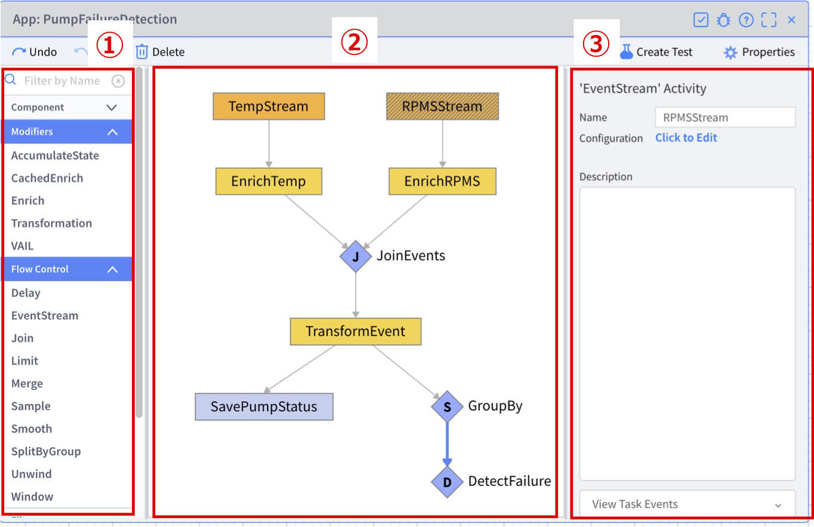
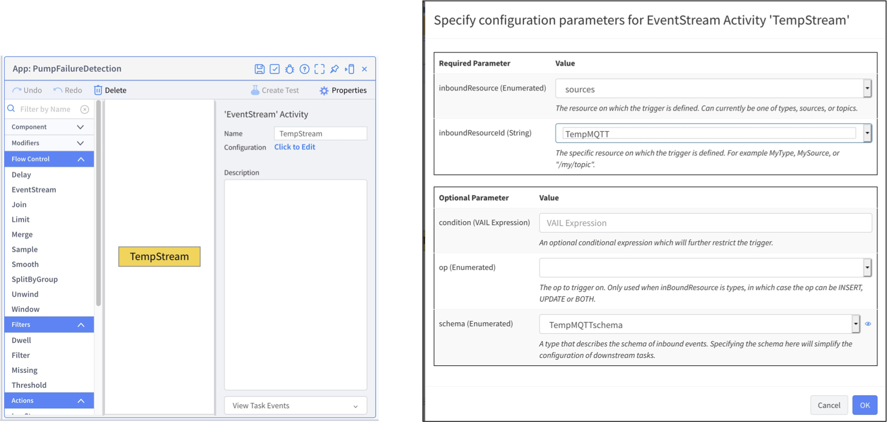
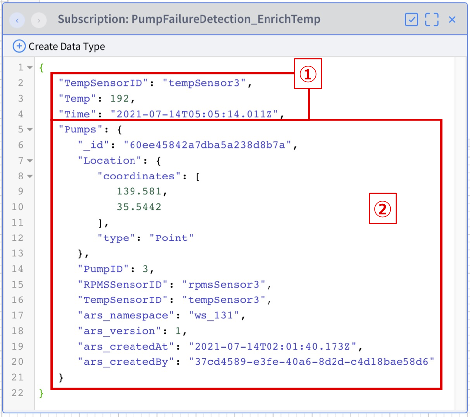
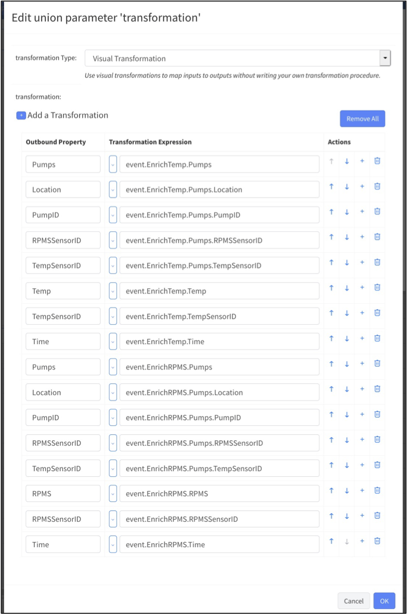
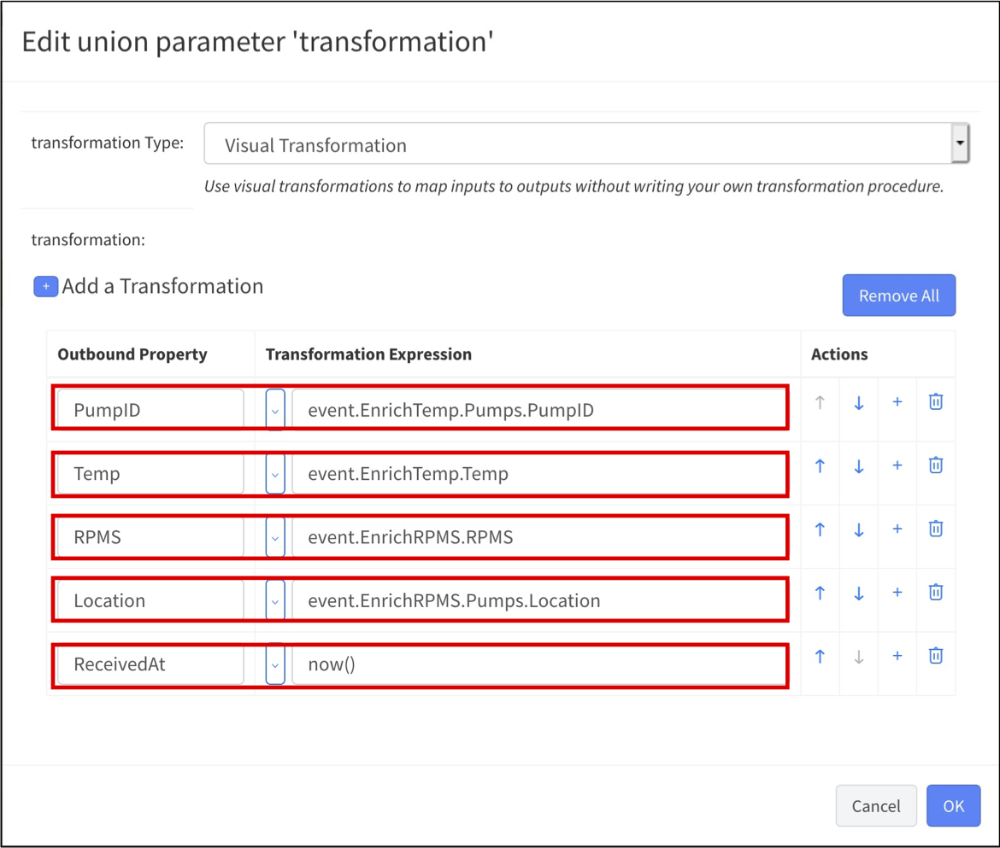
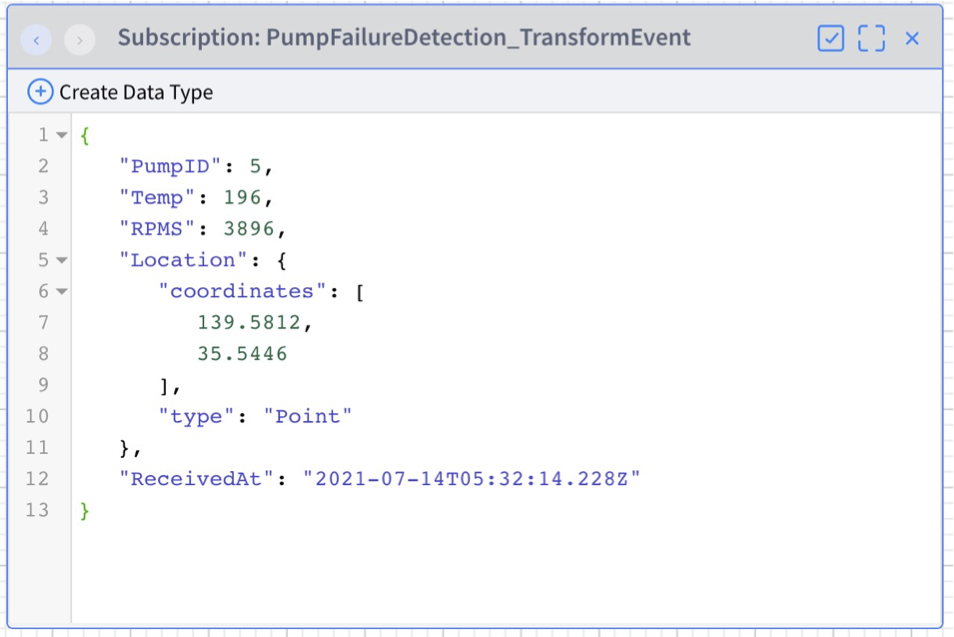
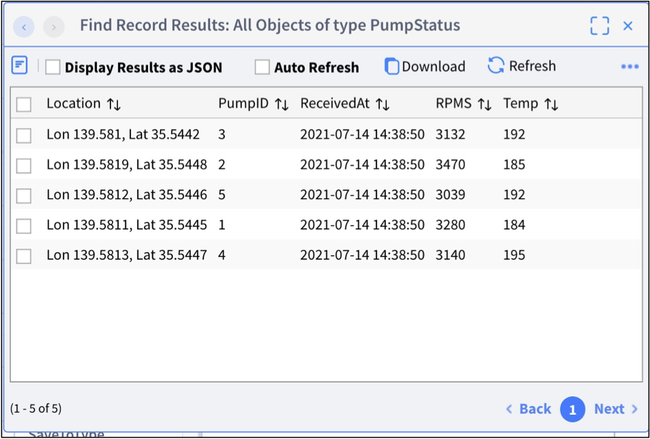
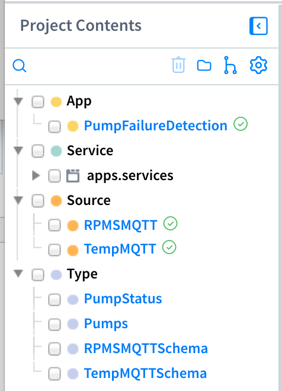

# **Lab 04 – App Builder（アプリケーションビルダー）**

## **概要**

この Lab では App Builder を利用してリアルタイムに複合イベント処理を行うアプリケーションを作成します。

### * App Builder の全体図

### ①. Activity pattern のリスト  
* Activity pattern という VANTIQ 側で予め用意されたファンクションのリスト  
* 開発エリアにドラッグ&ドロップすることで使用できる  
### ②. 開発エリア  
* アプリケーションの開発を行うエリア  
### ③. 設定エリア  
* ドラッグ&ドロップした Activity pattern の設定を行うエリア

## ***Step 1（EventStream の追加）***

1. 「追加」 > 「Advanced」 > 「App...」 > 「_+ 新規 App_」 から App Builder のウィンドウを開きます。

1. 名前に 「PumpFailureDetection」と入力し、「_OK_」をクリックします。

1. _オレンジのボックス_ をクリックし、ウィンドウ右側のパラメーターを以下の通り設定します。
   1. 名前: _TempStream_  
1. 設定：  
   1. inboundResource: _sources_  
   1. inboundResourceId: _TempMQTT_  　＊ ドロップダウンリストより選択

    

1. ウィンドウ左側の Activity Pattern のリストにある「Flow Control」から「`EventStream`」をドラッグ&ドロップし、以下の通り設定します。 ＊ 開発エリアが狭い場合はウィンドウを広げてください。  
   1. 名前: _RPMSStream_  
   1. 設定:  
      1. inboundResource: _sources_  
      1. inboundResourceId: _RPMSMQTT_  　＊ ドロップダウンリストより選択

1. 右上の _変更の保存_ ボタンをクリックしてアプリケーションを保存します。

1. 開発画面に戻り以下の手順で 2つの Stream でデータを取得できていることを確認します。  
   1. それぞれのイベントストリームをクリックし「_Task Events の表示_」をクリックします。  
   1. それぞれ `Temp` データ (イベント) と `RPMS` データ (イベント) が表示されることを確認します。

     

   ＊「Task Events の表示」は各タスクを右クリックすることで表示されるメニューからも表示できます。

   ＊データ (イベント)が表示されない場合は、Dummyデータが生成されているか確認してください。
   

   
講師がいる場合

   講師に確認してください。
   

   

   
講師がいない場合

   データジェネレーターを起動し _Start Generator_ ボタンをクリックしてデータ生成を開始します。
   

## ***Step 2（Enrich による情報付加）***

**Enrich** を使用して受信したイベントに Pumps Type の情報を付加します。これによりセンサーのデータとそれがどのポンプの情報なのか・どこにあるポンプなのか、ということがわかるようになります。

1. Activity Pattern のリストにある「Modifiers」から「`Enrich`」を `TempStream` タスクに重なるようにドラッグ&ドロップします。そして名前を設定します。  
   1. 名前: _EnrichTemp_

1. 設定を以下の通りに行います。  
   1. associatedType: _Pumps_  
   1. foreignKeys : ＊ \<null> をクリックします。  
      1. 「_+ アイテムの追加_」をクリックします。  
      1. 「_TempSensorID_」と入力します。

アプリケーションを保存してから、`EnrichTemp` タスクをクリックし、「Task Events の表示」にて受信した `Temp` イベントに `Pumps` Type のデータが付加されていることを確認してください。また、データジェネレーターが停止している場合は再度実行してください。

  

① 受信した `Temp` イベント  
② 付加された `Pumps` Type のデータ　　

センサーの ID で受信したセンサーのデータとポンプのマスタデータが関連付けられていることが確認できます。

**設定するパラメーターに注意して同様の手順で `RPMSStream` の下に「`EnrichRPMS`」を追加してください。また、「Task Events の表示」での確認も行なってください。**

EnrichRPMS の設定の正解

- associatedType: _Pumps_
- foreignKeys : _RPMSSensorID_

## ***Step 3（Join によるイベントの結合）***

**Join** を使用して 2つの Stream のイベント同士を結合します。

1. Activity Pattern のリストにある「Flow Control」から「`Join`」を `EnrichTemp` タスクに重なるようにドラッグ&ドロップします。そして名前を設定します。  
   1. 名前: _JoinEvents_  

1. `EnrichRPMS` タスク を右クリックし 「_既存 Task とリンク_」 をクリックします。タスク名には「_JoinEvents_」を設定します。

1. `JoinEvents` タスク をクリックして設定を以下の通り行います。  
   1. constraints: ＊ \<null> をクリックします。  
      1. 「_+ アイテムの追加_」をクリックして入力欄を表示します。  
      1. 入力欄に「_EnrichTemp.Pumps.PumpID == EnrichRPMS.Pumps.PumpID_」と入力します。＊ 各要素はドロップダウンリストより選択することができます。
   1. withinDuration に「_10 seconds_」と入力します。

1. アプリケーションを保存してから、`JoinEvents` タスクをクリックし「Task Events の表示」にて `JoinEvents` タスクで処理したイベントの結果を確認し、下の画像のようになっているか確認してください。データジェネレーターが停止している場合は再度実行してください。

      
&emsp;&emsp;① `EnrichTemp` の処理結果  

&emsp;&emsp;② `EnrichRPMS` の処理結果  

## ***Step 4（Transformation による加工）***

**Transformation** を使用して、イベントを加工します。

1. Activity Pattern のリストにある「Modifiers」から「`Transformation`」を `JoinEvents` タスクに重なるようにドラッグ&ドロップします。そして名前を設定します。  
   1. 名前: _TransformEvent_

1. 設定を以下の通り行います。  
   1. transformation の \<null> をクリックして、以下のプロパティ一覧を表示します。  

        

   1. 上の画像の状態のプロパティ一覧を、削除や手入力を行いながら以下の画像の通りに変更します。  

        

   1. schema に「_PumpStatus_」を設定します。  

1. アプリケーションを保存してから、`TransformEvent` タスクをクリックし「Task Events の表示」にて `TransformEvent` タスクで処理したイベントの結果が下の画像のようになっているか確認してください。データジェネレーターが停止している場合は再度実行してください。

     

   ↑ 重複した内容などが削除され、必要なプロパティのみのシンプルな構造になっています。

## ***Step 5（SaveToType による Type への保存）***

**SaveToType** を使用して、イベントを Type に保存します。

1. Activity Pattern のリストにある「Actions」から「`SaveToType`」を `TransformEvent` タスクに重なるようにドラッグ&ドロップします。そして名前を設定します。  
   1. 名前: _SavePumpStatus_

1. 設定を以下の通り行います。  
   1. type: _PumpStatus_  
   1. upsert: チェックボックスにチェック

1. アプリケーションを保存してから、`PumpStatus` Type のデータを確認し下の画像のようにデータが保存されているか確認してください (`PumpStatus` Type を開き、「すべてのレコードの表示」をクリックします)。また、データジェネレーターが停止している場合は再度実行してください。

      

   ＊ PumpID 1\~5 までの値が保存されています。`PumpStatus` Type で保存されるデータは `Upsert` しているためポンプの台数以上の件数にはなりません。

## ***Step 6（Dwell による異常検知）***

`SplitByGroup` を使用してイベントをポンプの ID 毎にグルーピングしてから、**Dwell** を使用して温度データと回転数データが一定の値を超え続けたことを検知します。

1. Activity Pattern のリストにある「Flow Control」から「`SplitByGroup`」を `TransformEvent` タスクに重なるようにドラッグ&ドロップします。そして名前を設定します。  
   1. 名前: _GroupBy_

1. 設定を以下の通り行います。  
   1. groupBy: _event.PumpID_

1. Activity Pattern のリストにある「Filters」から「`Dwell`」を `GroupBy` タスクに重なるようにドラッグ&ドロップします。そして名前を設定します。  
   1. 名前: _DetectFailure_

1. 設定を以下の通り行います。  
   1. condition: _event.Temp > 199 and event.RPMS > 3999_  
   1. duration: _20 seconds_

1. アプリケーションを保存してから、`DetectFailure` タスクをクリックし「Task Events の表示」にて `DetectFailure` タスクで処理したイベントの結果を確認できる状態にします。

1. ポンプの異常データを生成します。  

   

   
講師がいる場合

   講師に異常データの生成を依頼してください。
   

   

   
講師がいない場合

   1. データジェネレーターを開き、「Set Status of Pump」下の _Select a Pump_ プルダウンから「Pump 1」を選択します。

   1. _Normal_ プルダウンから「High Temp & RPMS」を選択し、_Update Pump Status_ ボタンをクリックします (PumpID 1 のポンプの温度と回転数が高い数値になります)。

   1. _Start Generator_ ボタンをクリックしてデータ生成を開始します。

   1. 開発画面に戻ります。
   

1. 温度 200度以上・回転数 4000回以上のイベントが 20秒間継続して生成されると検出します。

       

ここまでの手順で [Project Contents] ペインと App には下の画像のような要素が存在しているはずですので、ご確認ください。

* [Project Contents] ペイン

     

* PumpFailureDetection

     

## ***▷確認ポイント***

- エラーが出てしまった時  
  ✔︎ 配布しているデバッグ方法の資料を確認して原因を調査してみましょう。

- DetectFailure (Dwell) に値が来ない時  
  ✔︎ `Dwell` は一度、設定した値を超える値を検出すると再度その設定を下回る値を受信するか一定期間が空くまで再検出をしません。再度検出させたい場合はデータジェネレーターを開き該当するポンプのステータスを _Normal_ に一度戻してください。  
  ✔︎ 例えばポンプが故障した時に、一度故障を検出した以降は修理しない限りは設定値を超え続けることは明白で連続して検出する必要がないため、このような仕組みになっています。正常な値を受信した場合は修理が終わっている状態とみなせるので、その後に設定値を超えた値を再び受信した場合は再度、検出します。

- 今回のアプリで使用した以外の Activity pattern について  
  ✔︎ リファレンスに各 Activity pattern についての情報がございますので確認してみましょう。  
  ✔︎ App Builder リファレンス: <https://dev.vantiq.co.jp/docs/system/apps/index.html>

## Vantiq 1-day Workshop 次のセッション  
|Session #|Session      | Type  |Contents Description       |Duration (m)|Material               |
|:-----:|--------------|:------:|---------------------------|:-:|--------------------------------|
| 8 | Lab 04 までの復習 | Lecture | | 15 | [03_Review](7-03_Review.md) |
