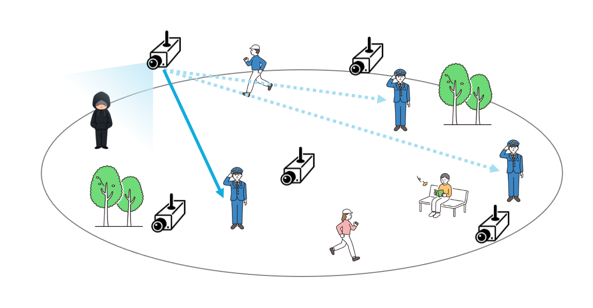
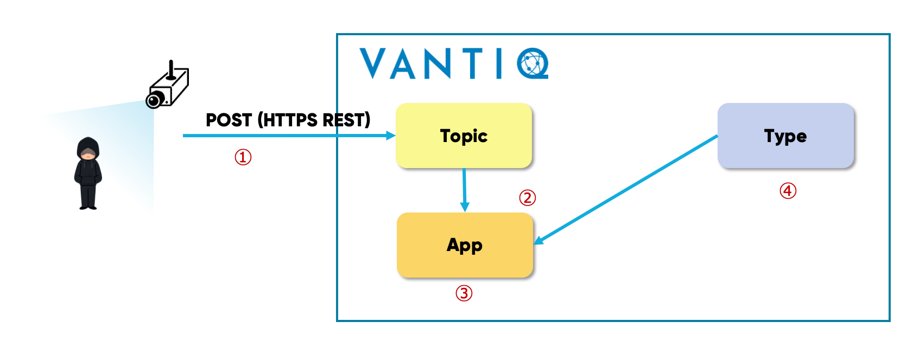
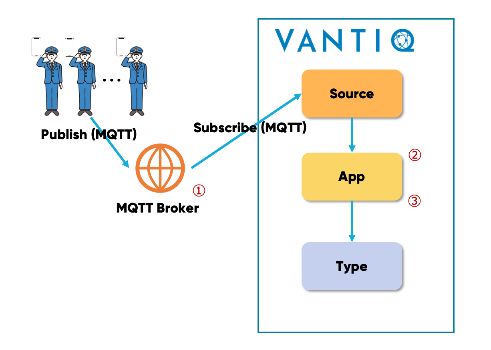
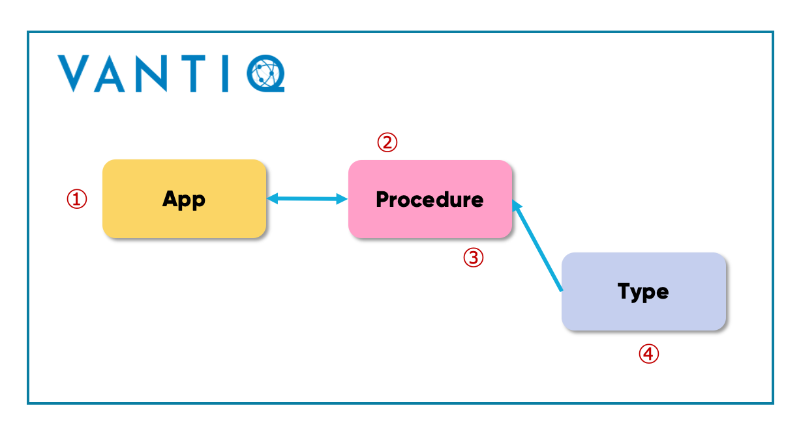
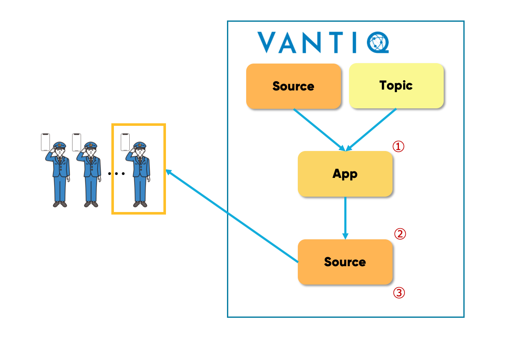
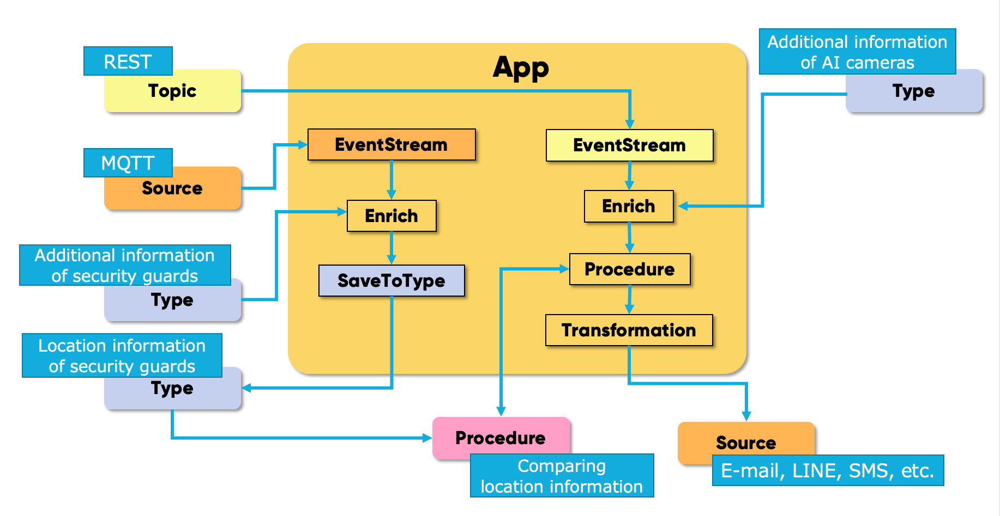
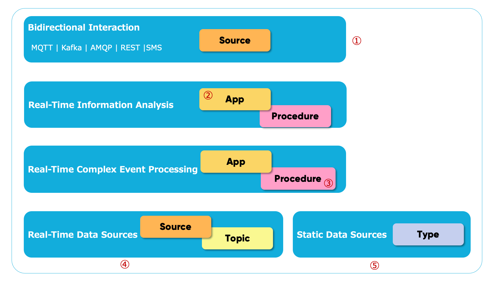

# 実例を通して Vantiq のリソースを理解する

##  AI カメラを使った警備員への通知システム  

広い公園において、AI カメラを使って不審者を検出し、一番近い警備員に通知を行う  

➡️ 不審者を検出した  **AI カメラの位置情報** と **全警備員の位置情報** を比較して最も距離が近い警備員に通知する  



# 前提条件

## AI カメラの仕様

- 不審者の特徴を学習済み  
- 画角内に不審者が映った場合、以下のデータを _HTTPS REST_ で送信する

```sh
{
“camera_id”: "camera_001",    # AI カメラの ID
“event_type”: "notice_001",
“image”: "data:image/jpeg;base64,/9j/4AAQSkZJRgABAQAAAQABAAD/2wBDAAMC...."    # Base64 エンコードした画像
}
```

***※ 一般的に AI カメラは位置情報を持たない  
また、持たせる場合は交換の際に工事業者のほかに AI カメラのエンジニアが必要になる***


## 警備員の位置情報取得方法  

- 警備員はスマートフォンを持ち、位置情報取得アプリをインストールしている  
- アプリは 30秒毎など任意の頻度で以下のデータを MQTT ブローカーに送信する

```sh
{
"guard_id": "134678493_1",    # 警備員ごとの ID
"type": "location",
"lat": 35.6864604,             # 緯度
"lon": 139.7635769,            # 経度
"time": 1631083251
}
```

## Vantiqで実装する処理内容

1. AI カメラや位置情報取得アプリからのデータを受信する
   * デバイスの仕様変更（データフォーマットなど）は将来変わる想定で設計しておく

1. AI カメラから送信されるデータに対して必要な情報を付加する  
   * AI カメラが位置情報を持たないため Vantiq 側で保持しておき付加する  

1. 警備員の最新の位置情報を保存・更新する  
   * 通知へのタイムラグを減らすため、不審者検出時に警備員の位置情報を取得するのではなく予め Vantiq 側で保持しておく  

1. 不審者を検出したAI カメラの位置と警備員の位置の比較  
   * 最も近い警備員を特定する  

1. 最も近い警備員への通知  
   * E-mail、SMS、LINE、Slack など任意の方法で通知を行う  


# 実装方法

## 1. Vantiq へのデータ入力


①　Vantiq は受信するデータのスキーマが定まっていなくても処理することができる  
②　Source は様々なプロトコルでデータを受信する  
③　Topic は REST API のエンドポイント経由でデータを受信する  

## 2. AI カメラからのデータへ情報付加



①　送信されるデータ
```sh
{
👉“camera_id”: "camera_001",
“event_type”: "notice_001",
“image”: "data:image/jpe...."
}
```  
② パラメーター変更・削除など必要なデータ整形は随時行う (Transformation)  
③
アプリは Type の情報を取得して AI カメラからのストリームデータに付加する (Enrich)  
```sh
{
👉“camera_id”: "camera_001",
👉“lan”: 35.6864604,
👉“lon”: 139.7635769,
“event_type”: "notice001",
“image”: "data:image/jpe...."
}
```  
④ AI カメラの位置情報など追加したい情報は、予めTypeで保持されている。
``` sh
{
👉“camera_id”: "camera_001",
“lan”: 35.6864604,
“lon”: 139.7635769
}
```

## 3. 警備員の最新の位置情報保存・更新

  

①　送信されるデータ
```sh
{
"guard_id": "134678493_1",
"type": "location",
"lat": 35.6864604,
"lon": 139.7635769,
"time": 1631083251
}
```  
② 通知時にメールアドレス、電話番号などが必要な情報を、`Enrich` を使って追加する  
③ アプリで `SaveToType` を `Upsert` 設定で使用することで最新の一件のみを *Type* に保存する

## 4. AI カメラと警備員の位置を比較

  

①
Procedure へ渡すデータ
```sh
{
“camera_id”: "camera_001",
👉“lan”: 35.6864604,
👉“lon”: 139.7635769,
“event_type”: "notice_001",
“image”: "data:image/jpe...."
}
```
② 位置を比較するロジックを実装した処理をアプリから呼び出し  
③ _ストリーム処理中の AI カメラのデータ_ に含まれる位置情報と、_Type で保存されている警備員のデータ_ の位置情報を比較して最も近い警備員を特定する  
④ 警備員の最新の位置情報が保存されたType


## 5. 特定した警備員へ通知

  


① 通知時に必要な形式に合わせてデータ整形を行う (Transformation)  
② Source は受信だけでなく、送信にも使用する  
③ E-mail、SMS、Slack、LINE、Teams など  

## Vantiq アプリケーション全体図



## サンプルアプリ  

サンプルアプリ (App とデータジェネレーターで構成されています) は[こちら](../../conf/ai-camera-demo) にあります。  


# 基本リソースの紹介

|Reource|説明|
|:-----|:---|
|Source|データの送受信を行うクライアント。送受信: MQTT、AMQP、Kafka &emsp;  送信のみ: HTTP(S)、E-mail、SMS|
|Topic|Vantiq 内のアプリ間などでイベントの受け渡しをするイベントバス。REST API のエンドポイントとしても機能する。|
|Type|データを保存する。Vantiq で DB に該当するリソース。|
|App|用意されたパターンや Procedure を組み合わせながら GUI 上で開発することができるアプリケーション本体。|
|Procedure|任意のロジックを実装することができるリソース。App で呼び出すなどしてオリジナルの機能を使うことができる。|

  

① 外部にデータを送信や他 API の実行を行う  
② パターンを組み合わせて処理を実装  
③ パターン外の処理は独自に実装  
④ デバイスから送信されるストリームデータ  
⑤ ストリームデータに付加したい情報や、リアルタイムのステータスなどを保存
