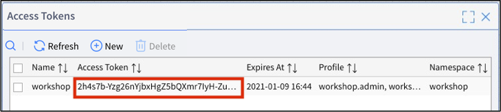
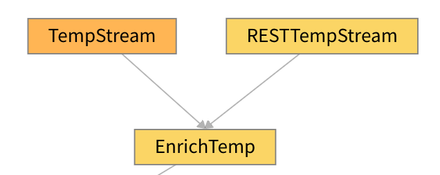

# **Lab 05 – VANTIQ REST API**

## **概要**

この Lab では **VANTIQ の REST API** を使用して、外部から VANTIQ のリソースを操作したり、**App Builder** で作成したアプリケーションを動かす方法を学習します。

また、この Lab では以下のツールを使用します。  
**Postman（**<https://www.postman.com/downloads/>**）**  
***＊ curl コマンドや他の REST クライアントを使っていただいても問題ありません。***

なお、 Postman には下記の2種類があります。  
お使いの環境に応じて利用してください。  

- The Postman app（デスクトップアプリ）
- Postman on the web（Webアプリ）

### Postman (REST Client) で行いたいこと

- **外部から VANTIQ の `Type` へデータの登録・取得・更新・削除を行う**  
Postman（REST Client）を使用して `Type` のデータを POST、GET、PUT、DELETE します。

- **外部から VANTIQ の `Topic` にデータを POST し、アプリを動かす**  
Postman（REST Client）を使用して `Topic` にデータを POST し、アプリケーションを動かします。  

    **＊ Topic**：VANTIQ 内のイベント処理でデータを送受信する機能。_REST API_ を使用する際は外部からでも `Topic` にイベントを Publish できる。  

#### 参考

- Vantiq Academy (要ログイン)
  - [2.4: 基本Resource: Source & Topic](https://community.vantiq.com/courses/%e3%82%a2%e3%83%97%e3%83%aa%e3%82%b1%e3%83%bc%e3%82%b7%e3%83%a7%e3%83%b3%e9%96%8b%e7%99%ba%e8%80%85-level-1-%e3%82%b3%e3%83%bc%e3%82%b9-%e6%97%a5%e6%9c%ac%e8%aa%9e/lessons/lesson-2-vantiq-%e9%96%8b%e7%99%ba%e3%83%97%e3%83%a9%e3%83%83%e3%83%88%e3%83%95%e3%82%a9%e3%83%bc%e3%83%a0/topic/2-4-%e5%9f%ba%e6%9c%acresource-source-topic-copy-2/)
- Vantiq Developer Guide
  - [API Reference Guide](https://dev.vantiq.co.jp/docs/system/api/index.html#api-reference-guide)
- REST Client
  - [cURL を Windows11 にインストールしてみた。 - Qiita](https://qiita.com/IoriGunji/items/db2141884c107b458c89)

## ***Step 1（外部から VANTIQ の `Type` へデータの登録・取得・更新・削除を行う）***

Postman (REST Client) からご自身の `Namespace` の `Type` を操作する方法を学習します。

### 1. アクセストークンの作成

外部から VANTIQ のリソースにアクセスするために、**アクセストークン** を作成します。

1. 「管理」 > 「アドバンスド」 > 「アクセストークン」を開き、「_+新規_」をクリックしてアクセストークンの新規作成画面を開きます。

1. アクセストークンの名前を入力します。  
   管理がしやすく分かりやす名前をつけることを推奨しています。  
   今回は名前にご自身の `Namespace` 名などを入力してください。例：「workshop_〇〇」など

1. アクセストークンの有効期限が正しく設定できているか確認をします。  
   有効期限の日付が本日以降になっていることを確認し、「_OK_」をクリックします。

1. 作成したアクセストークンが一覧に表示されますので、アクセストークンをコピーしておきます。  
＊ アクセストークン部分をクリックするとコピーできます。  

     

### 2. Postman を使ったデータの登録

Postman からデータを送信し、 VANTIQ の Type にデータを登録します。

1. Postman を起動します。  
   別タブを開き「<https://www.postman.com/downloads/>」から、デスクトップアプリ版の Postman のインストールおよび起動をするか、Webアプリ版の Postman を起動してください。

   1. 下の画像のようになっていることを確認します。  

        

1. `PumpStatus` Type に Postman からデータを登録します。  

   1. データの登録を行う場合は POST メソッドを利用します。  
   「GET」となっている部分をプルダウンから「POST」に変更し、メソッドを **POST** にします。  
   1. 「Enter request URL」となっている部分に以下の URL を入力します。  

      | https://dev.vantiq.co.jp/api/v1/resources/custom/PumpStatus |
      |-------------------------------------------------------------|  

   1. Headers タブを開き、以下のように入力します。  

      | KEY           | VALUE                                 |
      |---------------|---------------------------------------|
      | Authorization | **Bearer** ***<コピーしたアクセストークン>***  <br /> 例: "Bearer 2h4s7b-Yzg70kk6wxG37jsEFVZ_iPtV0eeqYABCDEFI=" (ダブルクォートは除く) |  

   1. Body タブを開き、以下のように設定します。  
      1. _raw_ のラジオボタンを選択します。  
      1. 「Text」となっている部分をプルダウンから「_JSON (application/json)_」に変更します。  
      1. 入力欄に下記のように入力します。  

         ```json
         {
             "Location": {
                 "coordinates": [
                     0,
                     0
                 ],
                 "type": "Point"
             },
             "PumpID": 7,
             "RPMS": 5000,
             "ReceivedAt": "2020-01-01T00:00:00Z",
             "Temp": 250
         }
         ```

   1. 以下の画像のようになっていることを確認します。

        

   1. _Send_ ボタンをクリックします。

   1. POST に成功すると、下の画像のように結果が表示されます。  

        

1. VANTIQ に戻り、`PumpStatus` Typeのデータを確認します。  
   1. `PumpStatu`s Typeの「_すべてのレコードの表示_」をクリックし、下の画像のように `PumpID` _7_ のサンプルデータが POST されていることを確認します。

        

#### 補足説明

＊ curl コマンドを使う場合は以下のようになります (Windowsだと正しく動作しないことがあります)。

```shell
curl
-X POST
-H 'Content-Type:application/json'
-H "Authorization: Bearer <アクセストークン>"
-d '{"Location": {"coordinates": [ 0, 0 ], "type": "Point" }, "PumpID": 7, "RPMS": 5000, "ReceivedAt": "2020-01-01T00:00:00Z", "Temp": 250 }'
https://dev.vantiq.co.jp/api/v1/resources/custom/PumpStatus
```

### 3. Postman を使ったデータの取得

Postman から `PumpStatus` Type のデータを取得します。

1. Postman に戻ります。

1. データの取得を行う場合は GET メソッドを利用します。  
   「POST」になっている部分をプルダウンから「**GET**」に変更し、_Send_ ボタンをクリックします。  

     

   `PumpStatus` Type のデータが全件表示されていることを確認してください。

#### 補足説明

＊ curl コマンドを使う場合は以下のようになります (Windowsだと正しく動作しないことがあります)。

```shell
curl
-H "Authorization: Bearer <アクセストークン>" https://dev.vantiq.co.jp/api/v1/resources/custom/PumpStatus
```

### 4. Postman を使ったデータの更新

Postman から `PumpStatus` Type のデータを更新します。

1. Postman を開きます。

1. データの更新を行う場合は PUT メソッドを利用します。  
   「GET」になっている部分をプルダウンから「**PUT**」に変更します。

1. URL の部分を以下の通り変更します。

   |https://dev.vantiq.co.jp/api/v1/resources/custom/PumpStatus?where={"PumpID": 7}|
   |---|  

1. Body タブの入力欄に以下の通り入力します。  

   ```json
   {
       "Location": {
           "coordinates": [
               130,
               35
           ],
           "type": "Point"
       }
   }
   ```  

1. _Send_ ボタンをクリックします。

1. VANTIQ に戻り、`PumpStatus` Type の `PumpID` _7_ のデータを確認し、`Location` が更新されていることを確認してください（GET して確認しても問題ありません）。

#### 補足説明

＊ curl コマンドを使う場合は以下のようになります (Windowsだと正しく動作しないことがあります)。  

```shell
curl
-g -X PUT
-H 'Content-Type: application/json'
-H 'Authorization: Bearer <アクセストークン>'
-d '{"Location": {"coordinates": [130,35],"type": "Point"}}' 'https://dev.vantiq.co.jp/api/v1/resources/custom/PumpStatus?where={"PumpID":7}'
```

### 5. Postman を使ったデータの削除

Postman から `PumpStatus` Type のデータを削除します。

1. Postman を開きます。

1. データの削除を行う場合は DELETE メソッドを利用します。  
   「GET」になっている部分をプルダウンから「**DELETE**」に変更します。

1. URL の部分が以下の通りになっていることを確認します。

   |https://dev.vantiq.co.jp/api/v1/resources/custom/PumpStatus?where={"PumpID": 7}|
   |---|

1. _Send_ ボタンをクリックします。

1. VANTIQ に戻り、`PumpStatus` Type のデータを確認し、`PumpID` _7_ のデータが削除されていることを確認します (GETして確認しても問題ありません)。  

#### 補足説明

＊ curl コマンドを使う場合は以下のようになります (Windowsだと正しく動作しないことがあります)。  

```shell
curl -g -X DELETE
-H 'Content-Type: application/json'
-H 'Authorization: Bearer <アクセストークン>'
'https://dev.vantiq.co.jp/api/v1/resources/custom/PumpStatus?where={"PumpID":7}'
```

### まとめ

以上の手順を実施することで、外部のシステムから VANTIQ の `Type` にデータの **登録**・**取得**・**更新**・**削除** を行うことができます。

## ***Step 2（外部から VANTIQ の `Topic` にデータを POSTし、アプリで確認する）***

Postman (REST Client) からデータを POST して、**PumpFailureDetection** App を動かします。

今回はアプリを動かしたいので、 `Type` ではなく、`Topic` にデータを POST します。  
`Topic` からのイベントを受け付けるよう、アプリケーションも少し修正します。  

### 1. Topic の作成
1. VANTIQ の開発画面を開きます。

1. 「追加」 > 「アドバンスド」 > 「Topic...」 > 「_+新規Topic_」 から `Topic` の新規作成画面を開きます。

1. Postman でアクセスする際のエンドポイントとなる名前を設定します。  
   今回は名前に「_/rest/temp_」と入力します。

1. 説明には **何のための Topic なのか** が分かるように、分かりやすい説明の入力を推奨しています。  
   今回は説明に「_REST用_」と入力します。

1. 「_OK_」をクリックし、`Topic` を保存します。

     

### 2. アプリの修正

1. **PumpFailureDetection** Appを開きます。

1. まずは Topic からのデータを受け取るために、新しい `EventStream` を作成します。  
   `Activity Pattern` のリストにある「Flow Control」から「`EventStream`」を開発エリアにドラッグ&ドロップし、以下の通り設定します。  
   今回は Topic からデータを受け取りたいので、先程作成した Topic の情報を入力していきます。

   1. 名前: _RESTTempStream_

   1. 設定:

      1. inboundResource: _topics_

      1. inboundResourceId: _/rest/temp_

1. Topic から受け取ったイベントを次のタスクに渡すための設定を行います。  
   `RESTTempStream` タスクを右クリックし「_既存のタスクのリンク_」をクリックします。  
   タスク名には「_EnrichTemp_」を設定します。

        

### 3. Postman でアプリを動かす

**Postman** からの温度データ と **データジェネレータ** からの回転数データを使って **PumpFailureDetection** App を動かします。

1. Postman を開き以下の通り設定します。

   1. Method: POST

   1. URL: https://dev.vantiq.co.jp/api/v1/resources/topics//rest/temp

   1. Headers:

        | KEY           | VALUE                                 |
        |---------------|---------------------------------------|
        | Authorization | **Bearer** ***コピーしたアクセストークン*** |
        | Content-Type  | application/json                      |

   1. Body:  

      ```json
      {
          "TempSensorID": "tempSensor1",
          "Temp":250,
          "Time": "2020-01-01T00:00:00Z"
      }
      ```

1. **データジェネレータ** を開き、「_Start RPMS Only_」ボタンをクリックします。  
   このボタンを押すと回転数データのみ生成されます。

1. 回転数データが生成されている状態で Postman に戻り、上記の設定済みの状態で _Send_ ボタンをクリックします。  
   これで Temp データが `/rest/temp` Topic に Publish されます。

1. 開発画面に戻り、回転数データと Postman からのデータが `Join` され、アプリケーションが動作していることを確認してください。

        

## ***▷確認ポイント***

- VANTIQ の _REST API_ を使うことにより、外部システムとの連携を簡単に実現することができます。  
  ✔︎ 例えば複数の外部システムから　VANTIQ　にデータを POST してアプリケーションで結合・整形することや、外部システムから `Type` の値を更新して `Enrich` する内容を変更するなど今回のワークショップで学習していただいた内容を使えば簡単に実装することができます。

## Vantiq 1-day Workshop 次のセッション  
|Session #|Session      | Type  |Contents Description       |Duration (m)|Material               |
|:-----:|--------------|:------:|---------------------------|:-:|--------------------------------|
| 11 | 他サービスとの連携 | Lab | Vantiq 1-day Workshop の次のステップ | | [Lab06_Integrate_other_services](a09-Lab06_Integrate_other_services.md) |
