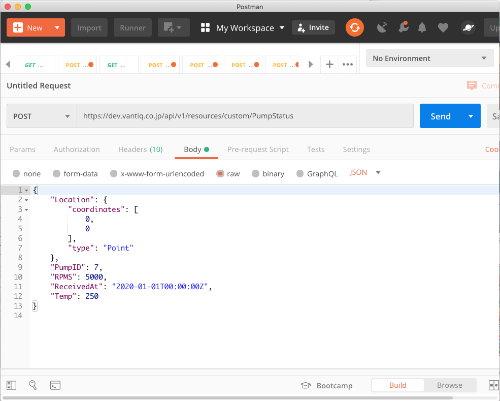
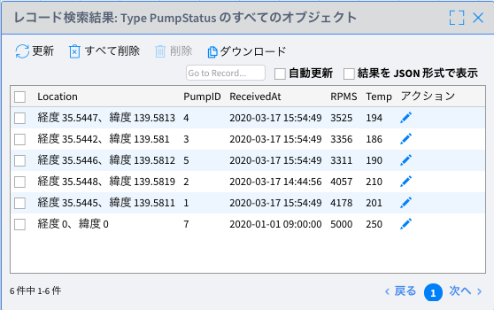

# **Lab 05 – VANTIQ REST API**

## **概要**

この Lab では **VANTIQ の REST API** を使用して外部から VANTIQ のリソースを操作したり、**App Builder** で作成したアプリケーションを動かします。

また、この Lab では以下のツールを使用します。  
**Postman（**<https://www.getpostman.com/>**）**  
または **Postman Chrome App**  
**(**<https://chrome.google.com/webstore/detail/postman/fhbjgbiflinjbdggehcddcbncdddomop?hl=ja-jp>**)**  
***＊ curl コマンドや他の REST クライアントを使っていただいても問題ありません。***

-   **外部から VANTIQ の `Type` へデータの登録・取得・更新・削除を行う**  
Postman（REST Client）を使用して `Type` のデータを POST、GET、PUT、DELETE します。

-   **外部から VANTIQ の `Topic` にデータを POST し、アプリを動かす**  
Postman（REST Client）を使用して `Topic` にデータを POST し、アプリケーションを動かします。  

    **＊ Topic**：VANTIQ 内のイベント処理でデータを送受信する機能。_REST API_ を使用する際は外部からでも `Topic` にイベントを Publish できる。  

#### 参考
- Vantiq Academy (要ログイン)
  - [2.4: 基本Resource: Source & Topic](https://community.vantiq.com/courses/%e3%82%a2%e3%83%97%e3%83%aa%e3%82%b1%e3%83%bc%e3%82%b7%e3%83%a7%e3%83%b3%e9%96%8b%e7%99%ba%e8%80%85-level-1-%e3%82%b3%e3%83%bc%e3%82%b9-%e6%97%a5%e6%9c%ac%e8%aa%9e/lessons/lesson-2-vantiq-%e9%96%8b%e7%99%ba%e3%83%97%e3%83%a9%e3%83%83%e3%83%88%e3%83%95%e3%82%a9%e3%83%bc%e3%83%a0/topic/2-4-%e5%9f%ba%e6%9c%acresource-source-topic-copy-2/)
- Vantiq Developer Guide
  - [API Reference Guide](https://dev.vantiq.co.jp/docs/system/api/index.html#api-reference-guide)


## ***Step 1（外部から VANTIQ の `Type` へデータの登録・取得・更新・削除を行う）***

Postman (REST Client) からご自身の `Namespace` の `Type` を操作します。

1.  外部からリソースにアクセスするために、以下の手順で **アクセストークン** を作成します。

    1.  「管理」 > 「アドバンスド」 > 「アクセストークン」を開き、「_+新規_」をクリックしてアクセストークンの新規作成画面を開きます。

    2.  名前にご自身の `Namespace` 名などを入力してください。例：「workshop_〇〇」など

    3.  有効期限の日付が本日以降になっていることを確認し、「_OK_」をクリックします。

    4.  作成したアクセストークンが一覧に表示されますので、アクセストークンをコピーしておきます。  
    ＊ アクセストークン部分をクリックするとコピーできます。  
      

2.  別タブを開き「<https://www.getpostman.com/>」から Postman をインストールして起動します。  

    1.  下の画像のようになっていることを確認します。  

       

3.  以下の手順を行い、`PumpStatus` Type に Postman からデータを登録します。  

    1.  「GET」となっている部分をプルダウンから「POST」に変更し、メソッドを **POST** にします。  
    2.  「Enter request URL」となっている部分に以下の URL を入力します。  

    | https://dev.vantiq.co.jp/api/v1/resources/custom/PumpStatus |
    |-------------------------------------------------------------|  

    3.  Headers タブを開き、以下のように入力します。  

    | KEY           | VALUE                                 |
    |---------------|---------------------------------------|
    | Authorization | **Bearer** ***<コピーしたアクセストークン>***  <br /> 例: "Bearer 2h4s7b-Yzg70kk6wxG37jsEFVZ_iPtV0eeqYABCDEFI=" (ダブルクォートは除く) |  

    4.  Body タブを開き、以下のように設定します。  
        1.  _raw_ のラジオボタンを選択します。  
        2.  「Text」となっている部分をプルダウンから「_JSON (application/json)_」に変更します。  
        3.  入力欄に下記のように入力します。  

        ```
        {
    	     "Location": {
    		       "coordinates": [
    			             0,
    			             0
    		       ],
    		       "type": "Point"
    	     },
    	     "PumpID": 7,
    	     "RPMS": 5000,
    	     "ReceivedAt": "2020-01-01T00:00:00Z",
    	     "Temp": 250
        }
        ```

    5.  以下の画像のようになっていることを確認します。

      

    6.  _Send_ ボタンをクリックします。

    7.  POST に成功すると、下の画像のように結果が表示されます。  

      

    8.  VANTIQ に戻り、`PumpStatus` Typeのデータを確認します。  
        1.  `PumpStatu`s Typeの「_すべてのレコードの表示_」をクリックし、下の画像のように _7_ 件目のサンプルデータが POST されていることを確認します。

          

＊ curl コマンドを使う場合は以下のようになります (Windowsだと正しく動作しないことがあります)。

```
curl
-X POST
-H 'Content-Type:application/json'
-H "Authorization: Bearer <アクセストークン>"
-d '{"Location": {"coordinates": [ 0, 0 ], "type": "Point" }, "PumpID": 7, "RPMS": 5000, "ReceivedAt": "2020-01-01T00:00:00Z", "Temp": 250 }'
https://dev.vantiq.co.jp/api/v1/resources/custom/PumpStatus
```

4.  以下の手順を行い、Postman から `PumpStatus` Type のデータを取得します。

    1.  Postman に戻り、「POST」になっている部分をプルダウンから「**GET**」に変更し、_Send_ ボタンをクリックします。  

      

    `PumpStatus` Type のデータが全件表示されていることを確認してください。

＊ curl コマンドを使う場合は以下のようになります (Windowsだと正しく動作しないことがあります)。

```
curl
-H "Authorization: Bearer <アクセストークン>" https://dev.vantiq.co.jp/api/v1/resources/custom/PumpStatus
```

5.  以下の手順を行い、Postman から `PumpStatus` Type のデータを更新します。

    1.  Postman を開き、「GET」になっている部分をプルダウンから「**PUT**」に変更します。

    2.  URL の部分を以下の通り変更します。

    |https://dev.vantiq.co.jp/api/v1/resources/custom/PumpStatus?where={"PumpID": 7}|
    |---|  

    3.  Body タブの入力欄に以下の通り入力します。  
    ```
    {
        "Location": {
            "coordinates": [
                  130,
                  35
            ],
            "type": "Point"
        }
    }
    ```  

    4.  _Send_ ボタンをクリックします。

    5.  VANTIQ に戻り、`PumpStatus` Type の `PumpID` _7_ のデータを確認し、`Location` が更新されていることを確認してください（GET して確認しても問題ありません）。

＊ curl コマンドを使う場合は以下のようになります (Windowsだと正しく動作しないことがあります)。  
```
curl
-g -X PUT
-H 'Content-Type: application/json'
-H 'Authorization: Bearer <アクセストークン>'
-d '{"Location": {"coordinates": [130,35],"type": "Point"}}' 'https://dev.vantiq.co.jp/api/v1/resources/custom/PumpStatus?where={"PumpID":7}'
```

6.  以下の手順を行い、Postman から `PumpStatus` Type のデータを削除します。

    1.  Postman を開き、「GET」になっている部分をプルダウンから「**DELETE**」に変更します。

    2.  URL の部分が以下の通りになっていることを確認します。

    |https://dev.vantiq.co.jp/api/v1/resources/custom/PumpStatus?where={"PumpID": 7}|
    |---|

    3.  _Send_ ボタンをクリックします。

    4.  VANTIQ に戻り、`PumpStatus` Type のデータを確認し、`PumpID` _7_ のデータが削除されていることを確認します (GETして確認しても問題ありません)。  

＊ curl コマンドを使う場合は以下のようになります (Windowsだと正しく動作しないことがあります)。  
```
curl -g -X DELETE
-H 'Content-Type: application/json'
-H 'Authorization: Bearer <アクセストークン>'
'https://dev.vantiq.co.jp/api/v1/resources/custom/PumpStatus?where={"PumpID":7}'
```


以上の手順で外部システムから VANTIQ の `Type` にデータを登録・取得・更新・削除することができます。

## ***Step 2（外部から VANTIQ の `Topic` にデータを POSTし、アプリで確認する）***

 Postman(REST Client) からデータを POST して、**PumpFailureDetection** App を動かします。

 今回は `Type` ではなく、`Topic` にデータを POST します。`Topic` からのイベントを受け付けるよう、アプリケーションも少し修正します。

1.  VANTIQ の開発画面を開きます。

2.  「追加」 > 「アドバンスド」 > 「Topic...」 > 「_+新規Topic_」 から `Topic` の新規作成画面を開きます。

3.  名前に「_/rest/temp_」と入力します。

4.  説明に「_REST用_」と入力します。

5.  「_OK_」をクリックし、`Topic` を保存します。

 &emsp;&emsp;  

6.  **PumpFailureDetection** Appを開きます。

7.  `Activity Pattern` のリストにある「Flow Control」から「`EventStream`」を開発エリアにドラッグ&ドロップし、以下の通り設定します。

    1.  名前: _RESTTempStream_

    2.  設定:

        1.  inboundResource: _topics_

        2.  inboundResourceId: _/rest/temp_

8.  `RESTTempStream` タスクを右クリックし「_既存のタスクのリンク_」をクリックします。タスク名には「_EnrichTemp_」を設定します。

   

9.  以下の手順で **データジェネレータ** からの回転数データと Postman からの温度データを使って **PumpFailureDetection** App を動かします。

    1.  Postman を開き以下の通り設定します。

        1.  Method: POST

        2.  URL: https://dev.vantiq.co.jp/api/v1/resources/topics//rest/temp

        3.  Headers:

        | KEY           | VALUE                                 |
        |---------------|---------------------------------------|
        | Authorization | **Bearer** ***コピーしたアクセストークン*** |
        | Content-Type  | application/json                      |

        4.  Body:  

        ```
        {
          "TempSensorID": "tempSensor1",
          "Temp":250,
          "Time": "2020-01-01T00:00:00Z"
        }
        ```

    2.  **データジェネレータ** を開き、「_Start RPMS Only_」ボタンをクリックします。このボタンを押すと回転数データのみ生成されます。

    3.  回転数データが生成されている状態で Postman に戻り、上記の設定済みの状態で _Send_ ボタンをクリックします。これで Temp データが `/rest/temp` Topic に Publish されます。

    4.  開発画面に戻り、回転数データと Postman からのデータが `Join` され、アプリケーションが動作していることを確認してください。

      

## ***▷確認ポイント***

-   VANTIQ の _REST API_ を使うことにより、外部システムとの連携を簡単に実現することができます。  
    ✔︎  例えば複数の外部システムから　VANTIQ　にデータを POST してアプリケーションで結合・整形することや、外部システムから `Type` の値を更新して `Enrich` する内容を変更するなど今回のワークショップで学習していただいた内容を使えば簡単に実装することができます。
