# **Lab 06 – 他サービスとの連携**

## **概要**

この Lab ではポンプの故障を検知した際にその内容を他サービスに連携し通知を行います。  
データを連携するサービスは以下の通りです。どのサービスの Step から取り組んでいただいても構いません。

-   **[メール](#step-1-メール)**

-   **[SMS (Twilio)](#step-2-sms)**

-   **[Teams](#step-3-teams)**

-   **[LINE](#step-4-line)**

-   **[Slack](#step-5-slack)**

***＊ それぞれのサービスの環境・アカウントはご自身で事前にご用意いただく必要があります。***

 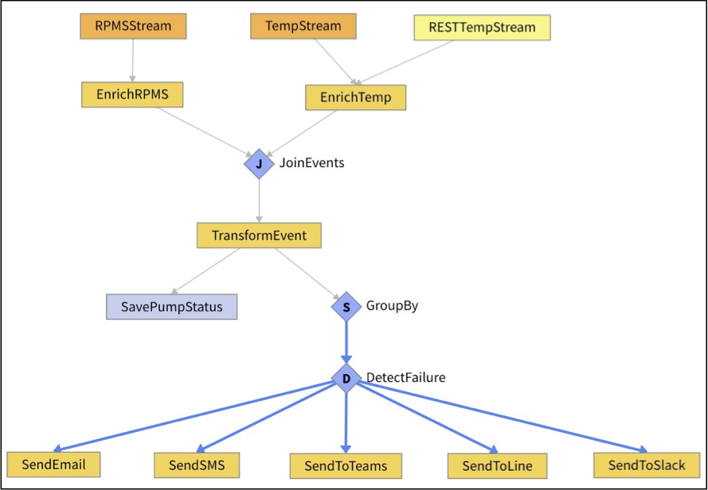  

また、データを送信する機能の実装には「**Procedure**」を使用します。Procedureを使うことで `Activity pattern` に存在しない処理も自由にプログラミングすることができます。Procedure は **App Builder** で作成したアプリケーションなどから呼び出して使うことのできるプログラムです。

#### 参考
- Vantiq Academy (要ログイン)
  - [4.2: SourceとTopic](https://community.vantiq.com/courses/vantiq%e3%82%a2%e3%83%97%e3%83%aa%e3%82%b1%e3%83%bc%e3%82%b7%e3%83%a7%e3%83%b3%e9%96%8b%e7%99%ba%e3%82%b3%e3%83%bc%e3%82%b9%ef%bc%86%e3%83%ac%e3%83%99%e3%83%ab1%e8%aa%8d%e5%ae%9a%e8%a9%a6%e9%a8%93v1-2/lessons/4-%e3%83%87%e3%83%bc%e3%82%bf%e3%81%ae%e5%88%86%e6%9e%90%e3%81%a8%e3%82%a8%e3%83%b3%e3%83%aa%e3%83%83%e3%83%81/topic/4-2-%e3%82%bd%e3%83%bc%e3%82%b9%e3%83%bb%e3%83%88%e3%83%94%e3%83%83%e3%82%af%e3%82%b9/)
  - [4.8: VAIL SQL](https://community.vantiq.com/courses/vantiq%e3%82%a2%e3%83%97%e3%83%aa%e3%82%b1%e3%83%bc%e3%82%b7%e3%83%a7%e3%83%b3%e9%96%8b%e7%99%ba%e3%82%b3%e3%83%bc%e3%82%b9%ef%bc%86%e3%83%ac%e3%83%99%e3%83%ab1%e8%aa%8d%e5%ae%9a%e8%a9%a6%e9%a8%93v1-2/lessons/4-%e3%83%87%e3%83%bc%e3%82%bf%e3%81%ae%e5%88%86%e6%9e%90%e3%81%a8%e3%82%a8%e3%83%b3%e3%83%aa%e3%83%83%e3%83%81/topic/4-8-vail-sql/)


## ***Step 1 (メール)***

メール用の Source を作成し、ポンプの故障を検知した際にメールを送信するまでの手順です。

1.  Source の作成

    1.  「追加」 > 「Source...」 > 「_+新規Source_」 から Source の新規作成画面を開きます。

    2.  Source 名に 「_Email_」 と入力します。

    3.  Source の種類 を 「_EMAIL_」に設定します。

    4.  「Properties」タブを開き、以下のご自身のメールサーバーの情報を設定し保存します。  
        1.  サーバーURL  
        2.  ポート  
        3.  ユーザー名/パスワード

        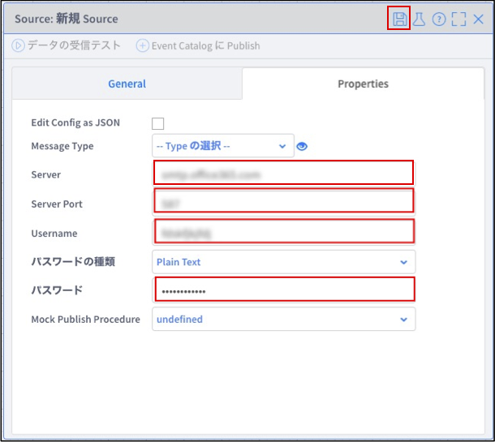  

2.  Procedure の作成

    1.  「追加」 > 「Procedure...」 > 「_+新規Procedure_」 から新規 Procedure の編集画面を開きます。

    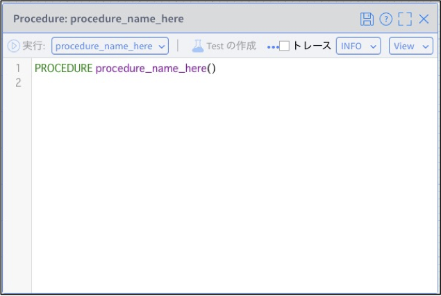  

    2.  以下の内容をペーストし、保存します。

        ***＊「`sendEmail`」という Procedure が作成されます。***  
        ***＊　＜任意のメールアドレス＞ の部分にはご自身のメールアドレスを入力してください。***  
        ```
        PROCEDURE sendEmail(event)
        // 送信先メールアドレス
        var toAddress = "＜任意のメールアドレス＞"
        // 送信元メールアドレス
        var fromAddress = "＜任意のメールアドレス＞"
        // 送信内容
        var subject = "ポンプが故障しました"
        var body = "<div>修理担当者 様</div>"
        body += "<div>ポンプID　" + event.PumpID + " のポンプが故障しました</div>"
        body += "<div>温度: " + event.Temp + "℃</div>"
        body += "<div>回転数: " + event.RPMS + "</div>"
        body += "<div>設置場所: " + "緯度: " + event.Location.coordinates[1] + "、経度: " + event.Location.coordinates[0] + "</div>"
        body += "<div>時刻: " + event.ReceivedAt + "</div>"
        // 送信
        PUBLISH { html: body } TO SOURCE Email USING { from: fromAddress, to: toAddress, subject: subject }    
        ```

3.  アプリの修正と実行

    1.  「**PumpFailureDetection**」 Appを開き、ウィンドウ左側の Activity Pattern のリストにある「Actions」から「`Procedure`」を「`DetectFailure`」タスクにドラッグ&ドロップし、以下の通り設定します。

        1.  procedure: `sendEmail`

    2.  「**PumpFailureDetection**」 Appを保存し、どれかのポンプの温度と回転数が高い値で生成されるよう設定した上で **データジェネレータ** を実行します。

    3.  「`SendEmail`」タスクが実行されたことを確認します。  

    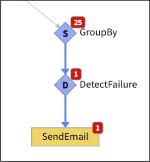  

    4.  指定したメールアドレスにメールが送信されていることを確認します。

    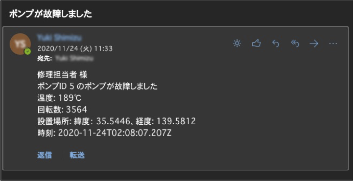  

メールを送信するまでの手順は以上です。

## ***Step 2 (SMS)***

SMS 用の Source を作成し、ポンプの故障を検知した際にSMSを送信するまでの手順です。

1.  Source の作成

    1.  「追加」 > 「Source...」 > 「_+新規Source_」 から Source の新規作成画面を開きます。

    2.  Source 名に 「_Twilio_」 と入力します。

    3.  Source の種類 を 「_SMS_」に設定します。

    4.  「Properties」タブを開き、以下のご自身の Twilio の情報を設定し保存します。  
        1.  アカウントSID  
        2.  認証トークン  
        3.  電話番号  

        * Twilio のコンソールダッシュボード  
        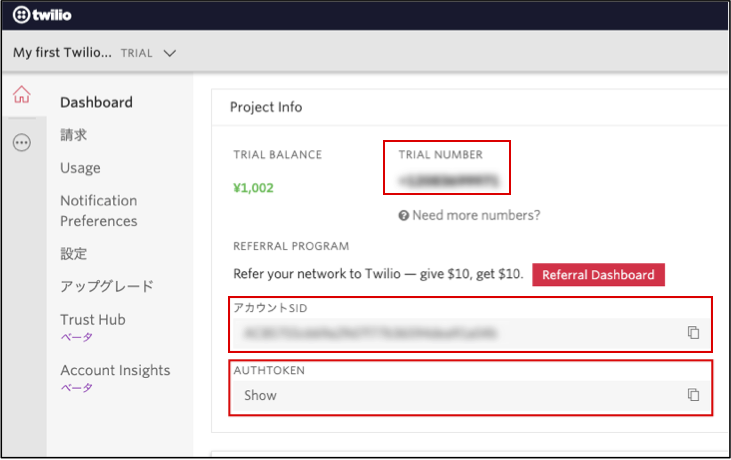  
        * Twilio 用 Source  
        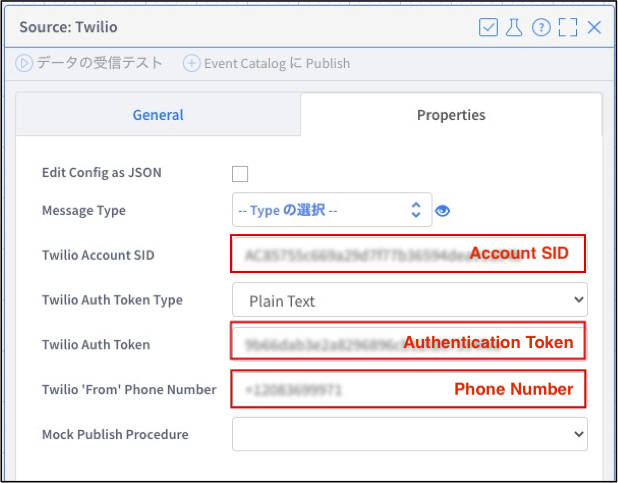  
        ＊ 電話番号は「+xxxxxxxxxxx」の形式です。

2.  Procedure の作成

    1.  「追加」 > 「Procedure...」 > 「_+新規Procedure_」 から新規 Procedure の編集画面を開きます。

    2.  以下の内容をペーストし、保存します。  
    ***＊ ＜任意の電話番号＞ の部分にはご自身の電話番号を入力してください。***  
        ```
        PROCEDURE sendSMS(event)
        // 送信先電話番号（+81xxxxxxxxxx‬）
        var phoneNumber = "＜任意の電話番号＞"
        //　送信内容
        var body = "ポンプID " + event.PumpID + "のポンプが故障しました \n"
        body += "温度: " + event.Temp + "℃ \n"
        body += "回転数: " + event.RPMS + "\n"
        body += "設置場所: \n"
        body += "緯度: " + event.Location.coordinates[1] + "\n"
        body += "経度: " + event.Location.coordinates[0] + "\n"
        body += "時刻: " + event.ReceivedAt
        // 送信処理
        PUBLISH { body: body } TO SOURCE Twilio USING { to: phoneNumber }
        ```

3.  アプリの修正と実行

    1.  「**PumpFailureDetection**」 Appを開き、ウィンドウ左側の Activity Pattern のリストにある「Actions」から「`Procedure`」を「`DetectFailure`」タスクにドラッグ&ドロップし、以下の通り設定します。

        1.  procedure: sendSMS

    2.  「**PumpFailureDetection**」 Appを保存し、どれかのポンプの温度と回転数が高い値で生成されるよう設定した上で **データジェネレータ** を実行します。

    3.  「`SendSMS`」タスクが実行されたことを確認し、指定した電話番号に SMS が送信されていることを確認します。

    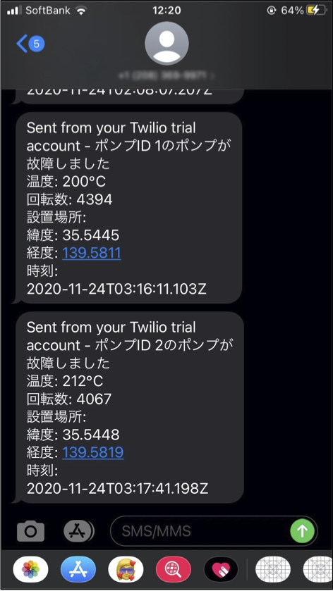

SMS を送信するまでの手順は以上です。

## ***Step 3 (Teams)***

Teams 用の Source を作成し、ポンプの故障を検知した際に Teams にメッセージを送信するまでの手順です。

1.  Teams のコネクタ準備

    1.  通知先として使用したい Teams のチャネルの設定から、コネクタの設定を開き Incoming Webhook 用のコネクタの「_構成_」をクリックします。

    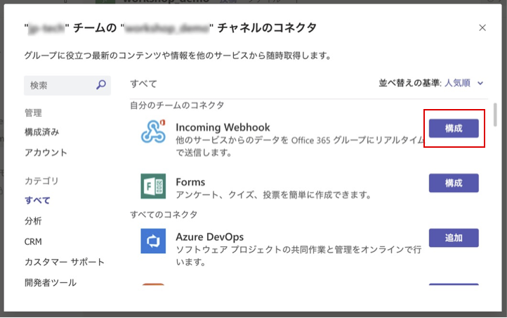

    2.  任意の名前と画像を設定し、「_作成_」をクリックします。

    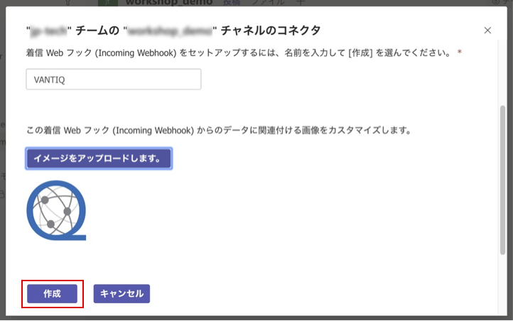

    3.  URL が表示されるのでコピーしてから「_完了_」をクリックします。

    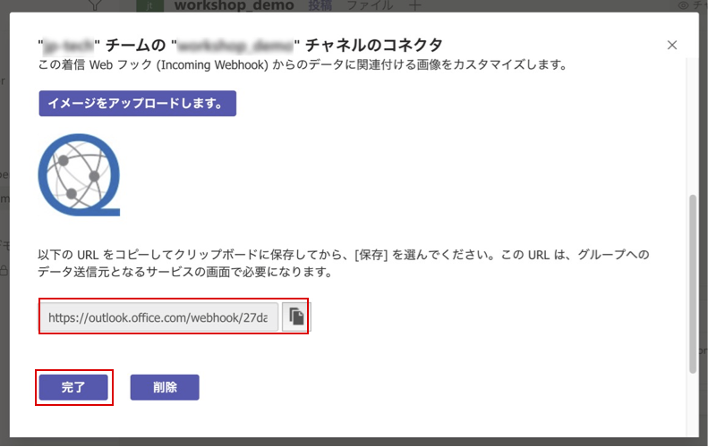

2.  Source の作成

    1.  VANTIQ の開発画面に戻り、「追加」 > 「Source...」 > 「_+新規Source_」 から Source の新規作成画面を開きます。

    2.  Source名に 「_Teams_」 と入力します。

    3.  Sourceの種類 を 「_REMOTE_」に設定します。

    4.  「Properties」タブを開き、「Server URI」に先ほどコピーした Teams の URL をペーストして保存します。

3.  Procedure の作成

    1.  「追加」 > 「Procedure...」 > 「_+新規Procedure_」 から新規 Procedure の編集画面を開きます。

    2.  以下の内容をペーストし、保存します。  
        ```
        PROCEDURE sendToTeams(event)
        // 送信内容
        var message = "ポンプID " + event.PumpID + "のポンプが故障しました <br>"
        message += "温度: " + event.Temp + "℃ <br>"
        message += "回転数: " + event.RPMS + "<br>"
        message += "設置場所: <br>"
        message += "緯度: " + event.Location.coordinates[1] + "<br>"
        message += "経度: " + event.Location.coordinates[0] + "<br>"
        message += "時刻: " + event.ReceivedAt
        var body = {
          text: message
        }
        // 送信処理
        PUBLISH { body: body } TO SOURCE Teams
        ```

4.  アプリの修正と実行

    1.  「**PumpFailureDetection**」 Appを開き、ウィンドウ左側の Activity Pattern のリストにある「Actions」から「`Procedure`」を「`DetectFailure`」タスクにドラッグ&ドロップし、以下の通り設定します。

        1.  procedure: `sendToTeams`

    2.  「**PumpFailureDetection**」 Appを保存し、どれかのポンプの温度と回転数が高い値で生成されるよう設定した上で **データジェネレータ** を実行します。

    3.  「`SendToTeams`」タスクが実行されたことを確認し、URL を発行した Teams のチャネルにメッセージが送信されていることを確認します。  
    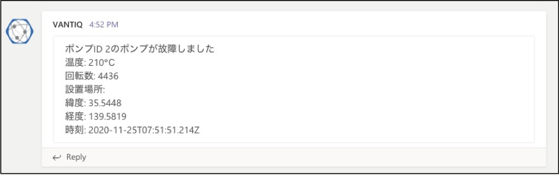

Teams にメッセージを送信するまでの手順は以上です。

## ***Step 4 (LINE)***

LINE 用の Source を作成し、ポンプの故障を検知した際に LINE にメッセージを送信するまでの手順です。

1.  LINE の設定  

    1.  [Developers コンソール](https://developers.line.biz/console/) を開き、Messaging API 用のチャネルの作成を行います。  
      ＊ 参考: [Messaging API を始めよう](https://developers.line.biz/ja/docs/messaging-api/getting-started/)  

    2.  作成したチャネルの「Messaging API設定」タブからチャネルアクセストークンの発行を行いコピーしておきます。  
    ***＊ Source の作成手順で使用します。***  
    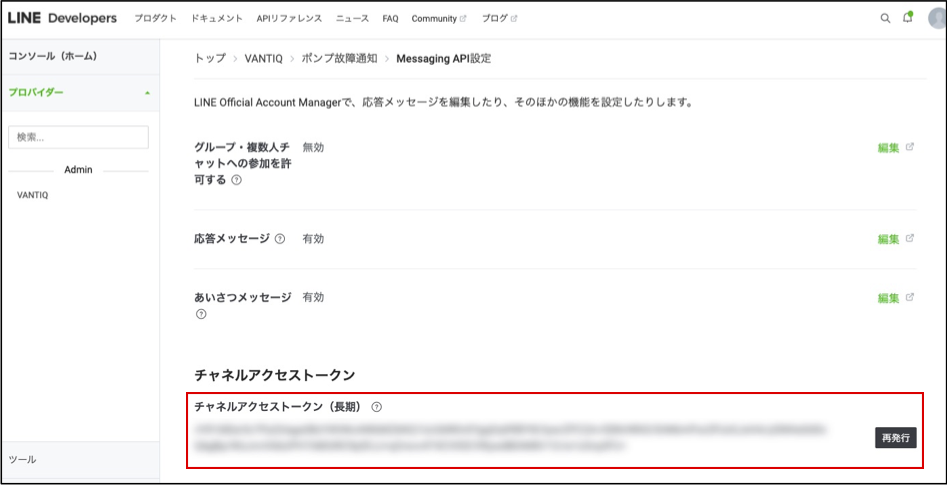

    3.  ご自身の LINE アプリから、チャネルの QR コードを読み込んでボットを友だち追加を行います。  
    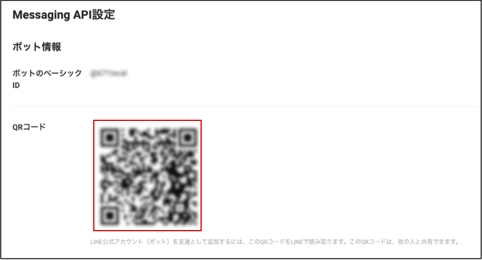

2.  Sourceの作成

    1.  「追加」 > 「Source...」 > 「_+新規Source_」 から Source の新規作成画面を開きます。

    2.  Source名に 「_LINE_」 と入力します。

    3.  Sourceの種類 を 「_REMOTE_」に設定します。

    4.  「Properties」タブを開き、以下の通り設定して保存します。  
      -   Server URI: https://api.line.me/v2/bot/message/broadcast  
      -   Credential Type: Access Token  
      -   Access Token Type: Plain Text  
      -   Access Token: ＊ LINE Developers Console で発行したトークン  
    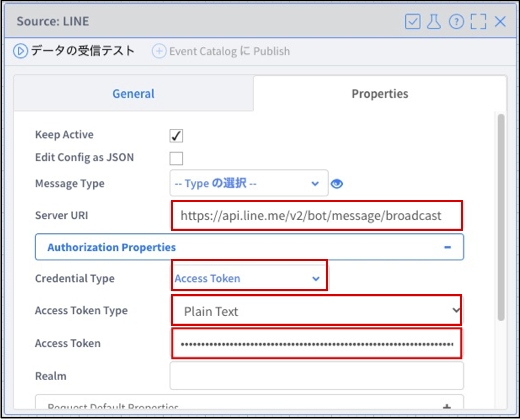

3.  Procedureの作成

    1.  「追加」 > 「Procedure...」 > 「_+新規Procedure_」 から新規 Procedure の編集画面を開きます。

    2.  以下の内容をペーストし、保存します。  

        ```
        PROCEDURE sendToLine(event)
        // 送信内容
        var message = "ポンプID " + event.PumpID + "のポンプが故障しました \n"
        message += "温度: " + event.Temp + "℃ \n"
        message += "回転数: " + event.RPMS + "\n"
        message += "設置場所: \n"
        message += "緯度: " + event.Location.coordinates[1] + "\n"
        message += "経度: " + event.Location.coordinates[0] + "\n"
        message += "時刻: " + event.ReceivedAt
        var body = {
            messages: [
              {
                  type: "text",
                  text: message
              }
            ]
        }
        // 送信処理
        PUBLISH { body: body } TO SOURCE LINE
        ```

4.  アプリの修正と実行

    1.  「**PumpFailureDetection**」 Appを開き、ウィンドウ左側の Activity Pattern のリストにある「Actions」から「`Procedure`」を「`DetectFailure`」タスクにドラッグ&ドロップし、以下の通り設定します。

        1.  procedure: `sendToLine`

    2.  「**PumpFailureDetection**」 Appを保存し、どれかのポンプの温度と回転数が高い値で生成されるよう設定した上で **データジェネレータ** を実行します。

    3.  「SendToLine」タスクが実行されたことを確認し、LINE にメッセージが送信されていることを確認します。

    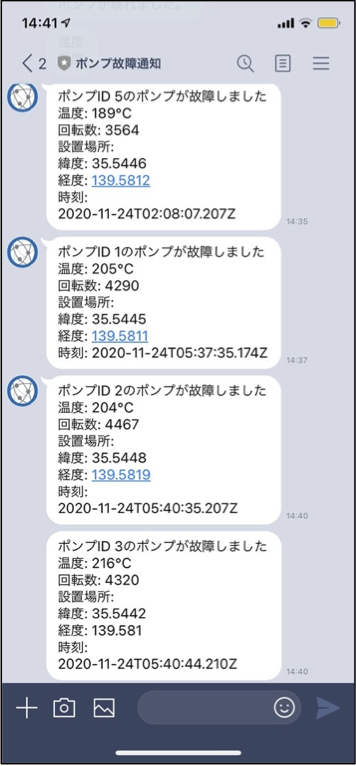

LINE にメッセージを送信するまでの手順は以上です。

## ***Step 5 (Slack)***

Slack 用の Source を作成し、ポンプの故障を検知した際に Slack にメッセージを送信するまでの手順です。

1.  Slack の Incoming Webhook アプリの準備

    1.  [slack app directory](https://slack.com/apps) を開き、「Incoming Webhooks」を検索して選択します。  
    ***＊ 右上に表示されているワークスペース名が使用したいものになっているか確認してください。***  
    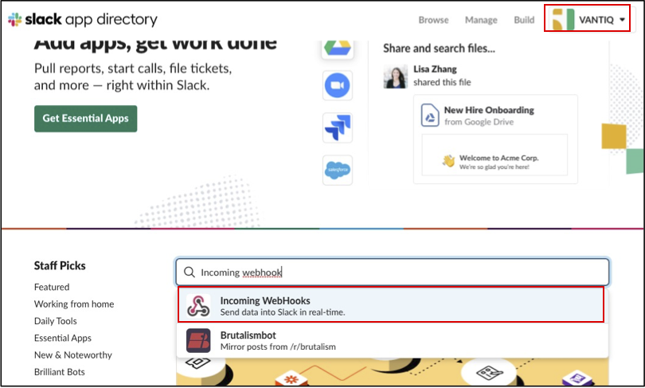

    2.  「_Add to Slack_」をクリックします。

    3.  メッセージを送信したいチャネルを選択し、「_Add Incoming Webhooks integration_」をクリックします。  
    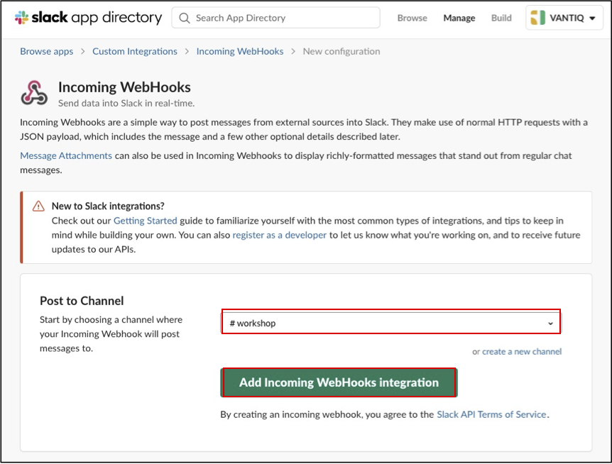

    4.  Webhook URL が表示されるのでコピーしておきます。  
    ***＊ Source の作成手順で使用します。***

2.  Source の作成

    1.  VANTIQ の開発画面に戻り、「追加」 > 「Source...」 > 「_+新規Source_」 から Sourceの新規作成画面を開きます。

    2.  Source 名に 「_Slack_」 と入力します。

    3.  Source の種類 を 「_REMOTE_」に設定します。

    4.  「Properties」タブを開き、「Server URI」に先ほどコピーした Slack の Webhook URL をペーストして保存します。

3.  Procedure の作成

    1.  「追加」 > 「Procedure...」 > 「_+新規Procedure_」 から新規 Procedureの編集画面を開きます。

    2.  以下の内容をペーストし、保存します。  

        ```
        PROCEDURE sendToSlack(event)
        // 送信内容
        var message = "ポンプID " + event.PumpID + "のポンプが故障しました \n"
        message += "温度: " + event.Temp + "℃ \n"
        message += "回転数: " + event.RPMS + "\n"
        message += "設置場所: \n"
        message += "緯度: " + event.Location.coordinates[1] + "\n"
        message += "経度: " + event.Location.coordinates[0] + "\n"
        message += "時刻: " + event.ReceivedAt
        var body = {
            text: message
        }
        // 送信処理
        PUBLISH { body: body } TO SOURCE Slack
        ```

4.  アプリの修正と実行

    1.  「**PumpFailureDetection**」 App を開き、ウィンドウ左側の Activity Pattern のリストにある「Actions」から「`Procedure`」を「`DetectFailure`」タスクにドラッグ&ドロップし、以下の通り設定します。

        1.  procedure: `sendToSlack`

    2.  「**PumpFailureDetection**」 Appを保存し、どれかのポンプの温度と回転数が高い値で生成されるよう設定した上で **データジェネレータ** を実行します。

    3.  「`SendToSlack`」タスクが実行されたことを確認し、Slack にメッセージが送信されていることを確認します。
    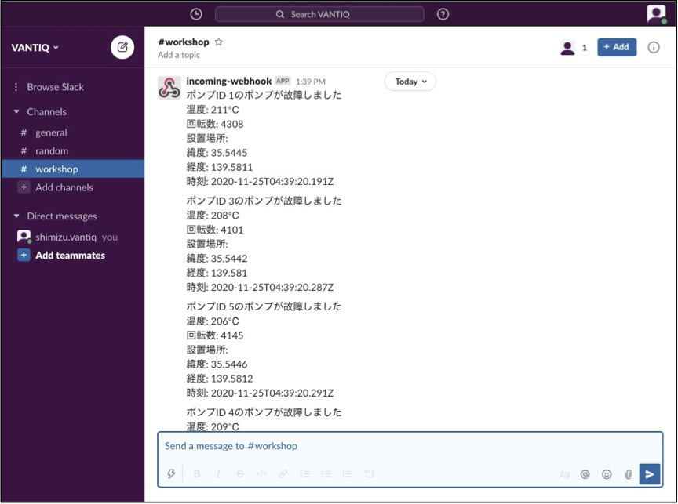

Slack にメッセージを送信するまでの手順は以上です。

## ***▷確認ポイント***

-   Source を使用することにより外部サービスと連携できます。  
    ✔︎ Source の種類について[リファレンス](https://dev.vantiq.co.jp/docs/system/sources/source/index.html) をご確認ください。

-   `Procedure` を使用することにより連携先のサービスが求めるフォーマットに合わせた実装ができます。

-   VANTIQ では「**VAIL**」という SQL と JavaScript を合わせたような独自言語でプログラミングすることができます。  
    ✔︎ 詳細については [リファレンス](https://dev.vantiq.co.jp/docs/system/rules/index.html) をご確認ください。

- EventStream でイベントを受信できない場合  
  Source がアクティブになっているか確認してください。  
  詳しくは [Source のアクティブ化](./0-04_SourceActivate.md) を参照してください。

## Vantiq 1-day Workshop 次のセッション  
|Session #|Session      | Type  |Contents Description       |Duration (m)|Material               |
|:-----:|--------------|:------:|---------------------------|:-:|--------------------------------|
| 12 | Vantiqのリソース全般の紹介 | | Reference | | [実例を通して Vantiq のリソースを理解する](../../../vantiq-resources-introduction/docs/jp/Vantiq_resources_introduction.md) |
| 13 | 混雑検出アプリ開発課題 | Lab | Vantiq 1-day Workshop の次のステップ | | [混雑検出課題アプリ](a10-dev01_detect_congestion_app.md) |
